# Recht für Ingenieure

Achtung: es wird hier möglichst vereinfacht geschrieben.

# Einführung in die Rechtsordnung

## Objektives Recht (Rechtsordnung)

Das objektive Recht gilt für alle Personen. Es ist die "Rechtsordnung eines Gemeinschaftswesens." Sie wird in zwei Gruppen unterteilt

### Öffentliches Recht

regelt die Beziehungen zwischen dem (übergeordneten) Staat als Hoheit und den einzelnem Mitglied der Gemeinschaft (z.B. Verfassung, StrassenverkehrsG, StGB usw.). Es regelt auch den Aufbau, Organisation und Tätigkeit des Staates. Immer **zwingendes** Recht.

Es gilt das *Subordinationsprinzip*: der Bürger ist dem Staat untergeordnet. Der Staat kann seine öffentlichen Rechte als Befehle formulieren und die Befolgung erzwingen

Es gilt das *Legalitätsprinzip*: kein staatliches Handeln ohne ausdrückliche (schriftliche) gesetzliche Grundlage. Damit schützt man den Bürger vor willkürlichem Handeln des Staats.

Teilgebiete:

* Staats- und Verfassungsrecht
* Verwaltungsrecht
* Prozessrecht
* Strafrecht
* Schuldbetreibung- und Konkursrecht
* Völkerrecht

### Privat-(Zivil)recht

bestimmt die Rechtsbeziehung zwischen den einzelnen, gleichgeordneten Mitgliedern. Grundsätzlich **dispositives (abänderbares) Recht**.

Es gilt das *Koordinationsprinzip*: gleichgeordnete können ihre Rechtsverhältnisse dem eigenen Willen nach ordnen, privates Recht bildet daher den Rahmen zur Koordination der privaten Beziehungen.

Es herrscht grundsätzlich *Privatautonomie*: sie können ihre Rechtsverhältnisse nach eigenem Willen ordnen, ohne an eine Form gebunden zu sein.

Teilgebiete:

* Zivilrecht (Personen-, Familien-, Erb-, Sachenrecht)
* Obligationenrecht (Forderungs-, Vertrags-, Gesellschaftsrecht)

### Rechtssatz

Der Rechtssatz hat folgende Eigenschaften

* generell: auf unbestimmten Adressatenkreis anwendbar
* abstrakt: unbeschränkte Anzahl von Sachverhalten anwendbar

Es gibt zwei Arten

* materiell: Inhalt ist eine Regelung betreffend das Verhalten
* formell: Inhalt ist eine Regelung betreffend das Verfahren oder die Organisation

Er wird auch folgend definiert:

* zwingend: gilt ohne Rücksicht auf Willen der Beteiligten
* dispositiv: die Beteiligten können abweichende Regelungen treffen, er gilt nur dann wenn keine abweichende Regelung getroffen wurde

EInzelne Rechtssätze definieren Begriffe, sogenannte *Legaldefinitionen*, z.B. die Definition des Gebäudeabstandes.

#### Quellen

* Verfassungsnorm
* Gesetzesnorm
* Verordnungsnorm: geht nicht von der Legislative, sondern von der Regierung, Verwaltungsabteilung, oder vom Parlament aus. Rechtsverordnungen richten sich an Bürger, Verwaltungsverordnungen an Verwaltungsstellen
* Konkordatsnorm: Vereinbarung zwischen öffentlich-rechtlichen Körperschaften (z.B. Kantone), zum Beispiel Vereinbarung zwischen den Kantonen über die HSR
* Allgemein verbindlich erklärte Vertragsnorm: ursprünglich durch zwei Privatrechtssubjekte ausgehandelt, durch ihre Allgemeinheit dann für alle verbindlich erklärt (von Behörde). Z.B. GAV. Nur im Privatrecht
* Gewohnheitsrecht. Nur im Privatrecht
* Richterrechtsnorm. Nur im Privatrecht

## Stufenbau

* Formell höherrangiges Recht geht nachrangigem Recht vor
* Jüngeres Recht setzt Älteres ausser Kraft
* Sonderbestimmungen gehen allgemeinen Regelungen vor

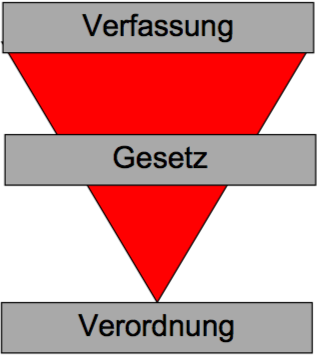

## Rechtssubjekte

Rechtssubjekte sind Träger von Rechten und Pflichten.

### Natürliche Personen

Beginnt mit der Geburt und endet mit dem Tod. Auch ein ungeborenes Kind kann in gewissen Fällen im Erbfall bereits Rechtwirkung zeitigen. Bedingt Handlungsfähigkeit, die ihrerseits Urteilsfähigkeit und Mündigkeit voraussetzt. Die Rechtsfähigkeit ist eine passive, die Handlungsfähigkeit eine aktive Eigenschaft.

### Juristische Personen

Zusammenschluss von Personen oder Anhäufung von Vermögen.

#### Privatrecht

* Körperschaften: Personenzusammenschlüsse, Korporationen
  * Vereine, AG, GmbH, Genossenschaften
* Anstalten: zweckgebundene Vermögenswerte
  * Stiftung

einfache Gesellschaft, Kollektiv- und Kommanditgesellschaften haben keine Rechtspersönlichkeit!

#### Öffentliches Recht

Zum Beispiel der Staat. Sind sie technisch und organisatorisch zusammengefasst und stehen den Benutzern dauernd zur Verfügung, sind sie Anstalten. Haben sie eine eigene Rechtspersönlichkeit, nennt man sie selbständige, öffentlichrechtliche Anstalten (z.B. Spitäler). Die HSR ist eine selbständige, öffentlichrechtliche Anstalt.

## Rechtsobjekte

Materielle Güter (Liegenschaft, Auto), immaterielle Güter (Erfindung, Werk), aber nicht Tiere!

Die Rechtsobjekte sind der Herrschaft der Rechtssubjekte unterworfen.

## Subjektives Recht (Berechtigung)

Das Rechtssubjekt leitet sein subjektives Recht am Rechtsobjekt aus einem Rechtsverhältnis (Gesetz, Vertrag), welches die Rechtsordnung (objektives Recht) festlegt, ab. 

In jedem Fall ist bei der Rechtsausübung der Grundsatz von Treu und Glauben zu beachten, weshalb der missbräuchlichen Ausübung der Rechtsschutz verwehrt bleibt (z.B. rechtsmissbräuchliche EInsprache gegen ein Bauprojekt).

Wenn subjektive Rechte von anderen Rechtssubjekten oder dem Staat nicht beachtet oder verletzt werden, stellt der Staat dem Bettoffenen seine Gerichtbarkeit zur Feststellung, sowie andere Zwangsmittel (Betreibung, Polizei, etc.) zur Verfügung.

### Absolute/relative subjektive Rechte

* Absolute, subjektive Rechte müssen von allen beachtet werden. Sie gelten daher gegenüber jedermann
  * dingliche Rechte (z.B. Eigentum), beschränkt dingliche Rechte (Pfandrechte)
  * Persönlichkeitsrechte (Recht auf Leben, ...)
  * Immaterialgüterrechte (Urheberrechte, Patent)
* Relative, subjektive Rechte sind nur gegenüber Rechtssubjekt(en) begründet, mit denen man in einem bestimmten Rechtsverhältnis steht, z.B. aufgrund eines Vertrags, einer unerlaubten Handlung oder einer gesetzlichen Bestimmung. Sie gelten nur gegenüber den verpflichteten Personen.
  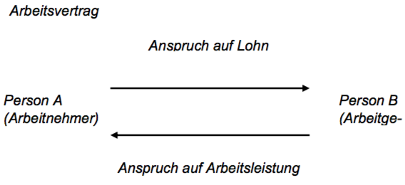

# Strafrecht

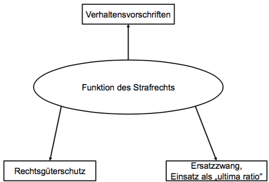

Deliktstypen

* Verbrechen StGB 10 II: Freiheitsstrafe über 3 Jahre
* Vergehen StGB 10 III: Freiheitsstrafe bis zu 3 Jahre/Geldstrafe
* Übertretungen StGB 106: Busse
* Vorsatzdelikt StGB 12: in der Regel macht sich nur strafbar, wer ein Delikt vorsätzlich begeht. Eventualvorsatz = Vorsatz
* Fahrlässigkeitsdelikt: pflichtwidrige Unvorsichtigkeit, Missachtung einer Sorgfaltspflicht, unvorsätzliches Bewirken der Tat

## Verbrechensaufbau

Prüfschema

* Verletzung der Strafnorm
  * objektive Tatbestandsmerkmale (TBM) erfüllt
  * subjektive TBM erfüllt
* Rechtswidrigkeit
  * keine Rechtfertigungsgründe (RFG)
* Schuld
  * keine Schuldausschlussgründe

objektiver Tatbestand (TB): äussere TBM eines Deliktes

> <u>Wer</u> vorsätzlich <u>einen Menschen tötet</u>, ohne dass (...) wird mit Freiheitsstrafe (...) bestraft.

subjektiver Tatbestand: innere (psychische) Merkmale, welche nach dem Gesetz der Verwirklichung des obj. TB zugrunde liegen müssen

* Vorsatz
  * Wissen: intellektuelle Komponente
  * Willen: voluntative Komponente
* Eventualvorsatz
  * Wissen: für möglich halten
  * Willen

Rechtswidrigkeit (RW)

* RW: jedes tatbestandsmässige Verhalten welches keinen RFG hat

* RFG: besondere Rechtssätze, die ausnahmsweise ein solches Verhalten erlauben

* Rechtfertigungsgründe

  * rechtf. Notwehr
    * angemessene Abwehr eines umittelbar bevorstehenden, drohenden oder sich im Gang befindlichen, rechtswidrigen Angriffs
    * Abwehrhandlung gegen Angreifer
    * Angemessenheit der Abwehr
    * (Subsidiarität, Proportionalität)
    * Notwehrexess

  * rechtf. Notstand
    * Straftat, um ein eigenes oder fremdes Rechtsgut, aus einer unmittelbaren, nicht anders abwendbaren Gefahr zu retten, sofern dadurch höherwertige Interessen gewahrt werden
    * absolute Subsidiarität, Schutz
    * höherwertige Interessen
    * Notstandexess
  * Berufs-/Amtspflichten
    * sofern ges. Grundlage für Eingriffsbefugnis besteht
    * wenn in Ausübung hoheitlicher Befugnisse
  * Einwilligung des Verletzen (nicht immer möglich)
    * übergesetzliche Rechtfertigungsgründe
    * auch mutmasslich möglich (ärztlicher Eingriff)

Schuld

* Schuldfähigkeit, sofern dem Täter persönlich vorwerfbar
  * Fähigkeit, Rechtswidrigkeit zu erkennen
  * Fähigkeit, sich entsprechend zu verhalten
* Schuldunfähigkeit
  * Unfähigkeit, Unrecht der Tat einzusehen
  * Unfähigkeitm sich entsprechend Einsicht zu verhalten
* verminderte Schuldfähigkeit
  * Täter ist zu obigem nur teilweise fähig

Wenn die Schuldunfähigkeit selbst zugefügt wurde, so gilt z.B. die Rauschtat (StGB 263), also z.B. nur Freiheitsstrafe bis drei Jahren.

## Strafarten

* Sanktionen
  * Strafen
    * Geldstrafe (GS)
    * gemeinnützige Arbeit (GA)
    * Freiheitsstrafe (FS)
    * Busse
  * Massnahmen

### Geldstrafe

Anzahl Tagessätze x Höhe des Tagessatzes

Anzahl Tagessätze

* schuldabhängig
* **max. 360**

Höhe des Tagessatzes

* schuldunabhängig
* abhängig von persönlichen/wirtschaftlichen Verhältnissen (Einkommen, Vermögen, Lebensaufwand, Unterstützungspflichten)
* **max.** 3000 CHF
* bei Uneinbringlichkeit: Umwandlung in FS

### Gemeinnützige Arbeit

* Tätigkeit: unentgeltliche Arbeite für soziale Einrichtungen, Werke im öffentlichen Interesse oder hilfsbedürftige Personen
* Höchstdauer: 6 Monate
* Hauptstrafe: nein, Ersatz für GS oder Busse
* Voraussetzung: Zustimmung des Täters erforderlich
* Vollzug: unbedingt, bedingt oder teilbedingt
* bei Nichtleistung: Umwandlung in Geldstrafe oder Freiheitsstrafe

### Freiheitsstrafe

Maximal: 20 Jahre oder lebenslänglich

Minimal: 6 Monate, ausnahmweise weniger

Vollzug: unbedingt/bedingt (bis zwei Jahre), teilbedingt (bis drei Jahre)

### Busse

* Anwendungsfälle: ausschliessliche Strafart bei Übertretungen, Zweitstrafe bei bedingten Strafen
* Höchstbetrag: i.d.R. CHF 10'000
* Vollzug: nur unbedingt
* Zumessung: gemäss Verschulden
* bei Uneinbringlichkeit: Ersatzfreiheitsstrafe, bereits im Urteil festzusetzen

### Vollzug

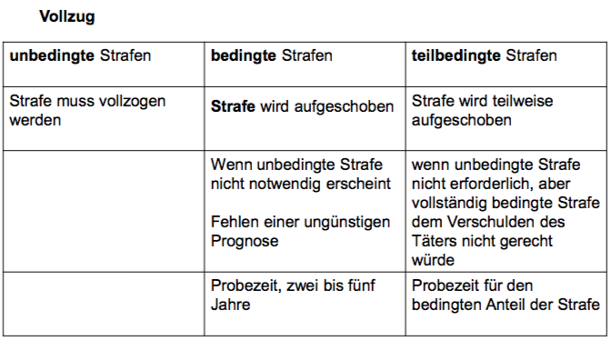

### Strafzumessung

ordentlicher Strafrahmen (Höchst-/Mindestdauer)

Strafmilderungsgründe: Herabsetzung

Strafschärfungsgründe: Erhöhung (bis zum Höchstmass)

richterliches Ermessen innerhalb Strafrahmens

* nach Verschulden
* Vorleben/persönliche Verhältnisse
* Wirkung der Strafe auf das Leben des Täters

Strafmilderungsgründe

* Handeln
  * aus achtenswerten Beweggründen
  * in schwerer Bedrängnis
  * unter dem Druck schwerer Drohung
  * Affekt
* Provokation durch Verletzen
* Betätigung aufrichtiger Reue
* Zeitablauf und Wohlverhalten

Strafschärfung

* Zusammentreffen von mehreren mit FS bedrohten Handlungen
* Zusatzstrafe

## Massnahmen

therapeutisch/Verwahrung

* ambulante/stationäre Behandlung von psych. Störungen/Suchtbehandlung/für junge Erwachsene
* Verwahrung

andere

* Friedensbürgschaft
* Berufsverbot
* Fahrverbot
* Urteilspublikation
* Sicherungseinziehung
* Einziehung von Vermögenswerten

allgemein

* Subsidiaritätsprinzip
* Verhältnismässigkeitsprinzip
* Begutachtungspflicht
* Durchführbarkeit

dualistisches System

* Strafe und Massnahme, sofern Voraussetzung gegeben sind
* Massnahmen geht dem Vollzug der FS vor
* Ausnahme: Verwahrung

### Verwahrung

Isolierende Massnahme, zeitlich unbegrenzt, ultima ratio

Arten

* ordentlich
* nachträglich
* lebenslang

Voraussetzungen: Anlasstat + Rückfallgefahr + nicht therapierbar (bei lebenslanger Verwahrung)

## Ziele

* Bestrafung schuldfähiger Täter
* Behandlung psychisch schwer gestörter/suchtabhängiger Täter
* Förderung der Fähigkeit, deliktfrei zu leben
* präventiver Opferschutz (schwere Delikte)

Inhalt Strafregister

* alle Verurteilungen wegen Verbrechen/Vergehen, sofern Strafe/Massnahme ausgesprochen
* zum Teil Verurteilungen wegen Übertretungen
* Personen, gegen welche Strafverfahren wegen Verbrechen/Vergehen hängig sind

Einsicht von Gerichtsbehörden und anderen Behörden

Privatpersonen nur im eigenen Auszug

Entfernung nur von Amtes wegen, je nach Sanktionsart (10, 20 Jahre)

# Strafrecht besonderer Teil

## Ehrverletzungsdelikte

Nicht ehrverletzend sind Äusserungen, die jemanden z. B. als Geschäfts- oder Berufsmann, als Politiker, als Künstler, als Sportler oder in seiner sozialen Funktion herabsetzen, sofern die Kritik nicht zugleich auch seine Geltung als erhbarer Mensche trifft.

## Strassenverkehrsrecht

Teil des Nebenstrafrechts, d.h. der allgemeine Teil des StGB ist anwendbar				

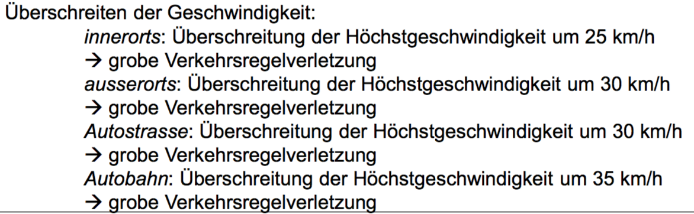

## Betäubungsmittel

10g Cannabis sind geringfügige Menge

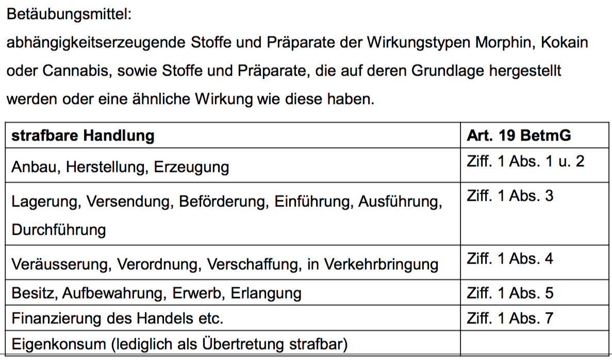

# Vertragsrecht

Obligationenrecht

"obligatio" = Schuld

Obligation = Schuldverhältnis

Schuldverhältnis: Leistungspflicht/Forderungsrecht

Entsteht aus Gesetz oder Rechtsgeschäft

### Schuldverhältnisse aus Gesetz

* unerlaubte Handlung
* ungerechtfertige Bereicherung
* sonstige gesetzliche Gründe

### Schuldverhältnisse aus Rechtsgeschäft

Schuldverhältnis, welches aufgrund einer privaten Willensäusserung entsteht, die eine rechtliche Wirkung zum Ziel hat.

* Willensäusserung: auf rechtlichen Erfolg abzielende private Äusserung
* Privatautonomie: Gleichstellung der Parteien

### Seiten

einseitige Rechtsgeschäfte: nur von einer Person (z.B. Testament)

zwei-/mehrseitig: Verträge, Gesellschaftsbeschlüsse

### Vertragsschluss, -arten

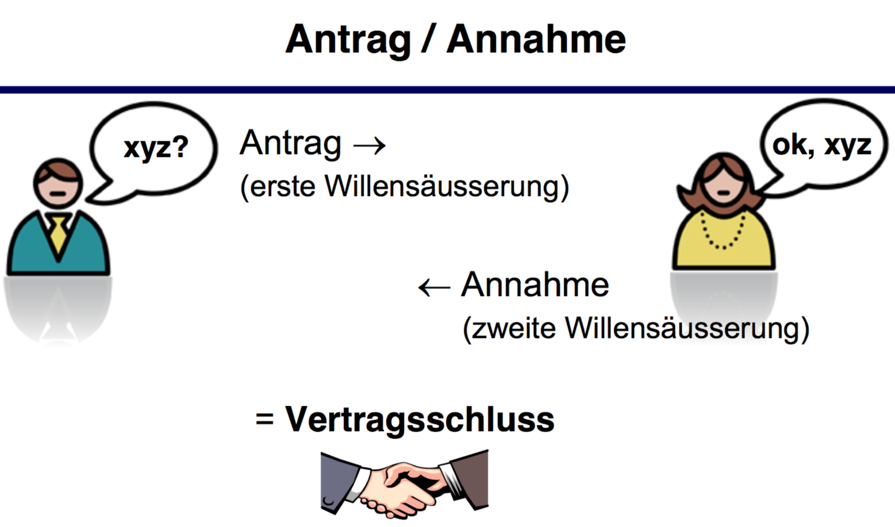

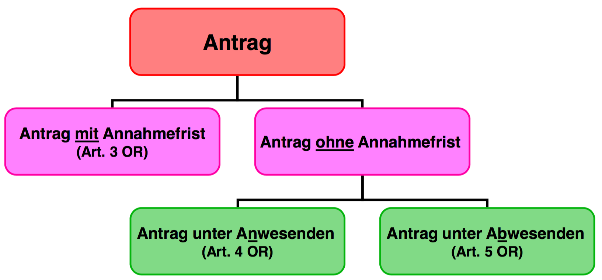

#### Voraussetzungen Vertragsschluss

* handlungsfähige Parteien
* übereinstimmende, gegenseitige Willensäusserung (Antrag/Annahme)
* Einigung über alle wesentlichen Punkte
  * Kaufvertrag: Produkt, Preis
  * Werkvertrag: Herstellung eines Werkes, Leistung einer Vergütung

#### Folgen

Begründung von Rechten (Forderungen) und Pflichten (Schulden) i.d.R. für beide Parteien

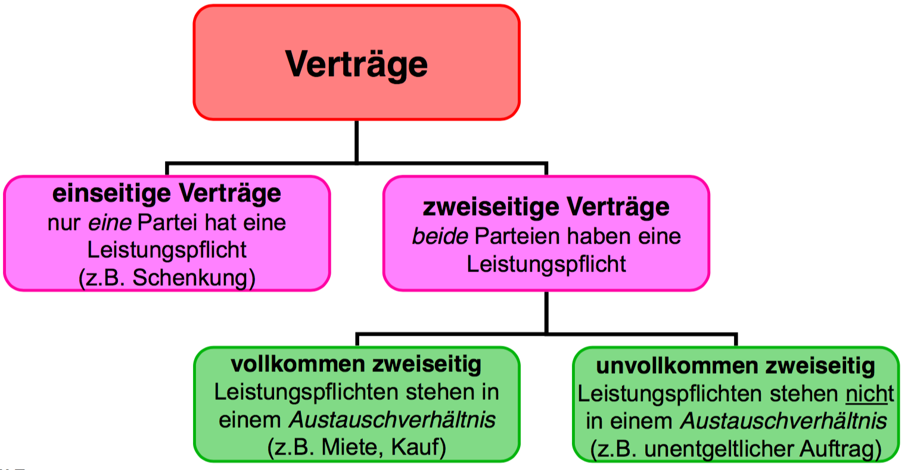

* Nominatverträge
  * gesetzlich, insbesondere im OR geregelte Verträge (z.B. Kauf)
* Innominatverträge
  * gesetzlich *nicht* geregelte Verträge (z.B. Leasing)

### Grundsatz der Vertragsfreiheit

* Abschlussfreiheit
* Partnerwahlfreiheit
* Formfreiheit
* Inhaltsfreiheit
* Typenfreiheit
* Änderungsfreiheit
* Aufhebungsfreiheit

Schranken der Vertragsfreiheit

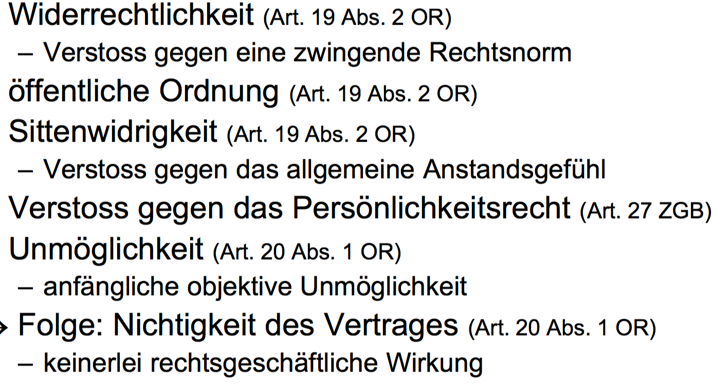

### Reihenfolge

1. Zwingende Gesetzesnorm (Abweichung nicht möglich)
2. Vertragliche Vereinbarung
3. Nicht zwingende (dispositive) Gesetzesnormen (Abweichung möglich)

## Form

Verträge sind grundsätzlich formlos, ausser das Gesetz schreibt es vor, oder die Parteien vereinbaren eine Form. Bei Formmangel ist Rechtsgeschäft grundsätzlich nichtig.

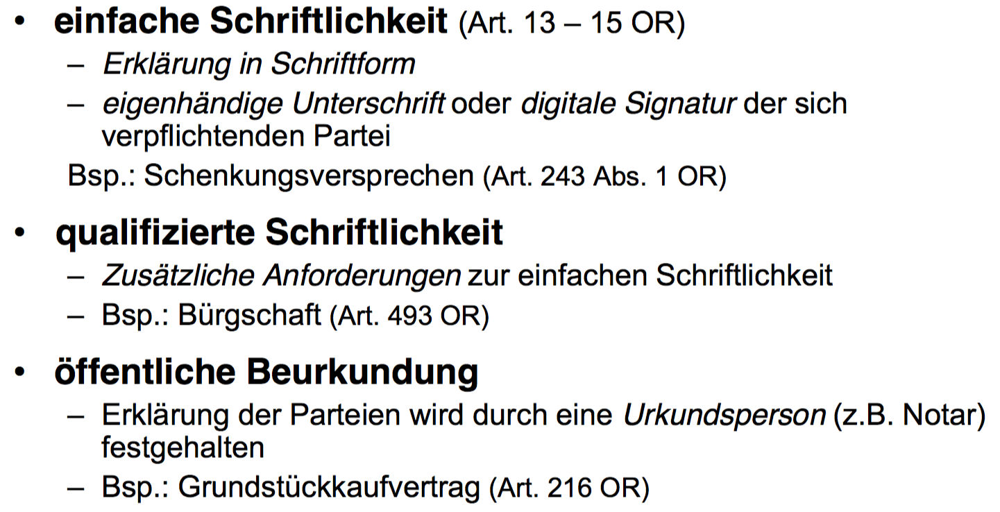

## Vertragserfüllung

Bei richtiger Erfüllung erlöschen die gegenseitigen Rechte (Forderungen und Pflichten (Schulden) der Parteien

Richtig:

* die richtige Person
  * höchstpersönlich durch Schuldner
    * vorallem Dienstleistungen (Arbeitnehmer)
  * sonstige
    * Erfüllung durch Dritte möglich
    * vorallem Sach und Geldleistungen
* die richtige Leistung
  * Leistung
    * Tun, Dulden, Unterlassen
  * Primär: vertraglich vereinbarte Leistung
  * Sekundär: gesetzlich geschuldete Leistung
    * bei Gattungsschulden (z.B. Kartoffeln) mindestens mittlere Qualität
* am richtigen Ort
  * primär: vertraglich vereinbarter Ort
  * sekundär: gesetzlicher Erfüllungsort
    * Geldschulden sind Bringschulden
    * alle übrigen Schulden sind Holschulden
* zur richtigen Zeit erbringt
  * Erfüllungszeit: Zeitpunkt, zu dem Gläubiger Erfüllung verlangen kann
  * Primär: vertraglich vereinbarter Zeitpunkt
  * Sekundär: gesetzlicher Erfüllungszeitpunkt
    * Natur des Rechtsverhältnisses: Lohn Ende Monat
    * ansonsten sofort

## Leistungsstörung

* Nichtleistung
  * Nichterfüllung wegen Unmöglichkeit der Leistung
* Schlechtleistung
  * Nicht gehörige Erfüllung der zu erbringenden Leistung oder Verletzung einer vertraglichen Nebenpflicht
* Spätleistung
  * Nicht rechtzeitige Erfüllung einer Leistung

### Verzugsfolgen

Mahnung (= Verzug) + Nachfrist => Ablauf der Nachfrist

* Klage auf Erfüllung der Leistung
  * Schadenersatz wegen Verzug
* Verzicht auf nachträgliche Leistung und
  * Schadenersatz wegen Nichterfüllung (positives Interesse)
  * Rücktritt vom Vertrag
    * negatives Interesse
    * Rückersattung
    * optional Schadenersatz

### Durchsetzung einer Forderung

Geldleistungspflichten: Betreibungsbegehren => Zahlungsbefehl => Pfändung (Schuldbetreibungsverfahren)

Andere: Klageerhebung => Entscheid => Vollstreckung des rechtskräftigen Entscheids (Zivilprozessverfahren)

Anwendbares Recht

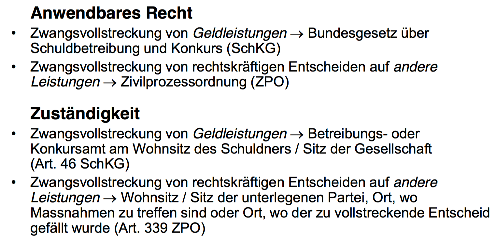

### Verjährung

Forderung nicht mehr durchsetzbar. Dient dem Erhaltung der Rechtssicherheit und des Rechtsfriedens.

Grundsätzlich 10 Jahre (127 OR), oder 5 Jahre bei regelmässigen Forderungen (Lohn, Miete, 128 OR)

Beginn: Fälligkeit der Forderung (130 OR)

# Bundesstaatstrecht

## Demokratie

Dem Bundesgericht un den übrigen rechtsanwendenden Behörden ist es nicht erlaubt, Gesetze, welche von der Legislative des Bundes erlassen worden sind, auf ihre Verfassungsmässigkeit zu überprüfen (in DE geht das).

Die Schweiz ist eine direkte Demokratie.

## Gewaltenteilung

* Exekutive (Regierung, Verwaltung), ausführende Gewalt
* Legislative (Parlament, Volk), gesetzgegebende Gewalt
* Judikative (Gerichte), richterliche Gewalt

Dazu kommt die personelle/subjektive Gewaltenteilung, dass die Staatsorgane personell streng getrennt sind. Eine Person darf daher gleichzeitig nur einem der Organe angehören.

### Legislative (Parlament, Volk)

Gesetzgebung und Whl der Hauptexponenten der übrigen Gewalten

Die Legislative kann auch durch Gesetze im materiellen Sinn (Verfassung, Gesetz) die Exekutive oder die Judikative berechtigen, Rechtssätze zu erlassen (z.B. Ausführungs- und Vollzugsbestimmungen, Notverordnungen). Diese erfolgen in Form von Verordnungen, Reglementen, Kreisschreiben usw.

### Exekutive (Regierung, Verwaltung)

Auf Bundesebene hat der Bundesrat die Regierungsfunktion, auf Kantonsebene der jeweilige Regierungsrat oder Staatsrat. Die Regierung ist auch mit der Leitung der Verwaltung betraut. Die Aufgabe der Regierung und Verwaltung ist in erster Linie der *Vollzug* der von der Legislative erlassenen Gesetze.

Bvor die Bundesversammlung über einen Entwurf einer neuen Verfassungsbestimmung oder Bundesgesetz berät, führt der Bundesrat oder die Verwaltungsstelle ein Vernehmlassungsverfahren durch, in dem die Konsensfähigkeit eines neuen Gesetzes bei Kantonen und Verbänden überprüft und abgeschätzt wird, ob diese beabsichtigen, ein Referendum gegen das geplante Gesetz zu ergreifen.			

Da die Aussenpolitik aber bei der Legislative liegt, gewinnt der Bundesrat in heutiger Zeit an Macht gegenüber der Legislative.

Die Judikative ist in Zivil- und Strafsachen in drei Instanzen gegliedert.

1.  Bezirksgerichte (Kreis-, Amtsgerichte)
2. Kantonsgerichte (Obergerichte)
3. Schweizerisches Bundesgericht (Lausanne)

In Verwaltungssachen welche von kantonalen Behörden ergehen, sind 

1. kantonale Versicherungsgerichte und Verwaltungsrekurskommission
2. kantonale Verwaltungsgerichte
3. Schweizerisches Bundeesgericht, eidgenössisches Versicherungsgericht

In Verwaltungssachen von eidgenössischen Behörden

1. eidgenössische Rekurskommissionen
2. Schweizerische Bundeskommision

Bei Ausnahmefällen, nämlich der Geltendmachung einer Verletzung der europäischen Menschenrechtskonvention (EMRK) bleibt schlussendlich als weitere Instanz der europäische Gerichtshof für Menschenrechte in Strassburg. Dieses darf zwar keine innerstaatlichen Rechte und Verwaltungsakten aufheben, es kann aber feststellen dass diese dem EMRK widersprechen und völkerrechtlich verbindliche Massnahme anordnen.

Wichtige Entscheide werden in Entscheidsammlungen publiziert.

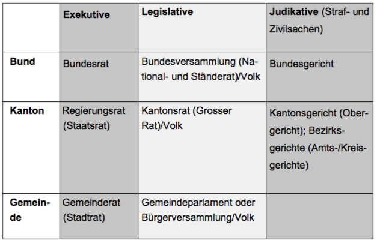

### Rechtsstaatsprinzip

Gesetze sind Ausdruck des Volkswillens.

Einem Einzelnen darf nicht mehr auferlegt werden, als der Allgemeinheit. 

## Föderalismus

Es gibt eine Aufzählung der Bundeskompetenzen (BV 42). Fehlt eine solche Ermächtigung, sind automatisch die Kantone zuständig. Neue Staatsaufgaben fallen somit erst einmal den Kantonen zu. Nur mittels Revision der Bundesverfassung kann eine gesamtschweizerische Regelung begründet werden.

Die Gesetze der verschiedenen Stufen können sich teilweise auch überlappen, zum Beispiel beim Raumplanungsgesetz.

## Bundesverfassung als Grundgesetz

Sie regelt

* Grundrechte, Bürgerrechte und Sozialziele
* Staatsform
* Kompetenzabgrenzung Bund und Kantone
* Beteiligung von Volk und Ständen bei der politischen Meinungsbildung des Bundes
* Grundsätze der Organisation der Bundesbehörden
* Revision der Bundesverfassung
* Übergangsbestimmungen

### Grundrechte

* Freiheitsrechte
* Rechtsgleichheit
* Sozialrechte

Abwehrrechte des Invididuums gegenüber dem Staat.

* Persönliche Freiheit (BV 10)
  * psychische und physische Integrität respektieren
  * kein Recht auf Finanzierung der Lebenskosten
  * keine staatlichen Impfungen (z.B.)
* Meinungs- und Informationsfreiheit
  * Recht auf freien Meinungsaustausch unter den Menschen
  * Recht auf Kritik am Staat
  * Recht, sich aus allen frei zugänglichen Quellen zu informieren
  * (Recht, eine Satellitenantenne auf seinem Dach aufzustellen)
  * Versammlungs-/Demonstrationsfreiheit (22 BV)
  * Kunstfreiheit (BV 21)
  * Wissenschaftsfreiheit (20 BV)
* Glaubens- und Gewissensfreiheit
  * religiöse Handlungen und Rituale
  * freie Wahl, Gemeinschaften anzugehören oder fern zu bleiben
* Eigentumsgarantie
  * **Institutsgarantie**
  * Bestandes- und Wertgarantie: verbietet Enteignungen (wenn nötig) ohne Entschädigung oder wesentliche Beschränkung des Eigentumsrechts
* Wirtschaftsfreiheit
  * freie Arbeitsplatzwahl
  * jeder darf mit eigener Leistung auftreten und konkurrenzieren
  * kein Protektionismus
  * verleiht keinen Anspruch auf Zulassung zu einer staatlichen Ausbildungseinrichtung, deren Ausbildung zur Ausübung eines öffentlichen Amtes befähigt

### Einschränkung von Grundrechten

Die Rechte gelten nicht absolut. Eingriffe sind erlaubt, wenn das folgende gegeben ist:

Grundlage in einem Rechtssatz

* je schwerer der Eingriff, desto höher der Anspruch an die gesetzliche Grundlage
* Schwere Eingriffe in Grundrechte benötigen ein Gesetz von der Konsensstufe des Parlaments bzw. Volkes.

öffentliches Interesse

* öffentliche Sicherheit
* ... Gesundheit
* ... Ruhe
* ... Sittlichkeit
* Treu und Glauben im Geschäftsverkehr
* Ist sehr weit gefasst und daher meistens gegeben

Verhältnismässigkeit im weiteren Sinne

* geeignet
  * geeignet sein, das angestrebte Ziel zu verwirklichen
  * geeignet: obligatorische Impfung zur Verhinderung von Epidemien
  * nicht geeignet: Importverbot von Hunden zur Verhinderung der Ausbreitung einer Katzenseuche
* erforderlich
  * ist eine mildere Massnahme ausreichend, ist eine strengere nicht erlaubt
* verhältnismässig im engeren Sinne

### Rechtsgleichheit

Alle sind vor dem Gesetz gleich.

# Gesellschaftsrecht

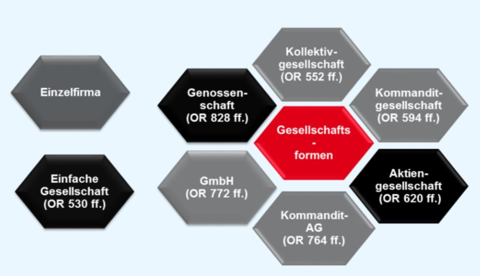

## Einfache Gesellschaft

* Zusammenschluss von zwei oder mehreren Personen. Erreichung eines gemeinsamen Zwecks, gemeinsame Mittel.
* Mitglieder: nat./jur. Personen, Gesellschaften ohne eigene Rechtspersönlichkeit
* keine eigene Rechtspersönlichkeit
* weder handlungs-, prozess-, noch betreibungsfähig
* kein eigenes Gesellschaftsvermögen
* Gesellschaftsbeschlüsse idR einstimmig, vertraglich anders regelbar
* Geschäftsführung im Bereich der gewöhnlichen Geschäfte steht jedem Gesellschafter einzeln zu, vertraglich anders regelbar
* jeden Gesellschafter trifft eine Beitragspflicht, nicht zwingend Geld
* gleicher Anteil an Gewinn/Verlust, vertraglich anders regelbar
* Vertretung nach aussen durch den einzelnen Gesellschafter nach Stellvertretungsrecht, gesetzliche Vermutung der Vertretungsmacht eines Geschäftsführers
* persönliche, solidarische und unbeschränkte Haftung der einzelnen Gesellschafter
* gesetzliche Regelungen meist dispositiver Natur, Gesellschaftsvertrag
* keine eigene Firma, kein eigener Sitz
* darf kein kaufmännisches Unternehmen führen
* nicht im HR eintragbar
* Mitgliedschaft unübertragbar und unvererblich
* Subsidiärform zu den anderen Gesellschaftsformen

## Kollektivgesellschaft

* Zusammenschluss von zwei oder mehreren natürlichen Personen, Erreichung eines gemeinsamen Zwecks, gemeinsame Mittel unter einer Firma
* HR-Eintrag Pflicht für kaufmännische KollG, nicht Pflicht aber konstitutiv für andere
* Mitglieder: nat. Personen
* keine eigene Rechtspersönlichkeit
* jedoch handlungs-, prozess- und betreibungsfähig
* eigenes Gesellschaftsvermögen
* Gesellschaftsbeschlüsse idR einstimmig, vertraglich anders regelbar
* Geschäftsführung im Bereich der gewöhnlichen Geschäfte steht jedem Gesellschafter einzeln zu, vertraglich anders regelbar
* jeden Gesellschafter trifft eine Beitragspflicht, nicht zwingend Geld
* gleicher Anteil an Gewinn/Verlust, vertraglich anders regelbar
* Vertretung nach aussen durch den einzelnen Gesellschafter nach Stellvertretungsrecht, Vertretung durch Dritte möglich
* primäre Haftung des Gesellschaftsvermögens, subsidiäre, unbeschränkte und solidarische Haftung der Gesellschafter mit Privatvermögen

## Kommanditgesellschaft

* Zusammenschluss von zwei oder mehreren natürlichen Personen, Erreichung eines gemeinsamen Zwecks, gemeinsame Mittel unter einer Firma
* mind. 1 Komplementär und 1 Kommanditär. Komplementär muss zwingend eine nat. Person sein, Kommanditäre nat. und jur. Personen sowie Gesellschaften ohne Rechtspersönlichkeit
* HR-Eintrag Pflicht für kaufmännische KollG, nicht Pflicht aber konstitutiv für andere
* keine eigene Rechtspersönlichkeit
* jedoch handlungs-, prozess- und betreibungsfähig
* eigenes Gesellschaftsvermögen
* Gesellschaftsbeschlüsse idR einstimmig, vertraglich anders regelbar
* Geschäftsführung im Bereich der gewöhnlichen Geschäfte steht jedem Komplementär einzeln zu, Ausschluss der Kommanditäre
* jeden Gesellschafter trifft eine Beitragspflicht, nicht zwingend Geld
  * für Kommanditär genügt grundsätzlich eine Haftungsübernahme im Umfang der Kommanditsumme (≠ Kommanditeinlage)
* Verlustbeteiligung des Kommanditärs höchstens im Umfang seiner Kommanditeinlage
* Vertretung nach aussen durch den einzelnen Gesellschafter nach Stellvertretungsrecht, Vertretung durch Dritte möglich
* primäre Haftung des Gesellschaftsvermögens, subsidiäre, unbeschränkte und solidarische Haftung der Komplementäre mit Privatvermögen, subsidiäre, beschränkte (Kommanditsumme) und solidarische Haftung der Kommanditäre mit Privatvermögen
* nach aussen verselbständigte Gesamthandsgemeinschaft
* gesetzliche Regelungen meist dispositiver Natur, Gesellschaftsvertrag
* subsidiäre Anwendung des Rechts der Kollektivgesellschaft und der einfachen Gesellschaft

## Aktiengesellschaften

* Körperschaft (jur. Person), eigene Firma, im Voraus bestimmtes Kapital in Teilsummen (Aktien), Gesellschaftsvermögen ausschliessliche Haftung für Verbindlichkeiten der Gesellschaft
* rechts-, handlungs-, prozess-, und betreibungsfähig
* formeller Errichtungsakt, Gründungsstatuten, Organbestellung, HR-Eintrag zum Erwerb der Rechtspersönlichkeit, qual. Gründung durch Sacheinlage oder Sachübernahme
* Gesellschaftsvermögen, mind CHF 100'000.00, 50% liberiert
  * liberiert: zur Verfügung stehend. Bei der Gründung müssen also mind. 50'000 CHF, ferner mind. 20%, des Gesellschaftsvermögens zur Verfügung stehen
* Aktionäre: nat. und jur. Personen, Handelsgesellschaften ohne Rechtspersönlichkeiten (KollG und KommG)
* Organe: Generalversammlung, Verwaltungsrat, Revisionsstelle (z.T. unübertragbare Befugnisse gemäss Gesetz)
* Handlungen primär durch Organe, GV als willsensbildendes Organ
* Geschäftsführung idR übertragen an einzelne VR oder Dritte nach Massgabe der Statuten
* Vertretung idR übertragen an einzelne VR oder Direktoren, Handlungsbevollmächtigte
* einzige Aktionärspflicht ist die Liberierungspflicht
* Möglichkeit von ABV
* Haftung ausschliesslich des Gesellschaftsvermögens, persönliche Haftung der Aktionäre ist ausgeschlossen
* Aktienkapital: div. Schutzvorschriften
* verschiedene Kategorien von Aktien, Vinkulierungsmöglichkeiten (statutarische, gesetzliche)
* Kapitalveränderungen, gesetzliche Regelungen
* Verantwortlichkeiten von VR und Revisionsstelle

## GmbH

* Körperschaft (jur. Person), eigene Firma, Stammkapital und Stammanteile, ausschliessliche Haftung des Stammkapitals für Verbindlichkeiten der Gesellschaft
* rechts-, handlungs-, prozess-, und betreibungsfähig
* formeller Errichtungsakt, Gründungsstatuten, Organbestellung, HR-Eintrag zum Erwerb der Rechtspersönlichkeit, qual. Gründung durch Sacheinlage oder Sachübernahme
* Gesellschaftsvermögen, mind CHF 20'000.00, vollständig liberiert
* Gesellschafter: nat. und jur. Personen, Handelsgesellschaften ohne Rechtspersönlichkeiten (KollG und KommG)
* Organe: Gesellschafterversammlung, Geschäftsführung, Revisionsstelle (z.T. unübertragbare Befugnisse gemäss Gesetz)
* Handlungen primär durch Organe, GV als willsensbildendes Organ
* Geschäftsführung durch Gesellschafter gemeinsam (dispositiv)
* Vertretung idR übertragen an einzelne Gesellschafter oder Handlungsbevollmächtigte
* Pflicht der Gesellschafter zur vollständigen Einzahlung der Einlage für den Stammanteil
* statutarisch Nachschusspflichten, Nebenleistungspflichten festlegbar
* Haftung ausschliesslich des Gesellschaftsvermögens
* Verantwortlichkeiten analog AG
* Kapitalveränderungen, gesetzliche Regelungen

## Genossenschaft

* Körperschaft (jur. Person), eigene Firma, offenes Grundkapital
* zwingend nicht geschlossene Anzahl Mitglieder
* Zweck: Förderung oder Sicherung wirtschaftlicher Interessen der Mitglieder in gemeinsamer Selbsthilfe
* rechts-, handlungs, prozess-, betreibungsfähig
* formeller Errichtungsakt, Gründungsstatuten, mind. 7 Mitglieder, Organbestellung, HR-Eintrag zum Erwerb der Rechtspersönlichkeit, qual. Gründung möglich
* Mitglieder: nat. und jur. Personen, Handelsgesellschaften ohne Rechtspersönlichkeiten (KollG und KommG)

* Organe: Generalversammlung, Verwaltung (mind. 3 Personen), Revisionsstelle (z.T. unübertragbare Befugnisse gemäss Gesetz)
* Handlungen primär durch Organe, GV als willsensbildendes Organ
* Geschäftsführung idR durch Verwaltung, Delegation möglich
* Vertretung idR durch Verwaltung, Delegation möglich
* versch. vermögensmässige und nicht vermögensmässige Rechte und Pflichten der Genossenschafter
* grundsätzlich ausschliessliche Haftung des Gesellschaftsvermögens, statutarisch persönliche Haftung der Mitglieder möglich

### Handelsregister/die Firma

* Definition der Firma
* Bedeutung der Firma
* Grundsätze der Firmenbildung
* Schutz der Firma
* Firmenrecherche (online und mittels REGIX)