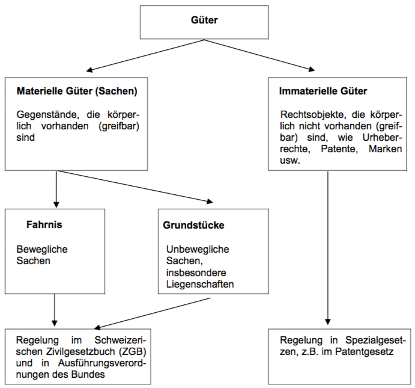
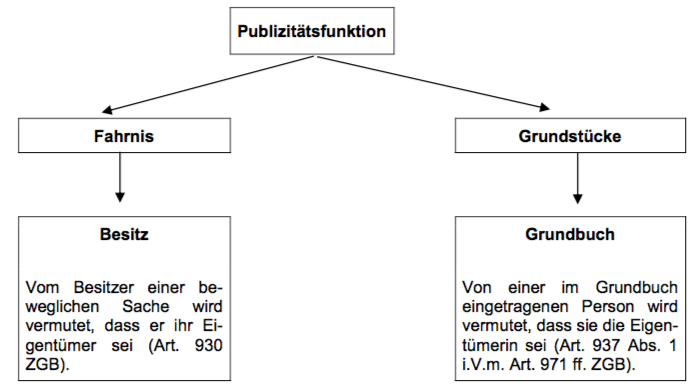
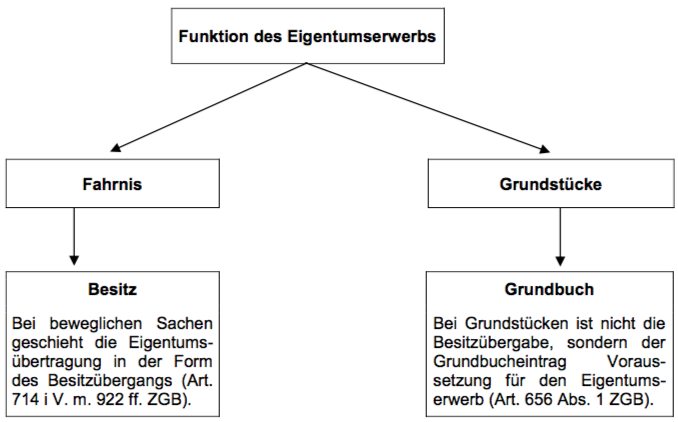
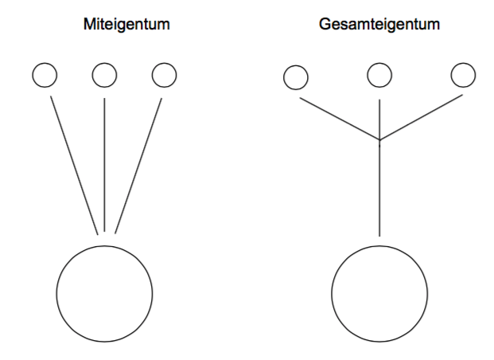
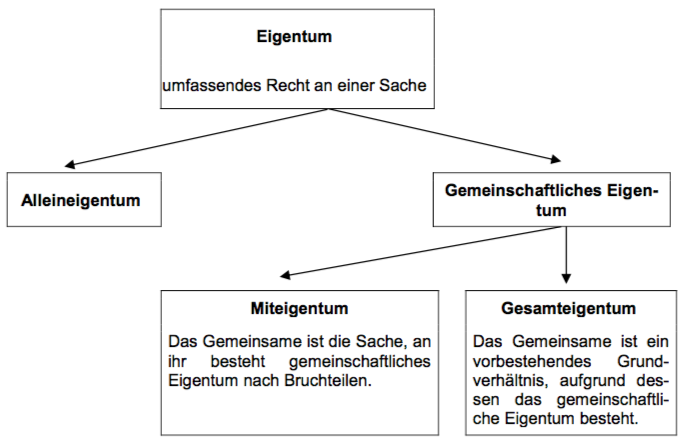
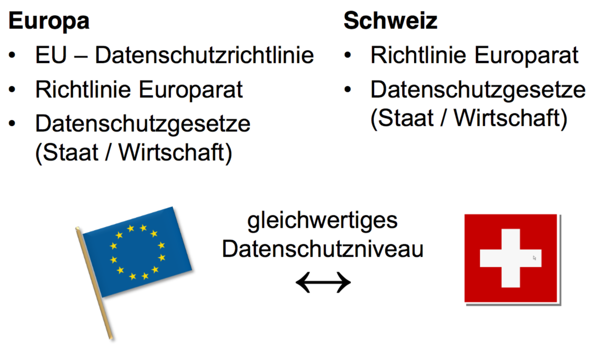
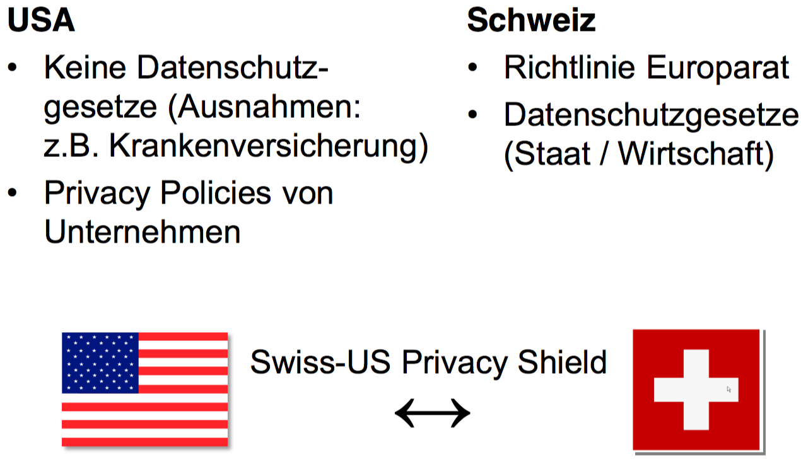

Achtung: es wird hier möglichst vereinfacht geschrieben.

# Einführung in die Rechtsordnung

## Objektives Recht (Rechtsordnung)

Das objektive Recht gilt für alle Personen. Es ist die "Rechtsordnung eines Gemeinschaftswesens." Sie wird in zwei Gruppen unterteilt

### Öffentliches Recht

regelt die Beziehungen zwischen dem (übergeordneten) Staat als Hoheit und den einzelnem Mitglied der Gemeinschaft (z.B. Verfassung, StrassenverkehrsG, StGB usw.). Es regelt auch den Aufbau, Organisation und Tätigkeit des Staates. Immer **zwingendes** Recht.

Es gilt das *Subordinationsprinzip*: der Bürger ist dem Staat untergeordnet. Der Staat kann seine öffentlichen Rechte als Befehle formulieren und die Befolgung erzwingen

Es gilt das *Legalitätsprinzip*: kein staatliches Handeln ohne ausdrückliche (schriftliche) gesetzliche Grundlage. Damit schützt man den Bürger vor willkürlichem Handeln des Staats.

Teilgebiete:

* Staats- und Verfassungsrecht
* Verwaltungsrecht
* Prozessrecht
* Strafrecht
* Schuldbetreibung- und Konkursrecht
* Völkerrecht

### Privat-(Zivil)recht

bestimmt die Rechtsbeziehung zwischen den einzelnen, gleichgeordneten Mitgliedern. Grundsätzlich **dispositives (abänderbares) Recht**.

Es gilt das *Koordinationsprinzip*: gleichgeordnete können ihre Rechtsverhältnisse dem eigenen Willen nach ordnen, privates Recht bildet daher den Rahmen zur Koordination der privaten Beziehungen.

Es herrscht grundsätzlich *Privatautonomie*: sie können ihre Rechtsverhältnisse nach eigenem Willen ordnen, ohne an eine Form gebunden zu sein.

Teilgebiete:

* Zivilrecht (Personen-, Familien-, Erb-, Sachenrecht)
* Obligationenrecht (Forderungs-, Vertrags-, Gesellschaftsrecht)

### Rechtssatz

Der Rechtssatz hat folgende Eigenschaften

* generell: auf unbestimmten Adressatenkreis anwendbar
* abstrakt: unbeschränkte Anzahl von Sachverhalten anwendbar

Es gibt zwei Arten

* materiell: Inhalt ist eine Regelung betreffend das Verhalten
* formell: Inhalt ist eine Regelung betreffend das Verfahren oder die Organisation

Er wird auch folgend definiert:

* zwingend: gilt ohne Rücksicht auf Willen der Beteiligten
* dispositiv: die Beteiligten können abweichende Regelungen treffen, er gilt nur dann wenn keine abweichende Regelung getroffen wurde

EInzelne Rechtssätze definieren Begriffe, sogenannte *Legaldefinitionen*, z.B. die Definition des Gebäudeabstandes.

#### Quellen

* Verfassungsnorm
* Gesetzesnorm
* Verordnungsnorm: geht nicht von der Legislative, sondern von der Regierung, Verwaltungsabteilung, oder vom Parlament aus. Rechtsverordnungen richten sich an Bürger, Verwaltungsverordnungen an Verwaltungsstellen
* Konkordatsnorm: Vereinbarung zwischen öffentlich-rechtlichen Körperschaften (z.B. Kantone), zum Beispiel Vereinbarung zwischen den Kantonen über die HSR
* Allgemein verbindlich erklärte Vertragsnorm: ursprünglich durch zwei Privatrechtssubjekte ausgehandelt, durch ihre Allgemeinheit dann für alle verbindlich erklärt (von Behörde). Z.B. GAV. Nur im Privatrecht
* Gewohnheitsrecht. Nur im Privatrecht
* Richterrechtsnorm. Nur im Privatrecht

## Stufenbau

* Formell höherrangiges Recht geht nachrangigem Recht vor
* Jüngeres Recht setzt Älteres ausser Kraft
* Sonderbestimmungen gehen allgemeinen Regelungen vor

## Rechtssubjekte

Rechtssubjekte sind Träger von Rechten und Pflichten.

### Natürliche Personen

Beginnt mit der Geburt und endet mit dem Tod. Auch ein ungeborenes Kind kann in gewissen Fällen im Erbfall bereits Rechtwirkung zeitigen. Bedingt Handlungsfähigkeit, die ihrerseits Urteilsfähigkeit und Mündigkeit voraussetzt. Die Rechtsfähigkeit ist eine passive, die Handlungsfähigkeit eine aktive Eigenschaft.

### Juristische Personen

Zusammenschluss von Personen oder Anhäufung von Vermögen.

#### Privatrecht

* Körperschaften: Personenzusammenschlüsse, Korporationen
  * Vereine, AG, GmbH, Genossenschaften
* Anstalten: zweckgebundene Vermögenswerte
  * Stiftung

einfache Gesellschaft, Kollektiv- und Kommanditgesellschaften haben keine Rechtspersönlichkeit!

#### Öffentliches Recht

Zum Beispiel der Staat. Sind sie technisch und organisatorisch zusammengefasst und stehen den Benutzern dauernd zur Verfügung, sind sie Anstalten. Haben sie eine eigene Rechtspersönlichkeit, nennt man sie selbständige, öffentlichrechtliche Anstalten (z.B. Spitäler). Die HSR ist eine selbständige, öffentlichrechtliche Anstalt.

## Rechtsobjekte

Materielle Güter (Liegenschaft, Auto), immaterielle Güter (Erfindung, Werk), aber nicht Tiere!

Die Rechtsobjekte sind der Herrschaft der Rechtssubjekte unterworfen.

## Subjektives Recht (Berechtigung)

Das Rechtssubjekt leitet sein subjektives Recht am Rechtsobjekt aus einem Rechtsverhältnis (Gesetz, Vertrag), welches die Rechtsordnung (objektives Recht) festlegt, ab. 

In jedem Fall ist bei der Rechtsausübung der Grundsatz von Treu und Glauben zu beachten, weshalb der missbräuchlichen Ausübung der Rechtsschutz verwehrt bleibt (z.B. rechtsmissbräuchliche EInsprache gegen ein Bauprojekt).

Wenn subjektive Rechte von anderen Rechtssubjekten oder dem Staat nicht beachtet oder verletzt werden, stellt der Staat dem Bettoffenen seine Gerichtbarkeit zur Feststellung, sowie andere Zwangsmittel (Betreibung, Polizei, etc.) zur Verfügung.

### Absolute/relative subjektive Rechte

* Absolute, subjektive Rechte müssen von allen beachtet werden. Sie gelten daher gegenüber jedermann
  * dingliche Rechte (z.B. Eigentum), beschränkt dingliche Rechte (Pfandrechte)
  * Persönlichkeitsrechte (Recht auf Leben, ...)
  * Immaterialgüterrechte (Urheberrechte, Patent)
* Relative, subjektive Rechte sind nur gegenüber Rechtssubjekt(en) begründet, mit denen man in einem bestimmten Rechtsverhältnis steht, z.B. aufgrund eines Vertrags, einer unerlaubten Handlung oder einer gesetzlichen Bestimmung. Sie gelten nur gegenüber den verpflichteten Personen.
  

# Strafrecht

Deliktstypen

* Verbrechen StGB 10 II: Freiheitsstrafe über 3 Jahre
* Vergehen StGB 10 III: Freiheitsstrafe bis zu 3 Jahre/Geldstrafe
* Übertretungen StGB 106: Busse
* Vorsatzdelikt StGB 12: in der Regel macht sich nur strafbar, wer ein Delikt vorsätzlich begeht. Eventualvorsatz = Vorsatz
* Fahrlässigkeitsdelikt: pflichtwidrige Unvorsichtigkeit, Missachtung einer Sorgfaltspflicht, unvorsätzliches Bewirken der Tat

## Verbrechensaufbau

Prüfschema

* Verletzung der Strafnorm
  * objektive Tatbestandsmerkmale (TBM) erfüllt
  * subjektive TBM erfüllt
* Rechtswidrigkeit
  * keine Rechtfertigungsgründe (RFG)
* Schuld
  * keine Schuldausschlussgründe

objektiver Tatbestand (TB): äussere TBM eines Deliktes

> <u>Wer</u> vorsätzlich <u>einen Menschen tötet</u>, ohne dass (...) wird mit Freiheitsstrafe (...) bestraft.

subjektiver Tatbestand: innere (psychische) Merkmale, welche nach dem Gesetz der Verwirklichung des obj. TB zugrunde liegen müssen

* Vorsatz
  * Wissen: intellektuelle Komponente
  * Willen: voluntative Komponente
* Eventualvorsatz
  * Wissen: für möglich halten
  * Willen

Rechtswidrigkeit (RW)

* RW: jedes tatbestandsmässige Verhalten welches keinen RFG hat

* RFG: besondere Rechtssätze, die ausnahmsweise ein solches Verhalten erlauben

* Rechtfertigungsgründe

  * rechtf. Notwehr
    * angemessene Abwehr eines umittelbar bevorstehenden, drohenden oder sich im Gang befindlichen, rechtswidrigen Angriffs
    * Abwehrhandlung gegen Angreifer
    * Angemessenheit der Abwehr
    * (Subsidiarität, Proportionalität)
    * Notwehrexess

  * rechtf. Notstand
    * Straftat, um ein eigenes oder fremdes Rechtsgut, aus einer unmittelbaren, nicht anders abwendbaren Gefahr zu retten, sofern dadurch höherwertige Interessen gewahrt werden
    * absolute Subsidiarität, Schutz
    * höherwertige Interessen
    * Notstandexess
  * Berufs-/Amtspflichten
    * sofern ges. Grundlage für Eingriffsbefugnis besteht
    * wenn in Ausübung hoheitlicher Befugnisse
  * Einwilligung des Verletzen (nicht immer möglich)
    * übergesetzliche Rechtfertigungsgründe
    * auch mutmasslich möglich (ärztlicher Eingriff)

Schuld

* Schuldfähigkeit, sofern dem Täter persönlich vorwerfbar
  * Fähigkeit, Rechtswidrigkeit zu erkennen
  * Fähigkeit, sich entsprechend zu verhalten
* Schuldunfähigkeit
  * Unfähigkeit, Unrecht der Tat einzusehen
  * Unfähigkeitm sich entsprechend Einsicht zu verhalten
* verminderte Schuldfähigkeit
  * Täter ist zu obigem nur teilweise fähig

Wenn die Schuldunfähigkeit selbst zugefügt wurde, so gilt z.B. die Rauschtat (StGB 263), also z.B. nur Freiheitsstrafe bis drei Jahren.

## Strafarten

* Sanktionen
  * Strafen
    * Geldstrafe (GS)
    * gemeinnützige Arbeit (GA)
    * Freiheitsstrafe (FS)
    * Busse
  * Massnahmen

### Geldstrafe

Anzahl Tagessätze x Höhe des Tagessatzes

Anzahl Tagessätze

* schuldabhängig
* **max. 360**

Höhe des Tagessatzes

* schuldunabhängig
* abhängig von persönlichen/wirtschaftlichen Verhältnissen (Einkommen, Vermögen, Lebensaufwand, Unterstützungspflichten)
* **max.** 3000 CHF
* bei Uneinbringlichkeit: Umwandlung in FS

### Gemeinnützige Arbeit

* Tätigkeit: unentgeltliche Arbeite für soziale Einrichtungen, Werke im öffentlichen Interesse oder hilfsbedürftige Personen
* Höchstdauer: 6 Monate
* Hauptstrafe: nein, Ersatz für GS oder Busse
* Voraussetzung: Zustimmung des Täters erforderlich
* Vollzug: unbedingt, bedingt oder teilbedingt
* bei Nichtleistung: Umwandlung in Geldstrafe oder Freiheitsstrafe

### Freiheitsstrafe

Maximal: 20 Jahre oder lebenslänglich

Minimal: 6 Monate, ausnahmweise weniger

Vollzug: unbedingt/bedingt (bis zwei Jahre), teilbedingt (bis drei Jahre)

### Busse

* Anwendungsfälle: ausschliessliche Strafart bei Übertretungen, Zweitstrafe bei bedingten Strafen
* Höchstbetrag: i.d.R. CHF 10'000
* Vollzug: nur unbedingt
* Zumessung: gemäss Verschulden
* bei Uneinbringlichkeit: Ersatzfreiheitsstrafe, bereits im Urteil festzusetzen

### Vollzug

### Strafzumessung

ordentlicher Strafrahmen (Höchst-/Mindestdauer)

Strafmilderungsgründe: Herabsetzung

Strafschärfungsgründe: Erhöhung (bis zum Höchstmass)

richterliches Ermessen innerhalb Strafrahmens

* nach Verschulden
* Vorleben/persönliche Verhältnisse
* Wirkung der Strafe auf das Leben des Täters

Strafmilderungsgründe

* Handeln
  * aus achtenswerten Beweggründen
  * in schwerer Bedrängnis
  * unter dem Druck schwerer Drohung
  * Affekt
* Provokation durch Verletzen
* Betätigung aufrichtiger Reue
* Zeitablauf und Wohlverhalten

Strafschärfung

* Zusammentreffen von mehreren mit FS bedrohten Handlungen
* Zusatzstrafe

## Massnahmen

therapeutisch/Verwahrung

* ambulante/stationäre Behandlung von psych. Störungen/Suchtbehandlung/für junge Erwachsene
* Verwahrung

andere

* Friedensbürgschaft
* Berufsverbot
* Fahrverbot
* Urteilspublikation
* Sicherungseinziehung
* Einziehung von Vermögenswerten

allgemein

* Subsidiaritätsprinzip
* Verhältnismässigkeitsprinzip
* Begutachtungspflicht
* Durchführbarkeit

dualistisches System

* Strafe und Massnahme, sofern Voraussetzung gegeben sind
* Massnahmen geht dem Vollzug der FS vor
* Ausnahme: Verwahrung

### Verwahrung

Isolierende Massnahme, zeitlich unbegrenzt, ultima ratio

Arten

* ordentlich
* nachträglich
* lebenslang

Voraussetzungen: Anlasstat + Rückfallgefahr + nicht therapierbar (bei lebenslanger Verwahrung)

## Ziele

* Bestrafung schuldfähiger Täter
* Behandlung psychisch schwer gestörter/suchtabhängiger Täter
* Förderung der Fähigkeit, deliktfrei zu leben
* präventiver Opferschutz (schwere Delikte)

Inhalt Strafregister

* alle Verurteilungen wegen Verbrechen/Vergehen, sofern Strafe/Massnahme ausgesprochen
* zum Teil Verurteilungen wegen Übertretungen
* Personen, gegen welche Strafverfahren wegen Verbrechen/Vergehen hängig sind

Einsicht von Gerichtsbehörden und anderen Behörden

Privatpersonen nur im eigenen Auszug

Entfernung nur von Amtes wegen, je nach Sanktionsart (10, 20 Jahre)

# Strafrecht besonderer Teil

## Ehrverletzungsdelikte

Nicht ehrverletzend sind Äusserungen, die jemanden z. B. als Geschäfts- oder Berufsmann, als Politiker, als Künstler, als Sportler oder in seiner sozialen Funktion herabsetzen, sofern die Kritik nicht zugleich auch seine Geltung als erhbarer Mensche trifft.

## Strassenverkehrsrecht

Teil des Nebenstrafrechts, d.h. der allgemeine Teil des StGB ist anwendbar				

## Betäubungsmittel

10g Cannabis sind geringfügige Menge

# Vertragsrecht

Obligationenrecht

"obligatio" = Schuld

Obligation = Schuldverhältnis

Schuldverhältnis: Leistungspflicht/Forderungsrecht

Entsteht aus Gesetz oder Rechtsgeschäft

### Schuldverhältnisse aus Gesetz

* unerlaubte Handlung
* ungerechtfertige Bereicherung
* sonstige gesetzliche Gründe

### Schuldverhältnisse aus Rechtsgeschäft

Schuldverhältnis, welches aufgrund einer privaten Willensäusserung entsteht, die eine rechtliche Wirkung zum Ziel hat.

* Willensäusserung: auf rechtlichen Erfolg abzielende private Äusserung
* Privatautonomie: Gleichstellung der Parteien

### Seiten

einseitige Rechtsgeschäfte: nur von einer Person (z.B. Testament)

zwei-/mehrseitig: Verträge, Gesellschaftsbeschlüsse

### Vertragsschluss, -arten

#### Voraussetzungen Vertragsschluss

* handlungsfähige Parteien
* übereinstimmende, gegenseitige Willensäusserung (Antrag/Annahme)
* Einigung über alle wesentlichen Punkte
  * Kaufvertrag: Produkt, Preis
  * Werkvertrag: Herstellung eines Werkes, Leistung einer Vergütung

#### Folgen

Begründung von Rechten (Forderungen) und Pflichten (Schulden) i.d.R. für beide Parteien

* Nominatverträge
  * gesetzlich, insbesondere im OR geregelte Verträge (z.B. Kauf)
* Innominatverträge
  * gesetzlich *nicht* geregelte Verträge (z.B. Leasing)

### Grundsatz der Vertragsfreiheit

* Abschlussfreiheit
* Partnerwahlfreiheit
* Formfreiheit
* Inhaltsfreiheit
* Typenfreiheit
* Änderungsfreiheit
* Aufhebungsfreiheit

Schranken der Vertragsfreiheit

### Reihenfolge

1. Zwingende Gesetzesnorm (Abweichung nicht möglich)
2. Vertragliche Vereinbarung
3. Nicht zwingende (dispositive) Gesetzesnormen (Abweichung möglich)

## Form

Verträge sind grundsätzlich formlos, ausser das Gesetz schreibt es vor, oder die Parteien vereinbaren eine Form. Bei Formmangel ist Rechtsgeschäft grundsätzlich nichtig.

## Vertragserfüllung

Bei richtiger Erfüllung erlöschen die gegenseitigen Rechte (Forderungen und Pflichten (Schulden) der Parteien

Richtig:

* die richtige Person
  * höchstpersönlich durch Schuldner
    * vorallem Dienstleistungen (Arbeitnehmer)
  * sonstige
    * Erfüllung durch Dritte möglich
    * vorallem Sach und Geldleistungen
* die richtige Leistung
  * Leistung
    * Tun, Dulden, Unterlassen
  * Primär: vertraglich vereinbarte Leistung
  * Sekundär: gesetzlich geschuldete Leistung
    * bei Gattungsschulden (z.B. Kartoffeln) mindestens mittlere Qualität
* am richtigen Ort
  * primär: vertraglich vereinbarter Ort
  * sekundär: gesetzlicher Erfüllungsort
    * Geldschulden sind Bringschulden
    * alle übrigen Schulden sind Holschulden
* zur richtigen Zeit erbringt
  * Erfüllungszeit: Zeitpunkt, zu dem Gläubiger Erfüllung verlangen kann
  * Primär: vertraglich vereinbarter Zeitpunkt
  * Sekundär: gesetzlicher Erfüllungszeitpunkt
    * Natur des Rechtsverhältnisses: Lohn Ende Monat
    * ansonsten sofort

## Leistungsstörung

* Nichtleistung
  * Nichterfüllung wegen Unmöglichkeit der Leistung
* Schlechtleistung
  * Nicht gehörige Erfüllung der zu erbringenden Leistung oder Verletzung einer vertraglichen Nebenpflicht
* Spätleistung
  * Nicht rechtzeitige Erfüllung einer Leistung

### Verzugsfolgen

Mahnung (= Verzug) + Nachfrist => Ablauf der Nachfrist

* Klage auf Erfüllung der Leistung
  * Schadenersatz wegen Verzug
* Verzicht auf nachträgliche Leistung und
  * Schadenersatz wegen Nichterfüllung (positives Interesse)
  * Rücktritt vom Vertrag
    * negatives Interesse
    * Rückersattung
    * optional Schadenersatz

### Durchsetzung einer Forderung

Geldleistungspflichten: Betreibungsbegehren => Zahlungsbefehl => Pfändung (Schuldbetreibungsverfahren)

Andere: Klageerhebung => Entscheid => Vollstreckung des rechtskräftigen Entscheids (Zivilprozessverfahren)

Anwendbares Recht

### Verjährung

Forderung nicht mehr durchsetzbar. Dient dem Erhaltung der Rechtssicherheit und des Rechtsfriedens.

Grundsätzlich 10 Jahre (127 OR), oder 5 Jahre bei regelmässigen Forderungen (Lohn, Miete, 128 OR)

Beginn: Fälligkeit der Forderung (130 OR)

# Bundesstaatstrecht

## Demokratie

Dem Bundesgericht un den übrigen rechtsanwendenden Behörden ist es nicht erlaubt, Gesetze, welche von der Legislative des Bundes erlassen worden sind, auf ihre Verfassungsmässigkeit zu überprüfen (in DE geht das).

Die Schweiz ist eine direkte Demokratie.

## Gewaltenteilung

* Exekutive (Regierung, Verwaltung), ausführende Gewalt
* Legislative (Parlament, Volk), gesetzgegebende Gewalt
* Judikative (Gerichte), richterliche Gewalt

Dazu kommt die personelle/subjektive Gewaltenteilung, dass die Staatsorgane personell streng getrennt sind. Eine Person darf daher gleichzeitig nur einem der Organe angehören.

### Legislative (Parlament, Volk)

Gesetzgebung und Whl der Hauptexponenten der übrigen Gewalten

Die Legislative kann auch durch Gesetze im materiellen Sinn (Verfassung, Gesetz) die Exekutive oder die Judikative berechtigen, Rechtssätze zu erlassen (z.B. Ausführungs- und Vollzugsbestimmungen, Notverordnungen). Diese erfolgen in Form von Verordnungen, Reglementen, Kreisschreiben usw.

### Exekutive (Regierung, Verwaltung)

Auf Bundesebene hat der Bundesrat die Regierungsfunktion, auf Kantonsebene der jeweilige Regierungsrat oder Staatsrat. Die Regierung ist auch mit der Leitung der Verwaltung betraut. Die Aufgabe der Regierung und Verwaltung ist in erster Linie der *Vollzug* der von der Legislative erlassenen Gesetze.

Bvor die Bundesversammlung über einen Entwurf einer neuen Verfassungsbestimmung oder Bundesgesetz berät, führt der Bundesrat oder die Verwaltungsstelle ein Vernehmlassungsverfahren durch, in dem die Konsensfähigkeit eines neuen Gesetzes bei Kantonen und Verbänden überprüft und abgeschätzt wird, ob diese beabsichtigen, ein Referendum gegen das geplante Gesetz zu ergreifen.			

Da die Aussenpolitik aber bei der Legislative liegt, gewinnt der Bundesrat in heutiger Zeit an Macht gegenüber der Legislative.

Die Judikative ist in Zivil- und Strafsachen in drei Instanzen gegliedert.

1.  Bezirksgerichte (Kreis-, Amtsgerichte)
2.  Kantonsgerichte (Obergerichte)
3.  Schweizerisches Bundesgericht (Lausanne)

In Verwaltungssachen welche von kantonalen Behörden ergehen, sind 

1. kantonale Versicherungsgerichte und Verwaltungsrekurskommission
2. kantonale Verwaltungsgerichte
3. Schweizerisches Bundeesgericht, eidgenössisches Versicherungsgericht

In Verwaltungssachen von eidgenössischen Behörden

1. eidgenössische Rekurskommissionen
2. Schweizerische Bundeskommision

Bei Ausnahmefällen, nämlich der Geltendmachung einer Verletzung der europäischen Menschenrechtskonvention (EMRK) bleibt schlussendlich als weitere Instanz der europäische Gerichtshof für Menschenrechte in Strassburg. Dieses darf zwar keine innerstaatlichen Rechte und Verwaltungsakten aufheben, es kann aber feststellen dass diese dem EMRK widersprechen und völkerrechtlich verbindliche Massnahme anordnen.

Wichtige Entscheide werden in Entscheidsammlungen publiziert.

### Rechtsstaatsprinzip

Gesetze sind Ausdruck des Volkswillens.

Einem Einzelnen darf nicht mehr auferlegt werden, als der Allgemeinheit. 

## Föderalismus

Es gibt eine Aufzählung der Bundeskompetenzen (BV 42). Fehlt eine solche Ermächtigung, sind automatisch die Kantone zuständig. Neue Staatsaufgaben fallen somit erst einmal den Kantonen zu. Nur mittels Revision der Bundesverfassung kann eine gesamtschweizerische Regelung begründet werden.

Die Gesetze der verschiedenen Stufen können sich teilweise auch überlappen, zum Beispiel beim Raumplanungsgesetz.

## Bundesverfassung als Grundgesetz

Sie regelt

* Grundrechte, Bürgerrechte und Sozialziele
* Staatsform
* Kompetenzabgrenzung Bund und Kantone
* Beteiligung von Volk und Ständen bei der politischen Meinungsbildung des Bundes
* Grundsätze der Organisation der Bundesbehörden
* Revision der Bundesverfassung
* Übergangsbestimmungen

### Grundrechte

* Freiheitsrechte
* Rechtsgleichheit
* Sozialrechte

Abwehrrechte des Invididuums gegenüber dem Staat.

* Persönliche Freiheit (BV 10)
  * psychische und physische Integrität respektieren
  * kein Recht auf Finanzierung der Lebenskosten
  * keine staatlichen Impfungen (z.B.)
* Meinungs- und Informationsfreiheit
  * Recht auf freien Meinungsaustausch unter den Menschen
  * Recht auf Kritik am Staat
  * Recht, sich aus allen frei zugänglichen Quellen zu informieren
  * (Recht, eine Satellitenantenne auf seinem Dach aufzustellen)
  * Versammlungs-/Demonstrationsfreiheit (22 BV)
  * Kunstfreiheit (BV 21)
  * Wissenschaftsfreiheit (20 BV)
* Glaubens- und Gewissensfreiheit
  * religiöse Handlungen und Rituale
  * freie Wahl, Gemeinschaften anzugehören oder fern zu bleiben
* Eigentumsgarantie
  * **Institutsgarantie**
  * Bestandes- und Wertgarantie: verbietet Enteignungen (wenn nötig) ohne Entschädigung oder wesentliche Beschränkung des Eigentumsrechts
* Wirtschaftsfreiheit
  * freie Arbeitsplatzwahl
  * jeder darf mit eigener Leistung auftreten und konkurrenzieren
  * kein Protektionismus
  * verleiht keinen Anspruch auf Zulassung zu einer staatlichen Ausbildungseinrichtung, deren Ausbildung zur Ausübung eines öffentlichen Amtes befähigt

### Einschränkung von Grundrechten

Die Rechte gelten nicht absolut. Eingriffe sind erlaubt, wenn das folgende gegeben ist:

Grundlage in einem Rechtssatz

* je schwerer der Eingriff, desto höher der Anspruch an die gesetzliche Grundlage
* Schwere Eingriffe in Grundrechte benötigen ein Gesetz von der Konsensstufe des Parlaments bzw. Volkes.

öffentliches Interesse

* öffentliche Sicherheit
* ... Gesundheit
* ... Ruhe
* ... Sittlichkeit
* Treu und Glauben im Geschäftsverkehr
* Ist sehr weit gefasst und daher meistens gegeben

Verhältnismässigkeit im weiteren Sinne

* geeignet
  * geeignet sein, das angestrebte Ziel zu verwirklichen
  * geeignet: obligatorische Impfung zur Verhinderung von Epidemien
  * nicht geeignet: Importverbot von Hunden zur Verhinderung der Ausbreitung einer Katzenseuche
* erforderlich
  * ist eine mildere Massnahme ausreichend, ist eine strengere nicht erlaubt
* verhältnismässig im engeren Sinne

### Rechtsgleichheit

Alle sind vor dem Gesetz gleich.

# Gesellschaftsrecht

## Einfache Gesellschaft

* Zusammenschluss von zwei oder mehreren Personen. Erreichung eines gemeinsamen Zwecks, gemeinsame Mittel.
* Mitglieder: nat./jur. Personen, Gesellschaften ohne eigene Rechtspersönlichkeit
* keine eigene Rechtspersönlichkeit
* weder handlungs-, prozess-, noch betreibungsfähig
* kein eigenes Gesellschaftsvermögen
* Gesellschaftsbeschlüsse idR einstimmig, vertraglich anders regelbar
* Geschäftsführung im Bereich der gewöhnlichen Geschäfte steht jedem Gesellschafter einzeln zu, vertraglich anders regelbar
* jeden Gesellschafter trifft eine Beitragspflicht, nicht zwingend Geld
* gleicher Anteil an Gewinn/Verlust, vertraglich anders regelbar
* Vertretung nach aussen durch den einzelnen Gesellschafter nach Stellvertretungsrecht, gesetzliche Vermutung der Vertretungsmacht eines Geschäftsführers
* persönliche, solidarische und unbeschränkte Haftung der einzelnen Gesellschafter
* gesetzliche Regelungen meist dispositiver Natur, Gesellschaftsvertrag
* keine eigene Firma, kein eigener Sitz
* darf kein kaufmännisches Unternehmen führen
* nicht im HR eintragbar
* Mitgliedschaft unübertragbar und unvererblich
* Subsidiärform zu den anderen Gesellschaftsformen

## Kollektivgesellschaft

* Zusammenschluss von zwei oder mehreren natürlichen Personen, Erreichung eines gemeinsamen Zwecks, gemeinsame Mittel unter einer Firma
* HR-Eintrag Pflicht für kaufmännische KollG, nicht Pflicht aber konstitutiv für andere
* Mitglieder: nat. Personen
* keine eigene Rechtspersönlichkeit
* jedoch handlungs-, prozess- und betreibungsfähig
* eigenes Gesellschaftsvermögen
* Gesellschaftsbeschlüsse idR einstimmig, vertraglich anders regelbar
* Geschäftsführung im Bereich der gewöhnlichen Geschäfte steht jedem Gesellschafter einzeln zu, vertraglich anders regelbar
* jeden Gesellschafter trifft eine Beitragspflicht, nicht zwingend Geld
* gleicher Anteil an Gewinn/Verlust, vertraglich anders regelbar
* Vertretung nach aussen durch den einzelnen Gesellschafter nach Stellvertretungsrecht, Vertretung durch Dritte möglich
* primäre Haftung des Gesellschaftsvermögens, subsidiäre, unbeschränkte und solidarische Haftung der Gesellschafter mit Privatvermögen

## Kommanditgesellschaft

* Zusammenschluss von zwei oder mehreren natürlichen Personen, Erreichung eines gemeinsamen Zwecks, gemeinsame Mittel unter einer Firma
* mind. 1 Komplementär und 1 Kommanditär. Komplementär muss zwingend eine nat. Person sein, Kommanditäre nat. und jur. Personen sowie Gesellschaften ohne Rechtspersönlichkeit
* HR-Eintrag Pflicht für kaufmännische KollG, nicht Pflicht aber konstitutiv für andere
* keine eigene Rechtspersönlichkeit
* jedoch handlungs-, prozess- und betreibungsfähig
* eigenes Gesellschaftsvermögen
* Gesellschaftsbeschlüsse idR einstimmig, vertraglich anders regelbar
* Geschäftsführung im Bereich der gewöhnlichen Geschäfte steht jedem Komplementär einzeln zu, Ausschluss der Kommanditäre
* jeden Gesellschafter trifft eine Beitragspflicht, nicht zwingend Geld
  * für Kommanditär genügt grundsätzlich eine Haftungsübernahme im Umfang der Kommanditsumme (≠ Kommanditeinlage)
* Verlustbeteiligung des Kommanditärs höchstens im Umfang seiner Kommanditeinlage
* Vertretung nach aussen durch den einzelnen Gesellschafter nach Stellvertretungsrecht, Vertretung durch Dritte möglich
* primäre Haftung des Gesellschaftsvermögens, subsidiäre, unbeschränkte und solidarische Haftung der Komplementäre mit Privatvermögen, subsidiäre, beschränkte (Kommanditsumme) und solidarische Haftung der Kommanditäre mit Privatvermögen
* nach aussen verselbständigte Gesamthandsgemeinschaft
* gesetzliche Regelungen meist dispositiver Natur, Gesellschaftsvertrag
* subsidiäre Anwendung des Rechts der Kollektivgesellschaft und der einfachen Gesellschaft

## Aktiengesellschaften

* Körperschaft (jur. Person), eigene Firma, im Voraus bestimmtes Kapital in Teilsummen (Aktien), Gesellschaftsvermögen ausschliessliche Haftung für Verbindlichkeiten der Gesellschaft
* rechts-, handlungs-, prozess-, und betreibungsfähig
* formeller Errichtungsakt, Gründungsstatuten, Organbestellung, HR-Eintrag zum Erwerb der Rechtspersönlichkeit, qual. Gründung durch Sacheinlage oder Sachübernahme
* Gesellschaftsvermögen, mind CHF 100'000.00, 50% liberiert
  * liberiert: zur Verfügung stehend. Bei der Gründung müssen also mind. 50'000 CHF, ferner mind. 20%, des Gesellschaftsvermögens zur Verfügung stehen
* Aktionäre: nat. und jur. Personen, Handelsgesellschaften ohne Rechtspersönlichkeiten (KollG und KommG)
* Organe: Generalversammlung, Verwaltungsrat, Revisionsstelle (z.T. unübertragbare Befugnisse gemäss Gesetz)
* Handlungen primär durch Organe, GV als willsensbildendes Organ
* Geschäftsführung idR übertragen an einzelne VR oder Dritte nach Massgabe der Statuten
* Vertretung idR übertragen an einzelne VR oder Direktoren, Handlungsbevollmächtigte
* einzige Aktionärspflicht ist die Liberierungspflicht
* Möglichkeit von ABV
* Haftung ausschliesslich des Gesellschaftsvermögens, persönliche Haftung der Aktionäre ist ausgeschlossen
* Aktienkapital: div. Schutzvorschriften
* verschiedene Kategorien von Aktien, Vinkulierungsmöglichkeiten (statutarische, gesetzliche)
* Kapitalveränderungen, gesetzliche Regelungen
* Verantwortlichkeiten von VR und Revisionsstelle

## GmbH

* Körperschaft (jur. Person), eigene Firma, Stammkapital und Stammanteile, ausschliessliche Haftung des Stammkapitals für Verbindlichkeiten der Gesellschaft
* rechts-, handlungs-, prozess-, und betreibungsfähig
* formeller Errichtungsakt, Gründungsstatuten, Organbestellung, HR-Eintrag zum Erwerb der Rechtspersönlichkeit, qual. Gründung durch Sacheinlage oder Sachübernahme
* Gesellschaftsvermögen, mind CHF 20'000.00, vollständig liberiert
* Gesellschafter: nat. und jur. Personen, Handelsgesellschaften ohne Rechtspersönlichkeiten (KollG und KommG)
* Organe: Gesellschafterversammlung, Geschäftsführung, Revisionsstelle (z.T. unübertragbare Befugnisse gemäss Gesetz)
* Handlungen primär durch Organe, GV als willsensbildendes Organ
* Geschäftsführung durch Gesellschafter gemeinsam (dispositiv)
* Vertretung idR übertragen an einzelne Gesellschafter oder Handlungsbevollmächtigte
* Pflicht der Gesellschafter zur vollständigen Einzahlung der Einlage für den Stammanteil
* statutarisch Nachschusspflichten, Nebenleistungspflichten festlegbar
* Haftung ausschliesslich des Gesellschaftsvermögens
* Verantwortlichkeiten analog AG
* Kapitalveränderungen, gesetzliche Regelungen

## Genossenschaft

* Körperschaft (jur. Person), eigene Firma, offenes Grundkapital
* zwingend nicht geschlossene Anzahl Mitglieder
* Zweck: Förderung oder Sicherung wirtschaftlicher Interessen der Mitglieder in gemeinsamer Selbsthilfe
* rechts-, handlungs, prozess-, betreibungsfähig
* formeller Errichtungsakt, Gründungsstatuten, mind. 7 Mitglieder, Organbestellung, HR-Eintrag zum Erwerb der Rechtspersönlichkeit, qual. Gründung möglich
* Mitglieder: nat. und jur. Personen, Handelsgesellschaften ohne Rechtspersönlichkeiten (KollG und KommG)

* Organe: Generalversammlung, Verwaltung (mind. 3 Personen), Revisionsstelle (z.T. unübertragbare Befugnisse gemäss Gesetz)
* Handlungen primär durch Organe, GV als willsensbildendes Organ
* Geschäftsführung idR durch Verwaltung, Delegation möglich
* Vertretung idR durch Verwaltung, Delegation möglich
* versch. vermögensmässige und nicht vermögensmässige Rechte und Pflichten der Genossenschafter
* grundsätzlich ausschliessliche Haftung des Gesellschaftsvermögens, statutarisch persönliche Haftung der Mitglieder möglich

### Handelsregister/die Firma

* Definition der Firma
* Bedeutung der Firma
* Grundsätze der Firmenbildung
* Schutz der Firma
* Firmenrecherche (online und mittels REGIX)

# Sachenrecht (dingliches Recht)

ZGB

* 4. Teil
  * Das Eigentum (641-729 ZGB)
  * Die beschränkten dinglichen Rechte (730-915 ZGB)
  * Besitz und Grundbuch (919.977 ZGB)

* Weiter: 17-48 SchlT ZGB

Weiter wird zwischen beweglichen (Mobilien) und unbeweglichen (Immobilien) unterschieden.

Rechte an Sachen sind **absolute** Rechte. Forderungsrechte sind hingegen **relativ**. 

* Eigentum: es vermittelt dem Berechtigten das umfassende Herrschaftsrecht an einer Sache
* Beschränkt dingliche Rechte: es vermittelt dem Berechtigten die Herrschaft über die Sache nur in bestimmter Hinsicht
  * Dienstbarkeiten
  * Pfandrechte

## Prinzipien

Diese werden im Gesetz nicht ausdrücklich genannt

* Typengebundenheit: die dinglichen Rechte sind zahlenmässig begrenzt und es gibt nur diejenigen, die das Gesetz vorsieht. Im Gegensatz dazu kann man im Vertragsrecht dem Vertragspartner nahezu alle erdenklichen Rechte einräumen
* Publizitätsprinzip: die dinglichen Rechte müssen für jedermann erkennbar sein, durch Besitz und Grundbuch. Ist eine Hypothek im Grundbuch nicht als Grundpfand eingetragen, so kann ein gutgläubiger Käufer das Grundstück ohne diese Belastung erwerben.
* Spezialitätsprinzip: dingliche Rechte können nur an individualisierten, einzelnen Objekten bestehen. Es ist also nicht möglich, bspw. ein Unternehmen als solches, als **Sachgesamtheit** dinglich zu übernehmen, sondern es muss jeder Bestandteil einzeln übertragen werden.
* Akzessionsprinzip: ein dingliches Rechte betrifft eine Sache mit allen ihren Bestandteilen. Über Bestandteile kann nicht anders verfügt werden als  über die Hauptsache. Erbt jemand bspw. einen Wohnwagen, so erbt er damit gleichzeitig die eingebauten Betten, Tische, usw.

Der Begriff der Sache ist schwer abzugrenzen. Ein Bienenschwarm ist eine Sache, eine Schafsherde hingegen eine Ansammlung von einzelnen Schaf-Sachen. Die Sache muss der menschlichen Herrschaft unterworfen werden können.

Begriffsmerkmale einer Sache

* Unpersönlichkeit: menschliche Körper, wie auch Leichname, sind keine Sachen. Ebenso Tiere. Allerdings sind die Bestimmungen des Sachenrechts auf sie anwendbar, falls keine Sonderregelung besteht
* Körperlichkeit: es muss greifbar sein. Ausnahmsweise wendet man das Sachenrecht auch auf Energien und Naturkräfte analog an. 
* Abgegrenztheit: muss ein abgegrenztes Dasein im Raum haben. Eine Gaswolke ist daher keine Sache
* Rechtliche Beherrschbarkeit: muss erworben, angeeignet oder genutzt werden können. Die Sonne kann deshalb keine Sache sein
* Räumlich begrenzter, körperlicher Gegenstand, ebenso Naturkräfte, aber NICHT Daten im klassisschen Sinne des Sachenrechts. Mit richterlicher Lückenfüllung kann man allerdings eine eigentumsähnliche Verfügungsmacht einräumen.

## Tiere

* wird in einem Testament ein Tier bedacht, müssen die Erben für das Tier tiergerecht sorgen
* bei Haustieren spricht das Gericht meistens das Tier der Partei zu, die besser für es sorgen kann
* wird ein Haustier verletzt oder getötet, wird nicht nur der Sachwert, sondern auch der Affektionswert ersetzt
* Haustiere sind unpfändbar
* Findet man ein Haustier, muss man es nur innerhalb von zwei Monaten dem bisherigen Eigentümer zurückgeben

## Besitz

Besitz/Eigentum

* Besitzer ist, wer die tatsächliche Herrschft über die Sache ausübt (z.B. Mieter)
* Eigentümer ist, wer die rechtliche Beziehung zur Sache innehat (z.B. Vermieter)

Bei Fahrnissen wird angenommen, der Besitzer sei der Eigentümer.

Besitz:

* tatsächliche Gewalt: vergisst man einen Schirm im Tram, verliert man die tatsächliche Gewalt und damit den Besitz
* subjektives Element: auch der Wille zur Ausübung dieser Gewalt muss vorhanden sein. Weiss man nichts vom Schatz im Garten, so gehört er einem auch nicht

Besitzarten (ZGB 970 Abs. 2)

* selbständigen Besitz
  * derjenige, der zugleich auch Eigentümer der Sache ist
* unselbständigen Besitz
  * vom Eigentümer zu einem dinglichen oder persönlichen Recht übertragen bekommen hat (Nutzniesser, Pächter, Mieter, Werkunternehmer)

Wie beim Mit- und Gesamteigentum gibt es auch den Mit- und Gesamtbesitz

Ebenso gibt es den **Besitzdiener**. Er hat die Gewalt vom Eigentümer über die Sache bekommen, ist aber kein unselbständiger Besitzer (Gast im Restaurant mit Messer/Gabel)

## Erwerb des Besitzes

* Derivativer Erwerb: Besitzübertragung mit dem Willen dees bisherigen Besitzers (Schenkung, 223ff OR) oder Kauf (184ff OR). Vertrag auf Eigentumsübertragung bedarf zu seiner Verbindlichkeit der öffentlichen Beurkundung
* Originärer Erwerb: ohne Willen des bisherigen Besitzers
  * Aneignung 658/718ff ZGB
  * Fund 720ff ZGB
  * Schatz 723 ZGB
* Besitzübertragungssurrogaten: durch blosse Willsenserklärung (924 ZGB)
* Besitzanweisung: ein selbständiger Besitzer einer Ware im Lagerhaus weist dieses an, den Besitz einer anderen Person zu vermitteln
* Besitzeskonstitut: der selbständige Besitzer wird zum unselbständigen. 
* brevi manu traditio: bisherige unselbständiger Mieter wird zum selbständigen, indem z.B. der Mieter die Sache kauft

## Publizitätsprinzip

## Eigentum

Ein Eigentümer kann die Sache z.B. verkaufen, verschenken oder auch vernichten. Er darf sie von jedem der sie ihm vorenthält verlangen und jede ungerechtfertigte Einwirkung abwehren. 

Das Gesetz unterscheidet zwischen *Bestandteilen* (ZGB 642 2) und *Zugehör* (ZGB 644 2)

Beziehung eines Bestandteils zur Hauptsache:

* innere Verbindung: ohne Bestandteil ist Sache nicht fertig oder vollständig
* äusserer Zusammenhang: körperlich und phsyikalisch miteinander verbunden. Abtrennung des Bestandteils nur unter äusserer Beschädigung der Hauptsache. (Dach oder Türe zum Haus)
* Dauerhaftigkeit: von längerer Dauer und nicht bloss vorübergehend. Wille ist entscheidend

Beziehung einer Zugehör zur Hauptsache:

* Zweckbeziehung: dient der Bewirtschaftung, der Benutzung oder Aufbewahrung der Hauptsache, nicht nur vorübergehend. Ortsbeziehung und wille ist entscheidend
* Sachbeziehung: körperliche Verbindung nicht notwendig. Müssen aber irgendwie zusammenpassen oder aufeinander abgestimmt sein. (Schlüssel zum Schloss, Hülle zum Tennisschläger)

Der Bestandteil darf keinen anderen Eigentümer als die Hauptsache haben! Das ist beim Zugehör möglich.

## Gemeinschaftliches Eigentum

* Miteigentum
  * das Recht des Eigentümers zielt auf einen Anteil (z.B. Drittel), der Rest steht anderen Eigentümern zu. Der Eigentümer kann über seinen Teil frei verfügen, auch verkaufen oder verpfänden
* Gesamteigentum
  * eine Sache steht mehreren Eigentümern als Gruppe, als Einheit zu. Der Wille des Eigentümers zählt nur als eine Stimme. Für eine Verfügung braucht es immer die Zustimmung aller Gesamteigentümer. Verbindet sie nur das gemeinschaftliche Eigentum, so beurteilt sich ihr Verhältnis nach den Regeln der einfachen Gesellschaft.
* Stockwerkeigentum: spezielle Form des Miteigentums ZGB 712aff

## Grundeigentum

Der Vertrag auf Eigentumsübertragung bedarf der öffentlichen Beurkundung. Der Vertrag wird auch Verpflichtungsgeschäft genannt. Erst der Grundbucheintrag, auch Verfügungsgeschäft genannt, begründet das dingliche Recht.

* originärer Erwerb:
  * Aneignung 658 ZGB
  * Bildung neuen Landes: 659 ZGB
  * Bodenverschiebung: 660 ZGB
  * Ersitzung: 662 ZGB

Umfang des Grundeigentums ist in 667-712 ZGB geregelt. Widersprechen sich die Grundbuchpläne und die Markierungen auf dem Grundstück, wird die Richtigkeit der Grundbuchpläne vermutet.

Die Ausdehnung nach oben und unten wird durch das Interesse des Grundeigentümers begrenzt. Er muss also den Raum über oder unter dem Erdboden beherrschen und daraus Nutzungsbefugnisse ausüben. Eine Leitung einige Meter unter dem Boden werden ihn beeinträchtigen, ein Tunnel Hundert Meter unter seinem Grundstück weniger

Insbesondere sind auch Bauten, Pflanzen und Quellen enthalten.

Der Grundeigentümer verpflichtet sich, sich übermässiger Einwirkungen auf seinen Nachbarn zu enthalten. Dieser Immissionsschutz (684ff ZGB) ist Grundlage für Beseitigungs-m Unterlassungs-, Präventiv-, und Schadensersatzklage.

Bei Bauten darf das Grundstück des Nachbarn nicht beschädigt werden, konkret das Erdreich nicht in Bewegung gebracht werden. Weiter muss er seinem Nachbarn das Wegrecht einräumen, wenn dieser darauf angewiesen ist, oder auch eine Wasserleitung durch das eigene Grundstück ziehen muss. Auch hier gilt, dass übermässiges nicht hingenommen werden muss. 

## Fahrniseigentum

Derivativer Erwerb

* gültiger, auf Eigentumsübertragung gerichteter Vertrag
* das Eigentum oder Verfügungsbefugnis liegt beim Veräusserer
* Übertragung des Besitzes auf den Erwerbenden (Traditio) oder Traditionssurogat (z.B. Besitzeskonstitut)

Originärer Erwerb

* Wenn der Empfänger gutgläubig davon ausgeht, dass der Veräusserer Eigentum der Sache ist, so kann Eigentum beim Empfänger entstehen. Ist die Sache dem Eigentümer aber gegen seinen Willen abhand gekommen, so kann er sie innerhalb von fünf Jahren herausverlangen, unter Umständen aber nur gegen Entgelt (934 2 ZGB)
* Aneignung: 718 ZGB herrenlose Sache
* Fund: 720 ZGB nach fünf Jahren unangefochtenen Besitzes geht es in das Eigentum über
* Verbindung/Vermischung: 727 ZGB: diese neue Sache steht den vorherigen Eigentümern im Miteigentum zu. Wenn die eine Sache der anderen untergeordnet ist, ist der Eigentümer der übergeordneten Sache auch Eigentümer der untergeordneten Sache, dem anderen bleibt lediglich ein Anspruch auf Ausgleichszahlung.

# Datenschutz

Datenschutz = Schutz der **Persönlichkeit** und der **Grundrechte** der Person, über die Daten bearbeitet werden.

Art, 8 EMRK: Recht auf Achtung des Privat- und Familienlebens. (1) jede Person hat das Recht auf **Achtung ihres Privat- und Familienlebens**, ihrer Wohnung und Ihrer Korrespondenz

10 2 BV: Jeder Mensch hat das Recht auf **persönliche Freiheit**, insbesondere auf körperliche und geistige Unversehrtheit und auf Bewegungsfreiheit

13 2 BV: jede Person hat Anspruch auf Schutz vor Missbrauch ihrer persönlichen Daten

28, 28a, 28l ZGB: Wer in seiner **Persönlichkeit widerrechtlich verletzt wird**, kann zu seinem Schutz gegen jeden, der an der Verletzung mitwirkt, das Gericht anrufen. Eine Verletzung ist **widerrechtlich**, wenn sie nicht durch Einwilligung des Verletzen, durch ein überwiegendes privates oder öffentliches Interesse oder durch Gesetz gerechtfertigt ist.

## Datenschutzgesetze

* Bund: Bundesgesetz über den Datenschutz (DSG)
  * Privatpersonen + private Unternehmungen
  * Bundesorgane
* Kantone: eigene Datenschutzgesetze
  * öffentliche Organe auf kantonaler und kommunaler Ebene
  * mit öffentlichen Aufgaben betraute Private

## Personendaten

Alle Angaben, die sich auf eine bestimmte Person oder *bestimmbare* Person beziehen (3 a DSG)

Kategorien

* gewöhnliche Personendaten: 3 a DSG
* besonders schützenswerte Personendaten: 3 c DSG
  * religiöse, weltanschauliche, politische oder gewerkschaftliche Ansichten oder Tätigkeiten
  * Gesundheit, Intimsphäre, Rassenzugehörigkeit
  * Massnahmen der sozialen Hilfe
  * administrative, strafrechtliche Verfolgungen und Sanktionen
* Persönlichkeitsprofil: 3 d DSG
  * Zusammenstellung von Daten, die eine Beurteilung wesentlicher Aspekte der Persönlichkeit einer natürlichen Person erlaubt

### Umgang mit Personendaten

Jeder Umgang mit Personendaten, unabhängig von den angewandten Mitteln und Verfahren, insbesondere das Beschaffen, Aufbewahren, Verwenden, Umarbeiten, Bekanntgeben, Archivieren und Vernichten von Daten. 3 e DSG

Bekanntgeben von Personendaten: das Zugänglicmachen von Personendaten wie das Einsichtgewähren, Weitergeben oder Veröffentlichen (3 f DSG)

## Rechtfertigung

Gründe

* Einwilligung der betroffenen Person
* überwiegendes privates oder öffentliches Interesse
* gesetzliche Grundlage

## Prinzipien

Rechte

* Auskunftsrecht (8 DSG)
  * höchstpersönlich
  * grundsätzlich kostenlos
  * dient der Transparenz und Kontrolle
* Weitere Rechte nach DSG (15 DSG)
  * Berichtigung
  * Korrektur
  * Sperrung
* Persönlichkeitsverletzung (28, 28a, 28l ZGB)
* Schadenersatz, Genugtuung (41/97 OR)
* Straftatbestände
  * Verletzung der Auskunfts-, Melde- und Mitwirkungspflichten (Art. 34 DSG)
  * Verletzung des Geheim- oder Privatbereichs durch Aufnahmegeräte (Art. 179quater StGB)
  * unbefugtes Beschaffen von Personendaten(Art. 179novies StGB)
  * Verletzung des Amts- oder Berufsgeheimnisses(Art. 320 und 321 StGB)
  * «Computerdelikte»(Art.143,143bis,144bisund147StGB)

Zuständigkeiten

* Bund: eidgenössischer Datenschutz- und Öffentlichkeitsbeauftragter (EDOEB)
  * Aufsicht über und Beratung von Privaten und Bundesorganen
  * Öffentlichkeitsprinzip
* Kantone kantonale Datenschutzbeauftragte
  * Aufsucht über und Beratung von Behörden und mit öffentlichen Aufgaben betraute Private
  * teilw. Öffentlichkeitsprinzip

## Entwicklung

Information als Wirtschaftsgut

Staatsüberwachung

Spannungsfeld

* Technologie
  * global
  * vernetzt
  * standardisiert
  * Benutzung einfach
* Recht
  * national
  * kollidiert
  * nicht standardisiert
  * Anwendbarkeit des Rechts im Internet ist schwierig

## Vergleich

Europa/Schweiz

USA/Schweiz

## Vorgehensweise

1. prüfen eines Rechtfertigungsgrundes für die Rechtmässigkeit der Bearbeitung von Personendaten
2. Einhaltung der übrigen datenschutzrechtlichen Prinzipien

## Mehrdimensionaler Datenschutz

# Prüfung

Im Zivilrechtsverfahren bestimmen die Verfahrensparteien den Sachverhalt

Im Zivilverfahren bestimmen die Verfahrensparteien den Prozessgegenstand