[TOC]

# Vorlesungswoche 1 - Grundbegriffe

## Medien und Datenraten

* Kupferkabel
  * Einige 100m-km, MHz-Bandbreiten
  * Zweidrahtleitung (Twisted Pair)
  * Koaxialkabel
  * Stromnetz
* Funk
  * Bis einige "zig km", kHz - GHz-Bandbreiten
  * Gerichtet (Mikrowellen, Richtstrahl)
  * Ungerichtet (z.B. WLAN, Radio, TV, GSM)
  * Licht (Infrarot)
* Lichtwellenleiter
  * Bis einige 1000km, THz-Bandbreiten
  * Multimode-Glasfasern
  * Singlemode-Glasfasern

## Kommunikationsarten

- Simplex (Radio, TV, Pager)
- Half-Duplex (Walkie-Talkie, Gegensprechanlage, WLAN), Wechselbetrieb
- Full-Duplex (analoges Telefon)

## Multicast/Broadcast

* Broadcast: an alle gleichzeitig
  * Radio, TV, Satelliten
  * Ethernet-Segment
  * Kabelfernsehnetz
* Multicast: an ausgewählte Gruppe gleichzeitig
  * Internet Multicast Backbone (MBONE)
  * IP-TV
  * LAN Multicast (MAC Gruppenadressen)

## Daten und Informationen

Daten sind Werte und Informationen sind interpretierte Daten

## Beispiele zu Datenmengen

* 5kB
  * 1 Seite A5
  * Text mit 63 Zeilen à 80 Zeichen
* 1MB
  * 1 Minute MP3 Musik komprimiert
* 4MB
  * Bibel als Text (ASCII)
* 10MB
  * 1 Minute Stereo-Musik in CD-Qualität
* 700MB
  * Speicherkapazität einer Daten-CD-ROM
* 5GB
  * DVD mit 1h MPEG2-komprimiertem Film
* Vergleich: digitalisiertes Video
  * 4MHz Bandbreite
  * 10MHz Abtastrate
  * 3B/Abtastwert
  * = 30MB/s = 1'800MB/min

## Binär oder Dezimalpräfixe

Datenraten: Dezimalpräfixe

1KB = 1000B

Datenmengen: Binärpräfixe

1KB = 1024B

## Transaktionen charakterisieren

* Antwortzeit
  * Grössenordnung (ms, sec, H, Tage)
  * Mittelwert, Variation (Standardabweichung)
* Zuverlässigkeit der Übertragung
  * Verfügbarkeit (Availability)
  * Korrektheit (Fehler, Bitfehler, Paketverlust)
* Kontinuität des Verkehrs
  * Dauernutzung (streaming traffic)
  * regelmässige aber nicht dauernde Nutzung
  * unregelmässiger Verkehr (bursty traffic)

### Round-Trip-Time

* Schweiz: 2ms
* DE: 7ms
* USA: 85ms
* Europa <=> USA Satellit: 480ms

## Formeln

### Ausbreitungsgeschwindigkeit

$$
c=3*10^8 m/s
$$

In der Realität aber
$$
v_{LWL}=\frac{2}{3}*c
$$

$$
v_{Cu}=0.6..0.9*c\approx\frac{2}{3}*c
$$

$$
v_{Satellit}=v_{Mikrowellen}=c
$$

### Laufzeit $\rightarrow$ Distanz

$$
L=\frac{RTT[s]}{2}*\frac{2}{3}c=\frac{RTT[s]}{2}*2*10^8[m/s]
$$

# Vorlesungswoche 2 - Kabel/Multiplexing

## Kleinstes Ethernet-Paket

Das kleinste Ethernet-Paket ist 64 Byte lang.

## MAC-Adressen

* 6 Byte, 48 Bit
* Erstes Byte: Spezialfunktion
* LSB: Unicast/Multicast, Individual/Group Bit
* vor LSB: Universal/Local Bit

## Multicast-Adressen

* 01-80-C2-00-00-00
  * Spanning Tree (for bridges)
  * Ethertye: 802
* 01-80-C2-00-00-10
  * Bridge Mgmt
  * Ethertype 802
* 01-00-5E-00-00-00
  * DoD Internet Multicast (RFC 1112)
  * Ethertype 0800
* CF-00-00-00-00-00
  * Ethernet Configuration Test protocol (Loopback)
  * Etherype 9000

## CSMA/CD

Jede Station kann jederzeit versuchen, Pakete abzuschicken

* Carrier Sense
  * Vor dem Zugriff aufs Medium wird überprüft, ob nicht eine andere Übertragung im Gange ist
* Multiple Access
  * Falls eine andere Übertragung im Gange ist, wird gewartet
  * Sonst beginnt man mit dem Absenden des Pakets
* Collision Detection
  * Falls zufällig gleich mehrere Stationen mit dem Senden begonnen haben, kollidieren ihre Pakete. Dies wird aber von den sendenden Stationen detektiert und der Sendevorgang wird abgebrochen.
  * Erkennung: die Signale überlagern sich
  * Collision Resolution
    * Nach dem Zufallsprinzip wird bestimmt, in welcher Reihenfolge nach Kollisionen gesendet wird.

## Ethernet

Stationen "kopieren" vorbeigehende Paket, wenn sie sehen

* ihre eigene MAC-Adresse
* Eine Group MAC-Adresse zu der sie gehören
* Eine Broadcast MAC-Adresse

## Medien

### Twisted Pair Kabel

* Telefonleitungen, aber auch schnelle Datenübertragung
* Twisted Pair Ethernet
* Übertragungsrate: 10-1000Mb/s
* Unshielded (UTP, nur Abschirmung für gesamtes Kabel) und Shielded (STP, jedes Adernpaar ist separat abgeschirmt)

### Koaxialkabel

* CATV-/Cablenet-Kabel
  * Verschiedene Durchmesser
  * Verstärkerabstände bis einige 100m
  * Bandbreite bis 900MHz
* Thick Ethernet/Yellow Cable
  * Durchmesser: 1cm, max. 500m
  * Übertragungsrate: 10Mb/s
* Thin Ethernet/Cheapernet
  * Durchmesser: 0.46cm, max. 185m
  * Übertragungsrate: 10Mb/s
  * Bis Ende 90er-Jahre am häufigsten genutzt
* Funkkanal
  * ISM (Industrial, Scientific and Medical)
    * 2.400-2.483GHz (83.5MHz Bandbreite)
  * U-NII (Unlicensed National Information Infrastructure)
    * 5.150-5.350GHz
    * 5.470-5.725GHz
    * 575MHz Bandbreite

### Lichtwellenleiter  (Glasfasern)

* Grosse Übertragungsraten (bis zu Tb/s, typisch 10-100Gb/s)
* Unempfindlich gegenüber elektromagnetischen Störungen, kleinste Fehlerraten
* Laser Diode (LD) oder LED sendet Lichtpulse
* Licht wird durch Lichtwellenleiter zum Empfänger geleitet
* Photodiode wandelt eintreffendes Licht in elektrischen Strom um

## Kanal

### Bandbreite

Differenz zwischen höchster und tiefster Frequenz eines Signals

* Telefon: 3.1 kHz
* Radio (UKW, FM): 15kHz
* TV analog: 6MHz (USA: 7 MHz)

Falls die Bandbreite des Übertragungskanals kleiner ist als die Bandbreite des Signals, werden die Pulse verbreitert (unerwünscht)

## Multiplexierung

Nutzung gemeinsamer Ressourcen (Übertragungskanal) durch mehrere Stellen (Kommunikationspartner)

* Raummultiplexierung (Space Division Multiplexing, SDM)
  * physisch getrennte Bereiche in einem Kanal
* Frequenzmultiplexierung (Frequency Division Multiplexing, FDM)
  * frequenzmässig (spektral) getrennt
* Zeitmultiplexierung (Time Division Multiplexing, TDM)
  * zeitlich getrennt, nacheinander nutzen
* Codemultiplexierung (Code Division Multiplexing, CDM)
* Wellenlängenmultiplexierung (Wavelength Division Multiplexing, WDM)
  * unterschiedliche Wellenlängen bei optischen Übertragungssystemen

### Multiplexier-Hierarchie

#### PCM (Pulse-Code-Modulation)

* 64kb/s
  * 1 Sprachkanal
* 2.048Mb/s
  * 30 Sprachkanäle
  * <=> USA 1.5Mb/s, 24 Sprachkanäle, T1
* 34.368Mb/s
  * 480 Sprachkanäle
  * <=> USA 45Mb/s, T3/DS3
* 139.264Mb/s
  * 1920 Sprachkanäle
* 564.992Mb/s
  * 7680 Sprachkanäle

#### SDH (Synchronous Digital Hierarchy, ebenso STM)

* SDH-1
  * 155.52Mb/s
  * 2430 Sprachkanäle
* SDH-4
  * 622.08Mb/
  * 9720 Sprachkanäle
* SDH-16
  * 2.48832Gb/s
  * 38'880 Sprachkanäle
* SDH-64
  * 10Gb/s
  * ca. 152'000 Sprachkanäle

### Frequenz-Multiplexing

Bspw. bei WLAN und Mobilfunk

Mobilfunk 

* Uplink: 890-915MHz
* Downlink: 935-960MHz

### Wellenlängenmultiplexierung (WDM)

* WDM (Wavelength Division Multiplexing)
  * Kanäle auf 850, 1300, 1500nm
* CWDM (Coarse WDM)
  * Channel Spacing 20nm
  * 1610nm, 1590nm, 1570nm, 1550nm, 1530nm, 1510nm, 1490nm, 1470nm
  * Bis runter zu 1270nm
  * Bis zu 18 Kanäle
* DWDM (Dense WDM)
  * Channel Spacing 40nm
  * 44-88 Kanäle

|                CWDM                 | DWDM                                     |
| :---------------------------------: | ---------------------------------------- |
|       Defined by wavelengths        | Defined by frequencies                   |
|     Short-range communications      | Long-haul transmissions                  |
|     Uses wide-range frequencies     | Narrow frequencies                       |
|    Wavelengths spread far apart     | Tightly packet wavelengths               |
|    Wavelength drift is possible     | Precision lasers required to keep channels on target |
| Breaks the spectrum into big chunks | Dies the spectrum into small pieces      |
|    Light signal isn't amplified     | Signal amplification maybe used          |

## Glasfasern

Eine einzelne Glasfaser kann Signale in beide Richtungen übertragen.

### Bänder (LWL)

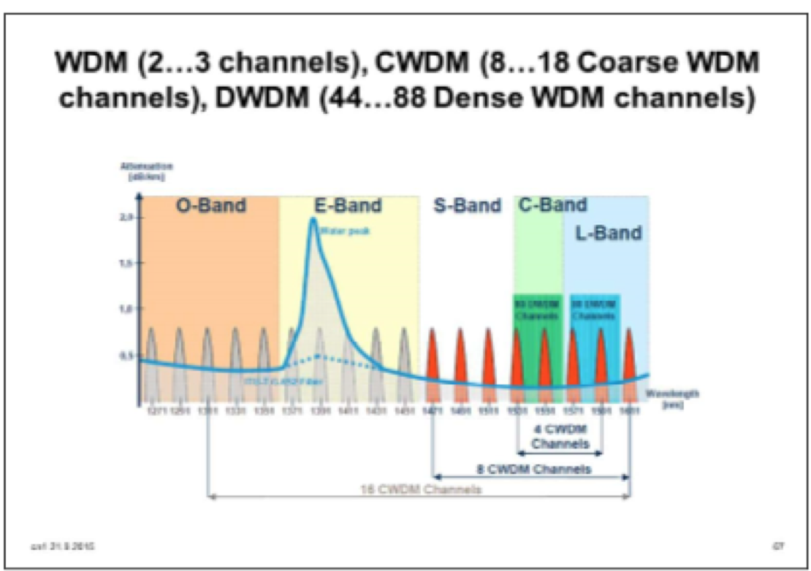

### EDFA

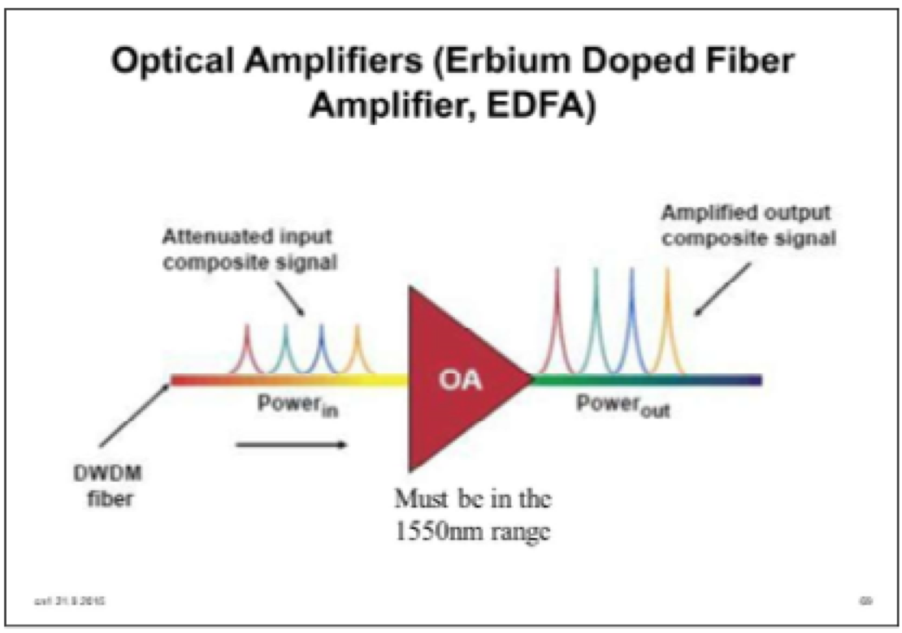

### IEEE 802.3ae

* Mechanical/Optical
  * 2 Fibers (SMF or MMF)
  * C Formfactor Pluggable (CFP, CFP2, CFP4) mit Transceiver mit 100Gb/s
  * Small Formfactor Pluggable (SFP) für Transceiver mit 10Gb/s
* Distance
  * Short Reach (SR): zwei max. 100m lange Multimode-Fasern (MMF)
  * Long Reach (LR): zwei max 10km lange Singlemode-Fasern (SMF)
  * Extended Reach (ER): zwei max. 40km lange Singlemode-Fasern (SMF)
* IEEE 802.3ae für 1x10Gb/s
  * 10GBASE-SR mit 850nm über max. 300m MMF
  * 10GBASE-LR mit 1310nm über max. 10km SMF
  * 10GBASE-ER mit 1550nm über max. 40km SMF
* IEEE 802.3ae für 10x10Gb/s
  * 100GBase-SR10 für 10 optical lanes mit 10 Gbit/s über max. 100m MMF
  * 100Gbase-LR10 für 10 optical lanes mit 10Gb/s über max. 10km SMF
  * 100Gbase-LR4 für 4 optical lanes mit 25 Gbits über max. 40km SMF

## Formeln

Totale Anzahl Verbindungen: *V*

### Vollvermaschung (Stern) 

$$
V=\frac{n*(n-1)}{2}=\frac{1}{2}(n^2-n)
$$

### Vollvermaschung (Bus)

$$
V=n-1
$$

### Vollvermaschung (Logischer Bus mit sternförmiger Verkabelung)

$$
V=n
$$


### Funksignaldämpfung im Freiraum (im Fernfeld $ d >> \lambda$)

$$
L=\left(\frac{4\pi d}{\lambda}\right)^2=\left(\frac{4\pi df}{c}\right)^2
$$

$$
\begin{align*}
    d&=\text{Distanz Sender-Empfaenger}\\
    \lambda&=\text{Wellenlaenge}\\
    f&=\text{Frequenz}\\
    c&=\text{Lichtgeschwindigkeit}\\
    c&=\lambda*f
\end{align*}
$$

### Sendeleistung

$$
P_r=P_t*G_t*G_r*\frac{1}{4\pi d^2}*\frac{1}{4\pi f^2}
$$

$$
\begin{align*}
    P_t&=\text{Transmitted Power (Sendeleistung)}\\
    P_r&=\text{Received Power (Empfangsleistung)}\\
    G_t&=\text{Antenna Gain at Transmitter (Antennengewinn)}\\
    G_r&=\text{Antenna Gain at Receiver (Antennengewinn)}\\
    d&=\text{distance}\\
    f&=\text{frequency}\\
    c&=\text{speed of light}\\
\end{align*}
$$


### Nyquist-Rate

Theoretisch maximal mögliche Anzahl Signalschritte pro Zeit, so dass sich aufeinanderfolgende Pulse noch unterscheiden lassen

$B_k = $ Kanalbandbreite
$$
r=2B_k
$$

### Kanalkapazität

$$
C=B_k*log_2(1+\frac{S}{N})=\frac{Bit}{s}
$$

$$
\begin{align*}
    C&=\text{Signalkapazitaet } [Hz]\\
    B_k&=\text{Kanalbandbreite } [Hz]\\
    \frac{S}{N}&=\text{Signal-zu-Geraeuschverhaeltnis SNR}\\
\end{align*}
$$

### Wellenlänge

$$
\lambda = \frac{c}{f}
$$


# Versuch 1 - Signale

## Fourier

Die Fouriertransformation liest aus einem Zeitsignal die einzelnen Frequenzanteile heraus, genannt Spektrum.

## Bandbreite in der Praxis

### Telefonkabel

Abhängig von der Leitungslänge und dem Kabelaufbau. In der Schweiz:

* 1km: 6MHz
* 3km: 2.3MHz

### Kabelfernsehen (Koaxialkabel)

* Mittlerweile 860MHz
* Nur möglich mit auf Kabeltyp angepasste Leitungsabschnittslänge und Zwischenverstärker

## Hören

Das menschliche Gehör ist zwischen 1kHz und 5 kHz am empfindlichsten.

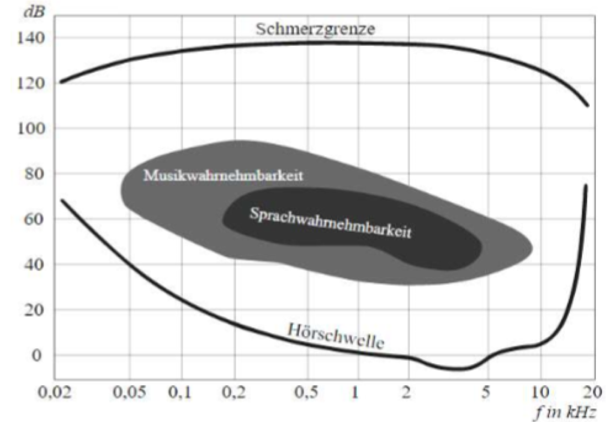

## Oszilloskop

Man gibt immer die Änderung pro Häuschen an. 2V/DIV bedeutet 2V pro "Häuschen". Das gibts für die Spannung (Y-Achse) und Zeit (X-Achse). 

Um ein stabiles Bild zu erhalten, setzt man den Trigger auf

* bestimmten Signalwert
* Angabe, ob triggern beim Überschreiten oder Unterschreiten
* => steigende oder fallende Flanke

Bei unregelmässigen Signalen erhält man kein stabiles Bild. Falls das Oszilloskop eine Single-Shot-Funktion, kann man einen Schnappschuss machen und diesen dann analysieren.

Mit GND wird die 0V-Linie angezeigt

AC zeigt nur die Signaländerungen gegenüber dem Mittelwert an. DC zeigt auch konstante Signalanteile an. Die im Praktikum verwendeten Signale sind aber mittelwertfrei, somit ist zwischen AC und DC kein Unterschied zu sehen.

## Formeln

### Abtastung

Damit das digitalisierte Signal wieder möglichst genau dem analogen Signal entspricht, muss die Abtastfrequenz mindestens ==doppelt== so gross sein wie die höchste im Signal enthaltene Frequenz.

Die höchste im Signal enthaltene Frequenz entspricht der Bandbreite $B$ des Signals.
$$
f_S > 2*B
$$

### Quantisierung

Um das Signal in diskrete Werte aufzuteilen, teilt man die Amplitude des Signals in Bereiche ein. 

$n = $ Anzahl Bit, $N = $ Anzahl Stufen
$$
N=2^n
$$

### Datenmengen und Datenraten

Falls pro Abtastwert eine Stufe mit $n$ Bit zugewiesen wird, so braucht es pro Abtastwert $n$ Bit, die gespeichert oder übertragen werden müssen.

Die Datenrate zur Übertragung des digitalisierten Signals ergibt sich zu
$$
R=f_s*n
$$

# Vorlesungswoche 3 - Netze/Schichten

* ADSL max 4.5km
* VDSL max 1km

Dämpfung Twisted Pair Kabel

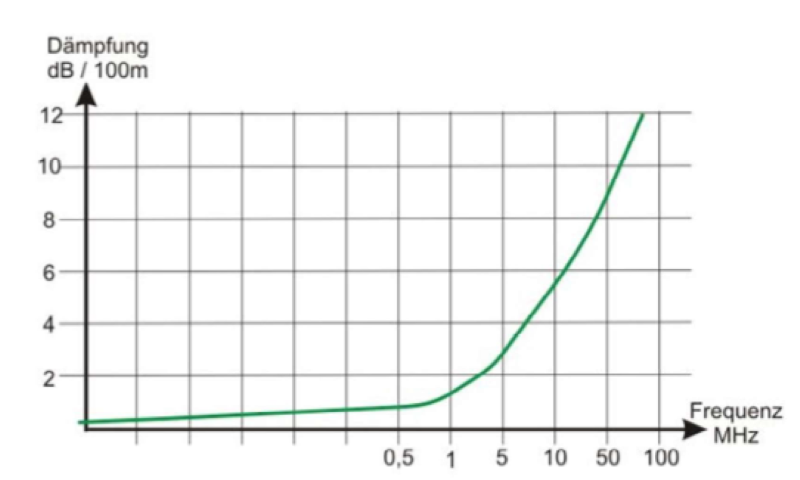

## DSL

* ADSL: maximale Downstream-Datenrate von 8 Mbit/s
* ADSL2: verbesserte Signalverarbeitung und Kodierung
  * 12 Mbit/s innerhalb 0.7 MHz
* ADSL2+: Kanalbandbreite auf 2 MHz erhöht
  * 24 Mbit/s
* VDSL1: Eine Reihe zueinander nicht kompatibler DSL-Techniken
  * Downstream: 52 Mbit/s, Upstream: 11 Mbit/s
  * Bereits bei 900m: 26/5.5 Mbit/s
  * 2000m: ADSL-Niveau
* VDSL2: Discrete Multitone (DMT)
  * Bandbreite: 30 MHz
  * Bis zu 100 Mbit/s in Up-/Downstream (theoretisch)
* VDSL2 Vectoring: Reduktion von Übersprechen durch laufende Messungen und Kompensation der Störsignale
  * Bis zu 100 Mbit/s im Downstream und bis zu 40 Mbit/s im Upstream

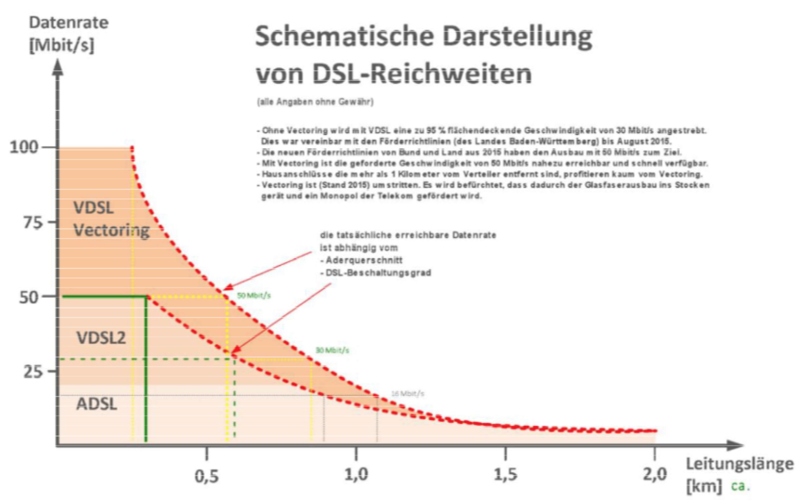

## CATV

Für TV

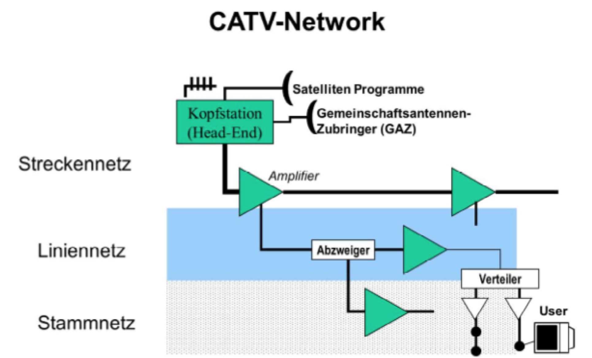

Bidirektional

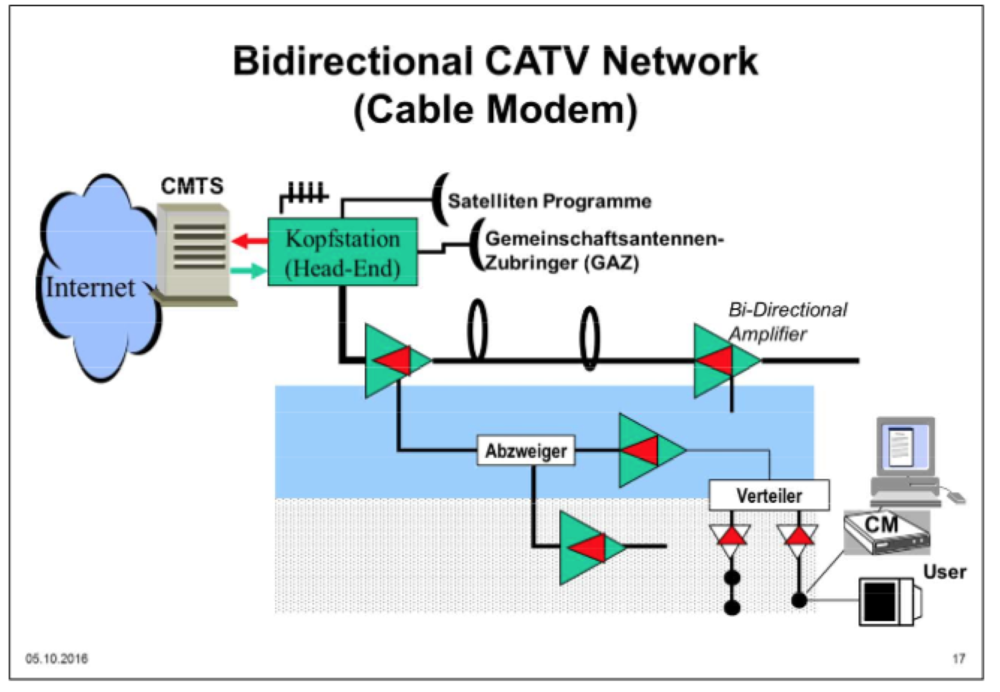

## DOCSIS-Standard

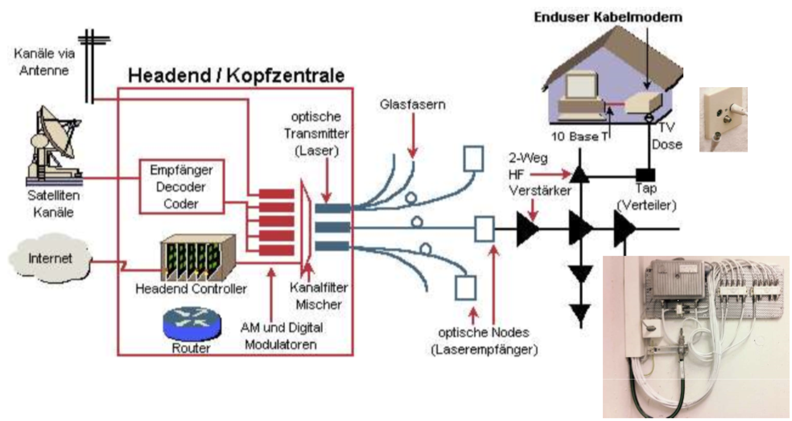

* Downstream (Empfangsrichtung): Bereich von 50-862 MHz
  * Nutzbare Rate von 38 Mbit/s pro 6 MHz Fernsehkanal (USA-Lösung)
  * Europa nutzt 8 MHz Kanäle und erzielt 50 Mbit/s
* Upstream (Senderichtung): Bereich von 5-65 MHz
  * 27 Mbit/s pro Kanal

Kanalbandbreiten: USA 6 MHz, EU 8 MHz

## xDSL vs Cablenet

* ADSL Vorteile
  * not shared in local loop, defined bandwidth
  * Higher number of potential taps available
  * broadly available
  * Bandwidth extension at provider side
* ADSL Nachteile
  * depends on existing telephone cable
  * Distance dependent on limited BW
* Cablenet Vorteile
  * separate channel for telephone and Internet
* Cablenet Nachteile
  * Shared with neighbors
  * Only one provider per location
  * Not available everywhere
  * Limited number of taps

## Glasfaser

* Glasfaserkabel können fast beliebige Bandbreiten (Datenraten) anbieten
* Anschlusskabel haben eine sehr lange Lebensdauer (> 10 Jahre)
* Die Betriebskosten sind bei Glasfaseranschlüssen eher niedriger als bei Kupferanschlüssen

## Layer und Protokolle

Begriffe

* Peer: Anlagestelle, "der Ebenbürtige"
* PDU, Protocol Data Unit: der ganze Teil auf diesem Layer
* SDU, Service Data Unit: der Teil, der den oberen Layern zur Verfügung steht

Layer n SDU: Layer n+1 PDU

Layer n PDU: Layer n-1 SDU

# 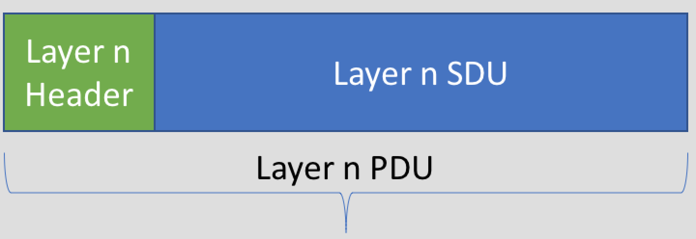

## OSI-Layer

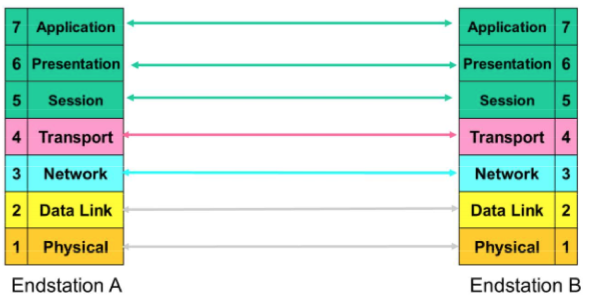

1. Die Bitübertragungsschicht kümmert sich um die Übertragung von Signalen. Beispiele: 802.3 Ethernet, 802.11 WLAN, USB, Bluetooth, ...
2. Die Sicherungsschicht sorgt für eine fehlerfreie Übertragung und regelt den Zugriff auf das Übertragungsmedium. Hier werden Daten auch in kleinere Pakete verpackt
3. Die Vermittlungsschickt sorgt fürs Routing auch über das Kommunikationsnetz hinweg
4. Die Transportschickt besorgt die Segmentierung von Paketen, Stauvermeidung und optional Fehlersicherung und Fehlerkorrektur. 
5. Die Kommunikations- oder Sitzungsschicht stellt auf einem System die Mittel zur Verfügung. Zum Beispiel Named Pipes, Sockets, RTP
6. Kümmert sich um die Vereinheitlichung der Daten zwischen Systemen, also z.B. XML
7. Verschafft den Anwendungen Zugriff auf das Netzwerk

## TCP/IP-Suite

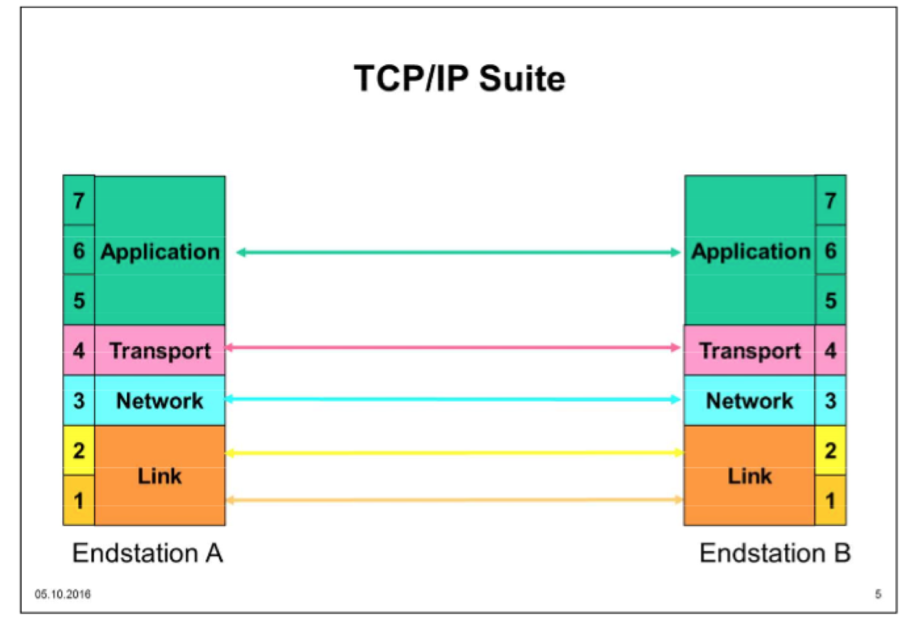

Auszutauschende Informationselemente zwischen Schichten

* Application: Message
* Transport: Segment
* Network: Datagram (Packet, Fragment)
* Link (Data Link): Frame
* Link (Physical): Bits

## Verbindungselemente

* Hub: bis Layer 1
* Switch (Bridge): bis Layer 2
* Router (Layer 3 Switch): bis Layer 3
* Gateway (Prox, Content Switch, Layer 4-7 Switch): bis Layer 7

## Grössen

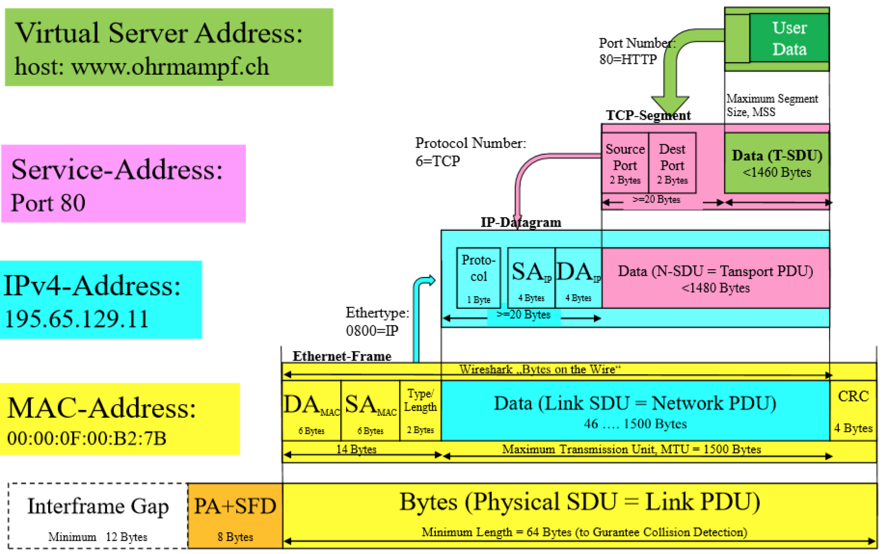

## Wireshark

Mit CTRL+F oder Edit > Find kann man Paketinhalte durchsuchen

Im Monitor Mode stellt Wireshark das Senden von Paketen auf diesem Interface aus.

# Vorlesungswoche 4 - Standardisierung/Ethernet

## Standardisierung


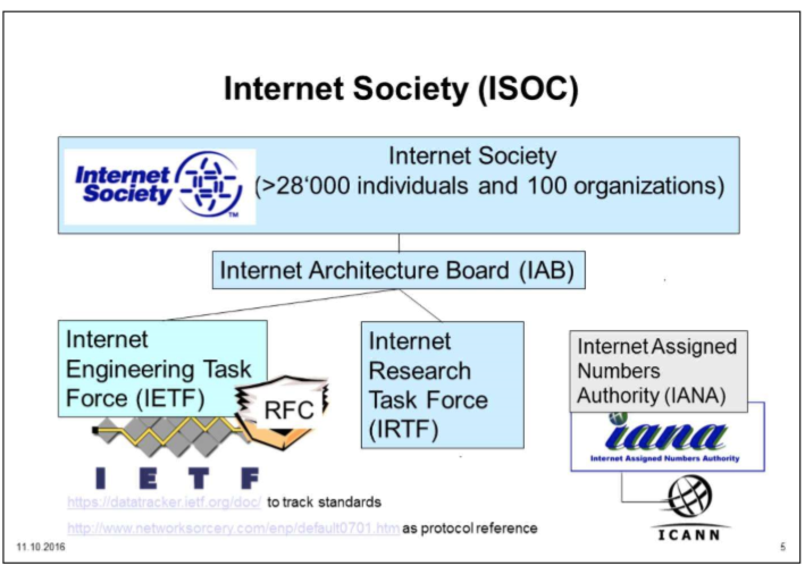

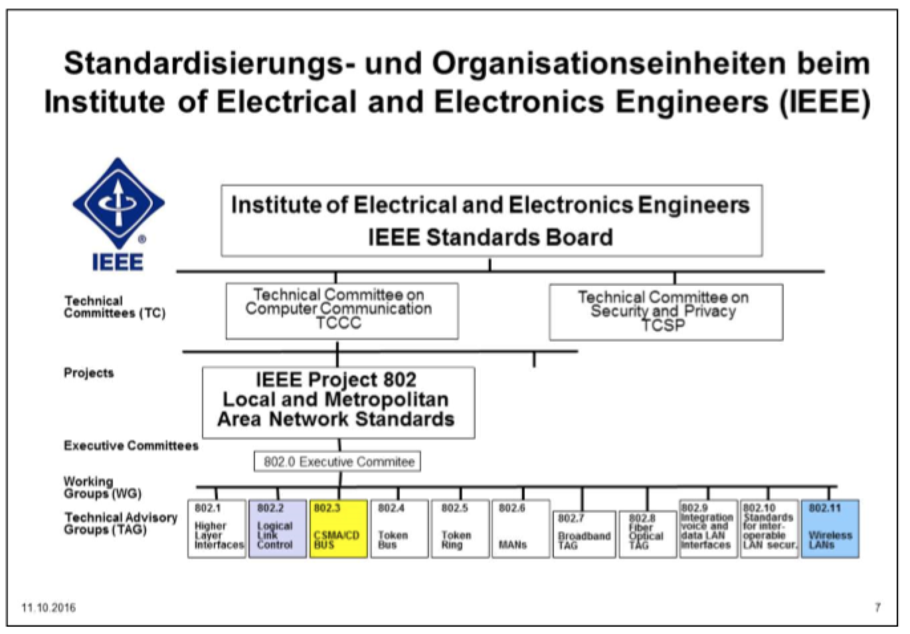

## Ethernet

Die Preamble ist immer
$$
10101010\, 10101010\, 10101010\, 10101010\, 10101010\, 10101010\, 10101010
$$
Der Start Frame Delimiter ist immer
$$
1010\,1011
$$

### Geschichte

+ 1970: Aloha Random Access mit CSMA/CD
+ 1972: Bob Metcalfe entwickeln bei Xerox Palo Alto Research Center (PARC) das Altos Aloha Network (1km Yellow Cable Coax, 2.94Mb/s)
+ 1976: Xerox stellt Althos Aloha Network als Ethernet vor
+ 1979: Metcalfe gründet 3Com
+ 1980: DEC, Intel, Xerox veröffentlichen 10Mb/s Ethernet-Standard (DIX-Standard)
+ 1982: 3COM liefert Ethernet-Karten für IBM-PC aus
  Ethernet II, DIX-Standard Version 2.0 wird veröffentlicht
+ 1985: IEEE 802.3 Standard für CSMA/CD, Lokalnetze mit Geschwindigkeit von 1 bis 10 Mb/s und verschiedene Kabeltpen
+ 1989: Distanzerweiterung mit Bridges (Switches)
+ 1990: Thinwire (Cheapernet) 10Base2 verdrängt 10Base5
+ 1991: Twisted Pair Ethernet 1 (10Base-T)
+ 1993: Fast Ethernet (100Base-T)
+ 1998: Gigabit Ethernet (1000Base-X) und 1000Base-T vorgestellt
+ 2002: 10Gb/s Ethernet
+ 2008: 40/100Gb/s Ethernet
+ 2011: 40Gb/s Packet over Sonet
+ 2013: 400Gb/s Ethernet Task Force

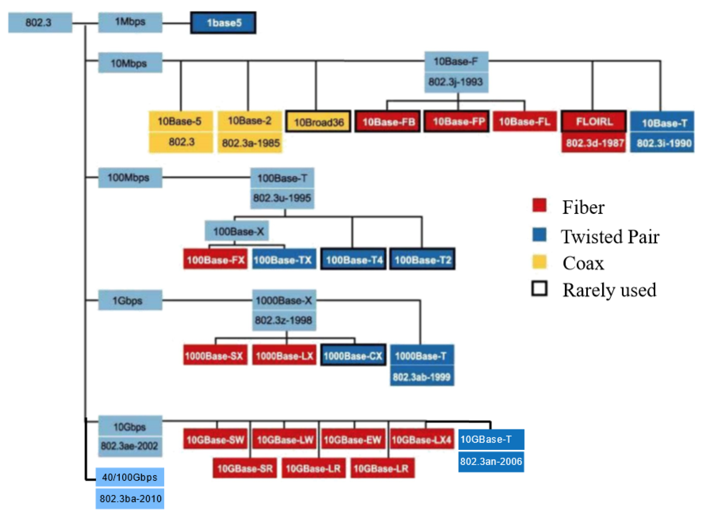

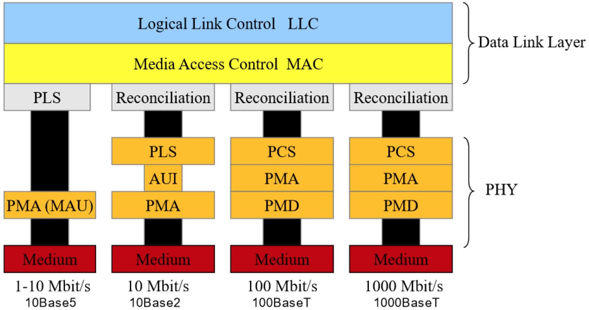

## 10Mb/s Ethernet

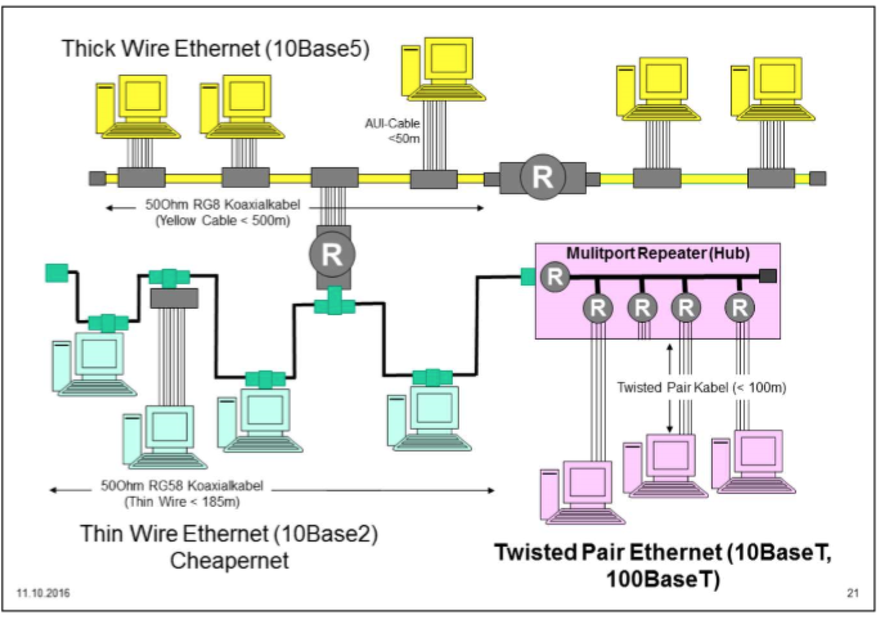

Auf dem Koaxialkabel kann nur Halbduplex übertragen werden. Es können nicht zwei Stationen gleichzeitig senden.
Beim Twisted Pair-Kabel gibt es zwar getrennte Sende- und Empfangsleitungen, aber diese können nicht gleichzeitig genutzt werden, da sie im Hub nicht separiert werden können.

Beim Thick Wire wurden die Stationen über spezielle Transceiver parallel an ein dickes, gelbes Koaxialkabel angeschlossen. Das Kabel durfte maximal 500m lang sein. Für grössere Netze braucht es Repeater

Beim Thin Wire wurde das relativ starre, dicke Kabel durch dünnere Koaxialkabel ersetzt. Ein einzelnes Kabel durfte nurnoch 185m lang sein. Dafür war bei 10Base2 der Transceiver bereits in der Ethernet-Karte integriert, so dass die Stationen nurnoch mit BNC T-Steckern direkt ans Kabel angechlossen werden konnten. Signalpegel: 0..-2.2V

Die Twisted Pair-Kabel dürfen maximal 100m lang sein. Signalpegel: +0.2 .. -0.2V

## CSMA/CD

* Carrier Sense: vor dem Zugrifff aufs Medium wird überprüft, ob nicht eine andere Übertragung im Gange ist
* Multiple Access: 
  * Falls eine andere Übertragung im Gange ist wird gewartet
  * Sonst beginnt man mit dem Absenden des Pakets
* Collision Detection
  * Falls zufällig mehrere Stationen mit dem Senden begonnen haben, kollidieren ihre Pakete. Dies wird aber von den sendenden Stationen detektiert und der Sendevorgang wird abgebrochen
  * Das Kollisionsfenster ist bei 10Mb/s 51.2us und bei Fast Ethernet 5.12us
  * Collision Resolution: Nach dem Zufallsprinzip (Binary Exponential Backoff) wird bestimmt, in welcher Reihenfolge nach Kollisionen nochmals gesendet wird

## Signalisierung bei 10Mb/s

Bei 10Mb/s wird der Manchester Code verwendet. Es gibt unabhängig von der Bitfolge immer eine Flanke pro Bit. Daher kann das Taktsignal stets abgeleitet werden. In IEEE 802.3 ist die Interpretation:

* Steigende Flanke: 1
* Fallende Flanke: 0

Der Manchestercode garantiert Gleichstromanteilsfreiheit (über eine Bitdauer). Der Nachteil ist, dass die Bandbreite zur Datenübertragung doppelt so hoch ist wie bei der einfachen Binärcodierung mit Non-Return-to-Zero.

## 100Mb/s

### 4B5B

100Base-TX verwendet den effizienteren 4B/5B Code

| (Hex)                   | (Binary) | 4B5B Code |
| ----------------------- | :------- | --------: |
| 0                       | 0000     |     11110 |
| 1                       | 0001     |     01001 |
| 2                       | 0010     |     10100 |
| 3                       | 0011     |     10101 |
| 4                       | 0100     |     01010 |
| 5                       | 0101     |     01011 |
| 6                       | 0110     |     01110 |
| 7                       | 0111     |     01111 |
| 8                       | 1000     |     10010 |
| 9                       | 1001     |     10011 |
| A                       | 1010     |     10110 |
| B                       | 1011     |     10111 |
| C                       | 1100     |     11010 |
| D                       | 1101     |     11011 |
| E                       | 1110     |     11100 |
| F                       | 1111     |     11101 |
| Q Quiet (Signalverlust) |          |     00000 |
| H Halt                  |          |     00100 |
| R Reset                 |          |     00011 |
| T End                   |          |     01101 |
| K Start #2              |          |     10001 |
| J Start #1              |          |     11000 |
| S Set                   |          |     11001 |
| I Idle (Pause)          |          |     11111 |

Alle anderen Kombinationen sind verboten. Es werden mit 4B5B lange 0 oder 1-Folgen vermieden, weil so die Taktrückgewinnung erschwert wird. 

### MLT3

Zusätzlich kommt MLT3 als Signalkodierung ins Spiel.

* Signal bleibt gleich: 0
* Signal ändert sich: 1

Somit bleibt der Informationsgehalt bei einem Bit pro Symbol.

## Switched Ethernet

* Punkt-zu-Punkt Verbindung von Station zum Switch
* Switch empfängt Frames und leitet sie wieter
  * Learning Phase zum Aufbau der Forwarding-Tabellen (MAC, Port)
  * Forwarding/Filtering Phase
* Half-Duplex Mode: kaum Kollisionnen, da nur zwei beteiligte Stationen und kurzes Kollisionsfenster
* Full-Duplex Mode: kein CSMA/CD, keine Kollisionen

## Gigabit (1000Gb/s)

* Twisted Pair-Kabel (CAT 5-UTP oder besser)
* maximale Länge eines Segments: 100m
* Vollduplexbetrieb, Verwendung aller vier Doppeladern mit gleichzeitiger Übertragung in beide Richtungen (Echokompensation)
* 4-dimensionales PAM-5 (Pulsamplitudenmodulation mit fünf Zuständen und Einsatz einer Trellis-Codierung und Scrambling) bei Ethernet
  * 5^4 = 625 mögliche Symbol. Man kann pro Schritt total 8 Bit = 256 mögliche Symbole übertragen, 
  * Man kann durch geschickte Wahl Symbole mit möglichst grossem Unterscheidungsgrad nutzen
* NRZ bei Glasfaser
* Schrittgeschwindigkeit 125MBaud
* Propagation Time (kürzestes Frame: 512ns)
* Codierung: 8B/10B

### 1000Base-LX (L = Long Wavelength)

* langwellig, 1310nm Wellenlänge
* 2 SInglemode-Glasfaserkabeln bis 5km
* 1000Base-LX10/1000Base-LH (Long Haul) bis 10km

### 1000Base-BX

* Einzige SInglemode-Faser
* Bis 10km Reichweite
* Wellenlängenmultiplex zur Richtungstrennung, downstream 1490nm, Upstream 1310nm

## Ethernet Frame-Struktur

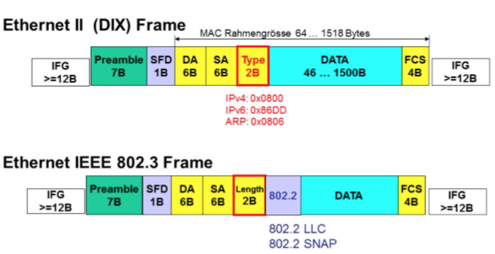

Hier wird zu einem Trick gegriffen. Die Datengrösse ist begrenzt (1500B). Darum beginnen die Typnummern mit 0x600 (1536). Liest man also ab 0x600 weiss man, dass es sich um ein Ethernet II-Frame handelt, ansonsten ist hier die Länge des IEEE 802.3 Ethernet Frame hinterlegt. 

"Auf dem Wire" wird die MAC-Adresse folgenderweise übertragen:

* Nehme jedes Byte für sich
* Drehe das Byte in sich um
* Versende nun alle Bytes
* => Analog Big/Little Endian

## Formeln

### Pulsausbreitungsgeschwindigkeit

$$
v=0.2\frac{m}{ns}
$$


# Versuch 2 - Serielle Schnittstellen


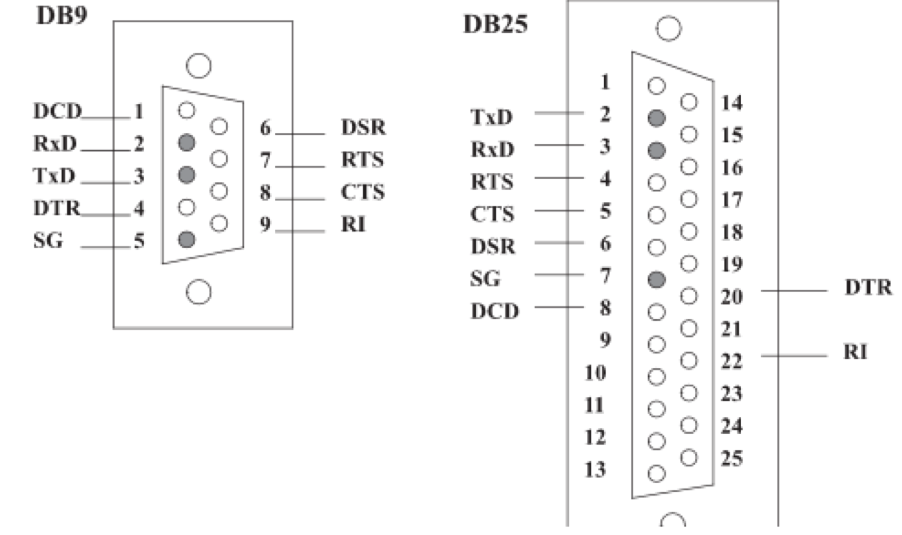

|       | Bedeutung auf Datenleitung | Bedetung auf Kontrolleitungen | Spannungs-pegel | LED bei der Break-Out-Box |
| :---- | -------------------------- | ----------------------------- | --------------- | ------------------------- |
| SPACE | Binär 0 (Logisch 0)        | Ein/Aktiv                     | +3..+15V        | rot                       |
| MARK  | Binär 1 (Logisch 1)        | Aus/Inaktiv                   | -3..-15V        | grün                      |

| DB25 | DB9  | Abkürzung | Englische Bezeichnung | Beschreibung                             | Quelle |
| ---- | ---- | --------- | --------------------- | ---------------------------------------- | ------ |
| 1    |      | PG        | Protective Ground     | Schutzerde                               |        |
| 2    | 3    | TxD       | Transmitted Data      | Sendedaten                               | DTE    |
| 3    | 2    | RxD       | Received Data         | Empfangsdaten                            | DCE    |
| 4    | 7    | RTS       | Request To Send       | Sendeteil einschalten: Mit RTS  informiert der  Computer das Modem, dass er bereit ist, Daten zu  empfangen (falls das Modem diese "Anfrage"  annimmt, setzt es CTS). Beim sogenannten  Hardware Handshake sendet das Modem nur  Daten zum DTE, wenn RTS gesetzt ist. | DTE    |
| 5    | 8    | CTS       | Clear To Send         | Sendebereitschaft: Mit CTS  informiert das Modem  das DTE, dass es bereit ist, Daten zu senden. Beim  Hardware Handshake stoppt das Modem das DTE,  indem es CTS deaktiviert. | DCE    |
| 6    | 6    | DSR       | Data Set Ready        | Betriebsbereit: Mit DSR reagiert  das Modem auf  ein DTR Signal des DTE und zeigt, dass es  eingeschaltet ist. Bei Wählmodems signalisiert  DSR , den Aufbau der Telefonverbindung. | DCE    |
| 7    | 5    | SG        | Signal Ground         | Signalerde                               |        |
| 8    | 1    | DCD       | Data Carrier Detected | Datenträger erkannt: Mit DCD  zeigt das Modem  an, dass ein Trägersignal erkannt wurde. | DCE    |
| 12   |      | HS        | High Speed            | Hohe Geschwindigkeit                     | DCE    |
| 15   |      | TCK       | TX Clock DCE          | Sendetakt DÜE                            | DCE    |
| 17   |      | RCK       | RX Clock DCE          | Empfangstakt DÜE                         | DCE    |
| 20   | 4    | DTR       | Data Terminal Ready   | Endgerät betriebsbereit: Damit  signalisiert der  Computer seine Empfangsbereitschaft und meldet  dem Modem, dass er bereit ist, Daten zu  empfangen. Mit DTE kann das Modem an- oder  ausgeschaltet werden. | DTE    |
| 22   | 9    | RI        | Ring Indicator        | Ankommender Anruf: Mit RI zeigt  ein  Wählmodem an, dass seine Telefaxnummer  angewählt wurde. | DCE    |

Für die eigentliche Übertragung werden nur die drei Leitungen TxD, RxD und SG benötigt. Die übrigen Leitungen dienen beim sogenannten "Hardware Handshake" zur Kontrole des Datenflusses (RTS, CTS), zur Bereitschaftsanzeige (DTR, DSR), zur Übergabe von Taktsignalen (TCK, RCK) oder zur Signalisierung (RI, HS) 

Um zu testen, ob man es mit einem DTE oder einem DCE zu tun hat, kann man die TxD-Leitung messen. Liegt hier eine negative Spannung zwischen-3V und -15V an, ist es ein DTE. An der RxD-Leitung sollte keine Spannung anliegen (0V)

## DTE mit DCE verbinden

Es genügt ein übliches Kabel, bei dem die Drähte 1:1 verbunden sind. Das Auskreuzen geschieht in den Geräten.

## DTE mit DTE verbinden

Hier muss das Kabel ausgekreuzt werden. Dies nennt man ein "Nullmodem-Kabel".

Wenn man die Pins 2 und 3 miteinander verbindet, hat man ein Loopback geschaffen. 

## Übertragung

Eine Übertragung läuft folgendermassen ab

* 1 Startbit (Space)
* 5-8 Datenbits
* 1 Parity-Bit (optional)
* Stopp-Bit(s): 1, 1.5 oder 2 (Mark)

Es wird immer zuerst das LSB jedes Zeichens übertragen

## Parität

* Even: Sume aller 1 Bits gerade
* Odd: Summe aller 1 Bits ungeade
* No Parity: kein Paritätsbit
* Space Parity: konstant 0
* Mark Parity: konstant 1

## Flusskontrolle

Es gibt den Software-Handshake und den Hardware-Handshake

* Software
  * Spezielle Steuerzeichen
  * XON (CTRL-Q)
  * XOFF (CTRL-S)
* Hardware Handshake
  * Spannungspegel auf den speziellen Steuerleitungen
  * DTR: DTE signalisiert DCE das An- und Ausschalten der Übertragungseinrichtung
  * DSR: DCE signalisiert DTE dass es für die Übertragung von Daten bereit ist. Datenübertragung vom DTE zum DCE ist nur dann möglich, wenn DSR aktiviert ist
  * RTS: DTE steuert die Sendeeinrichtung des DCE. Das Modem sendet nur dann Daten, wenn das RTS aktiviert ist. Sobald das RTS inaktiv ist, nimmt das Modem keine Daten mehr an
  * CTS: Das DCE zeigt dem DTE an, dass es bereit ist, Daten vom DTE zu senden.

## USB

* USB 1.1
  * 1.5Mb/s Low Speed
  * 12Mb/s Full Speed
* USB 2.0 High Speed: 480Mb/s
* Bis 2.0 vier Adern, D+, D-, +5V, Masse
* USB 3.0 Super Speed: 4.8Gb/s
* USB 3.1 Super Speed+: 10Gb/s
* Zusätzlich vier Adern, SSTX+, SSTX-, SSRX+, SSRX-

Ein Host-Controller (Master) legt fest, welcher Sender wann senden darf. Die Kommunikation ist zentral gesteuert. Logisch ist es ein Bus (alle sehen alle Kommunikation), elektirsch sind es Punkt-zu-Punkt-Verbindungen.

Möglich sind bis zu 127 Geräte pro Host-Controller (7 Bit-Adresse)

Zwischen der Anwendungssoftware und dem Gerät bzw. Endpunkt läuft es über eine sogenannte Pipe. Es sind pro Gerät bis zu 32 Endpunkte möglich, 16 in, 16 out.

### Geräteklassen

Idee: Geräte zusammenfassen, damit man nur einmal einen Treiber für ein generisches Gerät schreiben muss. Erst herstellerspezifische Funktionen benötigen dann einen speziellen Treiber.

Es gibt Geräte und Interfaces. Wenn das Gerät nur einer Klasse angehört, ist die Geräteklasse im Gerätedeskriptor hinterlegt. Wenn es zu mehreren Klassen gehört, im Interfacedeskriptor.

| Klasse | Verwendung | Beschreibung                             | Beispiele                                |
| ------ | ---------- | ---------------------------------------- | ---------------------------------------- |
| 00h    | Gerät      | Composite Device                         | Die Klasse wird auf Ebene der *Interface-Deskriptoren* definiert |
| 01h    | Interface  | Audio                                    | [Lautsprecher](https://www.wikiwand.com/de/Lautsprecher), [Mikrofon](https://www.wikiwand.com/de/Mikrofon), [Soundkarte](https://www.wikiwand.com/de/Soundkarte), [MIDI](https://www.wikiwand.com/de/Musical_Instrument_Digital_Interface) |
| 02h    | Beides     | Kommunikation und CDC-Steuerung          | [Modem](https://www.wikiwand.com/de/Modem), [Netzwerkkarte](https://www.wikiwand.com/de/Netzwerkkarte), [Wi-Fi](https://www.wikiwand.com/de/Wi-Fi)-Adapter |
| 03h    | Interface  | [Human Interface Device](https://www.wikiwand.com/de/Human_Interface_Device) | [Tastatur](https://www.wikiwand.com/de/Tastatur), [Maus](https://www.wikiwand.com/de/Maus_(Computer)), Joystick etc. |
| 05h    | Interface  | Physical Interface Device                | Physikalisches Feedback, etwa für Force-Feedback-Joysticks |
| 06h    | Interface  | [Bilder](https://www.wikiwand.com/de/Picture_Transfer_Protocol) | [Digitalkamera](https://www.wikiwand.com/de/Digitalkamera), [Scanner](https://www.wikiwand.com/de/Scanner_(Datenerfassung)) |
| 07h    | Interface  | Drucker                                  | [Laserdrucker](https://www.wikiwand.com/de/Laserdrucker), [Tintenstrahldrucker](https://www.wikiwand.com/de/Tintenstrahldrucker) |
| 08h    | Interface  | [Massenspeicher](https://www.wikiwand.com/de/Massenspeicher) | [USB-Stick](https://www.wikiwand.com/de/USB-Massenspeicher), Festplatten, Speicherkarten-Lesegeräte, [MP3-Player](https://www.wikiwand.com/de/MP3-Player) |
| 09h    | Gerät      | [USB-Hub](https://www.wikiwand.com/de/Universal_Serial_Bus#USB-Hubs) | Full-Speed-Hub, Hi-Speed-Hub             |
| 0Ah    | Interface  | CDC-Daten                                | diese Klasse wird zusammen mit Klasse 02h verwendet |
| 0Bh    | Interface  | [Chipkarte](https://www.wikiwand.com/de/Chipkarte) | Chipkarten-Lesegerät                     |
| 0Dh    | Interface  | Content Security                         | Finger-Print-Reader                      |
| 0Eh    | Interface  | Video                                    | [Webcam](https://www.wikiwand.com/de/Webcam) |
| 0Fh    | Interface  | Personal Healthcare                      | [Pulsuhr](https://www.wikiwand.com/de/Herzfrequenzmessger%C3%A4t) |
| 10h    | Interface  | Audio/Video Devices                      | AV-Streaming-Geräte                      |
| DCh    | Beides     | Diagnosegerät                            | *USB-Compliance*-Testgerät               |
| E0h    | Interface  | kabelloser Controller                    | [Bluetooth](https://www.wikiwand.com/de/Bluetooth)-Adapter, Microsoft RNDIS |
| EFh    | Beides     | Diverses                                 | [ActiveSync](https://www.wikiwand.com/de/ActiveSync)-Gerät |
| FEh    | Interface  | softwarespezifisch                       | [IrDA](https://www.wikiwand.com/de/Infrared_Data_Association)-Brücke |
| FFh    | Beides     | herstellerspezifisch                     | der Hersteller liefert einen Treiber mit |

Sobald der Host-Controller an einem Port ein neues Gerät detektiert, sendet er diesem Port und dem angeschlossenen Gerät einen Reset und versucht es zu identifizieren. Erhält das Gerät einen Reset wählt es die Adresse 0. Nach dem Reset teilt der Host dem Gerät seine eindeutige Adresse mit (zwischen 1 und 127). 0 ist Broadcast an jedes Gerät.

In dieser Phase erfragt der Host-Controller auch den Device-Deskriptor. Mit weiteren Deskriptoren kann das Gerät mitteilen, dass es alternative Konfigurationen besitzt, z.B. das Mikrofon bei einer Webcam.

Bei USB 1.x und 2.x kann nur abwechslungsweise gesendet werden, also im Half-Duplex. Bei USB 3.x gibt es noch zwei getrennte Sende- und Empfangspaare, dies erlaubt dann Duplex.

USB kann die Geräte mit 5V und bis zu 500mA (High Power, => 2.5W) oder 100mA (Low Power, => 0.5W) betreiben.

### USB-Pakete (Frames)

Jedes Feld wird nach Little Endian versendet. Jedes Paket besitzt die Felder

* SYNC: für Bit- und Byte-Synchronisation. 8 Bit bei Full- und Low-Speed, 32 Bit bei High-Speed-Geräten.
* PID (Packet Identifier): 4 Bit Pakettyp und 4 Bit Checksumme (Pakettyp invertiert)
* Functional Address: 7 Bit-Adresse
* Endpoint Address: bis zu 16 Endpunkte pro Gerät
* CRC

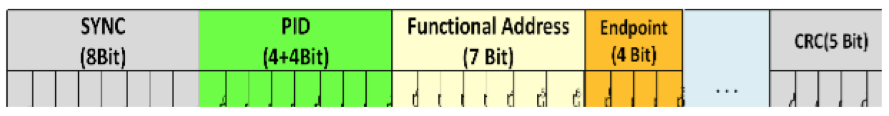

USB 2.0 unterscheidet vier Haupttypen und zu jedem gibt es Untertypen.

| PID Type  | PID Name | PID [3:0] | Description                              |
| --------- | -------- | --------- | ---------------------------------------- |
| Token     | OUT      | 0001b     | The packet describes a host-to-function transaction. |
|           | IN       | 1001b     | The packet describes a function-to-host transaction. |
|           | SOF      | 0101b     | The packet marks the start of frame and specifies the frame  number. |
|           | SETUP    | 1101b     | Packet describes a SETUP transaction from the host to the  function via a control pipe. |
| Data      | DATA0    | 0011b     | This packet is an even data packet.      |
|           | DATA1    | 1011b     | This packet is an odd data packet        |
|           | DATA2    | 0111b     | This packet is only used in high-speed, high-bandwidth  isochronous transfers. |
|           | MDATA    | 1111b     | This packet is only used in split transactions, or high-speed,  high-bandwidth isochronous transfers. |
| Handshake | ACK      | 0010b     | This packet acknowledges the successful receipt of a data  packet. |
|           | NAK      | 1010b     | This packet indicates that data is not ready to be transmitted  yet. |
|           | STALL    | 1110b     | This packet indicates that the endpoint has halted, or a  control pipe does not support a certain request. |
|           | NYET     | 0110b     | The receiver has not yet responded, or the host should begin  sending PING packets. |
| Special   | PRE      | 1100b     | This packet is a host-issued preamble for a split-transaction. |
|           | ERR      | 1100b     | This packet is a handshake response that a split transaction  error occurred. Note that this PID is identical to the PID for a PRE packet. |
|           | SPLIT    | 1000b     | This packet supports split transactions between the host and a  high-speed hub. |
|           | PING     | 0100b     | This packet is used for flow-control in high-speed control and  bulk transfers. |
|           | Reserved | 0000b     | Must not be used                         |

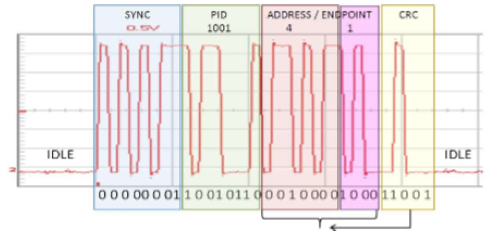


Beispiel-Paket, Typ: Token IN

## Pipes

Es wird zwischen Message Pipes und Stream Pipes unterschieden

* Message Pipes
  * bidirektional
  * Befehle und Statusabfragen => Control Transfers
  * Datentransfer wird generell bestätigt
  * Kommunikation zur Adresse 0 immer im Control Transfer Modus
* Stream Pipes
  * unidirektional
  * Zur Übertragung grösserer Datenmengen verwendet
  * Interrupt
    * kleinere Datenmengen zu nicht genau bestimmbaren Zeitpunkten
    * Für HID-Devices
    * Geräte teilen mit, in welchen maximalen Zeitabständen sie gefragt werden möchten
    * Low Speed: Minimal 10ms, pro Abfrage max. 8 Byte: 6.4kb/s
    * Full Speed: minimal 1ms, pro Abfrage max. 64B, d.h. 512kb/s
    * High Speed: minimal 1/24ms bis zu 1024B pro Abfrage, d.h. 196.6Mb/s
    * Benötigt ACK/NAK
  * Isochron
    * Für Geräte die eine garantierte Datenrate benötigen
    * Je nach Datenrate kann nur eine beschränkte Anzahl isochrone Geräte bedient werden.
    * Nur für Full Speed und High Speed
  * Bulk
    * Grosse Datenmengen, Ablieferung nicht zeitkritisch
    * Nach isochronen und Interrupt-Transfers
    * Durch Prüfnummer (CRC16) gesichert, durch Hardware bis zu dreimal wiederholt falls nicht richtig
    * Nur für Full Speed und High Speed
    * Benötigt ACK/NAK

# Vorlesungswoche 5 - Switching/LLC/VLAN

Wireshark zeigt nur alles bis zum Ethernet-Layer an, aber ohne CRC. Die Preamble und der SFD kommen später dazu.

Die Ethernet-MTU ist 1500 Byte. Jumbo-Frames haben eine MTU von 9000 Bytes

In Ethernet II gibt es das Type-Field (2B). In 802.3 gibt es das SSAP/DSAP mit nur 1B, um besser unterscheiden zu können gibt es SNAP mit 3 Byte OUI und 3 Byte Type Field

MAC Control Frames: für Ethernet-Flusskontrolle. War vor Fast Ethernet nicht nötig, da CSMA/CD verwendet wurde. Mit Vollduplex braucht es aber eine Flusskontrolle. Man sagt, man braucht eine Pause von 0 bis 65535 Einheiten, eine Einheit ist die Zeit für die Übertragung von 512 Bit.

## Switching

Die Switching Fabric gibt es in 3 Architekturen

* Shared Memory: Der Prozessor sagt dem Port, an welchem Ort im Memory die zu versendenden Daten liegen
* Bus: Der Empfangsport überträgt es direkt über einen Bus an den Ausgangsport
* Matrix: horizontale und vertikale Busse

An jedem Port gibt es einen Buffer. Der Switch entscheidet anhand der Forwarding Database, wohin das Paket soll.

Begriffe

* Broadcast Domain: alle über einen Switch verbundene Stationen
* Collision Domain: alle über einen Hub verbundene Stationen

## Forward

Es gibt eine Forward-DB, mit der Zuordnung von MAC-Destinationsadressen zu Ports. Gelernt wird anhand der Source-MAC-Adressen von diesem Port. Die Einträge altern (typischerweise 300s). Kommt ein Frame wieder mit der Sourceadresse an diesem Switchport an, wird der Timer zurückgesetzt.

* Flooding: falls es keine Einträge für diese Adresse gibt, wird das Frame an alle anderen Ports weitergeleitet
* Filtering: wenn es gefunden wird, wird es nur an diesen Port weitergeleitet (ausser es ist der Eingangsport)

## Verzögerung

Es gibt einige Methoden, ab wann der Switch weiterleiten darf. Hier eine Illustration (Zeiten für 10Mb/s)

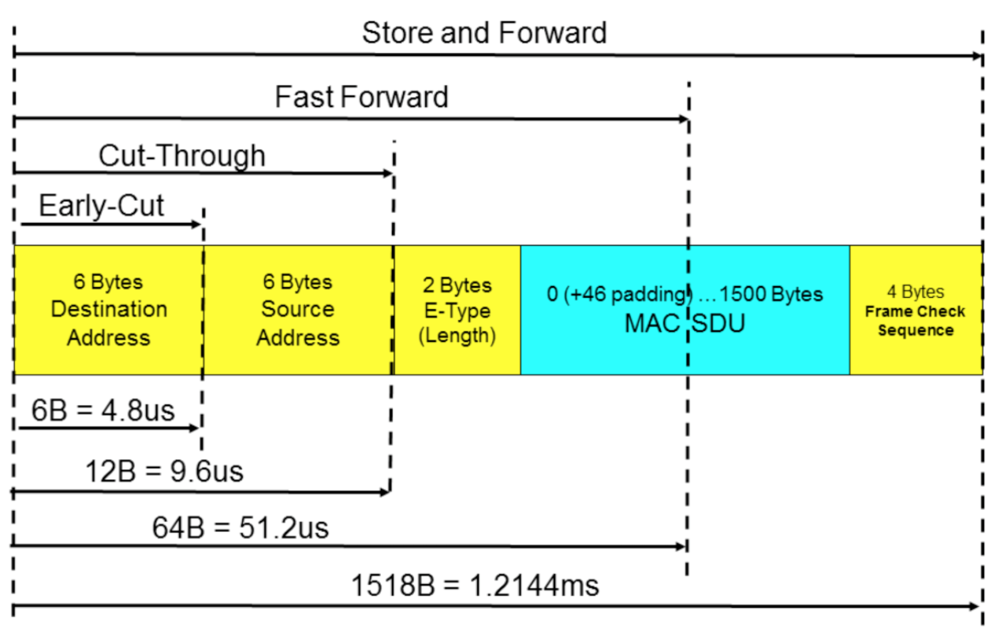

* Early-Cut: weiterleiten wenn Ziel bekannt
  * Sehr kurzer Delay, braucht nur Preamble und MAC Zieladresse
  * Leitet auch kaputte Frames weiter
  * Kann nur zwischen selben Speeds verwendet werden
* Cut-Through: weiterleiten wenn Ziel und Quelle bekannt
  * Kurzer Delay
  * Leitet auch kaputte Frames weiter
  * Nur zwischen selben Speeds
* Fast-Forward: nach 64 Byte (Ethernet-PDU Minimum)
  * Erkennt Kollisionen aber leitet CRC-Fehler weiter
  * Kann Ethertypes filtern
  * Nur zwischen selben Speeds
* Store-and-Forward
  * Erkennt alle Kollisionen und CRC-Fehler
  * Kann Ethertypes und höhere Layer auslesen
  * Auch zwischen unterschiedlichen Speeds

## Spanning Tree

Sorgt dafür, dass es in einem Netz mit Switches keine Loops gibt. Es wird eine Wurzel definiert und aufgrund derer ein Baum aufgespannt. 

* STP: basiert auf dem Austausch von Bridge Protocol Data Units, BDPU. Diese sind in LLC verpackt. Werden alle 2 Sekunden ausgetauscht. Es dauert ca. 10 Sekunden bis die Konfiguration aufgebaut wurde
* RSTP: basierend auf STP, erlaubt kürzere Konfigurationszeiten (wenige Sekunden)
* MSTP: Erweiterung von RSTP, baut für verschiedene VLAN unterschiedliche Trees auf. Jede Root-Bridge hat eine eigene Spanning Tree-Instanz, unabhängig von anderen

Für STP braucht jeder Switch eine MAC-Adresse. Es werden Hello-Pakete mit Multicast versendet. 

Parameter:

* Bridge Identifier (ID)
  * Kombination von 3B Priority Number und 6B MAC Adresse
  * Priority Number ist konfigurierbar (Default 32768)
* Port Number (P)
  * Ports eines Switches haben unterschiedliche Portnummern
* Path Cost (C)
  * Jedem Pfad können Kosten zugewiesen werden
  * Die Kosten sind pro Link bzw. Port definierbar, sie sind umso höher je langsamer die Datenrate eines Links ist

Standard-Kosten

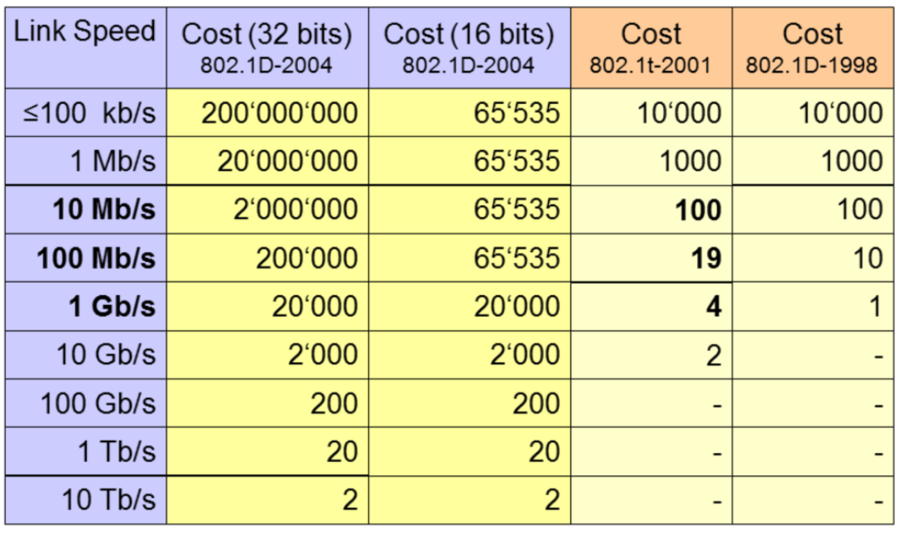 

### Algorithmus

1. Einschalten aller Bridges
2. Jede Bridge nimmt an, sie sei die Root-Bridge
3. Jede Bridge sendet BDPU aus
4. Die Bridge mit der kleinsten Bridge-ID (Priority & MAC-Adresse) wird zur Root-Bridge (untereinander)
5. Die Root-Bridge sendet Konfigurations-BDPUs aus. Diese werden von den Nachbar-Bridges empfangen und interpretiert. Die Empfänger der BDPU senden selbst BDPU an die Nachbarbridges, wobei angegeben wird über wieviele Hops/Pfadkosten die BDPU empfangen wurde. Die Pfadkosten der einzelnen Hops werden aufaddiert (Distanz zur Root)
6. Jede Bridge bestimmt den Port mit den kleinsten Pfadkosten zur Root-Bridge als Root-Port. Bei Ports mit gleichen Kosten gewinnt die kleinere Port-ID
7. Verbindungen zwischen nicht Root Ports werden deaktiviert
   1. Der Port mit den niedrigsten Pfadkosten zur Root wird zum Designated Port und leitet weiterhin Frames auf den Link
   2. Der Port mit den höheren Pfadkosten zur Root wird zum Blocked Port (sende keine Frames mehr, ==empfängt== aber noch)
   3. Solange ein Switch auf den Blocked Ports BDPU empfängt, bleibt der Port im Blocking Status
   4. Erhält er während der Maximum Age Time (Default 20s) keine BDPU, stellt er den Port vom Blocking zu Forwarding

## Logical Link Control (LLC)

Es bietet

* unbestätigten, verbindungslosen Dienst (LLC1)
* verbindungsorientierten Dienst (LLC2)
* bestätigten, verbindungslosen Dienst (LLC3)

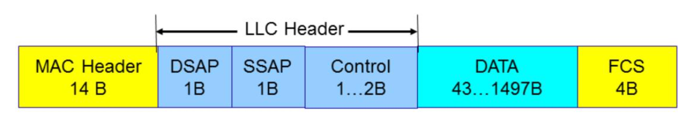

* DSAP: Destination Service Access Point
* SSAP: Source Service Access Point
* Control Field, 1 oder 2 B

DSAP/SSAP identifizieren das Protokoll der höheren Layer

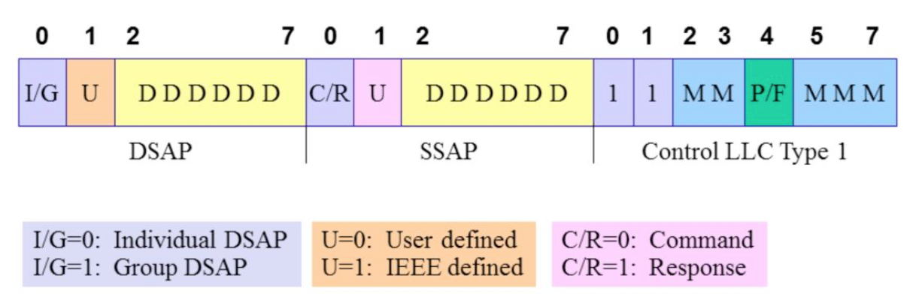

## Sub Net Access Protocol (SNAP)

Für mehr Typen als LLC

Mit LLC und SNAP ist die MTU nur noch 1492

## VLAN

Zuordnung über Tags (im Paket) oder Tagging am Port. 

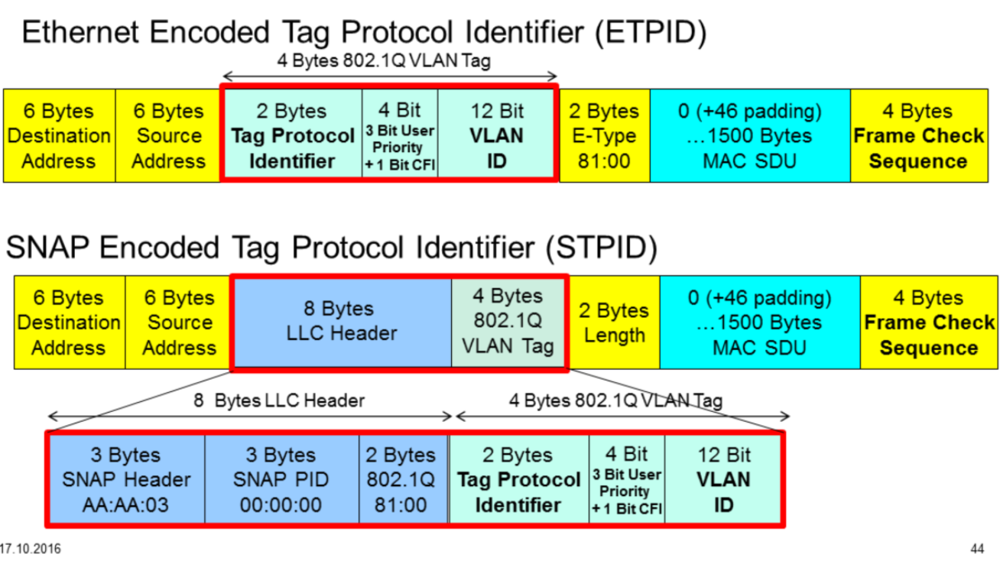

## Ethertype

* 0x0806: ARP
* 0x0800: IPv4
* 0x86DD: IPv6
* 0x8847: MPLS (unicast)
* 0x8848: MPLS (multicast)
* 0x880B: PPP
* 0x8863: PPPoE (Discovery)
* 0x8864: PPPoE (Session)

# Vorlesungswoche 6 - WLAN

* ASK: Amplitude Shift Keying: Sinusträger mit zwei verschiedenen Amplituden
* PSK: Phase Shift Keying: konstante Amplitude, aber zwei Phasenlagen
* FSK: Frequency Shift Keying: Sinusschwingungen mit unterschiedlichen Frequenzen

Wenn man jetzt mehr als nur 2 Zustände kennt, kann man mehrere Bit pro Symbol übertragen werden. Typischerweise verwendet man Symbole, bei denen sowohl die Amplitude als auch die Phase verändert wird und kommt so bis auf 8 oder gar mehr Bit pro Symbol (256-QAM)

## Phase Shift Keying Modulation

Beim Binary Phase Shift Keying (BPSK) gibt es zwei Symbole:

* 0: Cosinusschwingung mit Phase 0°
* 1: Cosinusschwingung mit Phase 180°

In der Praxis verwendet man meist Differential BPSK. Für eine 0 wird die Phase gegenüber dem vorangehenden Symbol gleich belassen. Für eine 1 wird die Phase um 180 Grad geschoben.

Beim Quadratur Phase Shift Keying gibt es 4 Symbole mit unterschiedlichen Cosinusphasen

* 00: Phase 0
* 01: Pi / 2
* 11: Pi
* 10: 3Pi / 2

## QAM

Beispiel 16QAM

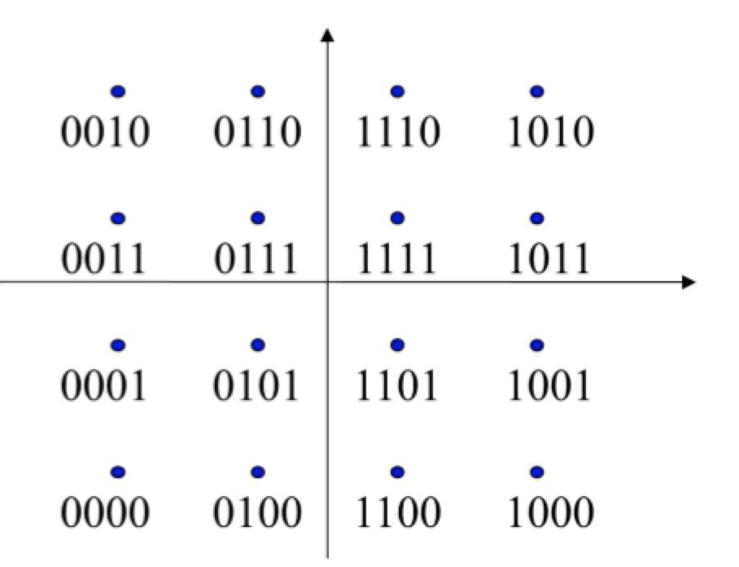

Es werden sowohl die Amplitude als auch die Phase verändert.

## Technologien

* ANT+
  * nicht standardisiert
  * Very Short Links
  * für Sensoren z.B. am Körper
* Bluetooth
  * Very Short Links
* ZigBee, Z-Wave
  * Hausautomation

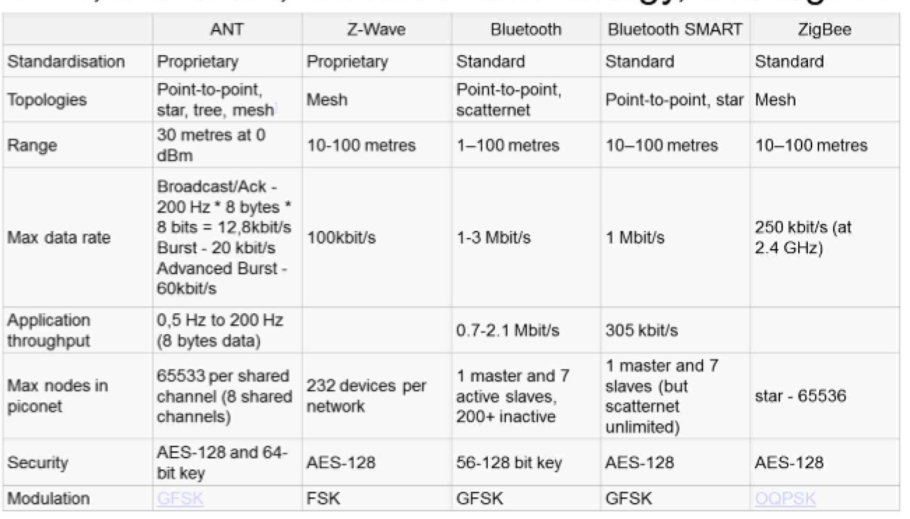

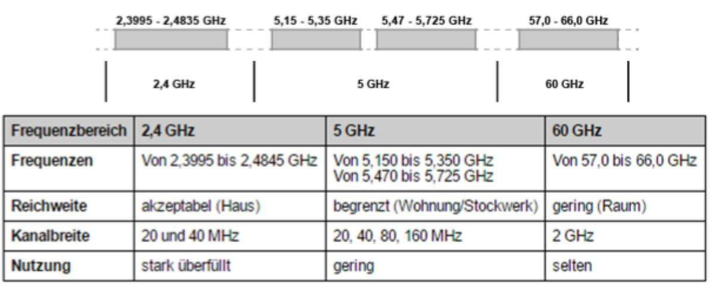

## Standards

* 802.11b: 2.4GHz
  * 1, 2, 5.5, 11 Mb/s
* 802.11a: 5GHz
  * 6, 9, 12, 18, 24, 36, 48, 54Mb/s
  * setzte sich nicht durch weil 5GHz damals sehr teuer war
* 802.11g: 2.4GHz
  * 1, 2, 5, 11, 6, 9, 12, 18, 24, 36, 48, 54Mb/s
* 802.11n: 2.4/5GHz
  * MIMO, bis 150 und 600Mb/s, kompatibel mit a/b/g
* 802.11ac: 5GHz
  * 80MHz, 256-QAM, Space Division Multiple Access (SDMA), Gb/s Datenraten
* 802.11ad: 60GHz

## Kanäle

* 2.4GHz
  * ==1==
  * 2
  * 3
  * 4
  * 5
  * ==6==
  * 7
  * 8
  * 9
  * 10
  * ==11==
  * 12
  * 13
  * 14(JP)
  * Nur die hervorgehobenen sollten verwendet werden, da die Kanäle jeweils nur 5MHz breit sind. WLAN braucht aber 20MHz, d.h. sie überlappen sich. Die hervorgehobenen stören sich nicht gegenseitig.
  * Eine direkte, genaue Störung ist weniger schlimm, als eine leicht verschobene
* 5GHz
  * 36-48: 4*20MHz, max. 0.2W
  * 52-64: 4*20MHz, max. 0.2W
  * 100-140, max. 1W
  * Auch Radaranwendungen sind hier und dürfen nicht gestört werden!
* 60GHz
  * 1: 58.32GHz
  * 2: 60.48GHz
  * 3: 62.64GHz
  * 4: 64.8GHz
  * Bandbreite je 2.16GHz

## Physical Layer

* Direct Sequence Spread Spectrum (DSSS)
  * 802.11 FHSS (Frequency Hopping) and IR (Infrared)
  * 802.11b DSSS which builds on 802.11
* Orthogonal Frequency Division Multiplexing (OFDM)
  * 802.11a/802.11g
  * 802.11n use OFDM and MIMO
  * 802.11ac use OFDM, MIMO und Kanalbandbreiten bis 160MHz mit bis zu 8x8 MIMO

## Frame

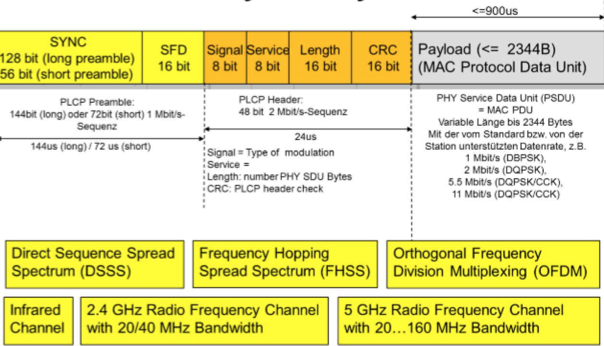

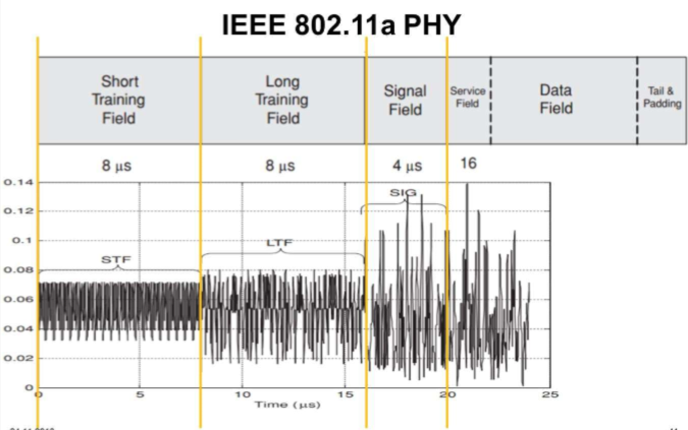

## MIMO

Mehrere Sende- und Empfangsantennen gleichzeitig. Man nutzt hier sogar die Reflektionen mit.

## Architektur

### Basic Service Set (BSS): Infrastruktur Modus

Kommunikation wird vom AP kontrolliert

* AP Identifikation
  * BSSID: MAC-Adresse des AP
  * SSID (32B): Name des AP

### Independent Basic Service Set (IBSS): Ad-Hoc Mous

* Peer-to-Peer Verbindungen
* Manchmal Kompatibilitätsprobleme

### Extended Service Set (ESS)

* Gruppe von BSS mit
  * gleicher SSID
  * gleichen Security Credentials
  * gemeinsamen Übergang auf Distribution Systeme (Wireline LANs)
  * gleichen oder verschiedenen Kanalnummern

### Mesh Basic Service Set (MBSS)

802.11s, noch wenig verbreitet

### Richtantennnen

Es können auch Richtantennen verwendet werden, um die Reichweite massiv zu vergrössern.

## MAC Frame


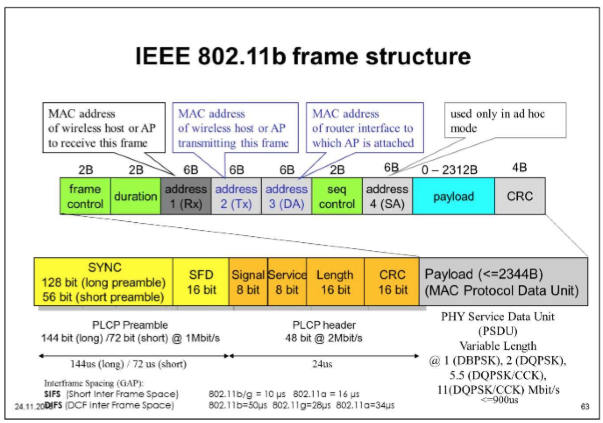MAC Addresses

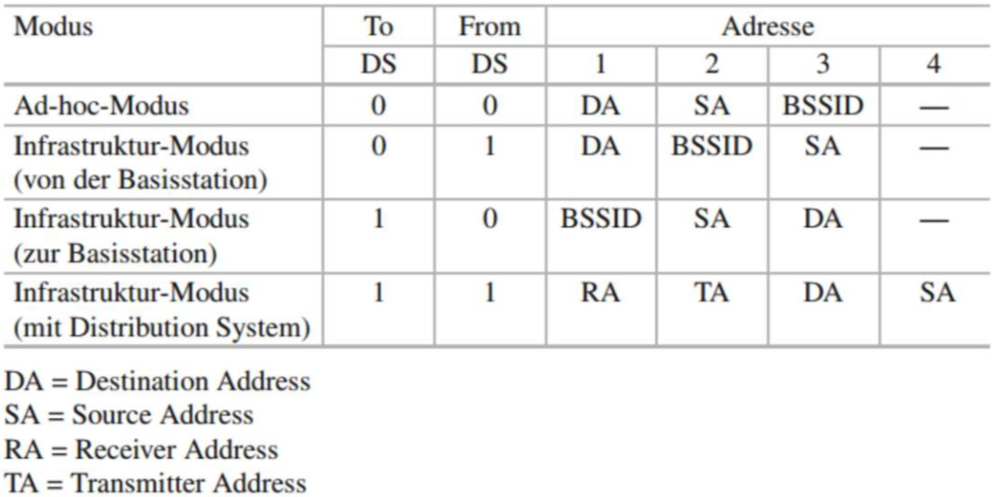

Frame Control Inhalt

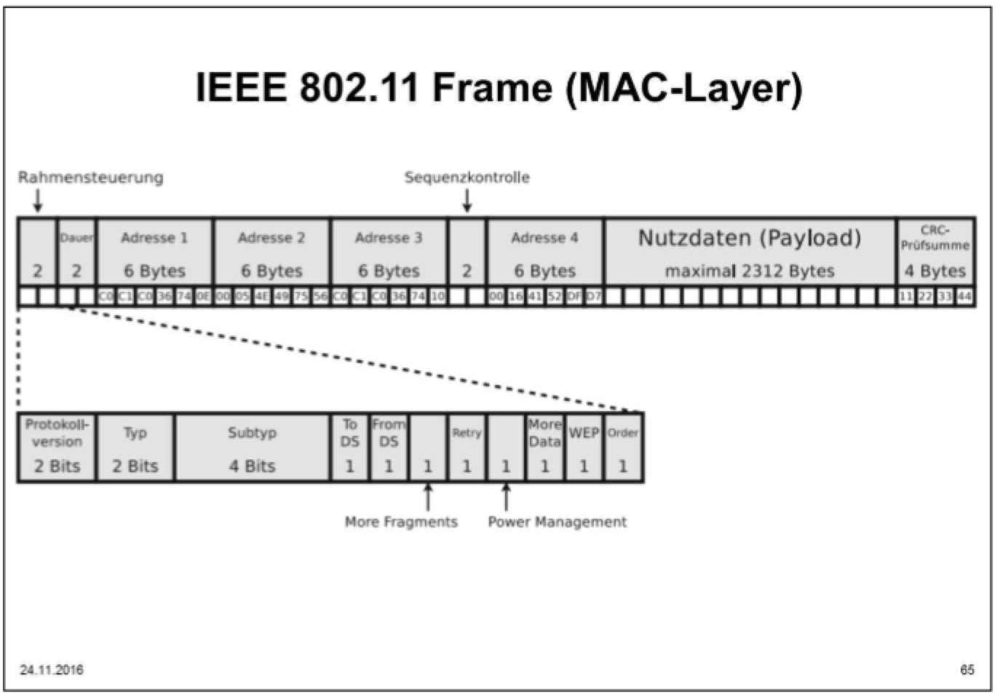

* More Fragments: 1, wenn weitere Fragmente eintreffen
* Retry: das Frame wurde erneut gesendet
* Power Management: Sender befindet sich im Stromsparmodus
* More Data: BS teilt Client mit, dass sie noch weitere Daten gepuffert hat
* Order: Rahmen werden in geordneter Reihenfolge übertragen
* Sequenz: 2B
  * 4 Bit lange Fragmentnummer
  * 12 Bit lange Sequenznummer
  * Wurde ein Frame in mehrere Fragmente unterteilt, ist die Sequenznummer für alle Fragmente gleich

Typ

* 00: Management
* 01: Control Frames
* 10: Data

| Typ  | Subtyp | Bezeichnung            | Beschreibung                             |
| ---- | ------ | ---------------------- | ---------------------------------------- |
| 00   | 0000   | Association Request    | Assoziierungsanfrage an eine BS          |
| 00   | 0001   | Association Response   | Positive Antwort auf eine Assoziierungsanfrage |
| 00   | 0010   | Reassociation Request  | Reassoziierungsanfrage an eine BS        |
| 00   | 0011   | Reassociation Response | Positive Antwort auf eine Reassoziierungsanfrage |
| 00   | 0101   | Probe Response         | Antwort auf eine Suchanfrage             |
| 00   | 1000   | Beacon                 | Regelmässige Bekanntmachung einer Funkzelle durch ihre BS |
| 01   | 1011   | RTS                    | Reserviervungsanfrage an die BS          |
| 01   | 1100   | CTS                    | Bestätigung der Reservierungsanfrage     |
| 01   | 1101   | ACK                    | Bestätigung einer Datenübertragung       |
| 10   | 0000   | Data                   | Datenübertragung                         |

##  Management

### AP finden

* Passiv
  * APs senden Beacons mit Informationen
  * STA hört Kanäle ab um APs zu finden
* Aktiv
  * STA sendet Probe Request um AP zu finden
  * AP antwortet mit Probe Response

Normalerweise werden die Beacon alle 100ms ausgesendet.

### Mit AP verbinden

Ein Verbindungsaufbau besteht aus mind. 6 Frames

* Probe Request =>
* <= Probe Response
* Authentication Request =>
* <= Authentication Response
* Association Request =>
* <= Association Response

Erst ==danach== folgt Authentifizierung (802.1x) und die Verschlüsselung. Authentication war ursprünglich für WEP gedacht.

* Bevor Daten übertragen werden können, muss eine STA assoziiert sein
* Eine STA kann bei genau einem AP assoziiert sein
* Ein AP kann mit vielen STA assoziiert sein
* Assoziierung wird immer von der STA ausgelöst
* Verbindung STA-AP
* Reassoziierung wird verwendet um eine Assoziierung von einem AP zum nächsten zu übertragen (innerhalb ESS)
* Mit Reassoziierung können Attribute einer Assoziierung geändert werden

## Shared Medium / CSMA/CA

Bei WLAN kann man nicht gleichzeitig senden und mithören. Nach jedem Freiwerden des Mediums muss immer eine fixe Zeit und ein Random Backoff abgewartet werden. Wenn ich sende, gebe ich an, wie lange ich etwa dafür brauche.

### Probleme WLAN

* Alle Stationen hören AP
* Nicht alle Stationen hören alle anderen Stationen (Hidden Nodes)
  * Zwei gegenüberliegende Stationen sehen zwar den AP, aber nicht sich gegenseitig
  * Abgeschottete Nodes sehen sich auch nicht
  * Hier ist RTS/CTS hilfreich
* Verkehr von AP zu Stationen (Downstream) erfolgt kontrolliert)
* Verkehr von Stationen zum AP ist nicht kontrollierbar: Multiple Access

Wenn eine Station senden will, schaut sie ob das Medium schon so lange idle ist, wie DIFS es vorgibt. Dazu kommt noch eine random backoff Time. Dann schaut es nochmal, ob es immernoch idle ist (die random backoff time hilft multiple access). 

Wenn die Station sendet, lässt sie nur immer einen Short Interframe Space.

### RTS/CTS

* RTS: ich möchte *so* lange senden
* CTS: du darfst *so* lange senden

### Interframe Space

Je höher die Priorität, je kürzer die Wartezeit

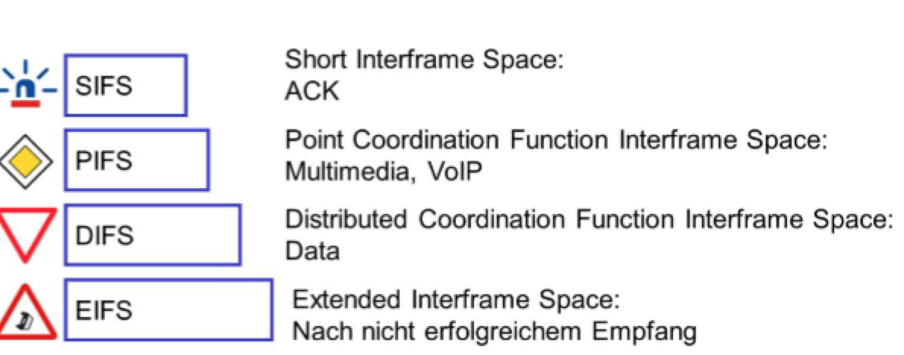


# Versuch 3 - Ethernet PHY/Hub

Hub/Switches haben TX/RX am Port gekreuzt, deshalb kann man bei ihnen ein Straight Kabel nehmen. 

## Twisted Pair Belegung

| RJ45-PIN | 10/100Base-T | 1000Base-T | Wire Color T568A | Wire Color T568B |
| -------- | ------------ | ---------- | ---------------- | ---------------- |
| 1        | Transmit+    | BI_DA+     | White/Green      | Orange/White     |
| 2        | Transmit-    | BI_DA-     | Green            | Orange           |
| 3        | Receive+     | BI_DB+     | White/Orange     | Green/White      |
| 4        | unused       | BI_DC+     | Blue             | Blue             |
| 5        | unused       | BI_DC-     | White/Blue       | Blue/White       |
| 6        | Receive      | BI_DB-     | Orange           | Green            |
| 7        | unused       | BI_DD+     | White/Brown      | Brown/White      |
| 8        | unused       | BI_DD-     | Brown            | Brown            |

## Verkreuzen

* TX und RX auskreuzen
* Plus auf Plus, Minus auf Minus

## Fehler erkennen

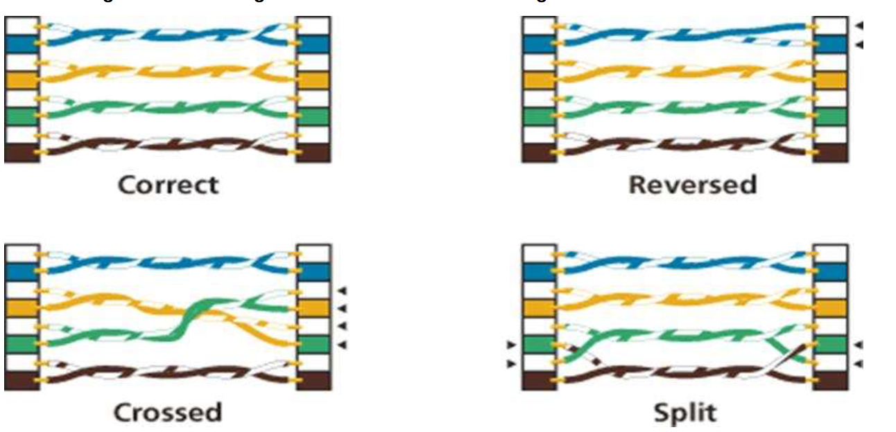

* Reversed Pair Wiring
  * Die Leiter sind *innerhalb* eines Leiterpaares vertauscht. Wenn eines der benötigten Paare (1/2) oder (3/6) betroffen ist, werden steigende in fallen Flanken gewandelt, d.h. eine 1 wird zu einer 0
* Split Pair Wiring
  * Pinout ist identisch auf beiden Seiten, d.h. es kann elektrisch eine Verbindung aufgebaut werden. Allerdings sind die benutzten Leitungspaare nicht miteinander verdrillt, was in einer grösseren Störanfälligkeit der Verbindung führt. In der Regel funktionieren aber solche Verbindungen - vorallem bei kurzen Strecken trotzdem. Split Pair Wiring wird mit einem einfachen Stromkreitest nicht erkannt
* Crossed Cable
  * Sende-Empfangspaare wurden ausgekreuzt. Im Prinzip wäre keine Verbindung möglich. Moderne Ethernet-Adapter können aber automatisch richtig zurückkreuzen.

# Vorlesungswoche 7 - IP/ARP

## IP Protocol Number

* 1 ICMP
* 6 TCP
* 17 UDP
* 41 IPv6 over IPv4
* 43 IPv6 ROuting Header
* 44 IPv6 Fragment header
* 59 IPv6 no next header
* 60 IPv6 Destination Options
* 47 GRE
* 50 ESP
* 51 AH
* 115 L2TP

## ARP

Ermittelt zu einer Netzwerkadresse die physikalische Hardwareadresse. Es wird eine Tabelle als Cache geführt. Für IPv6 passiert dies durchs NDP. Beim Gratuitous ARP teilt man eigenständig, vorgängig mit welche IP man selbst hat.

ARP funktioniert über MAC-Broadcast. Ein Empfänger schaut nach, ob seine IP-Adresse als Zieladresse enthalten ist, wenn ja antwortet er. Die Antwort wird in die ARP-Tabelle des Senders eingetragen. Gleichzeitig kann sich der Empfänger auch die Zuteilung des Senders merken. Für Request und Reply wird das gleiche Paket-Format verwendet.

Auch hier wird ein Aging Timer verwendet, der wieder zurückgesetzt wird sobald der Eintrag in der Tabelle genutzt wird. 

* Request
  * Source
    * Sender MAC-Adresse
    * Sender IP-Adresse
  * Destination
    * Broadcast MAC
    * Empfänger IP
* Reply
  * Source
    * Empfänger MAC
    * Empfänger IP
  * Destination
    * Sender MAC
    * Sender IP

## Internet

### AS - Autonomous System

Zusammenfassung von mehreren IP-Netzen

* Multihomed AS: Mehrere Verbindungen zu anderen AS, leitet Verkehr anderer AS nicht weiter
* Transit AS: Verbindungen zu mehreren AS, leitet Verkehr andere AS weiter (ISP)
* Stub AS: Nur eine Verbindung zu einem anderen AS

### Peering

Netze können sich peeren, damit sie Traffic untereinander ausliefern können. Beim Paid Peering kann ein grösserer Partner (Tier 1) mit einem kleineren Partner (Tier 2) Daten austauschen, weil der Tier 2 ihm dafür Geld zahlt. 

* Tier 3: Access ISP
  * Residential: Bluewin, Sunrise, Cablecom
  * Company Access: Green, Cybernet
* Tier 2
  * Regional or national coverage (IP-Plus, Sunrise)
* Tier 3
  * Top hierarchy (Spint, MCI, AT&T, Level3, QWest, Cable&Wireless)
  * Link Speeds in oroer of 622Mb/s to 10Gb/s
  * Swisscom IP-Plus buys from Tier 1 Providers

## IPv4

Verbindungslose, unzuverlässige End-to-End Datagram Delivery

Router verbinden Broadcast Domains.

### Adressen

32 Bit (4 Byte) Adressen

* Dotted Decimal: 152.96.129.3
* Binary 1001'1000.0110'0000.1000'0001.0000'0011

Regional administriert

* American Registry for Internet Numbers (ARIN)
* Réseaux IP Européen (RIPE)
* Asia Pacific Network Information Centre (APNIC)
* Latin American and Caribbean Internet (LACNIC)
* African Network Information Centre (AFRINIC)

Reserved

* Non-routable (RFC1918)
  * 10.0.0.0/8
  * 172.16.0.0/12
  * 192.168.0.0/16
* Broadcast
* Loopback: 127.0.0.0/8
* 6to4 Relay Anycast Addresses: 192.88.99.0/24
* IP Address without a DHCP: 169.254.0.0/16
* Multicast

### Klassen

Beginnt mit

* 0: Class A: 1-126.x.y.z/8
* 10: Class B: 128.1-191.254.y.z/16
* 110: Class C: 192.0.1-223.255.254.z/24
* 1110: Class D: 224.0.0.0-239.255.255.255.255 (Multicast)
* 1111: Class E: 240-255.x.y.z (reserved)

Kann mit ICMP Address Mask Request/Reply (17/18) bestimmt werden.

Heute von Supernetting und Classless Routing abgelöst.

## Berechnungen

### Netz-ID

Alle Bits im Host-Teil 0

### Broadcast

Alle Bits im Host-Teil 1

### Anzahl mögliche Hostadressen in diesem Netz

n = Anzahl Hostbits = $32-Netzmaske$
$$
2^n-2
$$

### Niedrigste/höchste Hostadresse in diesem Netz

Netz-ID bzw. Broadcast-ID +1/-1

### Im selben Netz

* Netzmaske binär aufschreiben
* IP binär aufschreiben
* Im Bereich wo die Netzmaske ist 
  * Alle Netz-Bits müssen gleich sein wie Host-Adresse

Beispiel: sind folgende Rechner im gleichen Netz wie 83.140.195.62/22

* 83.140.102.1
* 83.140.104.1
* 80.140.106.1

Gezeigt werden nur die letzten zwei Bytes

```
NM: 1111 1100 . 0000 0000
    vvvv vv
IP: 0110 1001 . 0011 1110
104:0110 0110 . 0000 0001 : 01xx != 10xx, nicht im selben Subnetz
104:0110 1000 . 0000 0001 : OK
106:0110 1010 . 0000 0001 : OK
```


# Vorlesungswoche 8 - IPv4/ICMP/NAT

## NAT

Beim NAT übersetzt man eine IP-Adresse in eine andere und führt eine Tabelle. Man kann auch mehrere IP-Adressen auf eine einzelne externe übersetzen, dann braucht es allerdings noch eine weitere Identifikation, wie z.B. die Layer 4-Ports. Wenn die Ports auch noch angepasst werden, nennt man das PAT.

### Probleme

* Unterstützung aller Protokolle
  * ICMP
  * FTP
* Spezielle Lösung für Zugang zu internem Netz
  * Port Forwarding
* Leistungsfähigkeit
  * Throughput WAN-to-LAN

## IPv4

Der Header ist mindestens 20 Byte lang

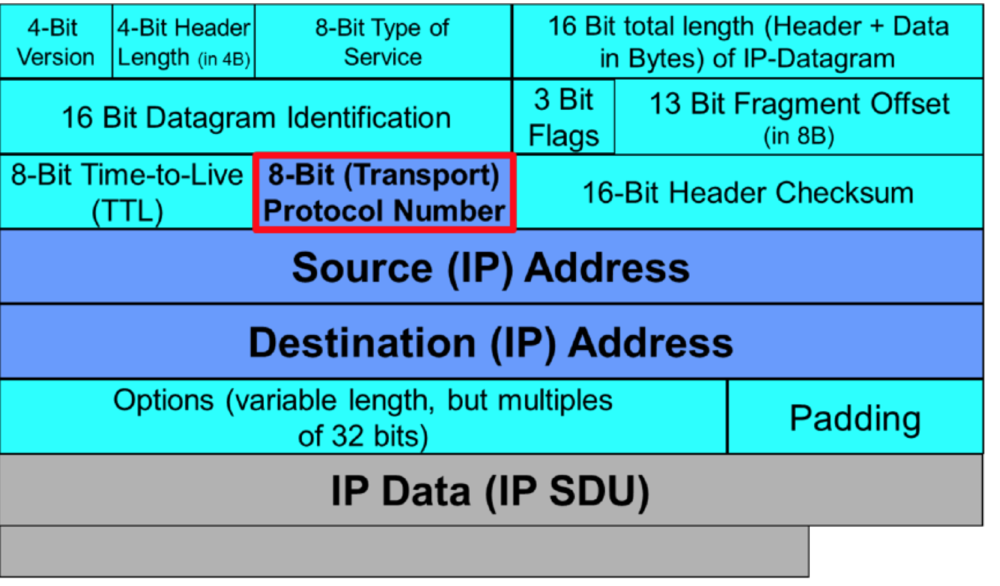

* Version: 4 bei IPv4, 6 bei IPv6
* IHL: Internet Header Length. Gibt an wie lange der Header ist (in 32 Bit). Minimum 5 (20 Byte), Maximum 15 (60 Byte)
* TOS: Type of Service
* Total Length: ganze Länge des Datagrams inkl. Header. IP Datagram können daher nur 65535 Byte lang sein
* Identification: Fragmente haben dieselbe ID
* Flags: Ist es ein Fragment, darf es fragmentiert werden, ist es das letzte Fragment oder folgen noch weitere Fragmente. Das erste Bit ist immer 0
* Fragment Offset: gibt an, welches Offset dieses Fragment hat
* Time to Live: ein Router muss es zu jeder angebrochenen Sekunde herunterstellen
* Protocol: inneres Protokoll
* Header Checksum
* Options & Padding: wenn Optionen vorkommen, muss der Header so aufgefüllt werden dass er auf 32 Bit passt.

### Protocol

* 1, 2, 3: ICMP
* 6: TCP
* 17: UDP
* 21: Reliable Data Protocol
* 41: IPv6 Encapsulation
* 46: Resource Reservation Protovol
* 47: GRE
* 50: ESP
* 51: AH
* 57: Simple Key-Management Protocol
* 89: OSPF
* 115: L2TP

### Type of Service (TOS)

* 1100: minimize delay
* 0100: maximize throughput
* 0010: maximize reliability
* 0001: minimize monetary cost
* 0000: normal service

### Optionen

Beispiel Option Type 7, Record Route

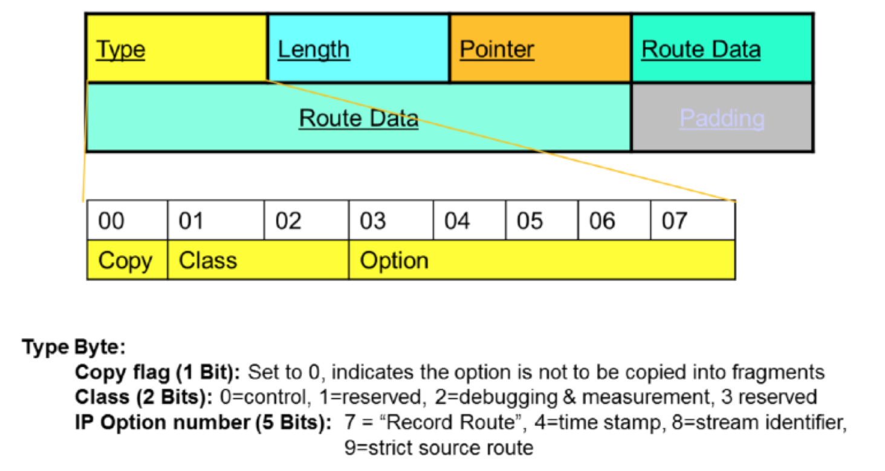

Wenn ein Router die Record Route Option sieht, versucht er seine Adresse dazuzulegen. Wenn das nicht ghet, schickt er ein ICMP Parameter Problem.

### MTU/Fragmentation

* 65535: Hyperchannel
* 17914: 16Mb/s Token Ring
* 8166 Token Bus
* 9000: Ethernet Jumbo Frames
* 4464: 4Mb/s Token Ring
* 2312: WLAN IEEE 802.11
* 1500: Ethernet V2
* 1492: IEEE 802.3
* 576: X.25 Networks

Zu Beginn durfte die MTU von TCP/IP maximal 576 Byte sein. Später durften die Router fragmentieren, dies führt aber zu mehr Overhead und mehr Belastung der Router. TCP holt sich die Path-MTU und stellt die Maximum Segment Size entsprechend ein.

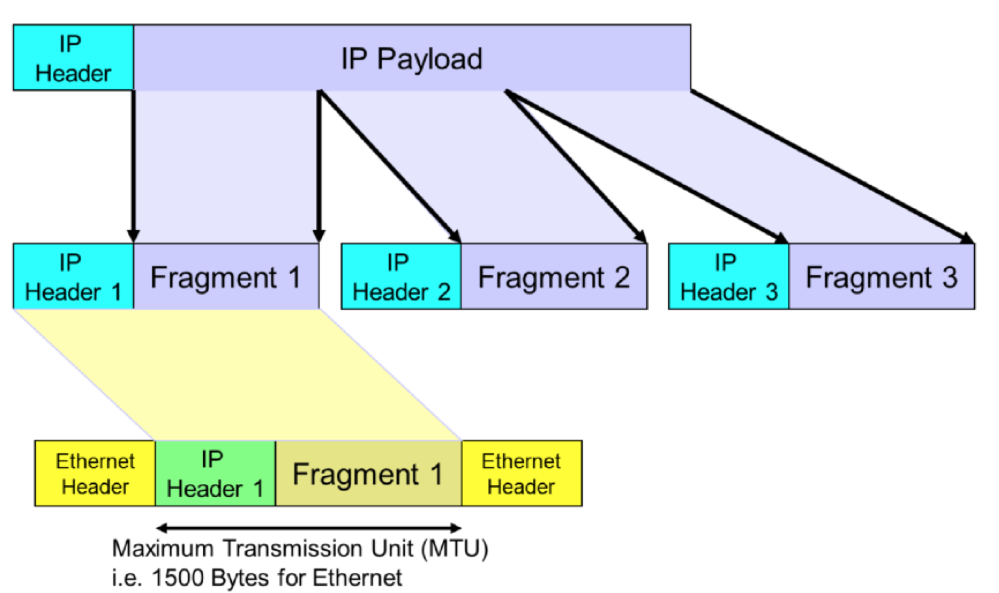

Alle Hosts müssen mindestens 576 Byte Datagrams (556 B Payload) unterstützen. 

Beim Fragment Offset aufpassen: wenn die MTU 1500 Byte ist, dann ist das Fragment Offset beim zweiten Paket 1480! Die MTU ist inkl. IP-Header

### Path MTU Discovery PMTUD

PMTUD verschickt relativ kleine Pakete (alle mit DF) und probiert dann immer grössere Pakete, bis keine Verbindung mehr zustande kommt. 


## ICMP

* Error Reporting
  * Checks and provides messages on network device status
  * Informs other devices of failures in particular machines
* Integral part of IP
* ICMP message generation is implementation and configuration dependent

ICMP-Anfragen müssen immer eine IP-Sourceadresse haben, die einen einzelnen Host benennt. Für fragmentierte Datagrams wird das Problem nur beim ersten Datagram berichtet. ICMP Messages zeigen nie auf ein IP Datagram mit einem Fragment Offset Fied != 0


Typ gibt typ an, Code den Zustand einer Nachricht (z.B. Host unreachable)

| Type | Code | Description                              | Application                |
| ---- | ---- | ---------------------------------------- | -------------------------- |
| 0    | 0    | Echo reply                               | Used in probes             |
| 3    | 0    | Destination Network unreachable          | Improves performance       |
| 3    | 1    | Destination Host unreachable             | Improves performance       |
| 3    | 2    | Destination Protocol unreachable         | Improves performance       |
| 3    | 3    | Destination Port unreachable             | Improves performance       |
| 3    | 4    | Fragmentation needed but "dont fragment" bit |                            |
| 5    | 0    | Redirect for network                     | Improves performance       |
| 5    | 1    | Redirect for host                        |                            |
| 8    | 0    | Echo Request                             | Used in probes, traceroute |
| 11   | 0    | Time Exceeded (TTL 0)                    | Used in Traceroute         |
| 12   |      | Parameter Problem                        | Reports Header errors      |
| 13   |      | Timestamp                                | Used in probes             |
| 14   |      | Timestamp reply                          |                            |
| 17   | 0    | Subnet Mask request                      | local use                  |
| 18   | 0    | Subnet Mask reply                        |                            |

ICMP Echo und Reply haben die folgenden Felder:

2 Byte Identifier, 2 Byte Sequence Number
Data

ICMP darf fragmentiert werden

# Versuch 4 - Ethernet MAC/Switch

## Link Integrity Puls

### Normal Link Puls

Bei 10Base-T wird etwa alle 16±8ms ein Link Pulse von 100ns Dauer gesendet wenn keine Datenpakete zu übertragen sind. Falls während mehr als 150ms keine Datenpakete und auch keine Link Pulse empfangen werden, so wird angenommen dass der Link zur Nachbarstation unterbrochen ist. 

## Autonegotiation

Um die Geschwindigkeit und den Duplex Mode auszuhandeln, wurde Auto Negotiation eingeführt. Dazu tauschen die Stationen Informationen über Fast Link Pulse (FLP) aus. 

Mit einem 16 Bit Link Code Word (LCW) wird beim Start der Ethernet-Verbindung signalisiert, welche Standards das Interface unterstützt. Das LCQ besteht aus Taktpulsen gefolgt von Datenpulsen. Der Taktpuls wird für jedes Bit gesendet. Falls ein Datenpuls folgt ist der Wert logisch 1, falls er fehlt logisch 0.

## Duplex Mismatch

Bei einem Duplex Mismatch interpretiert die HD-Maschine die eingehenden Pakete als Kollision und bricht das Senden ab.

## Formeln

### maximal mögliche UDP Datenrate

gegeben: UDP Packet Size UDP~SDU~ und Ethernet-Datenrate R~Ethernet~.
$$
R_{UDP-max} = R_{Ethernet} * UDP_{SDU}/(PHY_{PDU}+InterframeGap)
$$

$$
R_{UDP-max}=R_{Ethernet}*UDP_{SDU}/(UDP_{SDU}+UDP_{Header}+IP_{Header}+MAC_{Header}+CRC+Preamble+InterframeGap)
$$

### Interframe Gap

$$
InterframeGap [Byte]=((R_{Ethernet}/R_{UDP})*UDP_{SDU})-PHY_{PDU}
$$


# Vorlesungswoche 9 - IPv6

* Vergrösserung auf 2^128^ Adressen
* Vereinfachung der Header-Informationen (weniger Belastung für Router)
* Automatische Konfiguration
* Mobile IP
* IPsec als Teil des Protokolls
* Unterstützung von QoS und Multicast

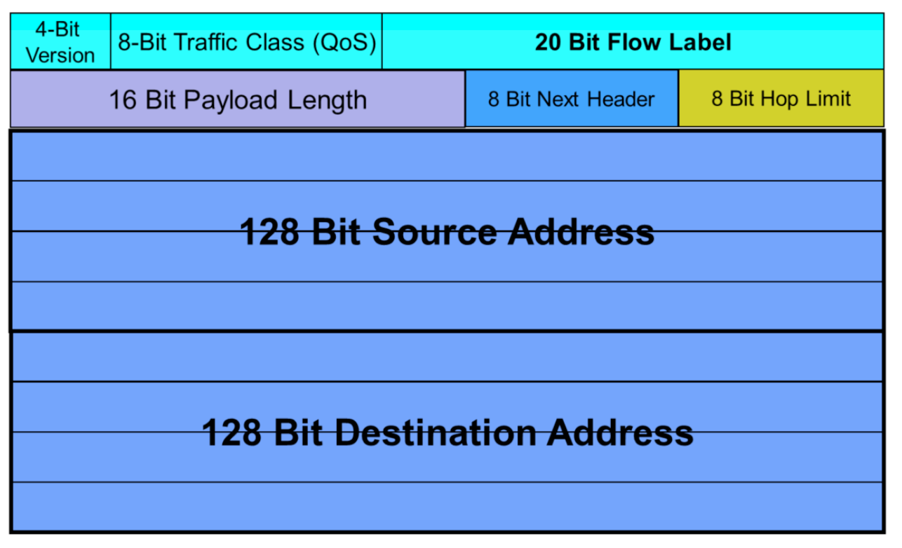

40 Byte IPv6 Header (fix). Andere Header werden in die Payload miteingebunden. 

* Version: 6
* Traffic Class (QoS)
* Flow Label
  * Jede Source wählt ihre eigenen Flow Label, Router benutzen die Source Address und das Flow Label um Flows zu identifizieren
  * Flow Label Value ist 0, wenn kein QoS gewünscht ist
* Payload Length
* Next Header: gibt an, was dem IPv6 Header folgt. Ähnlich dem Protocol Field von IPv4 und benutzt selbe Werte
* Hop Limit: TTL, aber diesmal Hops gemeint

## Addressierungsarten

* Unicast
* Multicast
  * ff00::/8
* Anycast
  * der "naheste" soll antworten (oftmals mittels Routing-Protokoll entschieden)

## Schreibweisen 

* Hexadezimal: 8 Blöcke mit je 4 Hex-Zeichen

  * `2001:0db8:0000:0000:08d3:1319:8a2e:0374`

* Abkürzungen

  * Führende Nullen innerhalb eines Blocks kann man weglassen

    * ```
      2001:0db8:0000:0000:08d3:1319:8a2e:0374
      2001: db8:   0:   0: 8d3:1319:8a2e: 374
      ```

  * Pro Adresse darf ==eine== Gruppe aufeinanderfolgender 0-Blöcke ausgelassen und durch zwei Doppelpunkte angezeigt werden

    * ```
      2001:0db8:0000:0000:08d3:1319:8a2e:0374
      2001: db8     ::     8d3:1319:8a2e: 374
      ```

  * Für die letzten 32 Bit kan man auch Dezimal Notation verwenden

    * ```
      2001:0db8:0000:0000:08d3:1319:8a2e:0374
      2001: db8     ::     8d3:1319: 138.46.7.52
      ```

  * Im URL werden IPv6-Adressen in eckigen Klammern angegeben, da sie sonst als Portnummern interpretiert werden könnten.

## Struktur

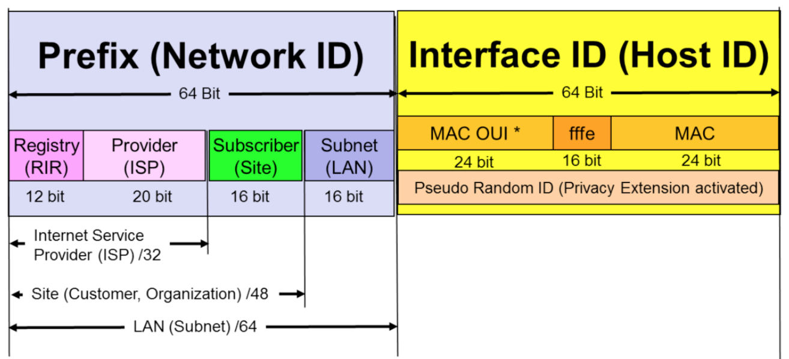

Die IANA hat einige Addressen fix vergeben

* 2001::/32 Teredo
* 2001:db8::/32 Dokumentation
* 2002::/16 6to4

Der Host-Teil ist immer 64Bit gross.

## Mehrere Adressen

Eine IPv6 Schnittstelle kann unter mehreren Adressen erreicht werden

* Link Local: fe80::/64 (1111 1110::)
  * Jeder IPv6-Rechner muss eine Link Local Adresse haben
  * Link Local Addressen werden von Routern nicht weitergeleitet
  * Der Hostteil der Link Local adressen wird aus der MAC-Adresse abgeleitet oder zufällig gewählt (bei aktivierten Privacy Extensions)
* Globale Addresse: 2000::/3 (001…) (2000 bis 3fff)
  * Global Unicast, weltweit gültige von Routern weitergeleitete Adresse (0010)
* Loopback-Adresse: ::1/128 (::1)
  * eigene, mit localhost verknüpfte Adresse

## Multicast

* ff0==s==, s gibt den Scope an
* ff01:: Loopback
* ff02:: Linklocal
* ff04:: Adminlokal (durch Admin festgelegt)
* ff05:: Sitelokal
* ff08:: Organisationslokal (mehrere Sites)
* ff0e:: Global

## Autokonfiguration

Die 64 Bit lange IPv6 Interface ID leitet sich aus der 48 Bit MAC-Adresse ab. Diese nennt man dann Extended Unique Identifier (EUI-64)

* 3 Bytes OUI
  * Universal/Local invertiert
* FFFE (reserviert, darf an dieser Stelle sonst nicht vorkommen)
* 3 Bytes NIC ID

Es gibt aber auch die Privacy Extensions, der Hostteil wird zufällig generiert

* Endgerät erzeugt regelmässig einen zufälligen Interface Identifier
* Endgerät prüft, ob der Identifier im Subnetz bzw. in der Broadcast Domain noch nicht existiert
  * Neighbor Soliciation Message an Multicast Adresse FF02::1:FFFE:641D
  * Adresse zuweisen, wenn kein Neighbor Advertisement kommt
* Endgerät verwendet diesen zufälligen Identifier
* Identifier hat beschränkte Geltungsdauer (z.B. Windows 7 wählt jeden Tag einen neuen Identifier und akzeptiert Pakete für diesen Identifier während 7 Tagen)
* Endgerät kann somit über mehrere Identifiers erreicht werden


## Prefix lernen

1. Host sendet Router Solicitation Request (RS) an alle Router (Multicast FF02:2)
2. Router antwortet mit Routing Advertisement (RA)

## Umstellung von IPv4 auf IPv6

### Dual Stack

### Tunneling (6in4, 6rd, ISATAP)

### Tunneling (Teredo)

### Tunneling (4in6, DS-Lite)


# Vorlesungswoche 10 - Transport/UDP/VoIP

# Versuch 5 - Switching/VLAN

# Vorlesungswoche 11 - TCP

# Vorlesungswoche 12 - FTP

# Versuch 6 - WLAN

# Vorlesungswoche 13 - DNS/Whois/CDN

# Vorlesungswoche 14 - HTTP

# Versuch 7 - Performance

# 


