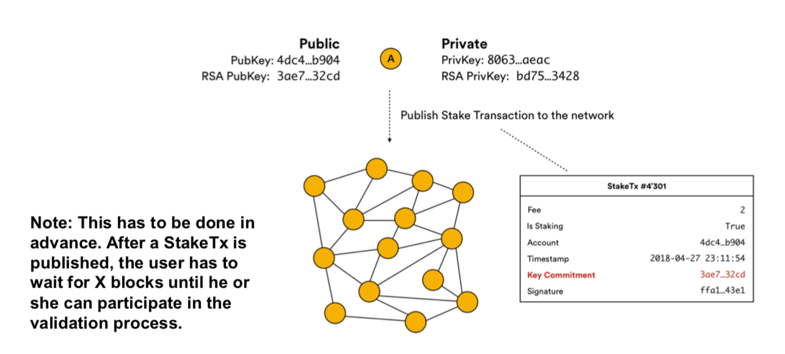

# DSA

# VSS Repetition

## Replication

Direct Replication: Originator Peer is the Responsible.

Indirect Replication: closest peer is Responsible

## Consistency

Consistency in a DHT is difficult

vDHT: for consistency (among others)

* Copy on write
* 2PC
* replication
* software transactional memory (STM)
* works for light churn
  * No locking, no timestamps
  * every update = new version
  * get latest version, check if all replica peers have latest version, if not wait and try again
  * put prepared with data and short TTL
    * if status is OK on all replica peers, go ahead,
    * otherwise, remove the data and go to step 1
  * put confirmed (don't send data, just remove the prepared flag)
* for heavy churn: API user needs to resolve

## Kademlia

Kademlia: if distance can be represented in m bits, bucket m will be used

Symmetrical routing paths

## Coins

Account-based (e.g. ETH):

* Global state stores a list of accounts with balances and code
* Transaction is valid if the sending account has enough balance
  * Balance on sender is deducted, new balance
* If the receiving account has code, the code runs and state may be changed
  * Signature must match sending account

UTXO-based

* Every referenced input must be valid and not yet spent
* Total value of the inputs must equal (or exeed) the total value of the outputs
  * You always spend all outputs
* Transaction must have a signature matching the owner of the input for every input
  * Script determines if input is valid

# TomP2P

Iteratives Routing!

Security: best effort

* Signature-based

# WebRTC

eliminate plugins or native apps

STUN/TURN

# Security Considerations

## Anonymity

Heuristic 1: if two (or more) addresses are inputs to the same transaction, they are controlled by the same user

Heuristic 2: the one-time "change address" is controlled by the same user as the input addresses

Heuristic 3: multisig wallets usually use p2sh change, but the recipient rarely uses p2sh, which allows to determine the correct change output high high probabiliy

Optimal change heuristic: wallet software does not spend output unnecessarily => the change value is smaller than any of the spent outputs (the change is the smallest output)

Consumer heuristic: consumer wallets only create transactions with two outputs. Therefore, if an output is spent by a transaction with 3 outputs, it is not change

# Ethereum

Contracts are Turing complete. Every instruction needs to be paid for. Gas Price/Gas Limit: if you run out of gas, state is reverted, ETH gone

Gas Price: proportional to computational work

# Smart Contracts

Objectives:

* observability
* verifiability
* privity
* enforceability

Structs

Mapping (Key-Value), not iterable (can be implemented)

## Functions

* Standard Functions (can read and modify the state) `public`/...
* View Functions: do not modify the state (free) `view`
* Pure Functions: do not read from or modify the state `pure`
* Internal Functions: only callable internally `internal`
* External Functions: only callable externally `external`
* Payable Functions: receives plain ether `payable` (value in `msg.value`)

## Require

revert: abbrechen, alten Stand wiederherstellen

assert: sollte nie falsch liegen

require: sicherstellen, kann falsch liegen

## Events

Log that something has occurred (`emit`)

## ERC20

"Interface" for tokens written in ETH

## Transaction Ordering

Mining order counts. E.g, a buyer contract checks the price, and then executes `buy`. When the seller contract is changed to increase the price, and this change is mined first, the buyer pays more than he initially wanted.

## Reentrancy Attack

Use Contract Locks!

# ICO

Little regulation, short in duration, open to anyone

High chance it won't work

Perform due diligence!

# NEO

"Ethereum of China"

Consensus: Delegated Byzantine Fault Tolerance

Delegates create block, 2/3 need to approve through voting. **Works if more than 50% honest.**

## Delegated Byzantine Fault Tolerant

Nodes in the network elect a group of consensus nodes. Leader/speaker randomly chosen from consensus nodes, rest are delegates. 

Leader/Speaker creates a new block, needs to be positively checked by 2/3 of delegates. If they agree, block added to the chain. Countermeasures for dishonest leader/speakers or delegates.

Has a stack-based NeoVM. Smart Contracts can be written in C#, Python, Golang.

# IOTA

"Permissionless distributed ledger for a new economy" for IoT

Feeless M2M (e.g. IoT) transactions

A node can only issue a transaction after solving a cryptographic puzzle

Uses a decentralized acyclic graph instead of a blockchain. Tangle: transaction must approve two previous transactions in order to be considered valid

It is safe to receive any number of transactions to a given address until an outgoing transfer (send) transfer is made. After this, the address should no longer be re-used. => Sending IOTAs, part of the private key of that address is revealed.

Now requires a "coordinator"/trusted node. Every 35 seconds, this node makes a normal transaction that confirms 2 tx (called milestone). Check tx: get latest milestone and check

IOTA Snapshot: pruning of the ledger, removing all events and addresses which don't have a positive balance. 

# Consensus & Scalability

## Consensus

Develop, agree and support a decision that is in the best interest of the whole

 **Classical Consensus Models**

* Crash failure models => honest nodes failing 
* Byzantine failure model => able to tolerate a portion of malicious nodes 

**Elected Leader** 

* Probabilistic elected leader (e.g., who can find the hash first?) 
* Most known Proof-of-Work (PoW) 
* Also, Proof-of-Stake (value held on the chain and its variants), Proof-of-Capacity (PoC), Proof-of-Burn (PoB), Proof-of-Authority (PoA), etc. 

**Hybrid Consensus Models**

* Single consensus has many limitations
* Combine different consensus mechanisms 

**Scalability** 

* System is divided into shards (communities)
* Cross-chain communications 

Blockchain: public, decentralized ledger. Nodes must evaluate and agree on all addenda before they are permanently incorporated into the blockchain.

* Practical Byzantine Fault Tolerance (PBFT)
  * Hyperledger, Stellar, Ripple
* Proof of Work (PoW)
  * Bitcoin, Ethereum
* Proof of Stake (PoS)
  * Peercoin, Ethereum's Casper, Bazo

### Two Generals Problem

Case 1: no guarantee of acknowledgement

Case 2: Faulty communication channel

The Two Generals Problem has been proven to be unsolvable

### Byzantine Generals Problem

How do you make sure that multiple entities, which are separated by distance, are in absolute full agreement before an action is taken?

PoW is a probabilistic solution to the problem, which means the confidence that a consensus is reached is growing with every block added to the chain, but it never reaches 100%.

PBFT: the algorithm offeres both liveness and safety provided at most $\frac{n-1}{3}$ out of a total of $n$ replicas are simultaneous faulty

* A general solves the PoW Problem, broadcasting a new block
* When receiving this block, each general verifies it and works on solving their next PoW problem, incorporating the prior solution into it
* The generals will switch over to the longest chain (it has the greatest chance of success)
* They know how long the PoW solution roughly takes. After a set amount of time, they will know if enough of the other generals are also working on the same chain

### Bitcoin

Has a nonce in the transaction header that can be varied to produce a different hash

### Proof of Stake

Stake an amount of their token to have a chance of being selected to validate blocks of transactions, and get rewarded for doing so.

The more a user stakes, the better their chance of being selected since they have more skin in the game => acting malicious would see them set back by a greater amount than someone who stakes less

### Proof of Stake in Bazo

Each node wanting to become a validator generates an RSA keypair and publishes a stake transaction containing the public key to the network. A transaction of this type is accepted if the issuer fulfills the minimum staking amount. After the minimum waiting time elapsed, each validator participates in the election process.

## Scalability

Scale up (vertical): add more resources to a single unit

Scale out (horizontal): add additonal units to split workload across units

Bitcoin can process roughly 8 transactions per second (8 tps), ETH 15 tps

Every single node must process every single transaction (higher security and decentralization, less scalability) (more nodes = more power does not equal more speed)

Divide transactions to different groups of nodes: smaller group of nodes are more vulnerable. Increases scalability, decreases security/decentralization

Solutions:

* Plasma: connects parent and child chains to the main blockchain and transforms it into a tree structure
* State channes: a two-way communication channel to send transactions off-chain
* Sharding: divides the network state into partitions, where each node is responsible for a single partition

Database Sharding: compute a hash of the shard key field's value. Each chunk is assigned a range based on the hashed shard key values. Each chunk is held on a separate database server instance.

Blockchain sharding: only designated nodes validate the transaction and not the entire network. The blockchain should scale linearly with every nerw node. 

Single Shard Takeover attack:

### Sharding in Bazo

Dynamic Load Balancing: dynamically adjusting the number of partitions (shards)

Self-contained proofs: miners can verify the validity of the transaction without the blockchain history.

Transaction aggregation: automatically reduce the overall size of the blockchain over time

Entities:

* **Users** Uses Bazo’s infrastructure to transfer funds and run smart contracts 

* **Validators** Participates in Bazo’s consensus protocol and validates blocks 

* **Leaders** A special type of validator who has the right to append the next block to a random shard 

* **Aggregators** A special type of validator who aggregates transactions of a shard 

Self-Contained Proof (SCP):

* Instead of validators requiring the full blockchain to validate a transaction, a user has to provide all required proofs in the transaction, independent of the blockchain. A SCP is a list of Merkle proof, one for each block that contains one or more transactions where they sent or received funds.

# Protocol

SCTP

* Message-based
* Allows data to be divided into multiple streams
* Syn cookies: 4-way handshake with a signed cookie

QUIC: UDP/443

## Ethereum Wire Protocol

Node Discovery: Kademlia-like. Find node in DHT, connect to it (via RLPx), negotiate capabilities, exchange ETH information

RLPx is a cryptographic peer-to-peer network and protocol suite. ECIES encryption

Ethereum uses RLP (Recursive Length Prefix)

## Noise Protocol

# ECC

Never reuse the random number.

HD Keys: Seeds as words. 

An elliptic curve is nothing more than Point = Multiplier * Public Base Point. Given the point, it's impossible to get the multiplier. 

Signatures are not deterministic, always using new random number

# Monero

