# Information Security Management

## Datensicherheit und Datenschutz

Datensicherheit wahrt die Vertraulichkeit (confidentiality), Echtheit (integrity) und Verfügbarkeit (availability). Zusätzlich involviert können Authentizität, Verantwortlichkeit, Nicht-Abstreitbarkeit und Zuverlässigkeit sein

Datenschutz schützt Personen vor dem Missbrauch ihrer personenbezogenen Daten.

## Informationssicherheitsmodell: CIA

**C**onfidentiality, **I**ntegrity, **A**uthenticity

## Informationssicherheitsmanagement

Management der Prozesse zur Aufrechterhaltung der Vertraulichkeit, Echtheit und Verfügbarkeit von Informationen. Schutz durch organisatorische, technische Massnahmen. In den Bereichen Infrastruktur, Prozesse, Personen.

## Wert (Asset)

Alles was für die Organisation von Wert ist. Arten:

* Informationen (Wissen oder Daten)
* Software (z.B. Computerprogramme)
* materielle Werte, z.B. Computer
* Dienstleistungen
* Menschen und ihre Qualifikationen, Fähigkeiten und Erfahrung
* immaterielle Werte, z.B. Reputation und Image

## Ziele/Wertvorstellungen

* Firmenziele: Rendite, längerfristiges Fortbestehen
* Persönliche Ziele: Jobsicherheit, Karriere, Selbstverwirklichung, eigenes Haus, Kinder
* Politiker-Ziele: Wiederwahl
* Zeithorizont der Zielerreichung: Quartal, Jahr, Amtsdauer, mehr als 5 Jahre

## Bedrohung (Threat)

Bedrohung ist der mögliche "Grund" für einen ungewollten Vorfall, der das System oder die Organisation schädigen kann.	

## Kontrolle, Massnahme (Control)

Eine Schutz-/Gegenmassnahme (Kontrolle) ist ein Mittel zur Risikohandhabung. Inbegriffen sind Policies, Prozeduren, Richtilinien, Praktiken oder organisatorische Strukturen, welche administrativen, technischen, rechtlichen oder Management-Charakter haben können.

## Schwachstelle (Vulnerability)

Eine Schwachstelle bezeichnet die Schwäche einer Schutzmassnahme die durch eine oder mehrere Bedrohungen ausgenutzt werden kann.

## Gefährdung (Hazard, Applied Threat) = Bedrohung + Schwachstelle

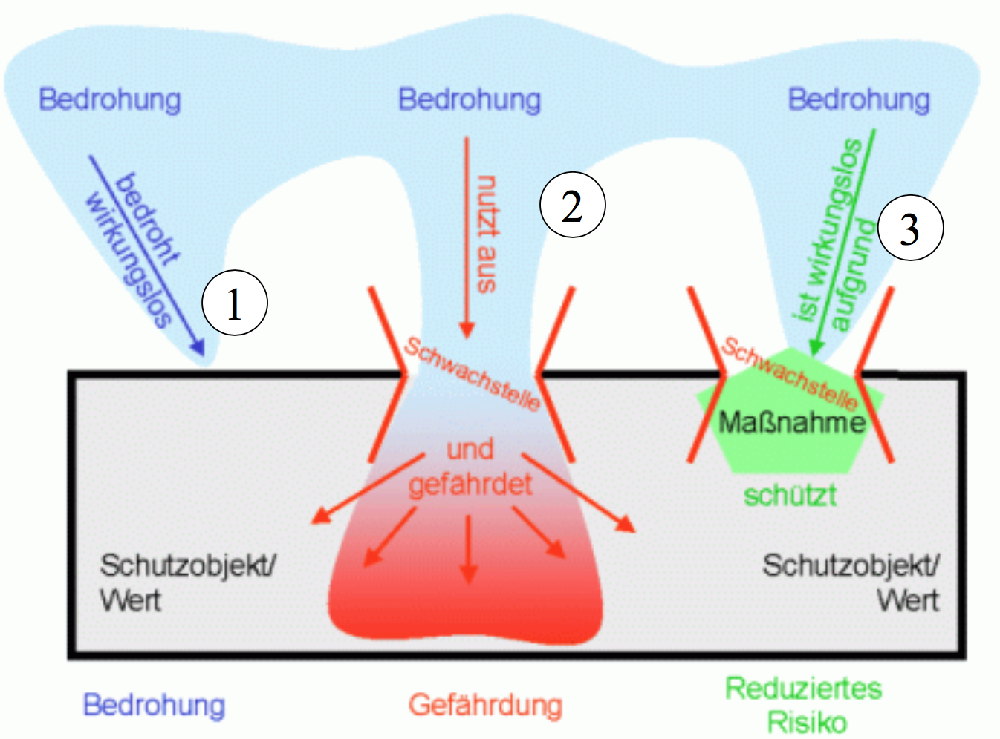

# Risikomanagement

Risikoidentifikation (Ereignisliste) $\rightarrow$ Risikobewertung (Risikomatrix) $\rightarrow$ Risikobewältigung (Massnahmen)

## Risiko

Kombination aus der Wahrscheinlichkeit eines Reignisses (Vorfalls) und dessen Auswirkungen

Risiko = Wahrscheinlichkeit eines Zwischenfalls * Schaden = Bedrohung * Verletzlichkeit * Schaden

# Hilfsmittel zur Verbesserung

## Reaktiv - aus Fehlern lernen

Datenbanken und CVE-Scores

## Proaktiv

Security von Anfang an beachten, nicht am Ende noch sicher machen

# Threats

## Ransomware

Wannacry

## Cyberwar

Spionage, Sabotage, Desinformation

## Hacktivism

Anonymous

# Rechtslage Internet

Damit ein Eindringling verurteilt werden kann muss er einen Schutz durchdringen. Nun kann man sich darüber streiten, was als Schutz gilt.

# Informationsbeschaffung

* Surface Web: normales, sichtbares Netz
* Deep Web: nicht durch Suchmaschinen indexiert, erst nach Ausfüllen von Formularen zugänglich, nur mit Login

# Massnahmen

 human error (inadvertent) [menschliches Versagen, unbeabsichtigt]

=> console [Trost spenden]

at-risk behavior (coice to drift) [bewusstes Verhalten mit eigener
Risikosbeurteilung]

=> coach [betreuen, trainieren]

reckless behavior (conscious disregard, repetitive at-risk behavior)[rücksichtloses Verhalten, bewusste Missachtung, wiederholte Vergehen]

=> punish (strafen)

**(bis zu diesem Punkt ist vieles in der Vorlesung nicht hier in der Zusammenfassung, weil ich es zu "basic" finde)**

# Kryptologie Basics

## Begriffe

* Kommunikation
  * Steganographie: bedeckt schreiben
  * Kryptographie: geheim schreiben
    * Transposition: vertauschen
    * Substitution: ersetzen
      * Codierung: Wörter ersetzen
      * Chiffrierung: Buchstaben ersetzen

Beispiele für Steganographie: Bilder in einem anderen Bild verstecken, oder der Zeus-Bot der seine Konfiguration in einem Bild erhalten hat. Oder die Druckerpünktchen, womit man erkennen kann von welchem Drucker gedruckt wurde.

Kryptologie ist die "Science of Secret Message Exchange" und beinhaltet *Cryptography* und *Cryptanalysis*. 

## Design Rules

> Die Sicherheit eines Verschlüsselungsverfahrens darf nur von der Geheimhaltung des Schlüssels abhängen, nicht jedoch von der Geheimhaltung des Algorithmus. (Kerckhoffs)
>
> Konfusion (Mischen): der Chiffretext muss möglichst gut einer Zufallsorgie gleichen, die statistische Verteilung im Klartext soll im Chiffretext nicht mehr ersichtlich sein [=> 'e' darf nicht am meisten vorkommen]
>
> Diffusion (Verteilen): Eine Änderung eines Teils des Klartextes oder des Schlüssels soll den gesamten Chiffretext beeinflussen; (beide Shannon)

Ein kryptographischer Algorithmus ist *sicher*, wenn der effizienteste Angriff nicht schneller ist als ein Brute-Force-Angriff

Die Sicherheit eines kryptographischen Algorithmus hängt von der Anzahl der möglichen Schlüssel ab - je mehr mögliche Schlüssel, desto sicherer ist die Verschlüsselung

Für die Kryptanalyse wird folgendes angenommen: der Angreifer kennt alle Details des Verfahrens, ihm fehlt einzig der geheime Schlüssel. Man unterscheidet noch zwischen:

* Ciphertext-only: der Angreifer kennt nur Chiffrate
* Known-Plaintext: er kennt gewisse Klartext-Chiffrat-Paare
* Chosen-Plaintext: er kann Klartexte wählen und die resultierenden Chiffrate beobachten

## Informationstheorie

**Informationsgehalt** eines Zeichens: je grösser der Überraschungsgrad bzw. je kleiner die Wahrscheinlichkeit eines Zeichens, desto grösser ist der Informationsgehalt.
$$
I_i(x_i) = -log_2(p_i)
$$
x~i~ Zeichen, I~i~ Informationsgehalt des Zeichens x~i~, p~i~ Wahrscheinlichkeit des Zeichens x~i~.

**Entropie**: durchschnittlicher Informationsgehalt aller Zeichen. Die Entropie wird maximal, wenn alle Zeichen gleichwahrscheinlich auftreten.
$$
H(X) = \sum_i p_i I_i = - \sum_i p_i log_2(p_i)
$$

# Geschichte

**Transpositionsverfahren**: Zeichen des Klartextes in der **Reihenfolge** vertauschen

**Substitutionsverfahren**: zum Beispiel Cäsar-Code. Jeder Buchstabe wird mit einem anderen vertauscht, mit einem fixen Abstand im Alphabet. Der Schlüssel ist dieser Abstand. Cäsar-Code ist ein Substitutionsverfahren mit monoalphabetischer Verschlüsselung.

Bei Vigenère handelt es sich um ein SV mit polyalphabetischer Verschlüsselung. Die Substitution ändert sich mit jedem Buchstaben.

Als sicher gilt das One-Time Pad: https://www.wikiwand.com/de/One-Time-Pad#/Beispiel

# Verschlüsselung

# Symmetrische Verfahren

Ein symmetrisches Kryptosystem verwendet den gleichen Schlüssel zur Ver- und Entschlüsselung. Der Schlüssel wird vorgängig über einen sicheren Kanal zwischen Sender und Empfänger ausgetauscht.

Bei einem System mit $n$ Teilnehmern gibt es $\frac{n(n-1)}{2}$ unterschiedliche geheime Schlüssel im System.

Beispiele:

* DES
* RC4
* A 5/1
* IDEA
* CAST
* RC5
* AES
* Camellia

## Stream Cipher

Die Zeichen des Klartextes werden mit den Zeichen des Schlüsselstroms einzeln (XOR) verknüpft. Der Schlüsselstrom ist eine pseudozufällige Zeichenfolge, die aus dem Schlüssel *abgeleitet* wird.

Es gilt
$$
Plaintext-Bit \oplus Running-Key-Bit = Ciphertext-Bit
$$
Falls der Empfänger den empfangenen Ciphertext-Bitstrom wieder an der *richtigen Position* mit dem geheimen Schlüsselstrom XOR-verknüpft, so erhält er:
$$
Ciphertext-Bit \oplus Running-Key-Bit \\
= Plaintext-Bit \oplus Running-Key-Bit \oplus Running-Key-Bit\\
= Plaintext-Bit
$$
also wieder den Klartext.

Stream Ciphers waren früher sehr verbreitet und beliebt, weil man damit schnelle Verschlüsselungsmaschinen bauen konnte.

Falls der Schlüssel direkt den Cipher Stream angibt, und genauso lang (mindestens so lang) ist wie der zu verschlüsselnde Klartext, und nur einmal verwendet wird, ist es eine One-Time-Pad Verschlüsselung.

## Block Cipher

Ein Block Cipher bildet Klartext Blöcke fixer Länge (z.B. n=64 Bit) auf Ciphertext-Blöcke der selben Länge ab. Welche der $(2^n)!$ möglichen Abbildungen gewählt wird, wird durch einen zufällig gewählten Schlüssel K bestimmt. **Falls der Klartext einen Block nicht ganz füllt werden Padding-Zeichen angefügt**.

Derselbe Plaintext-Block führt bei gegebenem Schlüssel immer auf denselben Ciphertext-Block. Daher egeben Blockmuster oder Periodizitäten im Plaintext auch solche im Ciphertext. Um das zu vermeiden wurden verschiedene Block Chaining Modes eingeführt, z.B. Cipher Block Chaining (CBC), Cipher Feedback (CFB) oder Output Feedback (OFB) Mode.

In der Praxis haben sich Blockgrössen von Vielfachen von 64 Bit durchgesetzt.

### ECB-Mode

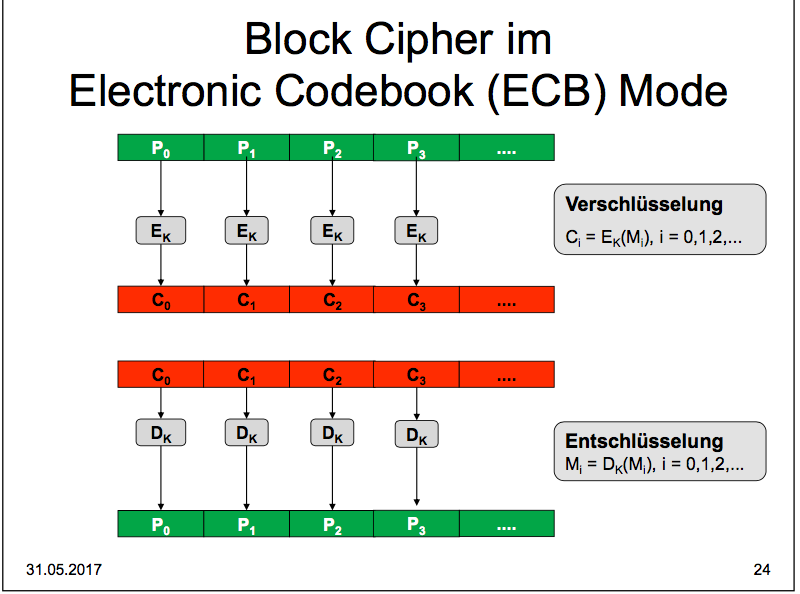

Beim ECB-Mode erfolgt eine Chiffrierung von Klartextblöcken in (Gruppen von $b$ Bits) in die jeweils dazugehörigen Geheimtextblöcke (Gruppen von $b$ Bits). Beim ECB-Modus können Verschlüsselung und Entschlüsselung mit mehreren Blöcken parallel erfolgen. Bei Verwendung von ECB schlagen Muster im Klartext zu Muster im Geheimtext durch.

Fakten

* Gleiche Nachrichtenblöcke werden auch gleich verschlüsselt
* Eine Vertauschung von Blöcken im Chiffrat führt zur gleichen Vertauschung der Blöcke in der verschlüsselten Nachricht
* Ein Fehler in einem Block beeinflusst nur die Entschlüsselung dieses Blocks
* Mehrere Blöcke können parallel ver- und entschlüsselt werden.

Von der Verwendung des ECB-Modus wird abgeraten, es sei denn es soll nur einmal ein einziger Nachrichtenblock verschlüsselt werden.

### Block Cipher Counter (CTR mode)

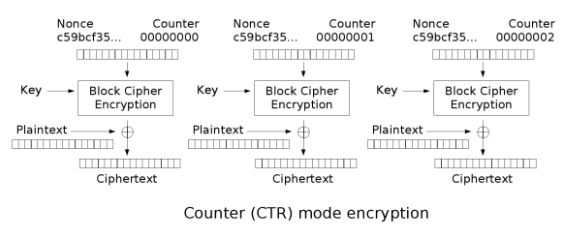

Hier wird der Key, und ein IV + Counter verschlüsselt. Danach wird das Resultat mit dem Plaintext XOR-t.

### Cipher Feedback (CFB mode)

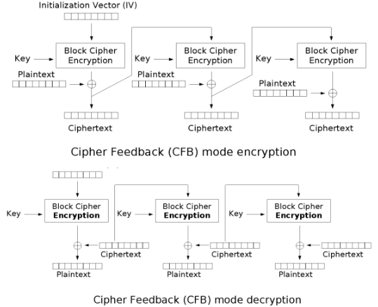

Ähnlich wie oben, allerdings wird nur einmal ein IV + Counter verwendet. Danach wird der Ciphertext anstelle des IV + Counter verwendet.

### Cipher Block Chaining

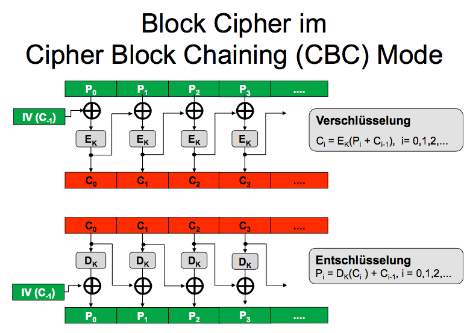

Hier wird, im Unterschied zu vorher, der Plaintext vorher XOR-t. Die XOR-Operation von CFB wandert also einfach über die Encryption-Funktion.

### Padding

**Null Padding**: hängt solange Null-Bytes an, bis die Blocklänge erreicht ist. Dieses Padding-Verfahren lässt sich nur dann eindeutig umkehren, wenn die Nachricht nicht mit Null-Bytes endet. 

**PKCS #7 Padding**: die Anzahl der erforderlichen Padding-Bytes wird als Binärzahl in die Bytes codiert. Es muss immer mindestens ein Padding-Byte geben. 

**ANSI X.923 Padding**: hängt Nullbytes an, gefolgt von einem Byte in welchem die Anzahl der Nachrichten-Bytes im letzten Block binär codiert ist. In einer anderen Variante werden hier die Anzahl Padding-Bytes codiert.

### Feistel

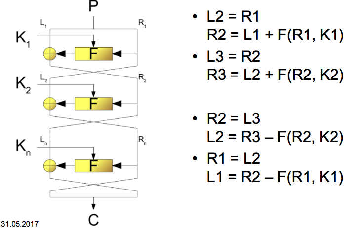

### DES

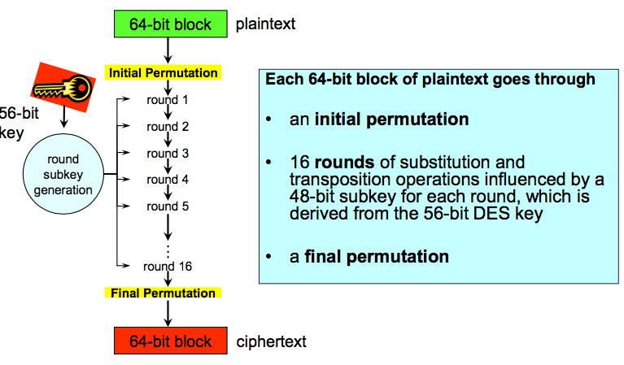

Jeder Block geht durch

1. eine initiale Permutation
2. 16 Runden Substitution und Transposition, beeinflusst von einem 48 Bit Subkey für jede Runde, der von einem 56 Bit DES-Key abgeleitet wird.
3. Eine letzte Permutation, die das inverse der initialen Permutation ist.

Bei Triple DES wird mit drei verschiedenen Schlüsseln verschlüsselt. Er wird mit dem DES-Schlüssel 1 chiffriert, mit dem Schlüssel 2 dechiffriert und mit dem Schlüssel 3 wieder chiffriert. Dieses Verfahren nennt man auch EDE (Encrypt-Decrypt-Encrypt). Falls alle drei Schlüssel gleich gewählt werden, hat man wieder Single DES.

### AES

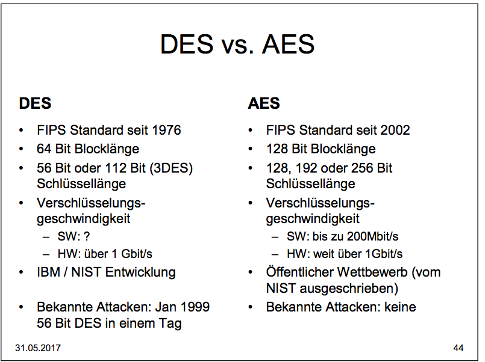

# Asymmetrische Verfahren

## Anwendungen

**Verschlüsselung/Entschlüsselung**: der Sender verschlüsselt die Nachricht mit dem **Public Key des Empfängers**.

**Schlüsselaustausch**: der Sender und der Empfänger produzieren einen gemeinsamen geheimen Schlüssel, der dann als symmetrischer Schlüssel verwendet wird.

**Digitale Signierung**: der Sender *signiert* eine Nachricht mit dem **Private Key des Senders**. Der Empfänger *prüft* die Signatur mit dem **Public Key des Senders**. 

Jeder Teilnehmer hat ein persönliches Schlüsselpaar, das aus einem geheimen und einem öffentlichen Schlüssel besteht. Der öffentliche Schlüssel landet in einem Schlüsselverzeichnis im Internet.

Diese Funktionen gelten als Einweg-Funktionen:

* der Public Key ist der Verschlüsselungsschlüssel, wer den Public Key kennt kann verschlüsseln
* Der Private Key ist der Entschlüsselungsschlüssel, wer den Private Key kennt kann entschlüsseln
* Wer nur den Public Key kennt, kann nicht entschlüsseln. Es ist praktisch unmöglich, den Private Key zu berechnen wenn man nur den Public Key kennt.

## Algorithmen

* RSA: basiert auf Multiplikation und Faktorisierung von Zahlen. Grosse Schlüsselgrösse empfohlen, z.B. 2048 Bit.
* Elliptic Curve (ECC): basiert auf diskreten Logarithmen, kleine Schlüssellänge möglich (224 Bit)$

## Einwegfunktionen

$Y=f(x)$ ist einfach zu berechnen

$x=f^{-1}(Y)$ ist schwierig zu berechnen

Beispiel: faktorisieren. 

$4’221’571 * 94’257’593 = ?$

$ = 397’915’121’138’603$

ist sehr schnell. Aber die Faktoren wieder herauszufinden, ist sehr langsam.

## RSA

Im Gegensatz zu einem symmetrischen Schlüssel ist ein RSA-Schlüssel keine reine Zufallsfolge von Bits, sondertn das Produkt von zwei zufällig gewählten grossen Primzahlen. Daher sind bei $b$ Bits Schlüssellänge nicht alle $2^k$ Kombinationen möglich, wie dies bei asymmetrischen Schlüsseln der Fall ist.

Als Exponent wird häufig $e=65537 = 2^{16} + 1$ gewählt, da sich so $C=M^e \mod n$ sehr effizient berechnen lässt.

## Diffie-Hellman

1. Zwei grosse Primzahlen $p$ und $g < p$ veröffentlichen
2. Grosse Geheimzahl $Y_A$ produzieren
3. $DH_A=g^{Y_A} \mod(p)$ berechnen
4. $DH_A$ veröffentlichen
5. A und B erhalten die gemeinsame Geheimzahl indem sie berechnen:
   $K_{AB} = DH_B^{Y_A} \mod(p) = DH_A^{Y_B}\mod(p)$

# Hybride Verfahren

Hybride Verfahren verwenden Public Key Verfahren für den Austausch der geheimen symmetrischen Schlüssel und Symmetric Key Verfahren für die eigentliche Meldungsverschlüsselung.

# Brechen

Je länger der Schlüssel in Bits, desto grösser ist die Schlüsselvielfalt bzw. die Anzahl von möglichen Schlüsseln. Die Sicherheit nimmt mit der Schlüssellänge exponentiell zu.

# Signaturen

Digitale Signaturen gewährleisten die Integrität und die Authentizität.

## Hash

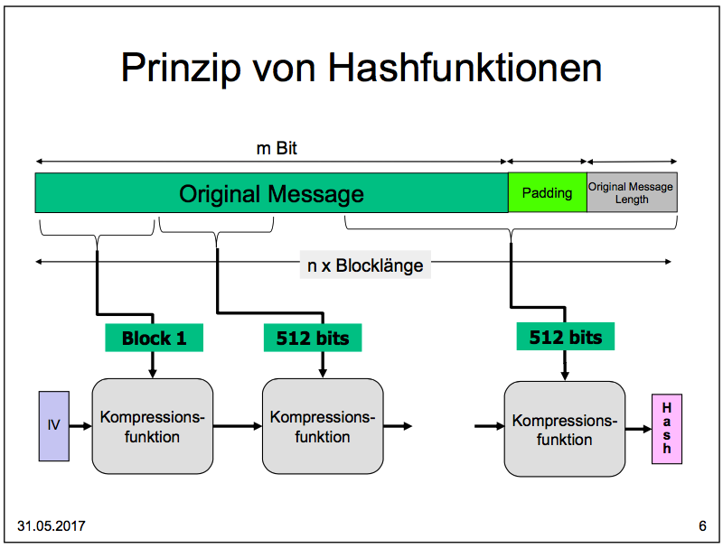

Eine Hash-Funktion bildet einen beliebig langen Datensatz auf einen kurzen Datensatz ab. Anstelle von "Hash" sagt man auch "Message Digest" oder "Fingerprint"

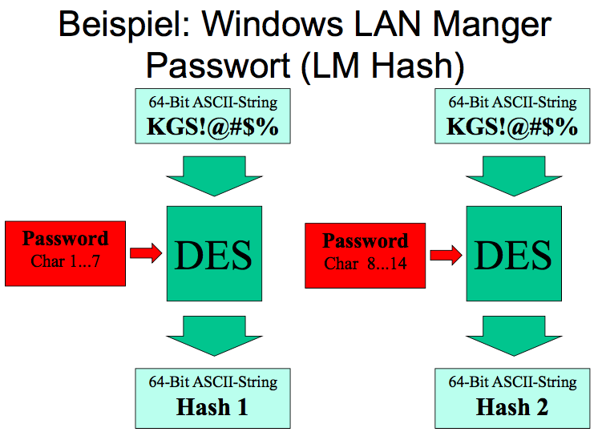

Der Key `KGS!@#$%` ist dabei fix.

### Anforderungen an Hashes

**One Way Function**

**Collision Resistant**: es sollte schwierig sein, zwei Messages zu finden die dieselbe Message finden

**Preimage Resistant**: es sollte schwierig sein, zu einem gegebener Message eine andere Message zu finden, die denselben Hash produziert (deckt sich so halb mit Collision Resistant, der Unterschied hier ist dass eine Message vorgegeben ist).

### MD5/SHA

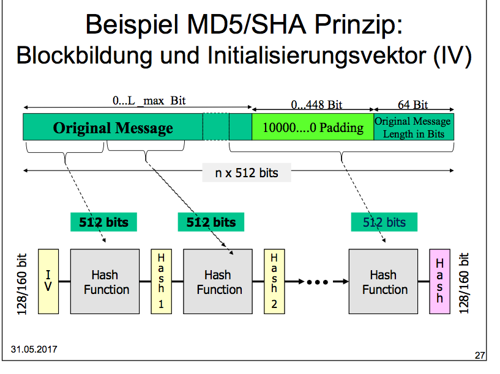

Wie man sieht, arbeitet MD5/SHA rückgekoppelt.

Folgend, was im Block "Hash Function" passiert:

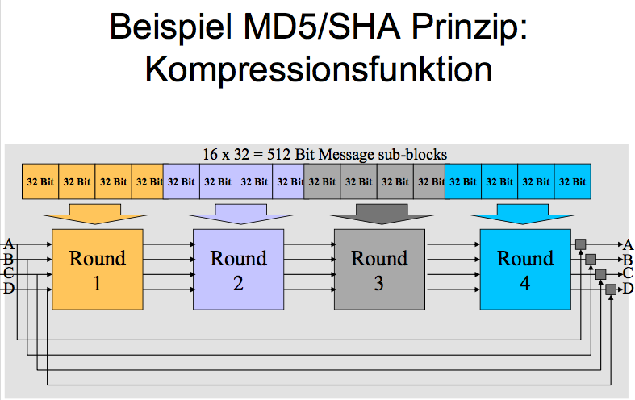

MD5 nutzt 4 Runden. Was in den Runden passiert:

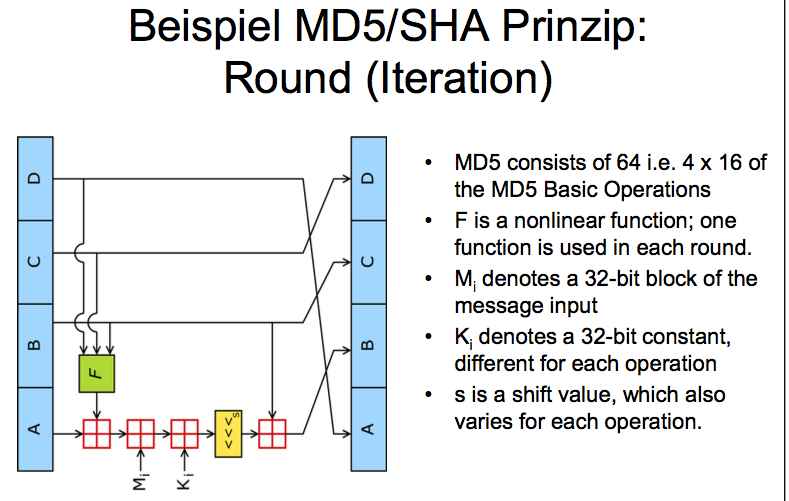

### Keyed Hash

Will man sicherstellen, dass eine Nachricht nicht verändert wurde, hasht man zuerst eine Nachricht. Dann vereinbart man ausserhalb des Kanals einen Schlüssel und verschlüsselt den Hash mit diesem Schlüssel. Man sendet nun die Nachricht und den "verschlüsselten (keyed)" Hash über den unsicheren Kanal, und den Schlüssel über einen anderen Kanal.

Der Empfänger kann nun die Nachricht mit dem Schlüssel hashen. Wenn sie mit dem Hash übereinstimmt, wurde sie nicht verändert.

Ein Angreifer, der die Nachricht ändert könnte zwar auch den mitgelieferten Keyed Hash ändern. Wenn der Empfänger aber die Nachricht erneut mit dem geheimen Schlüssel hasht, erhält er nicht den korrekten Hash den er über den unsicheren Kanal erhalten hat. Somit ist die Nachricht unbrauchbar

## Public Key Signaturen

Digitale Public Key Signaturen erfolgen nach dem gleichen Prinzip wie der Keyed Hash. Anders hier ist, dass der geheime Schlüssel nicht im Vorherein vereinbart werden muss.

Der Sender verschlüsselt den Hash mit seinem Private Key. Ein (!) Empfänger kann nun anhand des Public Keys des Senders herausfinden, ob dieser Hash wirklich vom Sender stammt, und ihn danach mit seinem errechneten Hash der erhaltenen Nachricht vergleichen.

Man beachte den Unterschied von Signierung und Verschlüsselung:

* Bei der Verschlüsselung/Entschlüsselung wird mit dem **Public Key des Empfängers** verschlüsselt und mit dem **Private Key des Empfängers** entschlüsselt.
* Bei der Signierung wird mit dem **Private Key des Senders** signiert und danach mit dem **Public Key des Senders** geprüft.

Man beachte die Reihenfolge von Private oder Public Key, und von wem diese Keys stammen.

# Public Key Infrastruktur (PKI)

All diese Funktionen beruhen darauf, dass ich sicher sein kann dass ich den korrekten Public Key habe. Wie kann ich das machen?

* Public Key manuell erhalten und das Gegenüber überprüfen
* Public Key hashen (zur Effizienz) und zum Beispiel über Telefon miteinander vergleichen

Manche Browser bieten die Möglichkeit, den Hash (Fingerprint) von Zertifikaten anzeigen zu lassen. Wichtig: das ist generiert und gehört NICHT zum Zertifikat an sich. Die Browser bieten dies als Komfortfunktion.

Das manuelle Prüfen ist aber zu mühsam. 

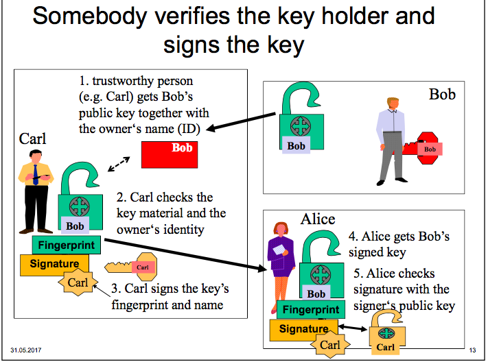

Wichtig: Carl signiert den Fingerprint (Hash) des Zertifikates.

## Zertifikate

Ein Zertifikat ist ein mit Zusatzinformationen versehener, öffentlicher Schlüssel.

# TLS/SSL

TLS verschlüsselt und verifiziert die Daten anhand eines verhandelten Keys^' '

https://www.youtube.com/watch?v=cuR05y_2Gxc

## Perfect Forward Secrecy

Mit Perfect Forward Secrecy kann der Sitzungsschlüssel nicht im Nachhinein entschlüsselt werden, auch wenn der Private Key des Servers bekannt wird.x

Perfect Forward Secrecy benötigt aber Diffie-Hellman als Key Exchange, nicht mehr RSA.

https://www.youtube.com/watch?v=IkM3R-KDu44

## HTTP Strict Transport Layer (HSTS)

Header: `Strict-Transport-Security: max-age=31536000`. Es sagt folgendes aus:

* alle Requests zu diesem Origin gehen über HTTPS
* Alle unsicheren Links und Client Requests sollen zu HTTPS konvertiert werden
* Bei einem Zertifikatsfehler soll eine Fehlermeldung angezeigt werden und der Benutzer darf die Warnung nicht umgehen

## Public Key Pinning

Clients enthalten bekannte Public Keys für bestimmte Domänen. Wenn ein anderer Public Key angeboten wird, auch wenn dieser von einer CA validiert ist, wird er abgelehnt (und häufig gemeldet).

Es ist auch möglich, Zertifikate zu pinnen die nicht mitgeliefert sind. Hier wird einfach beim ersten Mal gesagt, welche Keys gepinnt werden sollen, das Risiko liegt dann darin dass bei diesem ersten Versuch bereits ein falsches Zertifikat verwendet wurde.

## OCSP Stapling

Der Server hängt die Antwort der CA direkt an (ganz kurz erklärt in der Vorlesung...)

# Identity und Access Management (IAM)

* Identification
  * who you claim to be
* Authentication
  * verify that you are who you claim to be
* Authorization
  * what you're allowed to do
* Accounting
  * charge for what you do

## Biometric

Secure: nur Iris und Venen

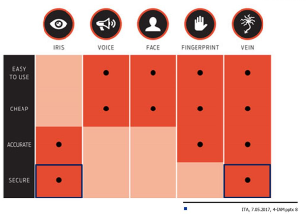

## Cryptographic Password Strength in Bits

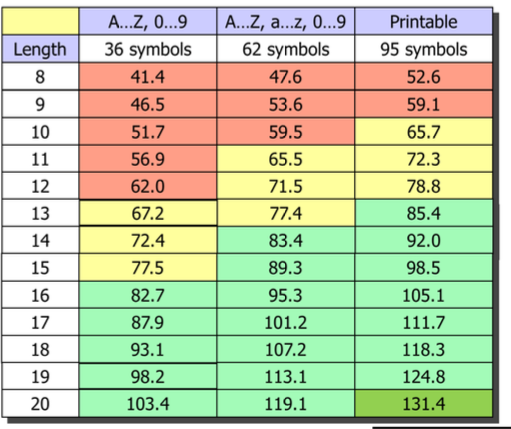

## Kerberos

Der KDC hat die Master Keys von allen Principals.

# Disk Encryption

Motivation: Laptops werden gerne gestohlen.

* The data on the disk should remain confidential
* Data retrieval and storage should both be fast operations, no matter where on the disk the data is stored
* The encryption method should not waste disk space => the amount of storage used for encrypted data should not be significantly larger than the size of plaintext

Man nimmt an, dass ein Angreifer

* Can read the raw contents of the disk at any time
* Can request the disk to encrypt and store arbitrary files of their choosing
* Can modify unused sectors on the disk and then request their decryption

(übersprungen: S. 42-58)

# Secure Email

Ursprünglich gibt es MIME. Mit MIME kann man auch binäre Daten in Textform austauschen. Die Idee ist, dass man sogenannte MIME-Header verwendet, mit denen man angibt von welchem Typ diese Daten sind - ähnlich wie Dateinamenendungen, oder Magic Numbers.

Dieser MIME-Header wird im Header `Content-Type` verwendet. Ein Multipart-MIME-Email (z.B. Text und eine PowerPoint-Präsentation) fängt mit dem Header:

```
Content-Type: multipart/mixed; 
	boundary=boundary1
```

an. Hier ist der String `boundary=` wichtig zu verstehen. Er gibt an, was der Boundary (Begrenzer) im folgenden E-Mail ist, zwischen den einzelnen Teilen. Er folgt immer am Anfang und am Ende eines Teils, wie ein Zaunpfosten wenn die Teile der Zaun sind.

Wichtig zu verstehen hier ist, dass dies verschachtelt sein kann. Innerhalb eines Boundary kann nochmal derselbe Header auftauchen, hier muss dann natürlich ein anderer Boundary verwendet werden (Outlook generiert dafür zufällige).

S-MIME ist nun einfach ein weiterer Part. Wichtig ist hier, dass der Top-Header anders sein muss, z.B.:

```
Content-Type: multipart/signed;
	protocol="application/pkcs7-signature";
	micalg=sha1; boundary=boundary1
```

(Ich nehme an dass die Whitespaces hier vorallem für die Präsentation so gemacht wurden, da gibt es bestimmt bessere Standards)

Danach folgt die Nachricht, evtl. mit weiteren Attachments dran. Wenn eine Nachricht mit weiteren Parts signiert werden soll, so muss diese Nachricht mit den Parts rekursiv (verschachtelt) definiert werden (als multipart/mixed), und schlussendlich mit dem Top Level Boundary abgeschlossen werden.

Schlussendlich folgt nach dem Body-Part die Signatur, mit folgendem Header:

```
Content-Type: application/pkcs7-signature; name=smime.p7s
Content-Transfer-Encoding: base64
Content-Disposition: attachment; filename=smime.p7s
```

Es gibt noch ein weiteres Format, das Outlook in der Standardeinstellung benutzt, bei dem der Content-Type `application/pkcs7-mime` ist. Hier wird direkt der Plaintext mit der Signatur zusammengepackt. Der Vorteil ist hier, dass durch die direkte Codierung in base64 keine Umcodierung im Nachrichtenteil mehr auftauchen kann und die Signatur somit stimmt; Nachteil ist dass man die Nachricht nicht mehr lesen kann ohne S/MIME zu unterstützen. Im ersten Fall ist das noch möglich, man kann dann nur die Signatur nicht überprüfen.

Dieses Format wird dann aber für die Verschlüsselung verwendet, wo man diesen Nachteil als Vorteil sieht. 

# Spam

## SPF (Sender Policy Framework)

SPF-Records sind TXT-Records im DNS. Ein Mail-Server fragt den Server im MAIL FROM ab. Ein SPF-Record gibt an, welche Server für diese Domäne E-Mais senden dürfen.

## DKIM (Domain Keys Identified Mail)

Der sendende Mail-Server signiert die E-Mail, der empfangende Server holt sich den Public Key vom DNS und prüft dies.