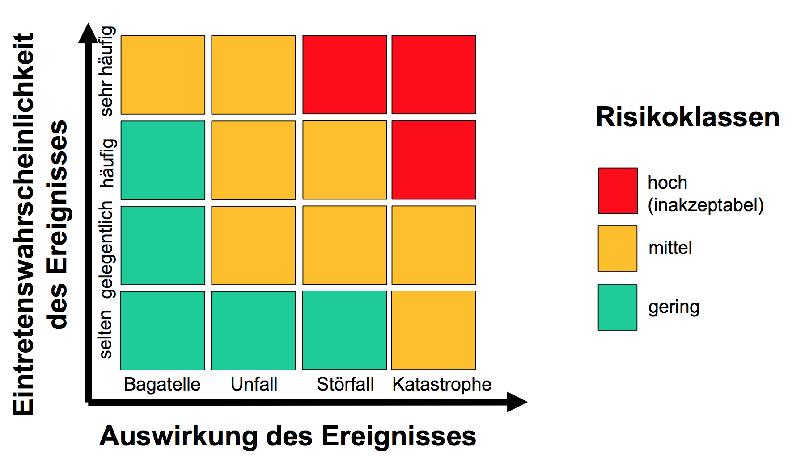

# Information Security Management

## Datensicherheit und Datenschutz

Datensicherheit wahrt die Vertraulichkeit (confidentiality), Echtheit (integrity) und Verfügbarkeit (availability). Zusätzlich involviert können Authentizität, Verantwortlichkeit, Nicht-Abstreitbarkeit und Zuverlässigkeit sein

Datenschutz schützt Personen vor dem Missbrauch ihrer personenbezogenen Daten.

## Informationssicherheitsmodell: CIA

**C**onfidentiality, **I**ntegrity, **A**uthenticity

## Informationssicherheitsmanagement

Management der Prozesse zur Aufrechterhaltung der Vertraulichkeit, Echtheit und Verfügbarkeit von Informationen. Schutz durch organisatorische, technische Massnahmen. In den Bereichen Infrastruktur, Prozesse, Personen.

## Wert (Asset)

Alles was für die Organisation von Wert ist. Arten:

* Informationen (Wissen oder Daten)
* Software (z.B. Computerprogramme)
* materielle Werte, z.B. Computer
* Dienstleistungen
* Menschen und ihre Qualifikationen, Fähigkeiten und Erfahrung
* immaterielle Werte, z.B. Reputation und Image

## Ziele/Wertvorstellungen

* Firmenziele: Rendite, längerfristiges Fortbestehen
* Persönliche Ziele: Jobsicherheit, Karriere, Selbstverwirklichung, eigenes Haus, Kinder
* Politiker-Ziele: Wiederwahl
* Zeithorizont der Zielerreichung: Quartal, Jahr, Amtsdauer, mehr als 5 Jahre

## Bedrohung (Threat)

Bedrohung ist der mögliche "Grund" für einen ungewollten Vorfall, der das System oder die Organisation schädigen kann.

## Kontrolle, Massnahme (Control)

Eine Schutz-/Gegenmassnahme (Kontrolle) ist ein Mittel zur Risikohandhabung. Inbegriffen sind Policies, Prozeduren, Richtilinien, Praktiken oder organisatorische Strukturen, welche administrativen, technischen, rechtlichen oder Management-Charakter haben können.

## Schwachstelle (Vulnerability)

Eine Schwachstelle bezeichnet die Schwäche einer Schutzmassnahme die durch eine oder mehrere Bedorhungen ausgenutzt werden kann.

## Gefährdung (Hazard, Applied Threat) = Bedrohung + Schwachstelle

# Risikomanagement

Risikoidentifikation (Ereignisliste) $\rightarrow$ Risikobewertung (Risikomatrix) $\rightarrow$ Risikobewältigung (Massnahmen)

## Risiko

Kombination aus der Wahrscheinlichkeit eines Reignisses (Vorfalls) und dessen Auswirkungen

Risiko = Wahrscheinlichkeit eines Zwischenfalls * Schaden = Bedrohung * Verletzlichkeit * Schaden

## Risikoidentifikation mittels Risikotabelle, Ereignis-Gefahrenliste

Beispiel: Gefahrenliste bei einer Treuhandfirma (ohne Spalten Nr., Verantwortlich, Termin)

| Gefahrengebiet                           | Risikobeschrieb                          | Eintretenswahrscheinlichkeit | Schadenpotenzial  | Massnahmen                               |
| ---------------------------------------- | ---------------------------------------- | ---------------------------- | ----------------- | ---------------------------------------- |
| Strategische Bedrohung, Laufende Geschäftstätigkeit | Abhängig von wenigen Kunden, Verlust von Kunden führt zu Entlassungen | möglich                      | existenzbedrohend | Vergrösserung des Kundenstamms durch Fokussierung auf eine weitere Branche, Ausarbeiten Marketingplan |
| Management und Mitarneiter, Verhalten    | Veruntrueung durch einen Mitarbeiter/Imageverlust | sehr selten                  | existenzbedrohend | Überprüfung Unterschriftsberechtigung, Freigabeprozess, Überwachungsprozess |
| Management und Mitarbeiter, unlautere, ungetreue Geschäftspraktiken | Ungenaue (lasch, oberflählich, unseriös) Umsetzung von Geschäftsstandards | unwahrscheinlich             | existezbedrohend  | Funktionsaudits durch Vorgesetzten, Kundenbefragung, Aus- und Weiterbildung |
| Operative Bedrohung, Gefahren für Produktionsanlagen | Überschwemmung Büroräumlichkeiten        | sehr selten                  | existenzbedrohend | Neuer EDV-Raum im 1. Stock des Gebäudes, prüfen Standortverlegung |
| Fnanzielle Bedrohung, Liquidität und Zahlungsausfall | Überschreiten der Kreditlimite, Belastung hoher Zinsen durch die Bank | häufig                       | spürbar           | Prozess für das Mahnwesen erbessern, Liquiditätsplanung verbessern |

## Risikobewertung (Risikomatrix)

