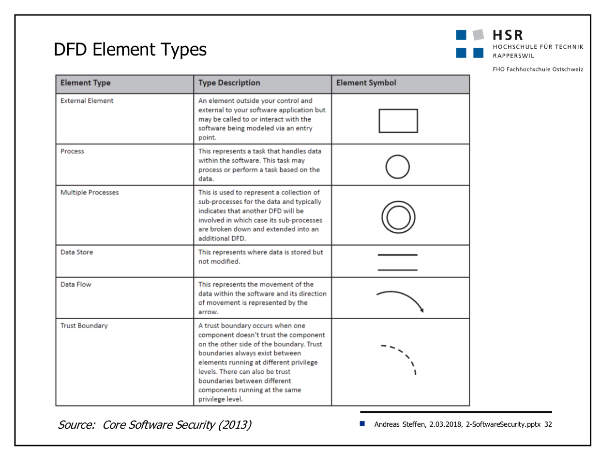

# InfSi 3

# Meline

Session-Cookie: wenn kein Expires oder Max-Age gesetzt wird ist es ein Session Cookie. Wird beim Browser beenden gelöscht.

Nach einem erfolgreichen Login kein 200 OK, sondern ein Redirect + neues Session Cookie. Mit 200 muss der Browser die Anfrage im Memory behalten, damit er sie erneut schicken könnte. Mit 302 passiert das nicht.

CSP Wildcard verhindert bereits XSS und JS eval().

`default-src 'self' foo.bar.ch; script-src 'self';` Nur Scripts von derselben Domain erlaubt, für andere Inhalte als Skripte: erlaube von derselben Domain plus foo.bar.ch 

# Angriffe

* Session Hijacking: Session-ID von jemand anderem bekommen und dann unter deren ID arbeiten
* Session Fixation: Session eröffnen, und Opfer Session-ID unterschieben. Opfer macht mit der Session-ID weiter, die ich nun weiss.
  * Fix: neue Session bei jedem Login, auch wenn schon eine vorhanden wäre
* Cross Site Scripting (XSS): in vertrauliche Seite unvertraulichen Code einführen.
  * `X-XSS-Protection: 1, mode=block` als Header
  * Reflected XSS: unter bekannter Entität (z.B. "Hallo") ein Dokument abspeichern, dass XSS enthält. Dann Opfer auf diese Seite leiten.
  * DOM Based XSS: XSS nur mit JS
* Time Based (Blind) SQL Injection: anhand  der Zeit welche die Antwort braucht herausfinden, ob der Angriff geglückt ist
* Cross-Site Request Forgery (XSFR): Aktion im Namen vom Nutzer auf einer anderen Seite machen
  * Router-Einstellungen verstellen, indem eine URL injected wird (z.B. Bild), die eine URL enthält die mit den richtigen Credentials Einstellungen vornimmt
  * Fix: CSRF Token
  * hilft aber nicht wenn Seite gegen XSS verwundbar
    * wenn XSS und CSRF Lücken sind, immer erst XSS reparieren

# 01

Ambiguity Analysis: Software von mehreren Spezialisten studieren lassen und ihre Findings diskutieren lassen. Dort wo sie nicht gleicher Meinung sind liegen oft Dinge von Interesse (oder Fehler)

# 05

Cookies

* Immer: `NAME=CONTENT;`
* Danach folgend, mit Semikolon getrennte
* `domain=` zu welcher Domain das Cookie geschickt werden soll. `.hsr.ch` ist als Domain mit Subdomains zu verstehen
  * Weglassen: nur genau zum Host
* `path=` Cookie nur bei diesem Pfad senden
  * Weglassen: nur genau zum "sendenden" Pfad
* `secure` (Flag): nur via HTTPS
* `HttpOnly` nicht via JS verfügbar machen (`document.cookie`)
* `expire` (absolut, dazu `Max-Age` relativ) gibt an, wie lange das Cookie gespeichert werden soll
  * Weglassen: nur im Memory, ist weg wenn der Browser geschlossen wird
* `SameSite=strict|lax`: wenn ich dieses Cookie setze, und jemand fremdes Inhalte von meiner Seite einbaut (IMG, aber auch Links) wird das Cookie nicht zu meinem Server gesendet.
  * `strict` Cookie erst senden, wenn ein User "Top Level Navigation" macht. Das ist z.B. gegeben, wenn ein User in der Adresszeile Enter drückt. **Schickt auch bei einem Link auf meine Seite das Cookie für meine Seite nicht mit**.
  * `lax` ist nicht dasselbe wie ein weggelassenes `SameSite`. Bei `lax` wird etwas mehr zugelassen, aber bei CSRF-anfälligen Dingen wie POST wird das Cookie weiterhin nicht mitgeschickt.

Redirect: wenn man ein Login nur mit 200 OK bestätigt, muss der Browser diesen Request weiterhin cachen. Ein Angreifer kann nun mit der Back-Taste bis zu diesem Request zurück, ihn erneut senden lassen, und er ist eingeloggt.

Mit 302 darf der Browser den originalen Request wieder verwerfen.

PRG-Pattern (Post/Redirect/Get):

Same Origin Followers

* JS
* XHR
* XDomainRequest
* Flash/Java/Silverlight/ActiveX/Browser Extensions/Plugins

JS von 3rd Party darf das Origin-Cookie ansehen, wenn das Skript von der Origin-Seite mit `script src=` geladen wurde. Man verliert mit `script src=` also die Kontrolle.

# 06

`OR 1=1`: meistens checken die Skripts nur, ob vom SQL-Server eine Antwort zurückkommt, aber nicht was genau. Mit diesem Query gibt es immer eine Antwort

`UNION ALL ...`: klebt den vorherigen Query und den Query unter ... zusammen. Müssen die gleichen Spaltenanzahl haben (und Type und Encoding)

Escaping Database Context

* Checken, mit welchem User die Datenbank aufgerufen wird
* PW auslesen (wenn unsalted einfach zu knacken)
* File mit `into outfile` schreiben und aufrufen (z.B: PHP Script)

Blind SQL Injection: rumstochern

Time Based: man erhält bei jeder Anfrage die gleiche Meldung, weiss aber dass einige davon anders ausgehen. Mit BENCHMARK lässt man nun die Anfragen einige Male laufen, und kann daraus lesen, welche länger gingen und welche schneller abbrachen

Abhilfe

* Prepared Statements
* Keine Fehler zeigen
* Salted Hashes (Hash mit Work Factor)
* Second Line of Defence
  * WAF
  * Application Servlet Filter
* DB User
  * Standard-Accounts umbenennen
  * DB-Admin und DB-Account für Webseite trennen

XSS

* Stored: das XSS ist permanent im Server
* Reflected: das XSS wird vom Server konstruiert, der Exploit ist in der URL dabei
* DOM-based: der Server baut eine normale Seite, aber der Client liest Parameter aus der URL und baut sie in den DOM ein. Diese Parameter können auch XSS-Exploits enthalten

XSS Prevention:

* Secure Programming (HTML Entities), Input Valudation, Output Encoding
* CSP benutzen (`script-src 'self'` verbietet grundsätzlich inline-JS und alle externen `<script src=>` würden nicht mehr aufgerufen)
* Browser kann Reflected XSS mittlerweile erkennen und unterbinden
* Wenn es nur um die Cookies geht: `HttpOnly`

# 07

## Insecure Deserialization

alles was vom Client kommt, auch z.B. ein App-Cookie das man binär codiert hat, kann ein Angreifer austauschen. Wenn man nun das Cookie einfach blind deserialisiert, hat man ein Problem.

Noch doofer: PHP-Objekt beim User speichern, das der User dann mitbringt. Dort den User-Namen setzen...

## Mass Assignment

Manche Frameworks erlauben es, z.B. Variablen in der URL einzutragen, die das Framework dann blindlings in den Kontext übernimmt. (z.B. PHP `register_globals`)

Idee: `username` und `password` aus Formular sind direkt übernommen (grundsätzlich gute Idee), aber `isAdmin` auch...

Manche Frameworks erlauben es, zur Remediation, anzugeben welche Parameter man gerne übernehmen möchte (Whitelist) und/oder welche nicht (Blacklist). Wahrscheinlich besser: Explicit Binding

Bessere Idee: InputModel bauen, welches nur die öffentlich verfügbaren Werte beinhaltet.

## Content Security Policy

Kommt als HTTP Response Header (Prio) oder HTML-Tag

Spezialwert `'self'`, ansonsten z.B. Domain `onlinekurse.ch`

* `default-src` gilt als Default für die nicht angegeben (ausser Scripts **angeblich**)
* `script-src` woher dürfen Scripts geladen werden (erlaubt auch Werte wie `'unsafe-inline' 'unsafe-eval'`, die man aber nicht verwenden sollte)
* `connect-src` wohin dürfen meine Scripts verbinden
* `font-src` woher dürfen Fonts geladen werden
* `frame-src` valide Sourcen für Frame/IFrame
* `img-src` Bilder
* `media-src` Audio, Video, Track
* `object-src` für Objekte mit `<object>`, `<embed>`, `<applet>`
* `style-src` für CSS

und weitere

CSP ist wie eine Browser-Firewall!

Defaults

* no inline JS
* no JS URLs (`javascript`)
* Element Event Attributes sind ausgeschaltet (`element.addEventListener()`muss verwendet werden)
* `eval` ausgeschaltet. `setTimeout/setInterval` können nur mit Funktionen aufgerufen werden (als Callback wahrscheinlich, aber verstehe den Sinn nicht ganz)
* `Function()` constructor ausgeschaltet
* `data:` URIs sind nur bei Images erlaubt
* XBL Bindings sind auch irgendwie speziell..

Wenn es mehrere Policies gibt, nimmt der Browser die restriktivste!

CSP kennt auch einen Report-Only Modus (`Content-Security-Policy-Report-Only`). Dort kann man eine `report-uri` angeben.

## CORS

CORS erlaubt, von einer Webseite auf `data.example.org` auf `site.example.com` zuzugreifen, wenn `site.example.com` dies zulässt und z.B. eine API ist.

 CORS relaxed die SOP, indem das Target sagt "es ist ok auf mich zuzugreifen"

### CORS Simple Requests (ohne Preflight)

Browser schickt Anfrage mit `Origin:`. Server antwort mit `Access-Control-Allow-Origin:` und einer Liste von erlaubten Origins (oder `*`)

* Request Method
  * GET
  * HEAD
  * POST
* Request Headers (neben üblichen Browser-Headern)
  * Accept
  * Accept-Language
  * Content-Language
  * Content-Type
* Request `content-type` (bei POST)
  * application/x-www-form-urlencoded
  * multipart/form-data
  * text/plain

### CORS Preflight

1. HTTP Options Request
   1. CORS-Header evaulieren
2. Wenn ok
   1. GET or POST Request
3. Ressourcen verwenden

Wenn

* andere Methoden als die oben genannten
* POST mit Content-Type anders als die oben genannten
* Immer bei POST mit XML-Payload als application/xml oder text/xml
* Custom Headers

Dann wird preflighted

Standardmässig werden keine Credentials (Cookies, Basic Auth) bei XHR-Requests versendet!

* Der Client muss auf dem XHR-Objekt `xhr.withCredentials = true` setzen
* Zudem muss der Server `Access-Control-Allow-Credentials: true` senden

## XSRF

(=CSRF, Session Riding, One Click Attack)

Client trusted Website: der ganze JS-Code wird benötigt, damit die Applikation läuft

Website trusted User: der User macht alle Anfragen willentlich

Eine Third Party Site darf ja das Cookie des E-Bankings nicht auslesen. Aber es kann z.B. ein IMG hinterlegen, das eine URL aufruft, welche dann im Namen des Nutzers eine Transaktion auslöst

Remediation: Token als Hidden-Field beim Erstellen der Website (Nonce), eine Nonce pro Session ist ausreichend

Mit SameSite kann man beim Cookie ausstellen angeben, dass dieses Cookie nicht bei Requests von anderen Seiten geschickt werden soll

Angular hat eingebaut, dass ein Cookie das `XSRF-TOKEN` genannt wird automatisch bei den anderen Requests mitgeschickt wird (Custom Header). Prüfung obliegt aber weiterhin dem Server-Betreiber

# 08

## OWASP Mobile Top 10

### M1 Improper Platform Usage

Dokus nicht gelesen

* Zu viele Permissions
* App Local Storage statt Keychain

Secure Coding/Secure Configuration (least privilege)

### M2 Insecure Data Storage

Data Leakage

* Logs
* Screenshots
* Keyboard Autocomplete
* Clipboard
* Web Data (WebView)
* Inter Process (URL Handlers, aber auch welche App öffnet nun X)

Critical Data nicht loggen, nicht cachen. Wenn absolut nötig, maskieren

Debug Logs in Prod deaktivieren

Auto-Completion deaktiviern

Copy/Paste deaktivieren für kritische Items

`FLAG_SECURE` auf Window um Screenshots zu verhindern. Vor dem App-Backgrounding bei iOS das Window neu zeichnen

Keine kritischen Daten im Backup

### M3 Insecure Communication

Cleartext, weak ciphers, TLS/SSL issues

Auch Bluetooth, NFC, ....

SSL/TLS wo möglich

Gute Zertifikate von Trusted Issuer

Keine sensitive Data über unsichere Kanäle senden

iOS 9 verbietet Server-Zugriffe ohne TLS 1.2 mit PFS, Valid Certificate und SHA-256 und 2048 RSA oder 256 Bit EC Key. Exceptions müssen definiert werden

Zertifikats-Pinning ist eine Lösung. Aber auf Renewal aufpassen!

Android 7.0 hat Zertifikats-Pinning eingebaut (XML)

### M4 Insecure Authentication

Authentication auch auf Server-Seite prüfen. Zu diesem Thema gehören auch Session-IDs, die man erraten kann usw.

### M5 Insufficient Cryptography

Weak Ciphers, self-made crypto

Insufficient key-length, hardcoded keys/unsecure place

Sensitive Data sollte nicht gespeichert werden, wenn es irgendwie anders geht

KeyChain nutzen!

### M6 Insecure Authorization

Insecure Direct Object Reference, Hidden Endpoints

Don't trust the mobile client!

### M7 Client Code Quality

Buffer Overflow, ..., aber auch XSS

### M8 Code Tampering

APK anpassen, wieder hochladen

Jailbreak

Third Party Stores

ObjC: Funktionsaufrufe gehen über Messaging. Man kann aber (auch zur Laufzeit) diese Message abfangen. Bei Swift ist das nicht so ABER wenn eine der Klassen Obj-C ist, ist es das alte Verhalten

JB abfragen (nicht perfekt!). Code prüfen

### M9 Reverse Engineering

Android: ProGuard

Auch Anti Debug-Mechanismen

### M10 Extraneous Functionality

Backdoors, ...

# 09

## Web Application Firewall/Reverse Proxy

PCI-DSS verlangt WAF

Bei Verbindung zum Backend-Server den Request "anreichern" mit Properties, die der Client fälschen könnte

Forensic Readiness: jeden Request durch alle Tiers mit einer ID belegen

Content Rewriting ist tricky. Relative URLs kein Problem, absolute URLs müssen umgeschrieben werden. Cookie Domain muss umgeschrieben werden. Manche Cookie-Werte müssen umgeschrieben werden

Request Filtering: z.B. SQL Injection

Response Filtering: z.B. Stack Traces

Files inspizieren: z.B. PDF Exploits

URL Encryption: hilft gegen Forceful Browsing

> Pre-Authentication reduces the attack surface of unauthenticated users
>
> Unique-ID enables forensic readiness 
>
> Cookie store hides insecure cookies from backend application 
>
> Service ACL is a second line of defence for the application authorization scheme 

mod_security:

## Response Splitting

Der Server muss im Header 1 CRLF schicken, + Content den der Attacker kontrolliert. Wenn man 2 CRLF schickt, ist man bereits im Body.

Sehr beliebt als Header: Cookie. Der Server könnte den Request in seine Set-Cookie Zeile einpflegen. Wenn man nun den Request kontrolliert, kann man beliebig Daten hinterlegen.

Header sind auch Output-Daten, die vom Attacker kontrolliert werden, wenn sie von Input-Daten abstammen!

Cache Poisoning: kaputte Webseite im Cache hinterlegen. Mit Last-Modified (Header) bleibt es im Cache.

## QUIC

HTTP2 setzt auf TLS 1.2 und TCP auf. HTTP2 über QUIC setzt direkt auf UDP auf

## Handnotizen

Auch möglich: mit Response Splitting eine Response zu generieren, die wie zwei Responses aussieht. Der Proxy könnte diese ja evtl. cachen

# 10

## Server Security

Exploit nach 6 Tagen, Patch nach 54 Tagen

Create a hacker unfriendly place

Expect the attacker

Disable direct Internet (anti covert channel)

Remove useful tools (nc, gcc, ...)

## SSL-TLS

`SSLHonorCipherOrder` Server Cipher Suite hat Priorität vor Client Cipher Suite (der Client könnte niedrigeres verlangen, oder sogar dazu gezwungen werden)

# 11

## Fraud Detection

Kommt der User z.B. aus einmal von einem anderen Land? Oder ist er einmal in der Schweiz und einmal in einem anderen Land gleichzeitig eingeloggt, oder kurz nacheinander?

Man vergleicht Unregelmässigkeiten, das Ganze ist mehr oder minder Statistik. Wenn etwas komisch ist, benötigt man einen weiteren Faktor (z.B. SMS) oder bricht die Transaktion ab und meldet sich beim Kunden.

Client Correlator-Software kann z.B. auch herausfinden, welche Java-Version und welchen Browser man installiert hat (etc.). Je mehr Daten man über den Client hat, desto eher erkennt man, wenn er wechselt.

## JSON Hijacking

Mit JSONP

Attacker überschreibt jetzt einfach `mycbm`

Mit `while(1)` am Anfang in der JSON-Antwort würde ein JSON im `<script>`-Tag einfach eine Endlosschleife verursachen. Wenn wir das JSON aber mit normalem JS laden, ignorieren wir diesen Teil 

Problem Top-Level Array in JSON: Man kann den Array-Konstruktor überschreiben und damit das JSON irgendwohin exportieren

# 12

Basic Auth

1. Send GET
2. Receive 401
3. Send again with Authorization Header

Digest Auth ist ähnlich. Es wird aber nicht das tatsächliche Passwort geschickt. Der Server sendet eine Challenge, der Client verändert sie mithilfe des Passworts und schickt die Response, und der Server kann die Response prüfen.

User Emumeration: Password incorrect, User unknown Unterscheidung: man weiss jetzt, welchen Teil man richtig hat. Besser: "Username or Password incorrect"

Brute-Force Erkennung auch, wenn 1 IP mehrere Usernamen ausprobiert (die meisten Brute Force-Erkennungen laufen darauf, dass 1 Benutzername mit X Passwörtern ausprobiert wird)

Session Handling Recommendations:

## XPath

XPath ist eine Query-Technologie für XML. Die Attacken laufen ähnlich wie bei einer SQL Injection ab.