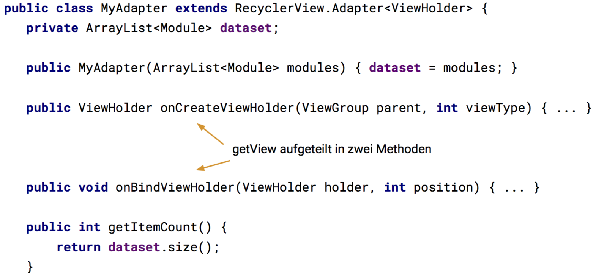

# Einführung und Konzepte

Linux, primär Java 7

App-Komponenten

* Activies (~ Screens)
* Services
* Content Provider
* Broadcast Receivers

System hat feste Kontrollen über App

* Verwaltung des Lebenszyklus
* Kommunikation zwischen Komponenten
* Apps werden automatisch geschlossen um Speicher zu sparen

Komponten anderer Apps können aufgerufen werden, sowie Systemkomponenten ersetzt werden (andere Kamera oder Browser-App)

Activity: hier passieren User-Eingaben. = GUI + Code

Grundgerüst:

```java
public class MainActivity extends Activity {
  @Override
  protected void onCreate(Bundle savedInstanceState) {
    super.onCreate(savedInstanceState);
    // Hier unser Code
  }
}
```

> Kein `main` oder `new MainActivity`, dies wird vom System instanziert

### Lifecycle

Das System ruft bei Zustandswechseln die jeweilige Methode der Activity-Klasse auf. Der Entwickler überschreibt Callback-Methoden, die ihn interessieren.


> Unterschied Paused/Resume: wird die Activity von einer anderen überdeckt (z.B. Notificationleiste heruntergezogen), wird die erste pausiert (`onPause`). Kommt sie wieder in den Vordergrund, wird wieder `onResume` aufgerufen.

Stopped/Started: kommt die Activity wieder in den Vordergrund, weil der User die Applikation nochmal startet oder mit dem Back-Button zurückkommt, wird `onRestart` aufgerufen

Destroyed: die App wird vom System destroyed, oder wenn sie explizit vom User geschlossen wird

> Dies kann auch direkt aus dem `onPaused`-Zustand geschehen (roter Shortcut)

Braucht Android den Speicher wieder, wird die Applikation gekillt. Kann aus

* `onPause`
* `onStop`
* `onDestroy`

geschehen

Tipp: Daten in `onPause` sichern, da man nicht sicherstellen kann dass die anderen beiden aufgerufen werden

> Bei Konfigurationsänderungen (Screengrösse/Ausrichtung) wird die Activity auch neu gestartet

### Best Practices

* GUI beim Start in `onCreate` erstellen
* Auf Benutzereingaben in `onResume` reagieren
* Daten in `onPause` sichern
* Ressourcen in `onStop` freigeben

### Lifecycle komplett

> Nur `onPause` ist garantiert, alles andere nicht


## Activity Stack

Activities werden in einem Stack verwaltet.

> Activies eines Stacks können zu verschiedenen Apps gehören


## Tasks

Eine Gruppe von Activities nennt man auch Task

Task lassen sich über den Overview-Screen anzeigen

Activities vs. Task: Browser-Analogie

* Browser: Tabs mit je eigener History beliebiger Seiten
* Android: Tasks mit je eigenem Stack von Activities

## Launch Modes

Android verwaltet Tasks und Activities für uns

Default

* Start der App von Launcher oder Homescreen startet neuen Task
* Back geht zum vorherigen Screen zurück (pop)

Kann geändert werden, aber nur wenn wirklich nötig (Game). Launch-Modes können dieses Verhalten ändern

Buchstaben stehen für Activities, Farben sind Tasks

 

## Activities/Tasks aus Systemsicht

Activities und Ressourcen werden in ein APK gepackt und installiert

Wird eine Activity aktiv, wird pro APK ein Linux-Prozess mit einem Thread gestartet

Dieser Prozess führt alle Activities, die in diesem APK enthalten sind, aus

> Jedes APK wird unter einem eigenen Linux-User installiert


APK sind JARs mit der Erweiterung `.apk`, die wiederum ZIP-Dateien sind.

Inhalt: Libraries, Ressourcen, Assets, Metadaten, kompilierte Klassen im DEX-Format

## Intents

Intent beschreibt, was gemacht werden soll

* expliziter Aufruf einer Klasse
  `new Intent(this, CalculateActivity.class)`
* impliziter Aufruf der passenden Komponente
  `new Intent(MediaStore.ACTION_IMAGE_CAPTURE)`
  * System entscheidet, wer zuständig ist
  * ermöglicht lose Kopplung und Austauschbarkeit
* Typischerweise eigene Klassen explizit aufrufen, Systemaktionen implizit auslösen (Bild erstellen, E-Mail senden)
* Apps können Activites zur Verfügung stellen die bestehende Applikationen ersetzen (z.B. Kamera)

### Parameterübergabe

Intent-Klasse kennt `setData`-Methode, welche URI entgegennimmt

* Ziel der ausszuführenden Aktion
* Datei, URL, Kontakt, ...

Zusätzliche Parameter an Activity übergeben: `intent.putExtra(MediaStore.EXTRA_OUTPUT, imageCaptureUri)`

* Key-Value-Paare mit weiteren Daten
* Nur für primitivate Daten, Strings, und alles was serialisierbar ist.

### Activities starten

* Kontrolle übergeben: `startActivity(intent);`

* Rückgabewert erhalten

* ```java
  startActivityForResult(intent, SOME_ID);

  // Callback
  @Override
  protected void onActivityResult(int request, int result, Intent data) {
    if (result == Activity.RESULT_OK && request == SOME_ID) {
      // Verarbeitung
    }
  }
  ```

### Weiteres

* Services starten
  * Hintergrundprozesse ohne UI
* Broadcasts versenden
  * an alle interessierten Apps im System versendet
  * z.B. Batterie leer oder geladen

## View

GUI: alles was der Benutzer sieht und mit dem er interagiert

Deklarativ in XML oder imperativ in Java-Code

Komponenten hierarchisch

* ViewGroup enthält andere Komponenten
* ViewGroup bestimmt das Layout der Kinder
* View ist die Oberklasse aller GUI-Elemente


### Beispiel


Buttons sind Views. Das Layout drumherum ist eine ViewGroup, aber auch wiederum eine View (Vererbung)

## Manifest

* Komponenten der App
* Metadaten (Name, Icon, Versionsnummer)
* Permissions
* Anforderungen an Geräte-API
* Alle Activities der App

Versionen

* `minSdkVersion` gibt an, welche Version das Gerät mindestens haben muss
* `targetSdkVersion` ist die höchste Version, mit der getestet wurde

Android Studio verwaltet einige Informationen im Gradle-File und baut erst beim Build das reale Manifest.

## Application

Parent unserer Activities im Manifest ist die Application

Ist auch eine Klasse, die den globalen Zustand unserer App hält

Kann durch eigene Application-Subklasser ersetzt werden

Zugriff aus Activity mit `getApplication`, Lifecycle-Methoden: `onCreate`, `onLowMemory`, `onConfigurationChanged`

## Grundlagen der GUI-Programmierung

Android View

* belegt rechteckigen Bereich auf Screen
* ist zuständig, dessen Inhalt zu zeichnen
* ist zuständig, Events zu behandeln

Untergruppen sind Widgets (nicht Homescreen-Widgets) und ViewGroups. Das SDK enthält auch vordefinierte, komplexere Elemente.

Widget = fixfertige Komponenten. Buttons, Images, Checkboxen. 

ViewGroup = Unterklasse von View. ViewGroup ~= Layout

## Layout

Für alle gemeinsam sind die `width` und `height`-Parameter. Zulässige Werte für `android:layout_width=`/`height` sind

* `match_parent`:  so gross wie möglich, also der Parent erlaubt
* `wrap_content`: so klein wie möglich, also die Kinder erlauben
* absolute Werte, aber selten empfehlenswert

## Linear Layout

Elemente werden vertikal oder horizontal angeordnet.

Standardmässig gleich viel Platz, aber selten sinnvoll. Daher kann man mit `android:layout_weight` ein Gewicht vergeben. Kinder ohne Weight bekommen minimalen Platz (Vermutung: `wrap_content`), der restliche Platz wird nach Gewicht aufgeteilt


## Relative Layout

Die Kinder werden relativ zueinander angeordnet. Also beispielsweise `android:layout_below="@id/first"`, und `android:layout_toStartOf="@id/first"`. 

Daneben gibt es noch `toRightOf` usw, aber wenn man nicht explizit rechts sondern das Ende meint, nutzt man besser die normalen Werte, dann geht RTL korrekt.

## Weitere

* Framelayout kann Kinder übereinander anordnen
  * Live-Kamerabild mit Auslöser und Hilfslinien
  * Kartenansicht mit Zoom-Buttons
* FlexboxLayout: CSS Flexbox
* ConstraintLayout, mit RelativeLayout verwandt (war in Android Studio immer Standard ab irgendeiner Version)
* WebView um HTML anzuzeigen
  * JavaScript kann aktiviert werden, und Java-Objekte können mit JS angesprochen werden

## Layout und Activity

mit `setContentView(R.layout.activity_main)` setzt man das Layout für die aktuelle Activity.

## Eingabefelder

Mit `inputType` gibt man die erwartete Eingabeform an, z.B. Telefonnummern, Nummern, oder auch E-Mailadressen usw. 

> Diese können auch kombiniert werden: `textCapSentences|textAutoCorrect`

## Eigene Views

Es können auch eigene Views eingebunden werden. Dazu nimmt man als Tag einfach den Klassenamen.

## ID/`R`

Mit `@id/bla` referenziert man das Element mit dieser ID. Damit es das überhaupt gibt, wird es mit `android:id="@+id/bla"` erstellt.

Das Android-Buildsystem sammelt alle diese IDs als Konstanten in der automatisch generierten Klasse `R`.  So können wir auf die in XML deklarierten Elemente zugreifen.

Ebenso liegen Ressourcen in `R`. Die Ordnernamen müssen in Java-Namen umgewandelt werden können, dürfen also z.B. kein `-` enthalten.

Weitere Ressourcentypen

* drawables
* menu
* mipmap - Launcher-Icon der App
* values - Strings und andere Konstanten

## Values Ressourcen

Beispielweise Strings, Farben und Dimensionen

Dimensionen aus `dimens.xml`:

```xml
<RelativeLayout
	android:paddingLeft="@dimen/activity_horizontal_margin"
/>

<!-- dimens.xml -->
<resources>
	<dimen name="activity_horizontal_margin">16dp</dimen>
</resources>
```

## Dimensionen

In density-independent pixels: `dp` oder `dip`


Bei Schriften verwendet man scale-independent Pixels `sp`

## Ressourcen-Varianten

Die Auslagerung in XML-Dateien dient auch dazu, dass die Definitionen in untetrschiedlichen Varianten hinterlegt werden können. Also Bilder in verschiedenen Auflösungen, Texte in verschiedenen Sprachen usw.

Android Studio hat dazu einen Wizard.

## Events

Sobald die Lifecycle-Methoden aufgerufen wurden, hat unsere App keine aktive Kontrolle mehr. Das Android-Framework hat einen Event-Loop (Looper). Dieser wartet bis ein Ereignis passiert und bearbeitet dieses dann.

Nur der Main-Thread darf das GUI verändern.

Auslöser

* durch Benutzer (Touch-Geste, Hardwaretaste)
* Sensoren (GPS meldet neue Location)

Um die Events zu empfangen müssen wir Listener beim entsprechenden Objekt registrieren.

Für die unterschiedlichen Typen gibt es unterschiedliche Listener, zum Beispiel:

* OnTouchListener für Touch-Events wie Gesten
* OnClickListener wenn eine View "angeklickt" wird
* OnLongClickListener touch-and-hold
* OnKeyListener Tasten

Für bestimmte Widgets gibt es noch spezialisierte Interfaces, wie z.B. den `TextWatcher` für Eingabefelder.

## GUI-Objekt finden

(mit Kotlin geht das in manchen Fällen automatisch, aber auch nicht immer zuverlässig...)

```java
Button button = (Button) findViewById(R.id.button)
```

`findViewById` der Activity sucht im aktuellen Layout (wahrscheinlich dasjenige von `setContentView`). Rückgabe ist immer die Oberklasse `View`,  das Resultat muss also noch gecastet werden.

## Listener registriern

```java
button.setOnClickListener(new View.OnClickListener() {
  @Override
  public void onClick(View v) {
   // ... 
  }
});
```

Alternativ dazu kann auch die Activity das Interface implementieren (`setOnClickListener(this`))

Sie können auch im XML deklariert werden. Das eignet sich dann, wenn die Activity sonst nicht viel macht, ansonsten ist es schöner in einer eigenen Klasse

`android:onClick="onButtonClicked"`

die Activity muss dann

`public void onButtonClicked(View view)`

implementieren. Mittels Reflection wird diese Methode dann gefunden.

Ein Listener lässt sich auch bei mehreren Views registrieren. Mit dem übergebenen View-Parameter kann man unterscheiden (Referenz-Vergleich `==`) welches Element den Event ausgelöst hat.

## Texteingabe-Events

Das `TextWatcher`-Interface implementiert 3 Methoden

* `beforeTextChanged` wird aufgerufen bevor der Text geändert wird, wir sehen also noch den alten Text
* `onTextChanged` wird aufgerufen, sobald der Text geändert hat (meistens interessiert uns nur diese Methode)
* `afterTextChanged` nachdem der Texte geändert wurde, hier haben wir noch die Chance den Text anzupassen (Achtung vor Endlosschleife)

## Inputvalidierung

EditTexts bieten eine einfache Möglichkeit, Inputvalidierung anzuzeigen. Mit `setError` kann eine Nachricht gesetzt werden, diese wird bei jeder Änderung resettet.

```java
final EditText password = findViewById(R.id.password);
password.addTextChangedListener(new TextWatcher() {
   @Override
   public void afterTextChanged(Editable s) {
       String pw = s.toString();
       if (pw.length() < 8) {
           password.setError("Passwort muss mindestens 8 Zeichen lang sein.");
       }
   }
});

```

# Strukturierung und Navigation

Zurück

* zum hierarchischen Parent: Ancestral Navigation
* zum vorherigen Element: Temporal Navigation

Ancestral-Navigation geschieht über den Up- oder Home-Button

Temporal Navigation über den Back-Button

### Screen-Map Vorgehen

1. Domainmodell entwerfen
2. Screens ableiten
3. Screens in Beziehung bringen und gruppieren (Handy Master-Detail, Tablet 1 Screen)
4. Navigation zwischen den Screens festlegen
5. Wireframe/Storyboard für die Gesamtübersicht erstellen
6. Usability-Test mit einem Paper-Prototypen des Wireframes (HCID)

## Fragments

Wiederverwendbare Teil-Activities

Fragment kann in mehreren Activities eingebunden werden

Activity kann mehrere Fragments beinhalten

Eigener Lebenszyklus! (es rastet uus)


Zusätzliche Zustände

* onAttach: Fragment wird einer Activity hinzugefügt
* onCreateView: UI des Fragments erstellen
* onActivityCreated: wenn Activity onCreate fertig ist
* onDestroyView: Gegenstück zu onCreateView
* onDetach: Gegenstück zu onAttach

## Fragment instanzieren

`LayoutInflater` nimmt XML und instanziert die View-Klassen

`ViewGroup container` ist Layout in der Parent-Activity


Fragments können statisch oder dynamisch in die Activity eingebunden werden.

Statisch:

```xml
<LinearLayout>
	<fragment 
     android:name="com.example.myfragmentapplication.MainActivityFragment"
     tools:layout="@layout/fragment_main" />
</LinearLayout>
```

In der Activity dann wie gewohnt das äussere Layout setzen.

Dynamisch:

```xml
<LinearLayout>
	<FrameLayout android:id="@+id/fragment_container"/>
  	<!-- Frame Layout hat sich so eingebürgert -->
</LinearLayout>
```

```java
public class MainActivity extends Activity {
  @Override
  protected void onCreate(Bundle savedInstanceState) {
    super.onCreate(savedInstanceState);
    setContentView(R.layout.activity_main);
    
    FragmentManager fragmentManager = getFragmentManager();
    FragmentTransaction fragmentTransaction = fragmentManager.beginTransation();
    
    MainActivityFragment fragment = new MainActivityFragment();
    fragmentTransaction.add(R.id.fragment_container, fragment);
    fragmentTransaction.commit();
  }
}
```

## Activity <==> Fragment-Kommunikation

Activity bei `onAttach` in Field speichern. Die Fragments sind wiederverwendbare Komponenten und sollten keine Abhängigkeit auf Activity haben. Daher Best Practice: Callback-Interface für Fragment => Activity-Kommunikation


## Master-Detail

Um das sauber zu unterscheiden, baut man zwei Einstiegs-Activities. Eine Default (enthält nur Master, für Phone) und eine grösser 600dp, also `sw600dp`, die Master und Detail enthält. Ferner baut man die beiden Fragments, und schlussendlich noch eine Detail-Activity fürs Phone.

Dann hat sich als Best Practice eingebürgert:

1. `boolean twoPane` zum Merken, ob wir im Tablet-Modus sind
2. Wenn `findViewById(R.id.item_detail_container) != null`, `twoPane = true`.

Dann in einem Callback, das von der Masterliste aufgerufen wird, checken in welchem Modus man sich befindet, und entweder eine Activity starten oder das Fragment austauschen.

## Verschachtelung

Ab Android 4.2, API-Level 17, können Fragments verschachtelt werden. Dann muss man mit dem `getChildFragmentManager` gearbeitet werden, z.B. beim ViewPager.

## Support Library

Fragments sind erst später hinzugekommen, daher braucht man für ältere APIs die Support-Library. Man muss aber alles mit oder ohne Support-Library machen, die Java-Typen sind unterschiedlich.

## Menüs

In `onCreateOptionsMenu(Menu menu)` erstellen (oder in XML bauen und mit `getMenuInflater().inflate(R.menu.menu_main, menu)` verlinken), dann in `onOptionsItemSelected(MenuItem item)` behandeln. Die Erkennung funktioniert dort über Konstanten, oder über die ID.

> `true` bedeutet behandelt

Von Fragments aus können auch Menü-Optionen hinzugefügt werden. Dazu gibt es auch dort `onCreateOptionsMenu(Menu menu, MenuInflater inflater)`, dort wird der Inflater also bereits mitgegeben.

>  In `onCreate` muss unbedingt `setHasOptionsMenu(true)` gesetzt werden, sonst wird wahrscheinlich das Callback nie aufgerufen

## Action Bar

Welche Actions in der Action-Bar angezeigt werden, hängt vom

*  verfügbaren Platz ab
* der Menü-Konfiguration ab (`showAsAction`)
* Dazu gibt es sogenannte ActionViews, wie z.B. ein Plus-Button der expandiert

## Split Action Bar / Tabs

Je nach Gerät und Theme können die Buttons auch unten angehängt werden. Es gibt auch eine Tab-Bar.

> Die Action-Bar ist seit Android 5 deprecated.

## Toolbar

Seit Lollipop gibt es die neue ToolBar, die auch einen ActionBar-Modus hat um z.B. das Options-Menü nachzubauen.

Zum Verwenden, im onCreate:

```java
Toolbar toolbar = (Toolbar) findViewById(R.id.toolbar);
setSupportActionBar(toolbar);
```

## Navigation Drawer

Platzsparend, aber der Hamburger wird auch kritisch gesehen


### Implementierung


In der Activity kann dann ein Listener registriert werden, welcher auf die Menüpunkte des Drawers reagiert


## Bottom Navigation View

3-5 Elemente, von iOS bekannt

## Support Library

NavigationView ist nicht Teil von Android, aber über die Design Support Library erhältlich.

## Toasts

kleine Feedback-Nachrichten. Länge `LENGTH_SHORT` oder `LENGTH_LONG`, und Position mit `setGravity` (kombinierbar mit `|`).

## Snackbar

Löst den Toast ab. Flexibler, da auch eine Action angegeben werden kann.


## Settings

Wird in XML deklariert und mit einer PreferenceActivity Subklasse eingebunden


# Listen und Persistenz

## Listen

Listen verwenden einen Adapter, um das Listen-Itemlayout zu erhalten, und das eigentliche Array. Für vordefinierte Layouts verwendet man:

```java
ArrayAdapter<String> adapter = 
  new ArrayAdapter<String>(
	this,
	android.R.layout.simple_list_item_1,
	myStringArray);

listView.setAdapter(adapter);
```

Man kann auch eigene, ganz einfache Layouts bauen und dem Adapter sagen, was er abfüllen soll


## Eigener ArrayAdapter

Man kann auch einen eigenen Array-Adapter bauen, der dann die Daten abfüllt:


`getView` hat die folgenden Aufgaben

* Layout erstellen, falls es nicht schon existiert
* Anzuzeigendes Objekt finden
* Objektdaten im Layout festlegen

> Achtung: die convertView kommt so daher, wie sie beim letzten Mal war. Wenn man also z.B. im "Default-Fall" schwarze Farbe verwendet, und in einem anderen Fall rote Farbe, so muss man diese Farben immer explizit setzen. Erhält man ein "rotes" Element zum recyclen, so bleibt es rot, auch wenn das Layout ursprünglich mal schwarz sagte.

Pattern:

```java
public View getView(int position, View convertView, ViewGroup parent) {
  final Module module = modulList.get(position); // Domaindaten
  
  if (convertView == null) { // Layout instanzieren beim 1. Mal
    LayoutInflater layoutInflater = 
      (...) getSystemService(Context.LAYOUT_INFLATER_SERVICE);
    convertView = layoutInflater.inflate(R.layout.rowlayout, null)
  }
  
  // Konkrete Felder finden
  TextView textView = convertView.findViewById(R.id.textView);
  CheckBox checkBox = convertView.convertView.findViewById(R.id.checkBox);
  
  // Konkrete Felder abfüllen
  textView.setText(module.getCode());
  checkBox.setText(module.getName());
  checkBox.setChecked(module.isSelected());
  
  // Listener setzen
  checkBox.setOnClickListener(new View.OnClickListener() {
    public void onClick(View v) {
      CheckBox cb = (CheckBox) v;
      module.setSelected(cb.isChecked());
    }
  })
  
  return convertView;
}
```

Die `findViewById`-Methode ist eine ziemlich teure Operation. Wir können die Views aber taggen, einmal mit Key-Value oder mit einem Objekt. Wir können also Daten an eine View hängen.

Dazu hängen wir an unsere convertView einfach einen Tag mit einem Pair der beiden Views:

```java
if (convertView == null) {
  // ...
  TextView textView = convertView.findViewById(R.id.textView);
  CheckBox checkBox = convertView.convertView.findViewById(R.id.checkBox);
  
  Pair<TextView, CheckBox> views = new Pair<>(textView, checkBox);
  // statt Pair auch eigene Klasse (ViewHolder)
}

Pair<TextView, CheckBox> views = (Pair<TextView, CheckBox>) convertView.getTag();
TextView textView = views.first;
Checkbox checkBox = views.second;
```

## RecyclerView

RecyclerView ist der neue, heisse Scheiss.

* Mehrere LayoutManager (horizontale/vertikale Liste, Grid)
* Animationen für Hinzufügen/Entfernen von Einträgen
* Recycling von Elementen fest eingebaut

Verschlechterungen

* Click-Handling ist mühsamer, kein `AdapterView.OnClickListener` mehr, dafür können Touch-Events generell behandelt werden

### Komponenten

* `Adapter`, analog zu einem `ArrayAdapter`, leicht anderes API
* `ViewHolder`, Klasse die die Views zwischenspeichert (wie die Pair-Klasse)
* `LayoutManager` (optional), Default für übliche Layouts
* `ItemDecoration` (optional), Trennlinien oder andere Dekorationen um die Elemente (Blüemli und so)
* `ItemAnimator` (optional), animiert hinzufügen/entfernen und Scrolling von Elementen

### Interface



### Setup


### View aktualisieren

Die RecyclerView bemerkt Änderungen an den Daten nicht von selbst. Um eine Aktualisierung zu veranlassen:

* `notifyDataSetChanged()`
* `notifyItemChanged(positionToUpdate)`
* `notifyItemInserted(insertPosition)`
* `notifyItemRemoved(removePosition)`

Diese gibts auch noch in einer `notifyItemRange`-Variante

## Best Practice

Leere Listen sollten vermieden werden. Besser ein Platzhalter, oder beschreiben wie ein neuer Eintrag in die Liste kommt.

## Persistenz

Apps werden vom System beendet, ohne dass dies dem Benutzer bewusst ist. Sichern der Daten ist also Aufgabe der App!

Arten

* Zustandsdaten der Views (Eingabewerte, Checkboxen usw)
* Anwendungsdaten unserer Domain-Klassen

## View-Daten persistieren

`onCreate` und `onSaveInstanceState`erhalten je ein `Bundle`-Objekt

Bundle: ähnlich Map mit Assoziation von String-Key zu Value

Mit dem `super`-Aufruf werden automatisch alle Views gespeichert **die eine ID haben**.

```java
public class MainActivity extends AppCompatActivity {
  @Override
  protected void onCreate(Bundle savedInstanceState) {
    super.onCreate(savedInstanceState)
  }
  
  @Override
  protected void onSaveInstanceState(Bundle outState) {
    super.onSaveInstanceState(outState)
  }
}
```

## App-Daten

Auch dort speichern?

Problem: `onSaveInstanceState` wird nicht immer ausgeführt, z.B. wenn die App gekillt oder über den Back-Button verlassen wird. Daher müssen App-Daten immer in `onPause` gespeichert werden

Möglichkeiten

* Shared Preferences mit Key-Value Paare für wenige Daten
* Files für private oder Daten, die mit anderen Programmen geteilt werden
* SQLite für strukturierte Daten in einer relationalen Datenbank
* Cloud allerdings nicht immer verfügbar, benötigt lokalen Zwischenspeicher

## Shared Preferences

Key-Value-Paare mit Typen:

* boolean
* float
* int
* long
* String
* Set<String>

Alternativ zu `MODE_PRIVATE`: `MODE_MULTI_PROCESS`


Nützlich: `settings.onSharedPreferenceChangeListener` (wahrscheinlich Listener, wenn eine Änderung gemacht wurde, so dass man neu laden kann)

## File Storage

Interner Speicher:

```java
FileOutputStream fos = openFileOutput(FILENAME, Context.MODE_PRIVATE);
fos.write("File Content".getBytes());
fos.close();
```

Externer Speicher

* braucht Permission im Manifest
* kann removable sein
* Andere Apps können darauf zugreifen
* Konstanten für vordefinierte Verzeichnisse

```java
File path = 
  Environment.getExternalStoragePublicDirectory(Environment.DIRECTORY_PICTURES);
File file = new File(path, "HSR_Cat.png");
```

## SQLite

```java
public class DBHelper extends SQLiteOpenHelper {
  private static final int DATABASE_VERSION = 2;
  
  DBHelper(Context context) {
    super(context, DATABASE_NAME, null, DATABASE_VERSION);
  }
  
  @Override
  public void onCreate(SQLiteDatabase db) {
    db.execSQL("CREATE TABLE ...;");
  }
  
  @Pverride
  public void onUpgrade(SQLiteDatabase db, int oldVersion, int newVersion) {}
}

DBHelper helper = new DBHelper(this);
SQLiteDatabase db = helper.getReadableDatabase();
db.execSQL("SELECT * FROM ...;");
```

## Room

"Room provides an abstraction layer over SQLite to allow fluent database access while harnessing the full power of SQLite"

* Database verwaltet DB Connections
* DAO lädt und speichert Entities
* Entity repräsentiert einzelnen DB-Eintrag

Keine Objektreferenzen zwischen Entities!


Beispiel-Code

```java
@Database(entities = {User.class}, version = 1)
public abstract class AppDatabase extends RoomDatabase {
   public abstract UserDao userDao();
}

@Dao
public interface UserDao {
   @Query("SELECT * FROM user")
   List<User> getAll();

   @Query("SELECT * FROM user WHERE uid IN (:userIds)")
   List<User> loadAllByIds(int[] userIds);

   @Insert
   void insertAll(User... users);
}

@Entity
public class User {
   @PrimaryKey
   private int uid;

   @ColumnInfo(name = "first_name")
   private String firstName;

   @ColumnInfo(name = "last_name")
   private String lastName;
}
```

## Hintergrundtasks

Mit Threads (Runnable)

```java
public void onClick(View v) {

   Runnable runnable = new Runnable() {
       @Override
       public void run() {
           final Bitmap bitmap = download("http://slow.hsr.ch/hsr_cat.bmp");

           Runnable command = new Runnable() {
               @Override
               public void run() {
                   imageView.setImageBitmap(bitmap);
               }
           };
           imageView.post(command);
       }
   };
   Thread thread = new Thread(runnable);
   thread.start();
}

```

OK, aber "zu Fuss"

### AsyncTask

* Vorbereitungsschritt (z.B. im GUI die Aktion anzeigen)
* Berechnung oder Netzwerkzugriff im eigenen Thread (langsam)
* Resultat im GUI anzeigen

```java
class DownloadBitmapTask extends AsyncTask<String, Void, Bitmap> {

   @Override
   protected void onPreExecute() {
       super.onPreExecute();
   }

   @Override
   protected Bitmap doInBackground(String... params) {
       return download(params[0]);
   }

   @Override
   protected void onPostExecute(Bitmap bitmap) {
       imageView.setImageBitmap(bitmap);
   }
}

new DownloadBitmapTask().execute("http://slow.hsr.ch/hsr_cat.bmp");
```

* String = Eingangsparameter
* Void = Zwischenparameter (kommt gleich)
* Bitmap = Ausgangsparameter

Wenn der Typ Void nun zu Integer geändert wird, kann man eine Progress-Anzeige bauen:

```java
class DownloadBitmapTask extends AsyncTask<String, Integer, Bitmap> {

   @Override
   protected Bitmap doInBackground(String... params) {
      publishProgress(10);
      return download(params[0]);
   }

   @Override
   protected void onProgressUpdate(Integer... values) {
      progressBar.setProgress(values[0]);
   }
}
```

# Material Design

Ziel von Design Languages: ein konsistentes und benutzbares Look-and-feel zu erreichen

Metapher: Material

* 3D-Raum mit Licht und Schatten
* Angelehnt an physikalische Begebenheiten

Materialien haben eine Dicke von exakt 1dp.

Die UI-Elemente haben unterschiedliche, vorgegebene Höhen. Zum Beispiel ist ein Nav-Drawer 16dp, während der FAB Resting bei 5dp liegt. Ein Nav-Drawer überlagert also den FAB.

Alle Materialien werden an einem 8dp Grid ausgerichtet

## View Styling

Styles sollten ausgelagert werden, statt jedem Button z.B. dieselbe Höhe zu geben.

Styles werden in `res/values/styles.xml` ausgelagert

```xml
<style name="MyButtonStyle">
  <item name="android:background">#ff85e1</item>
  <item name="android:height">32dp</item>
  <!-- weitere -->
</style>
```

und in der View referenziert

```xml
<Button 
        style="@style/MyButtonStyle" />
```

Auch hier können die Styles (als Ressourcen) für unterschiedliche Targets spezifiziert werden. Sie gelten immer nur für genau diese eine View, keine Vererbung!

## Themes

```xml
<application android:theme="@style/AppTheme">
	<activity
              android:name=".MainActivity"
              android:theme="@style/AppTheme"
</application>
```

Dies wird dann folgendermassen definiert:

```xml
<style name="AppTheme" parent="Theme.AppCompat.Light.NoActionBar">
	<!-- überschreiben -->
</style>
```

Styles in Themes gelten für alle Views der Activity

### Theme-Styles referenzieren

Im Theme definierte Styles können in anderen Ressourcen referenziert werden. Anstelle eines `@` wird ein `?` verwendet

```xml
<style name="AccentedButton">
	<item name="android:background">?colorAccent</item>
</style>

<Button android:background="?attr/colorAccent" /> <!-- attr ist optional -->
```

### Theme Overlays

Die Kombination von Light-Theme und dunkler Toolbar führt dazu, dass die Schrift in der Toolbar schwarz ist

Views können keine eigenen Themes haben, aber Theme Overlays, die einen Teil der Theme-Attribute überschreiben (hier die Farbe)

```xml
<android.support.v7.widget.Toolbar
   ...
   app:theme="@style/ThemeOverlay.AppCompat.Dark.ActionBar"
   app:popupTheme="@style/ThemeOverlay.AppCompat.Light"/>

```

## Material Design Components

### Floating Action Button

Primäre Aktion für die darunterliegende View

### TextInputLayout

EditText, bei dem der Hinweistext beim Editieren nicht verschwindet

### Scrollende Toolbar/zusammenklappende Toolbar

Ganz viel XML...

### Tab Navigation

```xml
<CoordinatorLayout>
  <AppBarLayout>
    <Toolbar />
    <TabLayout />
  </AppBarLayout>
  <ViewPager />
</CoordinatorLayout>
```

Tabs sind unterschiedliche Screens (mit Fragments implementiert)

* Tab Layout zeigt die Liste der Tabs
* ViewPager zeigt den Inhalt der Tabs an, welchselt also zwischen den Fragments
  * kann auch ohne Tabs verwendet werden

Aufgepasst, die alte ActionBar konnte auch Tabs anzeigen, aber das ist veraltet

```java
protected void onCreate(Bundle savedInstanceState) {
  // ...
  ViewPager viewPager = findViewById(R.id.viewpager);
  ViewPagerAdapter = new ViewPagerAdapter(getSupportFragmentManager());
  adapter.addFragment(new ListFragment(), "CALLS");
  adapter.addFragment(new ListFragment(), "CHATS");
  adapter.addFragment(new ListFragment(), "CONTACTS");
  viewPager.setAdapter(adapter);
  
  TabLayout tabLayout = findViewById(R.id.tabs);
  tabLayout.setupWithViewPager(viewPager);
}
```

Wenn die Fragments RecyclerViews oder NestedScrollViews sind (aber nicht ListViews oder ScrollViews), kann man die Toolbar auch wieder verstecken

# Patterns, Architektur und Hintergrunddienste

Multitier Architecture: Layer (z.B. Presentation, Domain, Data) mit unterschiedlichen Aufgaben.

(In der Vorlesung wird nun das Observer-Pattern beschrieben und konkret an einem Beispiel gezeigt)

Für Refreshs gibt es das SwipeRefreshLayout

```java
final SwipeRefreshLayout swipeRefreshLayout = findViewById(R.id.swipeRefreshLayout);

swipeRefreshLayout.setOnRefreshListener(new SwipeRefreshLayout.OnRefreshListener () {
  public void onRefresh() {
    // ...
    swipeRefreshLayout.setRefreshing(false);
  }
})
```


### MVP in Android

* Interfaces für View, Model (sog. Repositories) und Presenter (optional)
* Fragment implementiert View-Interface
* Activity instanziert Presenter, verbindet Presenter mit Repository-Model und View


Wenn man das nachschlagen will, die gibts die Android Architecture Blueprints.

## Context

Mit einer Context-Instanz (typischerweise Activity) können wir

* neue Views erstellen (Context als Parameter)
* auf System-Services zugreifen
* die Applikationsinstanz erhalten
* neue Activities starten
* Preferences lesen und schreiben
* Services starten

## Services

Für Aufgaben die im Hintergrund ablaufen sollen

* Musik
* Laden von Daten
* Rechenintensives

Services

* haben kein UI
* können gestartet oder gebunden werden
* arbeiten im UI-Threat der Applikation, sind also **keine eigenen Threads**
* müssen in der Manifest-Datei deklariert werden

```xml
<application>
  <service
           android:name=".ExampleService"
           <!-- dieser Service steht nur der eigenen App zur Verfügung -->
           android:exported="false" /> 
</application>
```

Services kennen zwei Szenarien

* Erledigung einmaliger Aufgaben (Download)
  * gestarteter Service
* Client-Server ähnliche Kommunikation über eine längere Zeitdauer
  * gebundener Service

### Started Services

Ein Service wird mit `startService(intent)` gestartet. Er läuft im Hintergrund und wird nicht gestoppt (solange genügend Ressourcen), auch wenn der Anwender die App wechselt oder der startende Context zerstört wird.

Der Service sollte sich beenden, wenn sie Arbeit getan ist.

Unterschied zum AsyncTask:

* AsyncTask: Aufgabe vom Main-Thread entkoppeln
* Service: Aufgabe vom Context entkoppeln

### Bound Services

Ein Service wird mit `bindService(intent)` gebunden. Er liefert ein Interface, das dem Client erlaubt, Methoden des Service aufzurufen.

> Es ist möglich, dass mehrere Clients gebunden sind

Wenn alle Clients `unbindService` aufgerufen haben, wird der Service zerstört.

### Service Lifecycle


## Started Service

Starten: 

```java
Intent intent = new Intent(this, SimpleService.class);
startService(intent);
```

ruft ggf. `onCreate()` und anschliessend `onStartCommand` auf. Per se keine Kommunikation zwischen Service und Activity

Service vom Service aus stoppen: `stopSelf();`. Könnte prinzipiell auch mit `stopService()` aus der Activity gestoppt werden, aber wann?

## IntentService (StartedService)

* Stellt einen Worker-Thread zur Verfügung
* Verwendet eine Queue, um Intents zwischenzuspeichern
* Intents werden sequentiell in `onHandleIntents` abgearbeitet
* Stoppt den Service, nachdem alle Intents abgearbeitet wurden

```java
public class HelloIntentService extends IntentService {
  public HelloIntentService() {
    super("HelloIntentService")
  }
  @Override
  protected void onHandleIntent(Intent intent) {}
}
```

Wie erhält die Activity ein Resultat?

* Service verschickt Intent mit Resultatdaten als Broadcast
  * Activity stellt einen Broadcast Receiver zur Verfügung
* PendingIntent (nachlesen: http://codetheory.in/android-pending-intents/)

## BoundService

```java
public class LocalService extends Service {
  private final IBinder binder = new LocalBinder();
  
  public class LocalBinder extends Binder {
    LocalService getService() {
      return LocalService.this;
    }
  }
  
  @Override
  public IBinder onBind(Intent intent) {
    return binder;
  }
  
  public int getRandomNumber() {
    return new Random().nextInt(100);
  }
}
```

Ein Bound-Service liefert bei `onBind` ein Interface vom Typ `IBinder`. Binder als Rückgabewert:

* Wenn der Service nur innerhalb der App und im gleichen Prozess arbeitet, sollte ein Binder als Interface geliefert werden
* Clients rufen die Methoden des Binders oder des Services auf

```java
Intent intent = new Intent(this, LocalService.class);
bindService(intent, connection, Context.BIND_AUTO_CREATE);
```

Der Aufruf von `bindService` liefert nicht den `onBind`-Binder, sondern es wird der Callback `onServiceConnected()` aufgerufen.

```java
private ServiceConnection connection = new ServiceConnection() {
   @Override
   public void onServiceConnected(ComponentName className, IBinder binder) {
       LocalService.LocalBinder myBinder = (LocalService.LocalBinder) binder;
       LocalService myService = myBinder.getService();
       int random = myService.getRandomNumber();
   }

   @Override
   public void onServiceDisconnected(ComponentName name) { }
};

```

### BoundService Messenger

Für prozessübergreifenden Service.

* Der Service stellt einen Handler zur Verfügumg, um Meldungen zu erhalten
* Der Messenger verarbeitet die Meldungen sequentiell
* Für Rückgabewerte des Servers muss der Client seinerseits einen Messenger zur Verfügung stellen

## Broadcast Receiver

Das System verschickt Meldungen per Broadcast

* Meldungen werden als Intent verschickt, Action bestimmt Ereignistyp
* Eine Meldung enthält Informationen über ein bestimmtes Ereignis (z.B. SMS empfangen, System gebootet, Akku schwach, ...)
* Broadcast Receiver können registriert werden, um bestimmte Meldungen zu erhalten.
* Apps können auch Meldungen per Broadcast verschicken

Rregistration:

* Statisch in Manifest-Datei
  * Receiver "global" in App
* Dynamisch mit `context.registerReceiver()`
  * Wenn Receiver an Activity gebunden
  * muss abgemeldet werden

Beispiel statisch:

```xml
<receiver android:name=".TimeChangedReceiver">
	<intent-filter>
	  	<action android:name="android.intent.action.TIME_SET" />
  </intent-filter>
</receiver>
```

Beispiel dynamische Registration in onResume/onPause

```java
// onResume
LocalBroadcastManager lbm = LocalBroadCastManager.getInstance(getApplicationContext());
IntentFilter filter = new IntentFilter(Intent.ACTION_BOOT_COMPLETED);
MyBroadcastReceiver receiver = new MyBroadcastReceiver(this);
lbm.registerReceiver(receiver, filter);

// onPause
LocalBroadcastManager lbm = LocalBroadcastManager.getInstance(this);
lbm.unRegisterReceiver(receiver);
```

### BroadcastReceiver Implementation

* Von BroadcastReceiver ableiten
* Methode `onReceive` überschreiben
* Wenn statisch registriert:
  * Receiver wird bei jeder Meldung neu instanziert
  * An keine Activity gebunden

```java
private class MyBroadcastReceiver extends BroadcastReceiver {
  public MyBroadcastReceiver(MainActivity activity) {}
  
  @Override
  public void onReceive(Context context, Intent intent) {}
}
```

### Versenden

Mit `sendBroadcast(intent)`

Die Action im angegeben Intent definiert den Ereignistyp.

> Namensgebung der Action ist global, bei eigenen Actions Name mit eigenem Namespace verwenden, z.B. `ch.hsr.mge.myapp.ACTION1`.

Beim Intent können unter Extras zusätzliche Daten hinterlegt werden

### Lokal versenden

Im selben Prozess

* LocalBroadcastManager einsetzen
* Meldungen verlassen den Prozess nicht
* Andere Prozesse können uns keine Meldungne schicken
* Effizienter und sicherer als globale Broadcasts

## Content Provider

Stellt Daten prozessübergreifend zur Verfügung. Client-Server Modell. Provider-Client und Provider kommunizieren über standardisierte Schnittstelle um Daten auszutauschen. Android stellt Daten über solche Content-Provider zur Verfügung (Kalender, Kontakte, ...)


Schnittstelle: Der Content Provider stellt in der Regel Daten zur Verfügung, die in einer Datenbank in Tabellen abgelegt sind. Daher ähnelt die Schnittstelle stark der SQL-Syntax (Operationen für query, insert, update und delete von Dateien)

Security; der Content Provider kann Permissions setzen, um den Zugriff auf die Daten einzuschränken oder zu schützen. Der Client muss die erforderlichen Permissions im Manifest angeben:

```xml
<uses-permission android:name="android.permission.READ_USER_DICTIONARY" />
```

ContentREseolver stellt Schnittstelle zur Verfügung

Die Tabelle des Content-Provider wird als URI angegeben: `content://user_dictionary/words`

```java
Cursor cursor = getContentResolver().query(
	UserDictionary.Words.CONTENT_URI,
  	mProjection,
  	mSelectionClause,
  	mSelectionArgs,
  	mSortOrder
)

int index = cursor.getColumnIndex(UserDictionary.Words.WORD);
while (cursor.moveToNext()) {
  String word = cursor.getString(index);
}
```


# Weiterführende Themen

## Sensoren

Qualität und Unterstützung von Gerät zu Gerät verschieden

* Bewegungssensoren (Accelerometer, Gyroscope)
* Umgebungssensoren (Temperatur, Licht)
* Lagesensoren für die Bestimmung der Neigung und der Nordrichtung

Alle werden über den Sensormanager angesteuert.

Wir brauchen

* `SensorManager` als Einstiegspunkt für die verfügbaren Sensoren
* `Sensor` als Repräsentant für einen konkreten Sensor
* `SensorEventListener` um sich für Updates von Sensordaten zu registrieren
* `SensorEvent` um die Sensordaten (Werte, Zeitpunkt) auszulesen

Ein Sensor liefert nur Rohdaten (`float []`,), je nach Sensor sind diese unterschiedlich zu interpretieren

(In der Vorlesung gibt es noch einen Codeblock, wie mans konkret anspricht)

## Dagger für Dependency Injection

* Modul
  * instanziert unsere Klasse (z.B. LibraryService), die wir injecten wollen
* Komponente
  * fasst Module zusammen und ist zuständig für die Injection
* Injection

