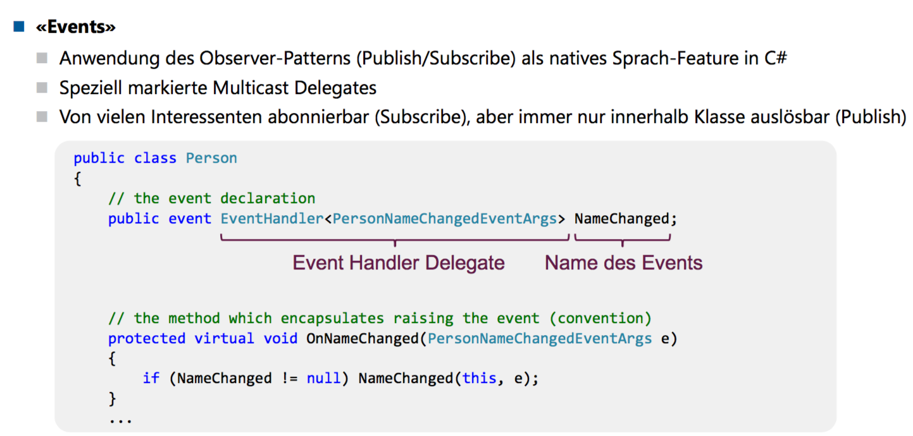
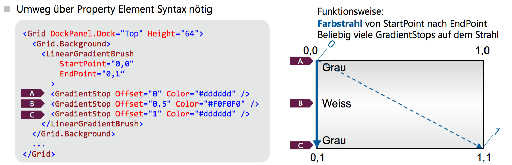

# WPF

WPF: Trennung von Darstellung (XAML) und Code

Begriffe

* Markup: Design, Elemente, Layout (XAML)
* Code Behind: Programmcode

Pixel in WPF sind device-independent Pixel (1/96") (in Windows Forms sind Pixel = Bildschirmpixel)

XAML-Elemente werden 1:1 zu erzeugten CLR-Objekten. Attribute werden 1:1 zu Properties und Events der erzeugten CLR-Objekte.

> Alles was in XAML implementiert werden kann, kann auch in Code (C#) ausgedrückt werden


Faustregel: was in XAML geht, in XAML machen, da oft leichtgewichtiger, kürzer, und auch mit einem Designer definierbar.

## Logical Tree


XAML-Elemente

* Entspricht der Struktur der XAML-Elemente
* Beschreibt die Beziehungen zwischen verschiedenen Elementen des UIs

Zuständig für

* Dependency Properties erben
* Dynamische Ressourcen-Referenzen auflösen
* Elementnamen für Datenbindung nachsclagen
* Routed Events weiterleiten

## Visual Tree

Dargestellte UI-Elemte und Dekorationen

* Entspricht der grafischen Repräsentation
* Beinhaltet alle dargestellten Elemente gemäss der Vorlage des Controls

Zuständig für

* Visuelle Darstellung
* Vereben der Transparenzeinstellungen, Transformationen, `IsEnabled`-Property
* Hit-Testing

## Routed Events


## Attribute Syntax/Property Element Syntax

```xml
<Button
        Height="50"
        Width="200"
        Content="Watch Now"
        />

<Button
        Width="120"
        Height="50">
  <Button.Content>Watch Now</Button.Content>
</Button>
```

Die Property Element Syntax ist so natürlich relativ sinnlos. Aber man kann mit ihr zusammengesetzte Dinge bauen:


## Attached Properties

Element setzt Eigenschaften, die das Parent-Element betreffen.

```xml
<Button DockPanel.Dock="Top" />
```

=

```c#
DockPanel.SetDock(element, Dock.Top)
```

## Markup Extensions

Verkürzte Notation um komplexe Ausdrücke unter Verwendung der "Attribute Syntax" eingeben zu können

```xml
<TextBox Text="{Binding Path=FirstName}" />
<!-- Kurzform von -->
<TextBox><TextBox.Text><Binding.Path="FirstName" /></TextBox.Text></TextBox>
```

## Type Converters

Konvertieren String-Werte automatisch in einen passenden Datentyp

```xml
<Button Background="Aqua" />
<!-- Kurzform von -->
<Button><Button.Background><SolidColorBrush Color="Aqua" /></Button.Background></Button>
```

## Events




# Layout und Controls

Falls nicht anders angegeben: Einheiten in `px`. 

Priorität bei Platzprobleme

1. MinWidth
2. MaxWidth
3. Width

## Alignment

Left/Center/Right, Top/Center/Bottom, sowie `Stretch` **als Standard**: füllt die ganze verfügbare Breite/Höhe im Parent-Element

> Tiefere Priorität als explizite Width/Height-Angaben!

## Ränder/Rahmen

* l, t, r, b
* l,t => l = links/rechts, t = oben/unten
* x = alle

Bei CornerRadius: 

* tl, tr, br, bl

## Box

Width = Inhalt + Border + Padding (CSS: `box-sizing: border-box`)

## Sonstiges

* IsEnabled: UI interagierbar (Standard = True)
* SnapsToDevicePixels: rundet Pixelangaben auf physische Gerätepixelwerte (Rendering)
* Visibility: Collapsed, Hidden, Visible (Standard)

## Brush

* SolidColorBrush
* LinearGradientBrush
* RadialGradientBrush
* ImageBrush
* DrawingBrush
* VisualBrush

Vordefinierte Pinseltypen: benannte Farben, UI-Farben (`MenuColor`)

Opacity: Transparenzwert 0..1

Rendering effizienter als wenn Opacity des Elements gesetzt wird

## Clipping

`ClipToBounds`: Sollen Child Controls an den Rändern des Parent Controls abgeschnitten werden? (Standard = False)

## Stack Panel

Child Elemente werden horizontal/vertikal aufgelistet. Standard vertikal

> Restlicher Platz wird nicht ausgefüllt

## WrapPanel

Wie StackPanel, aber mit Zeilen-/Spaltenumnbruch

In der Praxis zu Layoutzwecken nur selten anwendbar


## Dock Panel

Es gibt ein Top, Bottom, Left, Right. Die Reihenfolge der Elemente ist wichtig!

Wird z.B. erst ein Top und dann ein Left spezifiziert, so belegt das Top den ganzen oberen Rand und Left nur den restlichen, linken Platz.

Gibt man nichts an, wandert es ins Center.

## Grid

Zeilen/Spalten explizit deklarieren. Dort gibt es eine Breiten/Höhenangabe:

* Ganzzahlen: fixe Breite/Höhe
* `Auto`: automatisch aus verfügbarem Platz hergeleitet
* `*`: nutzt ganze Breite/Höhe entsprechend dem verfügbaren Platz, proportional aufgeteilt
* `2*`: verfügbarer Platz wird gewichtet aufgeteilt
* Dazu MinWidth/MinHeight

Mit `Grid.Column`/`Row` wird der Platz im Grid angegeben. Mit `RowSpan`/`ColumnSpan` kann gespannt werden.

Spezialfall 1x1 Grid: Elemente werden in der Zelle gestapelt, mit Alignment/Margin flexibles Layout erstellbar


Prozentangaben grundsätzlich nicht möglich. Trick: Gewichtung, z.B. 20, 40, 40

## Canvas

Absolute Positionierung, keinerlei Layout-Logik

Mit Canvas.Left/Top/Right/Bottom Abstand zum jeweiligen Rand angeben, dazu noch Canvas.ZIndex für Z-Position


## Shapes


Intern verwenden sie leichtgewichtige Model-Klassen für Geometrie-Berechnungen, die man auch zum Definieren einer Clipping-Form verwenden kann

## ViewBox

Skaliert einzelnes Child Control (inkl. Text), um den verfügbaren Platz auszunutzen. Funktioniert mit Transformation. Optionen `Stretch=`:


## Image

Attribut `Source` für Angabe der Datenquelle, verhält sich ansonsten wie ViewBox Stretch. Übergrösse wird bei Alignment berücksichtigt.

## Border

Zeichnet Rahmen um ein Child Control. Da `Border` nur ein Kind haben können, können sie mit Panels (z.B. StackPanel) kombiniert werden.

## Eigene Controls

UserControl: Komposition

* wiederverwendbare Zusammenstellung mehrerer Controls als Gruppe
* Besteht aus einem XAML und einem Code Behind-File
* Kann nicht mit Styles/Templates umgehen, dies muss vom umgebenden Fenster kommen

CustomControl: Ableitung

* Erweitert ein bestehendes Control um neue Funktionen
* Besteht aus einem Code-File und allenfalls einem Standard-Style
* Kann mit Styles-Templates umgehen

## Dialogfenster

Vorgehen

1. Dialogfenster erstellen
2. Dialogfenster mit `ShowDialog` anzeigen
3. Spezialvariable `DialogResult` setzen. true = OK, false = Abgebrochen

> Setzen der Variable: Dialogfenster wird automatisch geschlossen (Seiteneffekt)

4. Abrufen allfälliger Daten aus der Dialogfenster-Instanz

### Beispiel

* Default-Button: `IsDefault=true`
* Cancel-Button: `IsCancel=true`

## Fenster mit Spezialformen

1. `AllowTransparency`= True
2. `WindowStyle = None`
3. dazu `ResizeMode = NoResize` (sinnvollerweize)

Form in Window.Clip mittels eines Geometry-Elements festlegen

```xml
<Window.Clip>
	<RectabngleGeometry RadiusX="8" RadiusY="8" Rect="0, 0, 800, 600"
</Window.Clip>
```

(Ergibt Rechteck mit abgerundeten Rändern)

Beliebige Formen mit PathGeometry möglich. Fenstergrösse muss natürlich auf Geometrie abgestimmt sein.

## Testing

In der Vorlesung wird nun gezeigt, wie ein UI-Test gemacht wird

# UI Design

## LinearGradientBrush



## Ressourcen

Physische Ressourcen: z.B. Bilder `<Image Source="Desert Landscape.jpg">`

`Resource`: beliebiges Objekt (= Instanz), das in XAML definiert werden kann. Wird mit dem KeyAttribut aus dem `x`-Namespace benannt:


### ResourceDictionary

Behälter, um Ressourcen zu speichern. Indexiert nach dem Ressourcen-Namen. 

Zugriff auf Resource:

1. Key wird im Element und in allen Parent-Nodes gesucht (Logical Tree)
2. Key wird in `Application.Resources`gesucht
3. Key wird in SystemRessourcen gesucht


### Zugriff auf statische Werte

```xml
<Button Background="{:Static SystemColors.ControlBrush}" Content="Save" />
```

System-Ressourcen:

* im Namespace `System.Windows`
* `SystemColors`
* `SystemFonts`
* `SystemParameters`

### Statisch/dynamisch

* `StaticResource`: Statische Bindung beim Laden (1x)
  * Compile Time Check (findet Fehler früh)
* `DynamicResource`: dynamische Bindung zum Zugriff (jedes Mal)
  * Runtime Check (lässt dynamisch erzeugte und geladene Ressourcen zu)

## Ressourcen in C#

```c#
var okText = (string)FindResource("OkText");
var bgBrush = FindResource("DarkBrush") as Brush;
```

## Markup Extension


## Eigene ResourceDictionaries

Separates xaml-File. In andere ResourceDictionaries einbindbar. XML-Root-Node ist `ResourceDictionary`.

```xml
<ResourceDictionary <!-- Namespace-Quatsch --> >
	<!-- Hier Ressourcen angeben -->
</ResourceDictionary>
```

Zum Einbinden:

```xml
<Application.Resources>
	<ResourceDictionary>
      <!-- Mixen möglich -->
      <SolidColorBrush x:Key="MyButtonBackground" Color="#EEEEE" />
      <ResourceDictionary.MergedDictionaries>
      	<ResourceDictionary Source="Colors.xaml" />
        <ResourceDictionary Source="Brushes.xaml" />
      </ResourceDictionary.MergedDictionaries>
      <!-- Wiederverwendung möglich (definiert in Colors.xaml -->
      <SolidColorBrush x:Key="ButtonBgBrush" Color="{StaticResource ThemeColor1}" />
	</ResourceDictionary>
</Application.Resources>
```

## Externe Ressourcen: externe Assembly


### absolute Pfadangabe

Ressourcen im Filesystem. Nicht zu empfehlen, da zu starke Bindung

```xml
<Image Source="C:\Program Files\X-App\media\pix\open.png" />
```

### Package-URI

Kolleg...


Randnotiz:

> `/BasePicLib/...` hat einen Default-Prefix: `pack://application:,,,`

## Styles definieren

### explizite Styles

```xml
<Style x:Key="MyButtonStyle">
	<Setter Property="Button.Foreground" Value="#000000" />
	<Setter Property="Button.Background" Value="#FFFFFF" />
	<!-- auch komplexes möglich -->
  	<Setter Property="Button.Background">
      <Setter.Value>
        <LinearGradientBrush StartPoint="0,0" EndPoint="0,1">
        	<!-- ... -->
        </LinearGradientBrush>
      </Setter.Value>
  	</Setter>
</Style>
```

Verwenden mit:

```xml
<Button Style="{StaticResource MyButtonStyle}" Content="Cancel" />
```

Man kann auch einen `TargetType="Button"` einfügen. Der Klassenname (`Button.Foreground`) kann dann weggelassen werden (`Foreground`).

Lässt man den Key weg, **gilt der Style für alle Elemente des Controls**

Man kann auch ableiten, mit `BasedOn={StaticResource MyButtonStyle}`.

Möchte man aber den Grundstil als Standard-Stil haben, muss man einen Sentinel einfügen, der den Key weglässt und nur BasedOn ist (der Grundstil muss einen Key haben, damit man davon ableiten kann)

```xml
<Style TargetType="Button" x:Key="BaseButton"><!-- Nutzung über Key -->
  <!-- verschiedene Setter -->
</Style>
<!-- Sentinel, gilt für alle Button -->
<Style TargetType="Button" BasedOn="{StaticResource BaseButton}" />
<!-- spezifischer Stil, Nutzung über Key -->
<Style TargetType="Button" x:Key="DisabledButton" BasedOn="{StaticResource BaseButton}">
	<!-- verschiedene Setter -->
</Style>
```

## ControlTemplate

XAML-Struktur, die Inhaltsdarstellung eines Controls festlegt

Ermöglicht starke Wiederverwendung der Basis Control-Logik bei sehr flexibler Darstellung


TemplateBinding: nur innerhalb Control Template anwendbar. Kann Wert einer Dependency Property im Control (oder Style) abrufen

## Trigger

Style anhand unterschiedlicher UI-Zustände anpassen


## Visual State Manager


## Transformationen

`LayoutTransform`: werden vor der Layout-Phase angewandt

`RenderTransform`: werden nach der Layout-Phase angewandt


## GUI Design Principles


In der Vorlesung wird ab S. 77 beschrieben, wie Dynamic Layout mit WPF erzielt werden kann

# Umgang mit Daten

## Markup Extensions


## Binding


### DataContext

Datenbindungsausdrücke sind relativ zum DataContext zu formulieren

Data Binding Auswertung: es wird im Control + dessen Parents nach `DataContext != null` gesucht


Und auf einzelnes Objekt **unüblich**. Bei jedem UI-Wechsel Anpassung im Code Behind nötig. Stattdessen mit separaten ViewModels arbeiten und nur DataContext für Fenster setzen.


## Designer

Kennt DataContext nicht => by default kein IntelliSense für DataBinding

Abhilfe: Design-Time Data Context setzen

Variante 1: DesignInstance


Variante 2: eigene, statische Design Instanz


## Source/RelativeSource/ElementName

Source:

DataContext für einzelne Elements übersteuern: Datenquelle mittels Source explizit angeben


RelativeSource:

ermöglicht die Angabe einer relativen Datenquelle im **Visual Tree**

Eigene Markup Extension dafür: RelativeSource


ElementName

Nutzt direkt anderes, benanntes XAML-Element als Datenquelle. Namen müssen im gleichen Namensraum vorliegen. 

