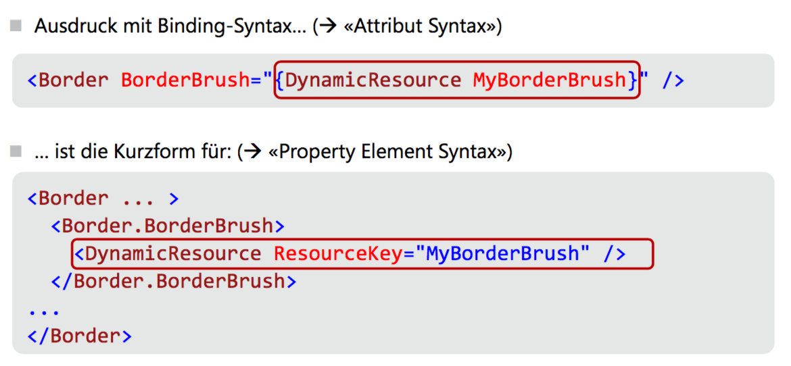
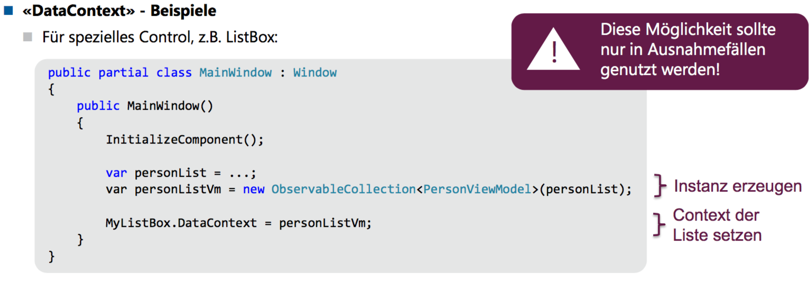

# WPF

WPF: Trennung von Darstellung (XAML) und Code

Begriffe

* Markup: Design, Elemente, Layout (XAML)
* Code Behind: Programmcode

Pixel in WPF sind device-independent Pixel (1/96") (in Windows Forms sind Pixel = Bildschirmpixel)

XAML-Elemente werden 1:1 zu erzeugten CLR-Objekten. Attribute werden 1:1 zu Properties und Events der erzeugten CLR-Objekte.

> Alles was in XAML implementiert werden kann, kann auch in Code (C#) ausgedrückt werden


Faustregel: was in XAML geht, in XAML machen, da oft leichtgewichtiger, kürzer, und auch mit einem Designer definierbar.

## Logical Tree


XAML-Elemente

* Entspricht der Struktur der XAML-Elemente
* Beschreibt die Beziehungen zwischen verschiedenen Elementen des UIs

Zuständig für

* Dependency Properties erben
* Dynamische Ressourcen-Referenzen auflösen
* Elementnamen für Datenbindung nachsclagen
* Routed Events weiterleiten

## Visual Tree

Dargestellte UI-Elemte und Dekorationen

* Entspricht der grafischen Repräsentation
* Beinhaltet alle dargestellten Elemente gemäss der Vorlage des Controls

Zuständig für

* Visuelle Darstellung
* Vereben der Transparenzeinstellungen, Transformationen, `IsEnabled`-Property
* Hit-Testing

## Routed Events


## Attribute Syntax/Property Element Syntax

```xml
<Button
        Height="50"
        Width="200"
        Content="Watch Now"
        />

<Button
        Width="120"
        Height="50">
  <Button.Content>Watch Now</Button.Content>
</Button>
```

Die Property Element Syntax ist so natürlich relativ sinnlos. Aber man kann mit ihr zusammengesetzte Dinge bauen:


## Attached Properties

Element setzt Eigenschaften, die das Parent-Element betreffen.

```xml
<Button DockPanel.Dock="Top" />
```

=

```c#
DockPanel.SetDock(element, Dock.Top)
```

## Markup Extensions

Verkürzte Notation um komplexe Ausdrücke unter Verwendung der "Attribute Syntax" eingeben zu können

```xml
<TextBox Text="{Binding Path=FirstName}" />
<!-- Kurzform von -->
<TextBox><TextBox.Text><Binding.Path="FirstName" /></TextBox.Text></TextBox>
```

## Type Converters

Konvertieren String-Werte automatisch in einen passenden Datentyp

```xml
<Button Background="Aqua" />
<!-- Kurzform von -->
<Button><Button.Background><SolidColorBrush Color="Aqua" /></Button.Background></Button>
```

## Events


# Layout und Controls

Falls nicht anders angegeben: Einheiten in `px`. 

Priorität bei Platzprobleme

1. MinWidth
2. MaxWidth
3. Width

## Alignment

Left/Center/Right, Top/Center/Bottom, sowie `Stretch` **als Standard**: füllt die ganze verfügbare Breite/Höhe im Parent-Element

> Tiefere Priorität als explizite Width/Height-Angaben!

## Ränder/Rahmen

* l, t, r, b
* l,t => l = links/rechts, t = oben/unten
* x = alle

Bei CornerRadius: 

* tl, tr, br, bl

## Box

Width = Inhalt + Border + Padding (CSS: `box-sizing: border-box`)

## Sonstiges

* IsEnabled: UI interagierbar (Standard = True)
* SnapsToDevicePixels: rundet Pixelangaben auf physische Gerätepixelwerte (Rendering)
* Visibility: Collapsed, Hidden, Visible (Standard)

## Brush

* SolidColorBrush
* LinearGradientBrush
* RadialGradientBrush
* ImageBrush
* DrawingBrush
* VisualBrush

Vordefinierte Pinseltypen: benannte Farben, UI-Farben (`MenuColor`)

Opacity: Transparenzwert 0..1

Rendering effizienter als wenn Opacity des Elements gesetzt wird

## Clipping

`ClipToBounds`: Sollen Child Controls an den Rändern des Parent Controls abgeschnitten werden? (Standard = False)

## Stack Panel

Child Elemente werden horizontal/vertikal aufgelistet. Standard vertikal

> Restlicher Platz wird nicht ausgefüllt

## WrapPanel

Wie StackPanel, aber mit Zeilen-/Spaltenumnbruch

In der Praxis zu Layoutzwecken nur selten anwendbar


## Dock Panel

Es gibt ein Top, Bottom, Left, Right. Die Reihenfolge der Elemente ist wichtig!

Wird z.B. erst ein Top und dann ein Left spezifiziert, so belegt das Top den ganzen oberen Rand und Left nur den restlichen, linken Platz.

Gibt man nichts an, wandert es ins Center.

## Grid

Zeilen/Spalten explizit deklarieren. Dort gibt es eine Breiten/Höhenangabe:

* Ganzzahlen: fixe Breite/Höhe
* `Auto`: automatisch aus verfügbarem Platz hergeleitet
* `*`: nutzt ganze Breite/Höhe entsprechend dem verfügbaren Platz, proportional aufgeteilt
* `2*`: verfügbarer Platz wird gewichtet aufgeteilt
* Dazu MinWidth/MinHeight

Mit `Grid.Column`/`Row` wird der Platz im Grid angegeben. Mit `RowSpan`/`ColumnSpan` kann gespannt werden.

Spezialfall 1x1 Grid: Elemente werden in der Zelle gestapelt, mit Alignment/Margin flexibles Layout erstellbar


Prozentangaben grundsätzlich nicht möglich. Trick: Gewichtung, z.B. 20, 40, 40

## Canvas

Absolute Positionierung, keinerlei Layout-Logik

Mit Canvas.Left/Top/Right/Bottom Abstand zum jeweiligen Rand angeben, dazu noch Canvas.ZIndex für Z-Position


## Shapes


Intern verwenden sie leichtgewichtige Model-Klassen für Geometrie-Berechnungen, die man auch zum Definieren einer Clipping-Form verwenden kann

## ViewBox

Skaliert einzelnes Child Control (inkl. Text), um den verfügbaren Platz auszunutzen. Funktioniert mit Transformation. Optionen `Stretch=`:


## Image

Attribut `Source` für Angabe der Datenquelle, verhält sich ansonsten wie ViewBox Stretch. Übergrösse wird bei Alignment berücksichtigt.

## Border

Zeichnet Rahmen um ein Child Control. Da `Border` nur ein Kind haben können, können sie mit Panels (z.B. StackPanel) kombiniert werden.

## Eigene Controls

UserControl: Komposition

* wiederverwendbare Zusammenstellung mehrerer Controls als Gruppe
* Besteht aus einem XAML und einem Code Behind-File
* Kann nicht mit Styles/Templates umgehen, dies muss vom umgebenden Fenster kommen

CustomControl: Ableitung

* Erweitert ein bestehendes Control um neue Funktionen
* Besteht aus einem Code-File und allenfalls einem Standard-Style
* Kann mit Styles-Templates umgehen

## Dialogfenster

Vorgehen

1. Dialogfenster erstellen
2. Dialogfenster mit `ShowDialog` anzeigen
3. Spezialvariable `DialogResult` setzen. true = OK, false = Abgebrochen

> Setzen der Variable: Dialogfenster wird automatisch geschlossen (Seiteneffekt)

4. Abrufen allfälliger Daten aus der Dialogfenster-Instanz

### Beispiel

* Default-Button: `IsDefault=true`
* Cancel-Button: `IsCancel=true`

## Fenster mit Spezialformen

1. `AllowTransparency`= True
2. `WindowStyle = None`
3. dazu `ResizeMode = NoResize` (sinnvollerweize)

Form in Window.Clip mittels eines Geometry-Elements festlegen

```xml
<Window.Clip>
	<RectabngleGeometry RadiusX="8" RadiusY="8" Rect="0, 0, 800, 600"
</Window.Clip>
```

(Ergibt Rechteck mit abgerundeten Rändern)

Beliebige Formen mit PathGeometry möglich. Fenstergrösse muss natürlich auf Geometrie abgestimmt sein.

## Testing

In der Vorlesung wird nun gezeigt, wie ein UI-Test gemacht wird

# UI Design

## LinearGradientBrush


## Ressourcen

Physische Ressourcen: z.B. Bilder `<Image Source="Desert Landscape.jpg">`

`Resource`: beliebiges Objekt (= Instanz), das in XAML definiert werden kann. Wird mit dem KeyAttribut aus dem `x`-Namespace benannt:


### ResourceDictionary

Behälter, um Ressourcen zu speichern. Indexiert nach dem Ressourcen-Namen. 

Zugriff auf Resource:

1. Key wird im Element und in allen Parent-Nodes gesucht (Logical Tree)
2. Key wird in `Application.Resources`gesucht
3. Key wird in SystemRessourcen gesucht


### Zugriff auf statische Werte

```xml
<Button Background="{:Static SystemColors.ControlBrush}" Content="Save" />
```

System-Ressourcen:

* im Namespace `System.Windows`
* `SystemColors`
* `SystemFonts`
* `SystemParameters`

### Statisch/dynamisch

* `StaticResource`: Statische Bindung beim Laden (1x)
  * Compile Time Check (findet Fehler früh)
* `DynamicResource`: dynamische Bindung zum Zugriff (jedes Mal)
  * Runtime Check (lässt dynamisch erzeugte und geladene Ressourcen zu)

## Ressourcen in C#

```c#
var okText = (string)FindResource("OkText");
var bgBrush = FindResource("DarkBrush") as Brush;
```

## Markup Extension



## Eigene ResourceDictionaries

Separates xaml-File. In andere ResourceDictionaries einbindbar. XML-Root-Node ist `ResourceDictionary`.

```xml
<ResourceDictionary <!-- Namespace-Quatsch --> >
	<!-- Hier Ressourcen angeben -->
</ResourceDictionary>
```

Zum Einbinden:

```xml
<Application.Resources>
	<ResourceDictionary>
      <!-- Mixen möglich -->
      <SolidColorBrush x:Key="MyButtonBackground" Color="#EEEEE" />
      <ResourceDictionary.MergedDictionaries>
      	<ResourceDictionary Source="Colors.xaml" />
        <ResourceDictionary Source="Brushes.xaml" />
      </ResourceDictionary.MergedDictionaries>
      <!-- Wiederverwendung möglich (definiert in Colors.xaml -->
      <SolidColorBrush x:Key="ButtonBgBrush" Color="{StaticResource ThemeColor1}" />
	</ResourceDictionary>
</Application.Resources>
```

## Externe Ressourcen: externe Assembly


### absolute Pfadangabe

Ressourcen im Filesystem. Nicht zu empfehlen, da zu starke Bindung

```xml
<Image Source="C:\Program Files\X-App\media\pix\open.png" />
```

### Package-URI

Kolleg...


Randnotiz:

> `/BasePicLib/...` hat einen Default-Prefix: `pack://application:,,,`

## Styles definieren

### explizite Styles

```xml
<Style x:Key="MyButtonStyle">
	<Setter Property="Button.Foreground" Value="#000000" />
	<Setter Property="Button.Background" Value="#FFFFFF" />
	<!-- auch komplexes möglich -->
  	<Setter Property="Button.Background">
      <Setter.Value>
        <LinearGradientBrush StartPoint="0,0" EndPoint="0,1">
        	<!-- ... -->
        </LinearGradientBrush>
      </Setter.Value>
  	</Setter>
</Style>
```

Verwenden mit:

```xml
<Button Style="{StaticResource MyButtonStyle}" Content="Cancel" />
```

Man kann auch einen `TargetType="Button"` einfügen. Der Klassenname (`Button.Foreground`) kann dann weggelassen werden (`Foreground`).

Lässt man den Key weg, **gilt der Style für alle Elemente des Controls**

Man kann auch ableiten, mit `BasedOn={StaticResource MyButtonStyle}`.

Möchte man aber den Grundstil als Standard-Stil haben, muss man einen Sentinel einfügen, der den Key weglässt und nur BasedOn ist (der Grundstil muss einen Key haben, damit man davon ableiten kann)

```xml
<Style TargetType="Button" x:Key="BaseButton"><!-- Nutzung über Key -->
  <!-- verschiedene Setter -->
</Style>
<!-- Sentinel, gilt für alle Button -->
<Style TargetType="Button" BasedOn="{StaticResource BaseButton}" />
<!-- spezifischer Stil, Nutzung über Key -->
<Style TargetType="Button" x:Key="DisabledButton" BasedOn="{StaticResource BaseButton}">
	<!-- verschiedene Setter -->
</Style>
```

## ControlTemplate

XAML-Struktur, die Inhaltsdarstellung eines Controls festlegt

Ermöglicht starke Wiederverwendung der Basis Control-Logik bei sehr flexibler Darstellung


TemplateBinding: nur innerhalb Control Template anwendbar. Kann Wert einer Dependency Property im Control (oder Style) abrufen

## Trigger

Style anhand unterschiedlicher UI-Zustände anpassen


## Visual State Manager


## Transformationen

`LayoutTransform`: werden vor der Layout-Phase angewandt

`RenderTransform`: werden nach der Layout-Phase angewandt


## GUI Design Principles


In der Vorlesung wird ab S. 77 beschrieben, wie Dynamic Layout mit WPF erzielt werden kann

# Umgang mit Daten

## Markup Extensions


## Binding


### DataContext

Datenbindungsausdrücke sind relativ zum DataContext zu formulieren

Data Binding Auswertung: es wird im Control + dessen Parents nach `DataContext != null` gesucht


Und auf einzelnes Objekt **unüblich**. Bei jedem UI-Wechsel Anpassung im Code Behind nötig. Stattdessen mit separaten ViewModels arbeiten und nur DataContext für Fenster setzen.



## Designer

Kennt DataContext nicht => by default kein IntelliSense für DataBinding

Abhilfe: Design-Time Data Context setzen

Variante 1: DesignInstance


Variante 2: eigene, statische Design Instanz


## Source/RelativeSource/ElementName

Source:

DataContext für einzelne Elements übersteuern: Datenquelle mittels Source explizit angeben


RelativeSource:

ermöglicht die Angabe einer relativen Datenquelle im **Visual Tree**

Eigene Markup Extension dafür: RelativeSource


ElementName

Nutzt direkt anderes, benanntes XAML-Element als Datenquelle. Namen müssen im gleichen Namensraum vorliegen. 


## StringFormat

Entspricht dem Format-String im Aufruf an die String.Format-Methode

## Path

Path ist die Standard-Property eines Binding-Ausdrucks. Folgendes ist daher identisch

* `{Binding FirstName}`
* `{Binding Path=FirstName}`

Es kann ebenso Objektsyntax verwendet werden

* `{Binding}` bindet direkt an Datenquelle selbst als Ganzes
* `{Binding Address.Street}` bindet an Property Street der Property Address der Datenquelle
* `{Binding Groups[0].Name}` 

## Mode

Richtung der Datenbindung. Default-Mode je nach gebundener Property unterschiedlich. **Im Zweifelsfall den Mode jeweils explizit angeben**

* OneTime: einmalig (bei erstem Zugriff)
* OneWay: lesend
* TwoWay: lesend/schreibend
* OneWayToSource: schreibend

## IValueConverter


Beispiel: BooleanToVisibilityConverter (aus dem Standard-Lieferumfang)

> Es ist auch möglich, nur eine der Methoden zu überschreiben und die andere mit NotImplementedException auszustatten, wenn man es selber nicht verwendet


```c#
public class BooleanToVisibilityConverter : IValueConverter {
  public object Convert(object value, Type targetType, object parameter, CultureInfo culture) {
    return value is bool && (bool)value == true ? Visibility.Visible : Visibility.Collapsed;
  }
  
  public object ConvertBack(object value, Type targetType, object parameter, CultureInfo culture) {
    return value as Visibility? == Visiblity.Visible
  }
}
```

## IMultiValueConverter


## Anwenden

Um einen ValueConverter anzuwenden, wird eine Instanz benötigt

* Variante 1: Instanz als Ressource in XAML anlegen

  * (z.B. in App.xaml)

  * ```xml
    <Application.Resources>
    	<local:BooleanToVisibilityConverter x:Key="MyVisiblityConverter" />
    </Application.Resources>
    ```

  * Dann: Nutzung wie gehabt

  * ```xml
    <Label Visiblity="{Binding IsAvailable}, Converter={StaticResource MyVisibilityConverter}"
    ```

  * ​

* Variante 2: Instanz als statische Property in C# bereitstellen

  * zum Beispiel gleich im ValueConverter

  * 

  * Dann: Nutzung via `{x: Static ...}` anstele von `{StaticResource ...}`

  * ```xml
    Converter="{x:Static local:RgbToColorConverter.Instance} 
    ```

  Gut abwägen, ob sich der Aufwand lohnt!

## INotifyPropertyChanged

In der Vorlesung geht man nun durch einige Varianten, wie man es implementieren kann


Achtung: mit Zwang zum Ableiten sind keine POCOs mehr möglich.

Problem: berechnete Properties. Änderung sollte immer dann kommuniziert werden, wenn Quellwerte ändern

Lösung: für jeden Wechsel eine eigene Notifikation übermitteln


Variante 4: Fody verwenden.

1. POCO schreiben
2. Mit Attribut `[ImplementPropertyChanged]` markieren

## Binding auf Collections

`ObservableCollection<T>` verwenden, implementiert `INotifyCollectionChanged` und `INotifyPropertyChanged`

Änderungen an den Inhaltsobjekten selbst benötigen weiterhin `INotifyPropertyChanged`

## ObjectDataProvider

Ermöglicht Verwendung einer Factory-Methode in XAML

Beispiel: Enums


## ItemTemplate


## DataGrid

Microsoft wollte das ursprünglich nicht mehr in WPF anbieten


## CollectionViewSource

Ermöglicht Gruppieren, Sortieren, Filtern

```xml
<CollectionViewSource x:Key="ListingDataView" Source="{Binding Source={x:Static Application.Current}, Path=AuctionItems}" />
```

# Details der Benutzerinteraktion

## Events

Publish/Subscribe-Mechanismus

Event in Klasse definieren

Innerhalb der Klasse auslösen (Publish)

Für Benachrichtigungen registrieren (Subscribe)


## Event Args

Von EventArgs abgeleitete Klasse für Übermittlung der Event-Details. Konvention: Klassenname endet auf EventArgs


Event-Handler:

```c#
private void OnPropertyChanged(object sender, PropertyChangedEventsArgs args)
{
  	// extract the property name out of the event args parameter
  	var propertyName = args.PropertyName
  	// get the new value of the mentioned property via reflection
    var newValue = sender.GetType().GetProperty(args.PropertyName).GetValue(sender);
  	// write to console
  	Console.WriteLine($"The property {propertyName} has changed to {newValue}")
}
```


### Konvention

Name des vordefinierten Event Handlers zu einem Event: "OnEVENTNAME"

Bei virtuellen Eventhandlern: Sender oft weggelassen

Zugriffskategorie meist `protected`

## Varianten für Event Handler

Event

```c#
this.Startup += (o, args) => {}
```

Variante vordefinierter Handler: OnStartup überschreiben

Er muss dann auch nicht mehr registriert werden (das macht WPF)

```c#
protected override void OnStartup(StartupEventArgs e) {}
```

## WPF App Lifecycle

C#/.NET generell: statische Main-Methode festlegen

Falls nur 1 Main-Methode in Assembly: wird automatisch durch Compiler festgelegt. Falls mehrere, Hauptklasse "Startup Object" in Build Settings festlegen.

Wo ist Main in WPF?


### App Startup


### Window Close


### App Close


## Routed Events = XAML UI Events

Interessante UI-Ereignisse, auf die reagiert werden soll

* Mouse-Ereignis, linke Maustaste gedrückt/losgelassen, Maus bewegt
* Keyboard-Ereignis
* ...

Können abgebrochen werden (`Handled = true`)

Nutzen das C# Event Konzept

Werden abwärts (*Preview*/*Tunneling*) und dann aufwärts (*Bubbling*) durch den **Visual Tree** gesendet


### Behandeln


Bei einem Parent-Element


## RoutedEventArgs

* Handled: Flag, ob Event behandelt wurde
* OriginalSource: Quell-Element (Hit-Testing), welches das Event ausgelöst hat
* RoutedEvent: Routed Event, welches mit diesem Objekt verknüpft ist
* Source: Element, welches das Event rapportiert hat

Source vs. OriginalSource

* OriginalSource: u.U. Kind-Element des Source-Elements, per Hit-Testing als 1. Adressat des Events bestimmt
* Source: Element im Logical Tree, welches das Event dann rapportiert

Beispiel: Subscribe auf MouseDown in einem Button. Vom Button rapportiert (Source), aber eigentlich vom Rahmen ausgelöst (OriginalSource)

Dazu gibt es dann abgeleitete Klassen, wie die MouseEventArgs.

* Left/Middle/RightButton (Pressed/Released)
* Delta: Mausradbewegung (120/-120)

Keyboard:

* Key (Enum)
* IsDown/IsUp
* IsRepeat
* SystemKey: gibt bei gedrückter ALT-Taste die zusätzlich gedrückte Taste an (Key ist dann Key.System)

Beispiel: Taste B wird gedrückt und wieder losgelassen


In der Vorlesung folgt nun eine Problemstellung, dass man unbedingt den Auslöser überprüfen sollte, wenn man einen Event erhält (kommt der von mir?)

## Drag & Drop


> Spick: Übungslösung übertragen, oder Appendix-Teil

## Hintergrundoperationen

1. visuelles Feedback geben
   1. Button deaktivieren
   2. Spinner anzeigen
      1. Button mit Label und Spinner, Visibility des Spinners an IsEnabled des Buttons binden (eigener Converter nötig da umgedrehte Logik)
2. Starten eines Background-Threads
3. UI-Thread benachrichtigen
   1. `Dispatcher.Invoke(() => {});
   2. Falls man nicht in einem WPF-Control ist: `System.Windows.Application.Current.Dispatcher.Invoke` (statische Instanz)

# Architekturmuster und Diverses


## Model

Eigentliche Daten, Domain-Objekte

* *Kein* Verhalten
* Nicht zuständig für Darstellung und Formatierung der Daten
* Nicht zuständig für Laden und Speichern
* Abbild der realen Welt, oft ergänzt um Informationen zur Nutzung, Speicherung, Tracking

(die Vorlesung zeigt kurz das Entity Framework und SQLite)

Model: DTO, oder direkt Entity wenn man keine DTO benutzt

## ViewModel

* View-spezifische Objekte, welche die Domain-Objekte um Daten, Berechnungen für die View anreichern
* Enthalten Verhalten
* Zuständig für Darstellung und Formatierung der Daten im Hinblick auf die Darstellung in der View
* Grundlage für stressfreies Data Binding
* Kontroverse: zuständig/nicht zuständig fürs Laden/Speichern

Zwei Varianten: 

* Model als Property kapseln
* Für jede im UI benötigte Property eine gleichnamige VM-Property implementieren
  * Dann Fleissarbeit, oder Tool verwenden (z.B. AutoMapper) um Properties aus Model zu kopieren

```c#
// Initialize Mapper table
Mapper.Initialize(cfg => cfg.CreateMap<Gadget, GadgetVm>());

// copy the properties of gadget into a new instance of type GadgetVm
var vm = Mapper.Map<GadgetVm>(gadget);
```

## Commands

Bindable Methods

Problem: View soll nichts von ViewModel wissen, wie kann ich dann Aktionen im VM auslösen?

Lösung: `ICommand` im ViewModel implementieren, dann via DataBinding auslösen

Begriffe

* The *command* is the action to be executed (Kommando)
* The *command source* is the object which invokes the command (XAML)
* The *command target* is the object, that the command is being executed on (ViewModel)
* The *command binding* is the object which maps the command logic to the command

Beispiel: ein GadgetVM soll sich selbst speichern können. Dies als Reaktion auf einen Button-Klick

Wir schreiben ein eigenes Command `SaveCommand`

* Command führt das Speichern aus
* Command Source ist der Button
* Command Target ist das GadgetVm-Objekt in der Detail View
* Das Command Binding definieren wir auf dem Button, so dass dieser das Kommando beim Klicken auslöst

### Nutzen von Commands

Data Binding im XAML-Code wie gehabt

Voraussetzung: DataContext für Binding korrekt auf ViewModel gesetzt

```xml
<Button Content="Save" Command="{Binding SaveCommand}" />
```

oder mit zusätzlichem Parameter: `CommandParameter="{Binding SelectedGadget}"`

Commands werden beim Data Binding an ein passendes Event eines Controls gebunden. Beim `Button` ist das der `Click`-Event.

Wir schweifen jetzt kurz ab, später kommt dann der konkrete SaveCommand!

Commands haben ein `CanExecute`-Property, das der Button automatisch an das `IsEnabled`-Property bindet.

### Implementierung von Commands

Variante 1: eigene Command-Klasse, Instanz davon als Property im ViewModel

```c#
public class SomeCommand: ICommand {
  	public bool CanExecute(object parameter) { /* return true/false */ }
  	
  	public void Execute(object parameter)
    {
      // irgendwas ausführen
    }
    
  	public event EventHandler CanExecuteChanged;
}

public class GadgetVM : BindableBase
{
	public SomeCommand MyCommand { get; set; } // kann auch ICommand MyCommand sein
	
	public GadgetVm()
    {
    	MyCommand = new SomeCommand();
    }
}
```

Variante 2: Command als innere Klasse im ViewModel implementieren

Vorteil: Zugriff auf private Member des ViewModels

Variante 3: RelayCommand implementieren (selber)

```c#
public class RelayCommand : ICommand
{
	private readonly Action _execute;
	private readonly Func<bool> _canExecute;
	
	public RelayCommand(Action execute, Func<bool> canExecute = null)
    {
    	if (execute == null) throw new ArgumentNullException("execute");
    	
    	_execute = execute;
    	_canExecute = canExecute;
    }
    
    public bool CanExecute(object parameter) => _canExecute?.Invoke() ?? True
    public void Execute(object parameter) => _execute();
}
```

Oder auch mit generischem <T>

```c#
public class RelayCommand<T> : ICommand
{
	private readonly Action<T> _execute;
	private readonly Predicate<T> _canExecute;
	
	public RelayCommand(Action<T> execute, Predicate<T> canExecute = null)
    {
    	if (execute == null) throw new ArgumentNullException("execute");
    	
    	_execute = execute;
    	_canExecute = canExecute;
    }
    
    public bool CanExecute(object parameter) => _canExecute?.Invoke((T)parameter) ?? True
    public void Execute(object parameter) => _execute((T)parameter);
}
```

Die Klasse geht aber jeweils noch weiter:

```c#
// Event an CommandManager delegieren (Benachrichtigung erfolgt so immer dann 
// wenn WPF denkt, dass sich etwas am Ausführungsstatus geändert hat,
// z.B. bei Key- oder Mouse-Button-Klick)
public event EventHandler CanExecuteChanged
{
	add { CommandManager.RequerySuggested += value; }
	remove { CommandManager.RequerySuggested += value }
}
```


Verwendung:

```c#
public class GadgetVm : BindableBase
{
	public ICommand SaveCommand { get; set; }
	
	public GadgetVm()
    {
    	SaveCommand = new RelayCommand(
    		() => this.Save(), // Methode des ViewModels
    		() => this.CanSave // Property des ViewModels
    	);
    }
    
    public CanSave => ; // some condition
    public void Save() {} // some method
}
```

Besser: Initialisierung direkt bei Definition:

```c#
public ICommand SaveCommand { get; } = new RelayCommand(() => this.Save(), () => this.CanSave);
```

Oder lazy

```c#
// Backing-Field benötigt
private ICommand _saveCommand;
public ICommand SaveCommand =>
  _saveCommand ?? (_saveCommand = new RelayCommand(() => this.Save(), () => this.CanSave));
```

## Events

View soll ViewModel nicht kennen, aber bei Auftreten von Events Command anstossen

Bekannte Lösung: mit Event Handling/Code Behind

Es gibt aber Alternativlösungen auf Nuget, womit man Events auf Kommandos mappen kann

## ViewModel vs. View

Werden beide "von aussen" erzeigt

Das ViewModel wird "von aussen" als DataContext für die View gesetzt

## ViewModel vs. Services

Immer mit Referenz auf service-Interface, und via Dependency Injection angeben.

## Die View

Möglichst wenig (am besten kein) Zugriff auf die UI-Controls aus dem Code Behind

Zustände via Data Binding zwischenspeichern

Steuerung der Anzeige via Flags des ViewModels binden

## Erzeugen des ViewModels

Es werden einige Varianten vogestellt, eine davon ist die Dependency Injection via Konstruktor

```c#
// onStartup
var vm = new GadgetVm();
MainWindow = new GadgeothekView(vm);
MainWindow.Show();

public GadgeothekView(GadgetVm vm)
{
  InitializeComponent();
  DataContext = vm
}
```

Dazu noch eine Variante direkt in XAML (das geht anscheinend...)

```xml
<Window ...>
	<Window.DataContext>
      <local:GadgetVm />
  	</Window.DataContext>
</Window>
```

```c#
public GadgeothekView()
{
  InitializeComponent(); // Code Behind also "leer"
}
```

So erreicht man, dass das ViewModel cross-plattform läuft und testbar ist. Zudem ist so 100% der Anwendung auch ohne UI testbar.

## Internationalisierung

Internationalisierung und Lokalisierung in CH nötig!

# Xamarin

X-Platform Native App Development C#

* Native User Interfaces
  * sehen aus und verhalten sich wie native Apps
* Native API Access
  * 100% der plattformspezifischen Device APIs
* Native Performance
  * Nutzen die volle Geschwindigkeit der Geräte

Klassischer Xamarin-Ansatz

* Native UI X-mal bauen
* Shared C# Backend

Xamarin Forms

* Native UI Tweaks builden lassen
* Shared C# Backend

Von C# zu nativem Code: Windows


iOS/Android


Xamarin.Forms: alle XAML-Konzepte X-Plattform nutzbar, Controls werden pro Plattform auf Native Controls gemappt.

