# MsTe

[TOC]

# Grundlagen

## Bestandteile

* Common Language Runtime CLR
  * ähnlich JVM
  * Common Type System CTS
  * Common Language Specification CTS
* .NET Class Library
  * Basis-Klassen, ADO.NET, XML, ...

## Architektur

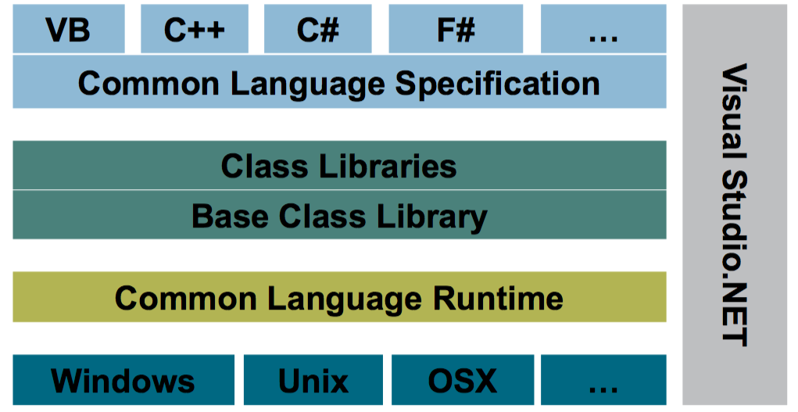

## Common Language Runtime

Laufzeitumgebung

* JIT für ILC (~Bytecode)
* Class Loader
* GC
* Code Access Security
* Debugging (sprachübergreifend)
* Exceptions
* Type Checking/Code Verifikation des ILC
* Threads
* COM (unmanaged Code)
* Basis-Klassen mit System-Funktionen

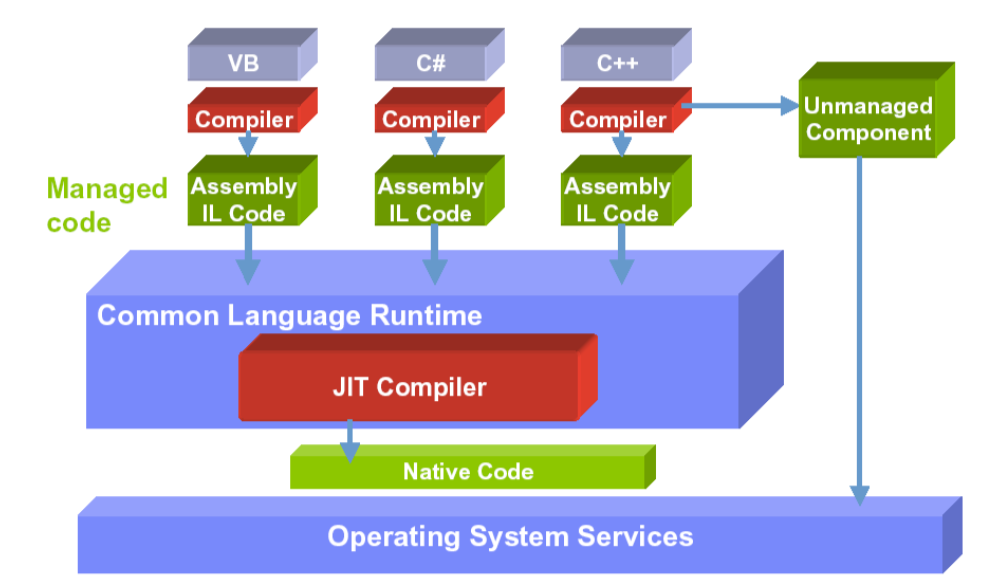

## MSIL

Assembler-ähnlich

Virtuelle Stack-Maschine ohne Register

Common Type System: komplexe Datentypen/Objekte, Boxing/Unboxing

Vererbung/Polymorphie

Vorteile

* Portabilität
* Typsicherheit

Nachteile

* Laufzeiteffizienz
  * kann durch JIT-Compiler wettgemacht werden, wenn dieser maschinenspezifische Instruktionen ausnutzen kann

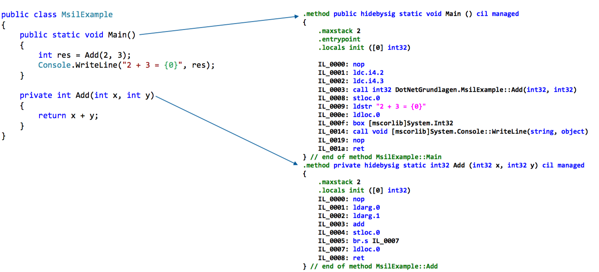

## Cross Language Development

Objekt-Modell und Bibliotheken in Framework integriert. Sprachwahl sekundär, Konzepte allgemeingültig

Common Language Specification

* Allgemeine Regeln für Cross-Language Development
* CLS-kompatible Bibliotheken können von allen .NET-Sprachen verwendet werden

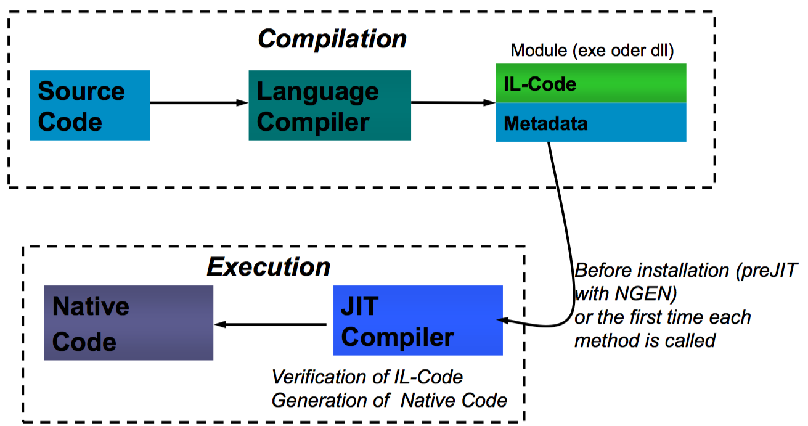

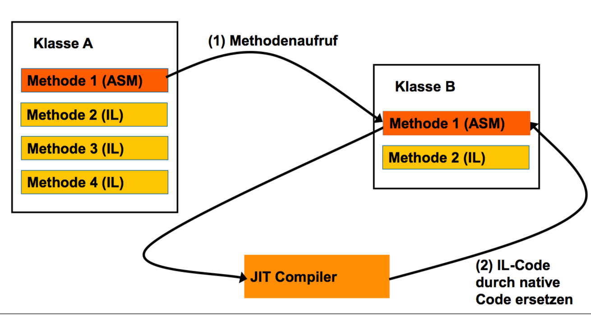

## Assemblies

Assembly: selbstbeschreibende Komponente mit definierter Schnittstelle

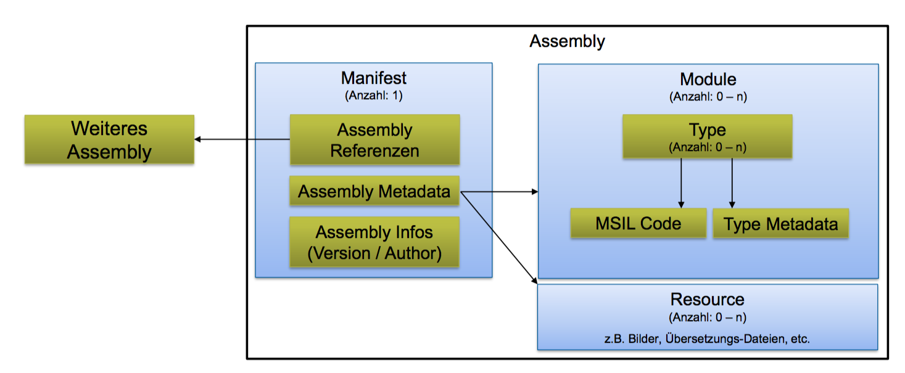

Kompilation erzeugt Assemblies und Module

* Assembly besteht aus 0 bis Module
* Visual Studio ertellt standardmässig nur 1 Modul pro Assembly

Assembly

* Deployment-/Ausführungseinheit
* exe, dll
* Binärdateien im PEF (ausführbar für Win32/Win64)
* Dynamisch ladbar
* Definiert Typ-Scope
* kleinste versionierbare Einheit
* Einheit für Security Überprüfung

Entspricht ungefähr einem JAR-File

Singlefile/Multifile

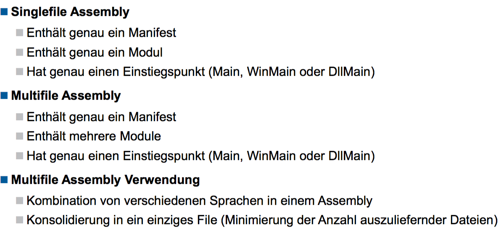

Kompilation erzeugt ein Modul mit 

* Code/MSIL

Metadaten beschreiben alle Aspekte des Codes ausser Programmlogik

* Klassen-Definitionen
* Methoden-Definitionen
* Feld-Definitionen
* usw

Metadaten lassen sich über Reflection abfragen

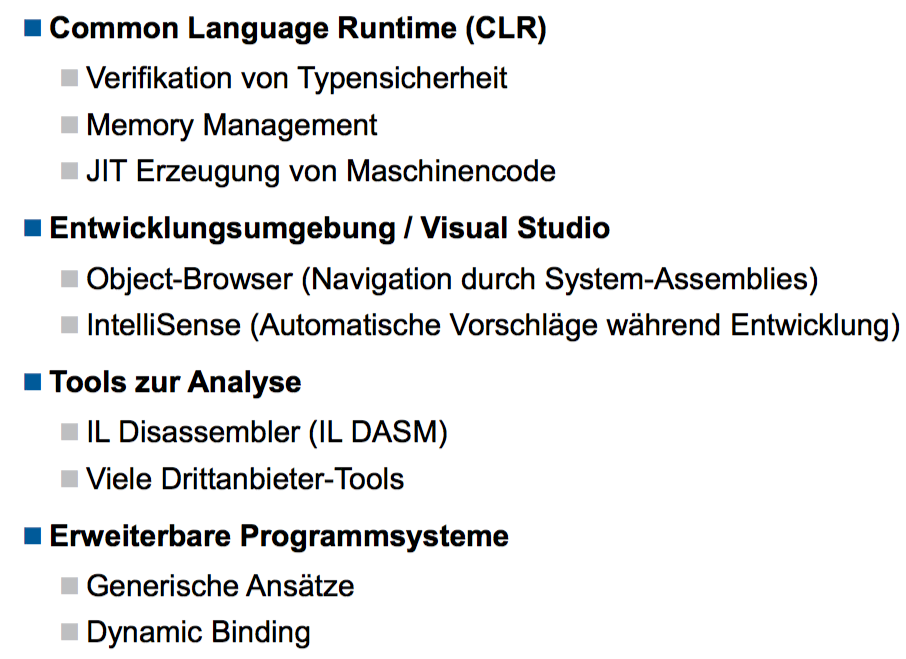

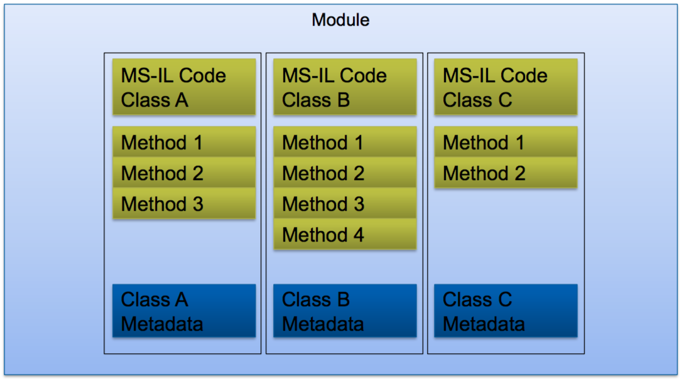

## Assemblies

Private Assembly: referenziert über Dateipfad, nirgends fix registriert, meist nur von einer Applikation genutzt

Shared Assembly

* eindeutige Bezeichnung (Strong Name)
  * Bezeichnung
  * Versionsnummer
  * Kulturinformation (falls vorhanden)
  * Public Key Token
* Im Global Assembly Cache registriert (gacutil.exe)
* steht allen Applikationen zur Verfügung
* Keine DLL-Hell
  * mehrere Versionen existieren parallel
  * Applikationen referenzieren spezifische Version

## Kompilierung

`csc.exe`für die Kompilierung von C# Quellcode

für jede Sprache separater Compiler

Aufruf aus spezieller Kommandozeile (Developer Command Prompt)

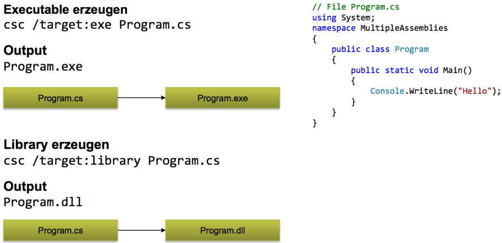

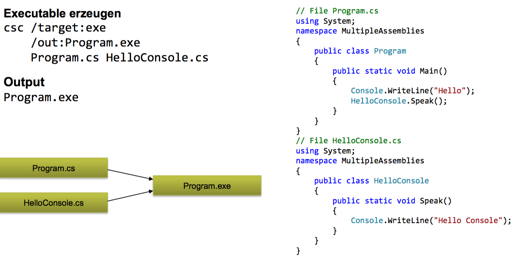

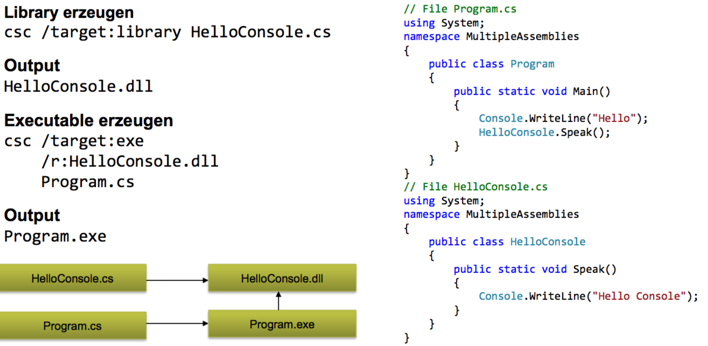

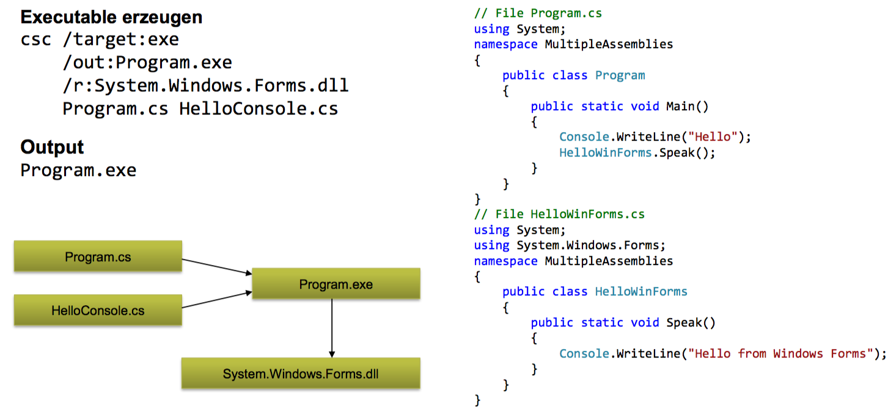

## Common Type System

Single-rooted Typsystem

> Alle Typen sind von System.Object abgeleitet (auch int, float usw.)

2 Kategorien von Typen: Reference/Value Types

Boxing/Unboxing automatisch

Polymorphismus mit `System.Object` unterstützt daher auch int usw.

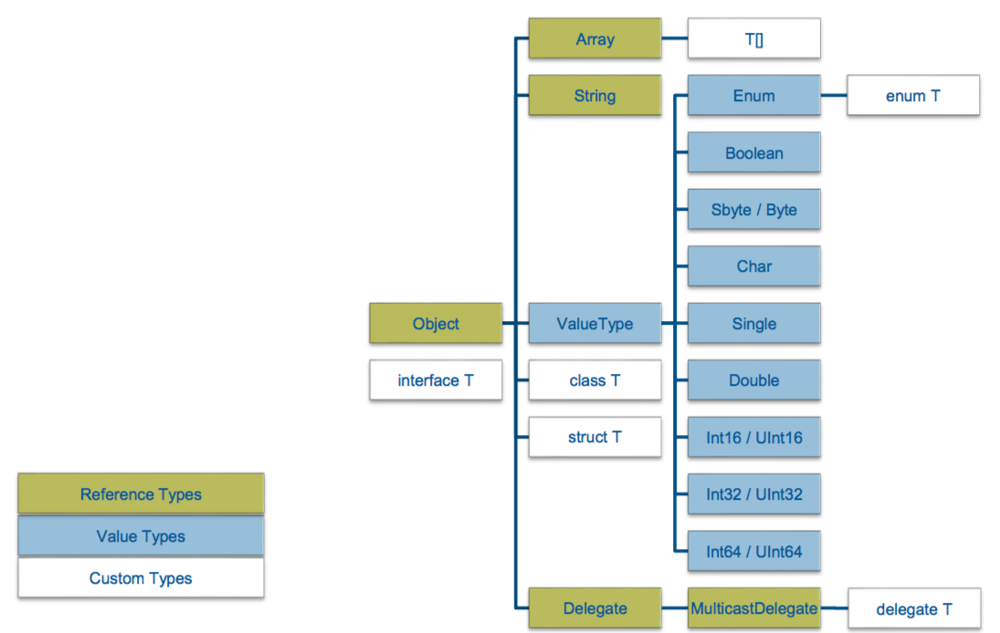

|                          | Reference (Class) | Value (Struct)     |
| ------------------------ | ----------------- | ------------------ |
| Speicherort              | Heap              | Stack              |
| Variable enthält         | Referenz          | Wert               |
| Nullwerte                | Möglich           | Nie                |
| Default Value            | null              | 0 \| false \| `\0` |
| Zuweisung/Methodenaufruf | Kopiert Referenz  | Kopiert Wert       |
| Ableitung möglich        | Ja                | Nein (sealed)      |

## Reference Types

> Objekt hat Referenz auf seine Typbeschreibung!

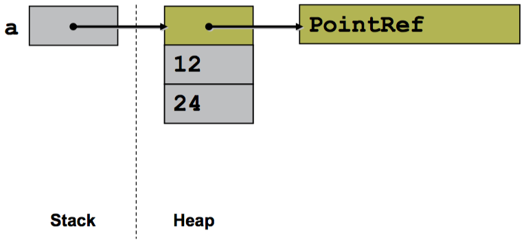

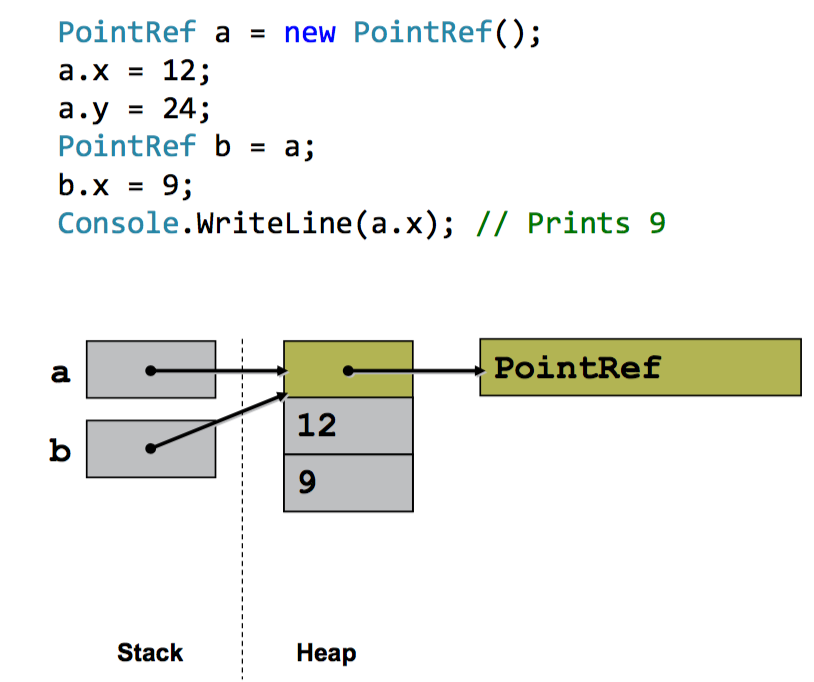

## Value Types

Keine Garbage Collection nötig, da auf Stack!

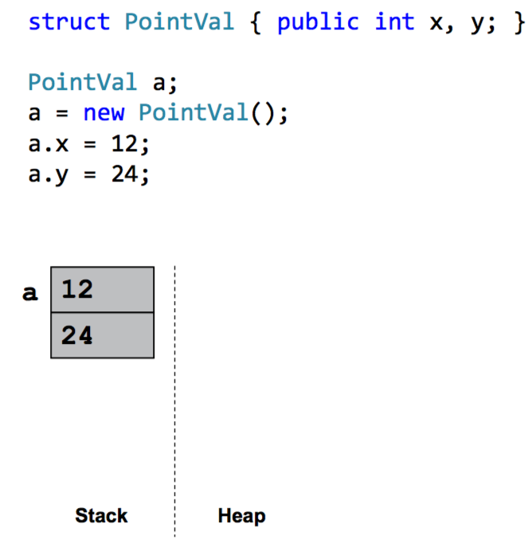


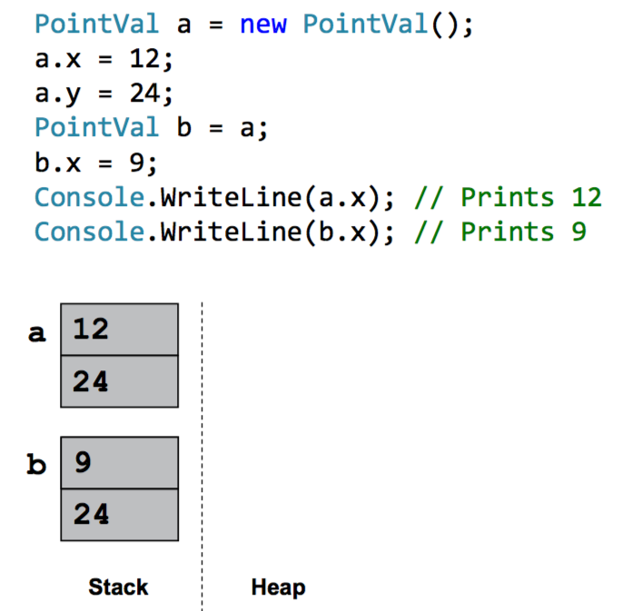


## Vergleich

* Reference Types: Objekt-Referenz wird kopiert
* Value-Types: Wert wird kopiert

## Boxing/Unboxing

Boxing automatisch (Up Cast), Unboxing Casting nötig (Down Cast)

```c#
System.Int32 i1 = 123;
System.Object obj = i1; // Boxing
System.Int32 i2 = (System.Int32)obj; // Unboxing
```


## CLS

Die CLS definiert eine Teilmene von Typen, die in interoperablen Schnittstellen verwendet werden können. Zum Beispiel sind unsigned-Typen verboten, oder Pointer-Typen und jagged-Arrays sind auch verboten.

Falls man Sprach-Interoperabilität möchte, muss CLS eingehalten werden

Beispiel:

* Server-Komponente in C#
* Client in VB.NET oder JScript

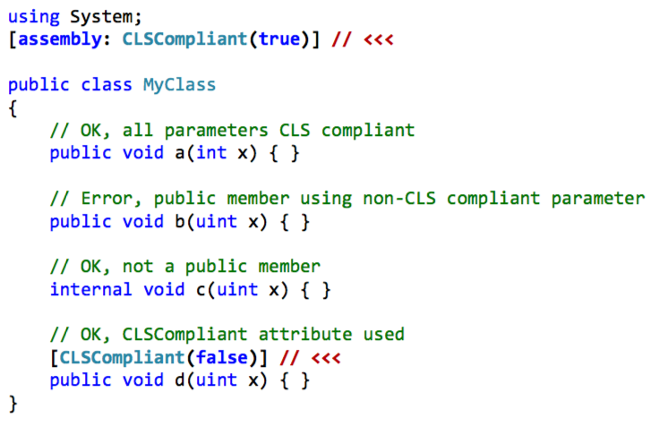

# C# Grundlagen

## Zahlen

Unicode

Case-sensitive

Wenn man Schlüsselwörter als Identifier verwenden möchte: `@` davorstellen (`@if`)

Unicode-Escape Sequenzen erlaubt

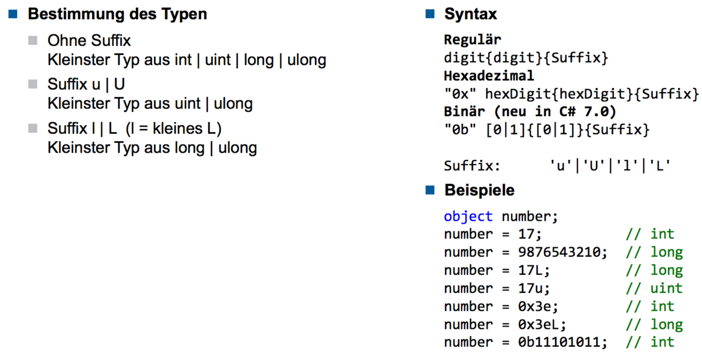

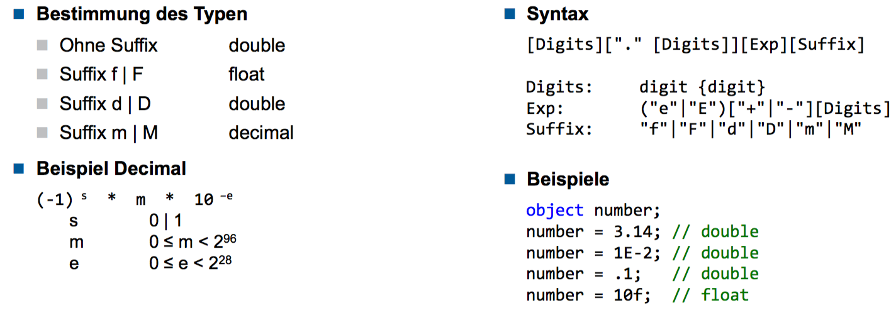

Ab C#7.0 auch `_` zur optischen Strukturierung von Zahlen. Wird vom Compiler schlichtweg entfernt.

## Zeichen/Zeichenketten

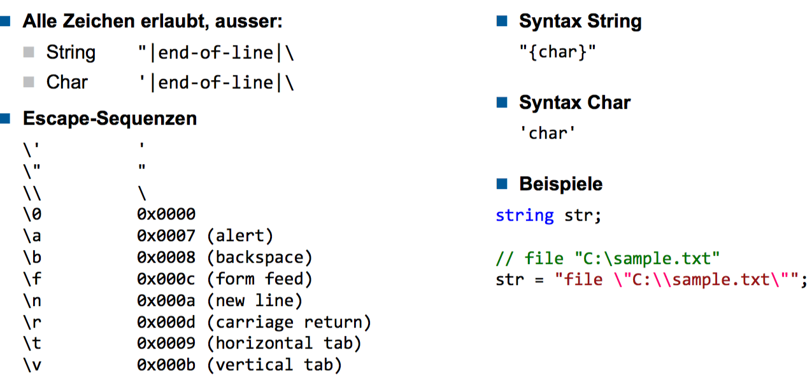 

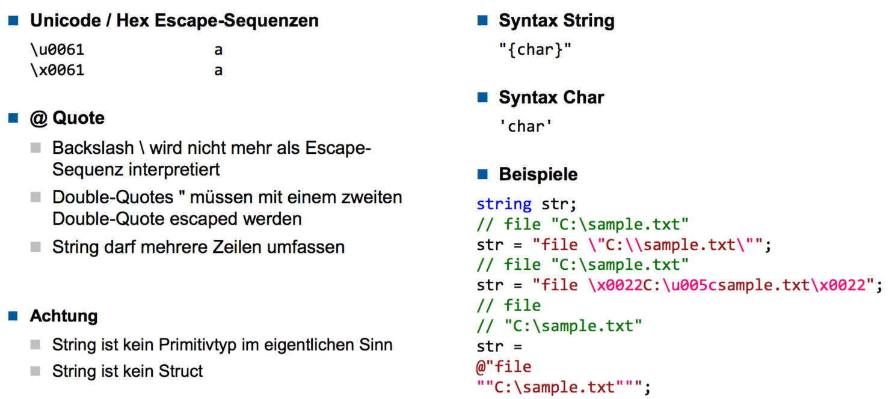

## Kompatibilität

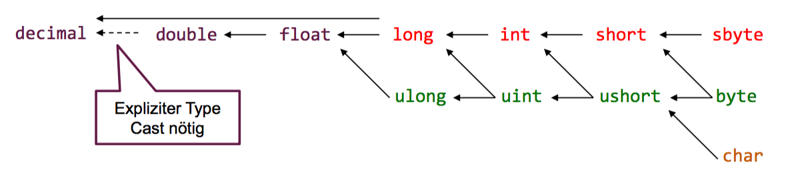

## Sichtbarkeit

| Attribut           | Beschreibung                             |
| ------------------ | ---------------------------------------- |
| public             | Überall sichtbar                        |
| private            | Innerhalb des jeweiligen Typen (Klasse / Struct) sichtbar |
| protected          | Innerhalb des jeweiligen Typen (Klasse / Struct) oder abgeleiteter Klasse sichtbar |
| internal           | Innerhalb des jeweiligen Assemblies sichtbar |
| protected internal | Innerhalb des jeweiligen Typen (Klasse / Struct) oder abgeleiteter Klasse sichtbaroderInnerhalb des jeweiligen Assemblies sichtbar |

| Typ       | Standard | Zulässig (Top-Level)* | Standard für Members | Zulässig für Members                     |
| --------- | -------- | --------------------- | -------------------- | ---------------------------------------- |
| class     | internal | public / internal     | private              | public<br />protected<br />internal<br />private<br />protected internal |
| struct    | internal | public / internal     | private              | public<br />internal<br />private        |
| enum      | internal | public / internal     | public               | –                                        |
| interface | internal | public / internal     | public               | –                                        |
| delegate  | internal | public / internal     | –                    | –                                        |

`*` gilt nicht für Nested Types