# Multi-Threading Grundlagen

## Prüfung: Hilfsmittel

> Ein A4-Blatt beidseitig bedruckt oder beschrieben

## Motivation

> The free lunch is over

Die Prozessoren werden seit 2003 nicht mehr sehr viel schneller, aber parallelisierter. Wir müssen Programme so schreiben, dass sie parallelisiert werden können.

## Parallelität und Nebenläufigkeit

**Parallelität (Parallelism)** ist die Zerlegung eines Ablaufs in mehrere Teilabläufe, welche gleichzeitig auf mehreren Prozessoren laufen. Ziel: schnellere Programme

**Nebenläufigkeit (Concurrency)** sind gleichzeitige oder verzahnt ausführbare Abläufe, welche auf gemeinsame Ressourcen zugreifen. Ziel: einfachere Programme

Sie arbeiten nach demselben Prinzip: mehrere Threads/Prozesse, die interagieren

> Writing correct programs is hard - writing correct concurrent programs is harder

## Prozesse vs. Threads

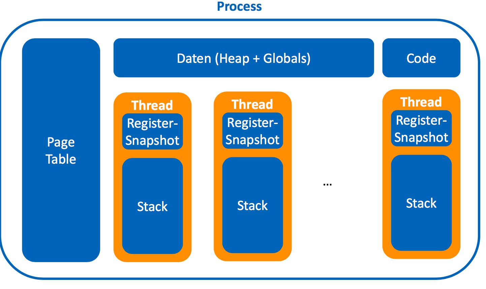

* Prozesse laufen parallel zueinander im System. Sie haben einen eigenen Adressraum.
* Threads laufen parallel zueinander innerhalb eines Programms. Sie teilen sich den Adressraum im Prozess.

## Threads

Threads haben jeweils einen Snapshot der Register sowie einen eigenen Stack. Es gibt User-Level Threads, wo sich der Programmierer selber um die Parallelität und Scheduling kümmern muss, und Kernel-Level Threads, wo der Kernel fürs Scheduling zuständig ist.

In Java erstellt die JVM für Java-Threads jeweils einen Kernel-Thread.

## Kontextwechsel

Mit dem Kontextwechsel bezeichnet man den Wechsel zu einem anderen Thread. Es gibt zwei Arten

**Synchron:** Warten auf Bedingung Der Thread wartet auf eine Bedingung, er kennzeichnet sich als Wartend, reiht sich ein und gibt den Prozessor frei.

**Asynchron:** Nach gewisser Zeit soll der Thread den Prozessor freigeben. Damit verhindert man,dass ein Thread dauerhaft den Prozessor belegt.

## Multi-Tasking

**Kooperativ:** Die Threads müssen explizit Kontextwechsel synchron initiieren. Der Scheduler kann einen laufenden Thread nicht unterbrechen

**Preemptiv:** Der Scheduler kann per Timer-Interrupt den laufenden Thread asynchron unterbrechen. Zum Beispiel mit Time-Sliced Scheduling: jeder Thread besitzt den Prozessor für einen maximalen Zeitintervall. Heutzutage wird in der Regel nur preemptiv gearbeitet.

# JVM Threads

Die JVM ist ein Single Process System. Sie erzeugt beim Aufstarten einen Thread, den Main-Thread, welcher die statische Methode ``main()`` aufruft. Der Programmierer kann dann weitere Threads starten.

Gewisse Subsysteme/Laufzeitsysteme starten auch eigene Threads, z.B. AWT oder der Garbage Collector.

Die JVM läuft, solange Threads laufen. Ausnahme hierzu sind Threads, die sich als Daemon markiert haben,auf diese wartet Java nicht (wie z.B. der Garbage Collector). **Daemon-Threads brechen bei JVM-Ende unkontrolliert ab**. Die JVM kann andererseits mit `System.exit()/Runtime.exit()` direkt terminiert werden, was aber unsauber ist. Alle Threads werden unkontrolliert abgebrochen.

## Erzeugung eines Threads

```java
class SimpleThread extends Thread { 
    @Override
    public void run() { // Thread implementieren
        // thread behavior
    } 
}
Thread myThread = new SimpleThread(); // Thread instanzieren

myThread.start(); // Thread starten
```

## Start und Ende

Der eigentliche Thread wird erst bei `start()` erzeugt. Er führt die `run()`-Methode des Objektes aus. Der Thread endet beim Verlassen von `run()`. Dies aus folgenden Gründen:

* Ende der Methode
* Return-Statement
* Unbehandelte Exception
  * andere Threads laufen weiter!

## Multi-Thread Beispiel

Achtung: dieses Beispiel ist nicht-deterministisch! Threads laufen ohne Vorkehrungen beliebig verzahnt oder parallel. Viele JVMs realisieren System-Outputs ohne Verzahnung oder Thread-Fehler, aber es ist nichts spezifiziert.

```java
class SimpleThread extends Thread { 
    private String label;
    private int nofIt; 
    public SimpleThread(String label, int nofIt) {
        this.label = label; this.nofIt = nofIt;
    } 
    @Override
    public void run() {
        for (int i = 0; i < nofIt; i++) {
            System.out.println(i + " " + label);
        } 
    } 
} 
public class MultiThreadTest {
    public static void main(String[] args) {
        new SimpleThread("A", 10).start();
        new SimpleThread("B", 10).start();
        System.out.println("main finished"); 
    } 
}
```

Feinheiten: Wenn man statt ``start()`` ``run()`` aufruft, wird nur die Methode aufgerufen und folglich sequentiell abgearbeitet.

## Runnable

Runnable sind Alternative zum Vererben von Thread. Runnable ist ein Interface statt eine Klasse, von der man erben muss (wie Thread), so dass man eine andere Basisklasse angeben kann.

Wichtig: hier ist das "automatische" Casting Thread <==> Runnable nicht gegeben, darum instanziert man einen *Thread* mit dem Runnable als Argument.

```java
class SimpleLogic implements Runnable {
    @Override
    public void run() {
        // thread behavior
    }
}

Thread myThread = new Thread(new SimpleLogic());

myThread.start();
```

## Lambda

Weil ``Runnable`` nur ``run()`` implentiert (nur eine Methode), können wir es mit einem Lambda direkt behandeln.

```java
Thread myThread = new Thread(() -> {
    // thread behavior
});

myThread.start();
```

Oder auch

```
new Thread(() -> simpleLogic("A" 10)).start(); // simpleLogic gegeben
```

Achtung: Lambdas sind effectively final. Das bedeutet für den Zugriff auf Variablen/Parameter der umgebenden Methode:

* Variablen/Parameter müssen implizit final sein
* Auch ohne final-Deklaration
  * Ansonsten gibt es einen Compile-Fehler

```java
void startMyThread(String label, int nofIt) { 
    new Thread(() -> {
        for (int i = 0; i < nofIt; i++) {
            System.out.println(i + " " + label);
        } 
    }).start();
}
```

## Passivierung

* Die Thread-Klasse bietet zwei statische Methoden.
  `Thread.sleep(milliseconds)` Der laufende Thread geht in den Wartezustand. Nach Ablauf der Zeit wird er wieder Ready
* `Thread.yield()` Der laufende Thread gibt den Prozessor frei, wird aber direkt wieder ready. Dies provoziert mehr Thread-Wechsel.


## Thread Join: Warten auf Beendigung eines Threads

`t.join()`: blockiert solange bis `t` terminiert ist. Nach Join gilt: `!t.isAlive()`.

Ein Zugriff auf Variablen von `t` ist erst nach dem Join sicher, dort könnten z.B. die Resultate des Threads gespeichert sein.

```java
Thread threadA = new SimpleThread("A", 100);
Thread threadB = new SimpleThread("B", 100);
System.out.println("Threads start");
threadA.start();
threadB.start();
try {
    threadA.join();
    threadB.join();
    System.out.println("Threads joined");
} catch (InterruptedException e) { }
```

Feinheiten: falls ein Thread noch nicht gestartet wurde, kehrt ``join()`` sogleich zurück.

## InterruptedException

Ist eine mögliche Exception bei blockierenden Aufrufen wie `sleep()` oder `join()`. Die Threads können auch von aussen mit `myThread.interrupt()` unterbrochen werden!

`interrupt()` ist für kooperatives Canceling gedacht. Nur verwenden, wenn die Cancel-Policy des Threads bekannt ist!

Sie wird oft zum Aufbrechen von Blockaden missbraucht. Dabei hinterlässt sie meist inkonsistente Zwischen-zustände, oder die Exception wird ignoriert und es wird weiter blockiert.

Achtung: Daemons hören nicht auf ``ÌnterruptedException``s! http://stackoverflow.com/questions/31252227/how-does-daemon-thread-survive-after-jvm-exits

## Weitere Thread-Methoden

* ``static Thread currentThread()`` Gerade ausführendeThread-Instanz
* `void setDaemon(boolean on)` Thread als Daemon markieren, standardmässig false
* `String getName(), void setName(String name)` Thread-Name einstellen.
  * Beim Konstruktor `Thread(String name), Thread(Runnable r, String name)`
  * Für diagnostische Ausgaben: Default: Thread-0, Thread-1, ...

## Java Thread Lifecycle

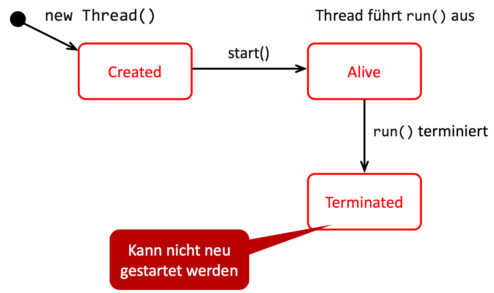

Dazu gibt es zu *Alive* noch Unterzustände

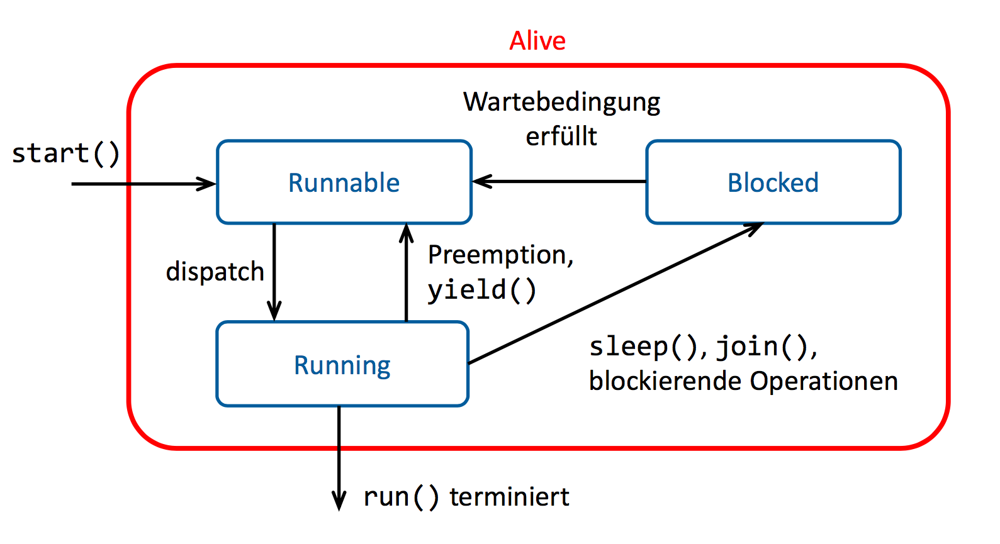

Achtung: frühere suspend/resume/stop Aufrufe sind veraltet, dies ist/war ein Java Designfehler.

# Synchronisation

Ohne Vorkehrungen laufen Threads beliebig verzahnt oder parallel. Oft muss die Nebenläufigkeit von Threads aber beschränkt werden.

> Synchronisation = Einschränkung der Nebenläufigkeit

## Fälle für Synchronisation

**Gegenseitiger Ausschluss (mutual exclusion:** nur einer darf die Kaffeemaschine auf einmal benutzen, nur eine Vorlesung zur gleichen Zeit im gleichen Raum

**Warten auf Bedingungen:** Post erst abholen, wenn sie angeliefert worden ist, Telefon: erst reden wenn Gegenstelle abgenommen hat 

## Zugriff auf gemeinsame Ressourcen

Threads können gleichzeitig auf dasselbe zugreifen:

* Instanzvariablen
* Statische Variablen
* Elemente in einem Array
* (Java 8: lokale Variablen nur lesend)

Diese Zugriffe müssen genügend synchronisiert sein, sonst gibt es unkontrollierte/falsche Interaktionen zwischen Threads (*Race Conditions*)

## Race Conditions

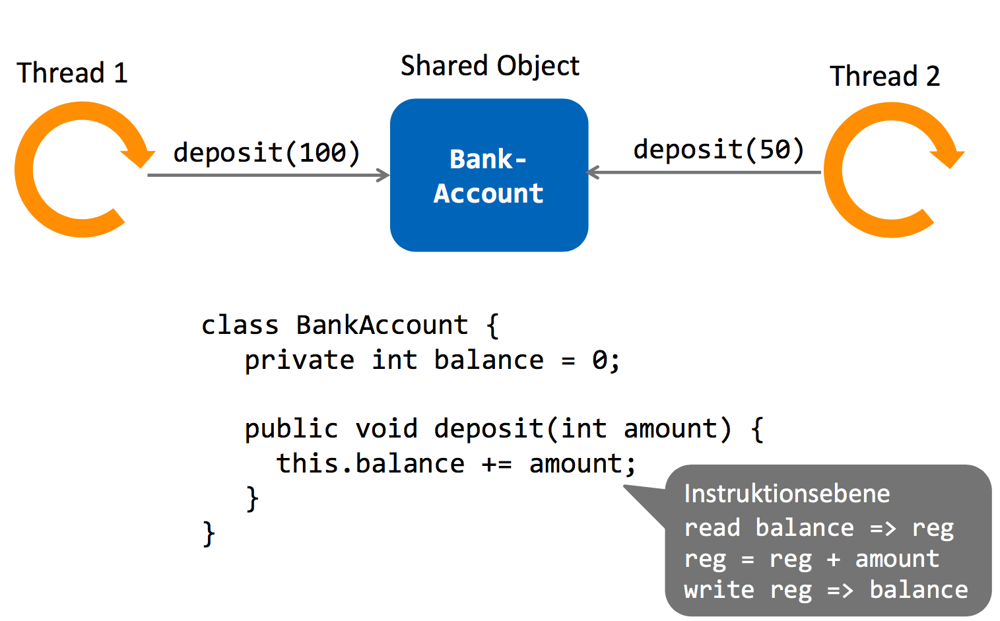

Dabei kann es dann zum Beispiel zu diesem Szenario kommen. Andere Szenarien sind denkbar, auch solche bei denen es zufällig korrekt läuft. Das ist das Gefährliche an Race Conditions, denn sie können auch manchmal korrekt laufen.

| Thread 1                        | Balance           | Thread 2                       |
| ------------------------------- | ----------------- | ------------------------------ |
| read balance => reg (reg == 0)  | 0                 |                                |
|                                 | 0                 | read balance => reg (reg == 0) |
| reg = reg + amount (reg == 100) | 0                 |                                |
|                                 | 0                 | reg = reg + amount (reg == 50) |
| write reg => balance            | 100               |                                |
|                                 | 50 (erwartet 150) | write reg => balance           |

## Kritische Abschnitte

Um dies aufzulösen, muss man `deposit` als kritischen Abschnitt kennzeichnen (*Critical Section*). Ein kritischer Abschnitt ist nur von einem Thread zur gleichen Zeit ausführbar, er braucht gegenseitigen Ausschluss.

## Naiver Ansatz

```java
class BankAccount {
  private int balance = 0;
  private boolean locked = false
  
  public void deposit(int amount) {
    while(locked) {} // busy waiting loop
    locked = true; // enter 
    this.balance += amount;
    locked = false; // exit
  }
}
```

Die Schlaufe und die Zuweisung sind aber nicht atomar! Es kann zu folgendem Szenario kommen

| Thread 1                             | locked | Thread 2                             |
| ------------------------------------ | ------ | ------------------------------------ |
| Read locked in loop (locked = false) | false  | Read locked in loop (locked = false) |
| Write locked = true                  | true   | Write locked = true                  |
| Critical Section                     |        | Critical Section                     |

## Gegenseitiger Ausschluss

>  Die korrekte Implementierung ist nicht trivial!

Es gibt Algorithmen wie Dekker, Peterson, Lamport's Bakery, sowie atomare Compare-and-Set Instruktionen.

Sie muss auch Weak Memory Consistency beachten. Man braucht Memory Fences (z.B. `volatile` Keyword)

Ein Busy Waiting ist zu teuer für lange Wartezeiten oder 1 CPU; Warteschlagen sind zu teuer für sehr kurzes Warten bei Multi-CPU

=> wir brauchen vorgefertigte Synchronisationsmechanismen

## Synchronized

Mit dem Java ``synchronized``-Keyword können Methoden mit gegenseitigem Ausschluss abgesichert werden. Der Body der Methode ist dann ein kritischer Abschnitt. 

```java
class BankAccount {
  private int balance = 0;
  
  public synchronized void deposit(int amount) {
    this.balance += amount;
  }
}
```

Jedes Objekt erbt von ``Object`` den Monitor-Lock. Maximal ein Thread kann denselben Lock haben. Der ``synchronized``-Block belegt den Lock des Objekts. 

* Bei Eintritt wird der Lock besetzt
  * sonst warten bis frei
* Bei Austritt: wieder freigeben

### Mehrere Methoden

Das Keyword ``synchronized`` kann auch bei mehreren Methoden stehen. Dabei gilt weiterhin, dass der Lock nur einmal pro Objekt existiert. Das Beispiel von vorhin erweitert:

```java
class BankAccount {
  private int balance = 0;
  
  public synchronized void deposit(int amount) {
    this.balance += amount;
  }
  
  public synchronized boolean withdraw(int amount) {
    if(amount > this.balance) {
      this.balance -= amount;
      return true
    } else { // keine Kreditbank
      return false;
    }
  }
}
```

In diesem Code schliessen sich zwei gleichzeitige Aufrufe von ``deposit()`` und ``withdraw()`` in jeglichen Kombinationen aus.

### Schachteln (Selbststudium)

Es ist möglich, `synchronized`-Methoden zu schachteln, also zum Beispiel so:

```java
public class NestedLocks
{
    public synchronized void methodOuter() {
        System.out.println(Thread.currentThread() + " says Hi from methodOuter!");
        methodInner();
    }

    private synchronized void methodInner() {
        System.out.println(Thread.currentThread() + " says Hi from methodInner!");
    }
}

public class Main {
    public static void callMethod(NestedLocks nestedLocks) {
        nestedLocks.methodOuter();
    }

    public static void main(String[] args) {
        NestedLocks nestedLocks = new NestedLocks();
        new Thread(() -> callMethod(nestedLocks)).start();
        new Thread(() -> callMethod(nestedLocks)).start();
    }
}

/*
Thread[Thread-0,5,main] says Hi from methodOuter!
Thread[Thread-0,5,main] says Hi from methodInner!
Thread[Thread-1,5,main] says Hi from methodOuter!
Thread[Thread-1,5,main] says Hi from methodInner!
*/
```

Dazu gibt es aber noch Feinheiten die später in der Vorlesung behandelt werden. Es soll hier nur gesagt werden, dass es grundsätzlich möglich ist.

Aus der [Java-Dokumentation für Reentrant Locking](http://download.oracle.com/javase/tutorial/essential/concurrency/locksync.html)

> a thread can acquire a lock that it already owns

### Funktion vs. Block

``synchronized`` kann auch in der Block-Variante verwendet werden. Dort kann angegeben werden, welches Objekt gelockt werden soll. Es ist dann auch nicht die ganze Methode gelockt, sondern nur dieser Block:

```java
public void deposit(int amount) {
  synchronized(this) {
    this.balance += amount;
  }
}
```

#### Äquivalenzen

```java
public class Test {
  synchronied void f() {...} // Object Lock
  static synchronized void g() {...} // Class Lock
}
```

$$
\iff
$$

```java
public class Test {
  void f() {
    synchronized(this) {...} // Object Lock
  }
  static void g() {
    synchronized(Test.class) {...} // Class Lock
  }
}
```

### Exit aus Synchronized Block

Der Lock wird bei jedem Exit freigegeben

* Ende des Blocks
* Return-Statements
* Unbehandelte Exception

### Rekursive Locks

Gleicher Thread kann denselben Lock mehrfach beziehen, z.B. durch geschachtelte Aufrufe. Der Lock wird erst beim letzten Release freigegeben. Realisiert wird dies intern durch einen Counter. Beispiel:

```java
synchronized void limitedDeposit(int amount) {
  if(amount + balance <= limit) {
    deposit(amount)
  }
}
synchronized void deposit(int amount) {...}
```

## Monitor - Warten auf Bedingungen

Angenommen, unsere ``withdraw()``-Methode wäre gutgläubig und geduldig wenn man zuwenig Geld hat. Anstatt einen Fehler zurückzugeben, wartet sie ab, bis genügend Geld vorhanden ist.

```java
public synchronized void withdraw(int amount) throws InterruptedException {
  while (amount > this.balance) {
    Thread.sleep(1);
  }
  this.balance -= amount;
}

public synchronized void deposit(int amount) {
  this balance += amount;
}
```

Das Problem ist, dass dieser Ansatz sehr naiv ist. Wenn nun eine Methode im ``withdraw()`` wartet, hat sie ja bereits den Lock des Objekts - das bedeutet, niemand kann die ``deposit()``-Methode aufrufen. Es kann also gar nie Geld ankommen.

``sleep()`` und ``yield()`` geben den Lock nicht frei. Zudem ist das Pollen in Zeitabständen ineffizient. Was lernen wir daraus? 

> ``synchronized`` ist nicht für Wartebedingungen.

Wir benötigen den *Wait & Signal*-Mechanismus des Monitors. 

### Monitor

Ein Monitor ist ein Objekt mit internem, gegenseitigen Ausschluss. Nur ein Thread operiert zur gleichen Zeit im Monitor. Nicht-private Methoden sind alle ``synchronized``, alle Variablen privat.

Im Wait & Signal-Mechanismus können Threads im Monitor auf Bedingung warten. Threads können die Bedingung signalisieren und wartende Threads aufwecken.

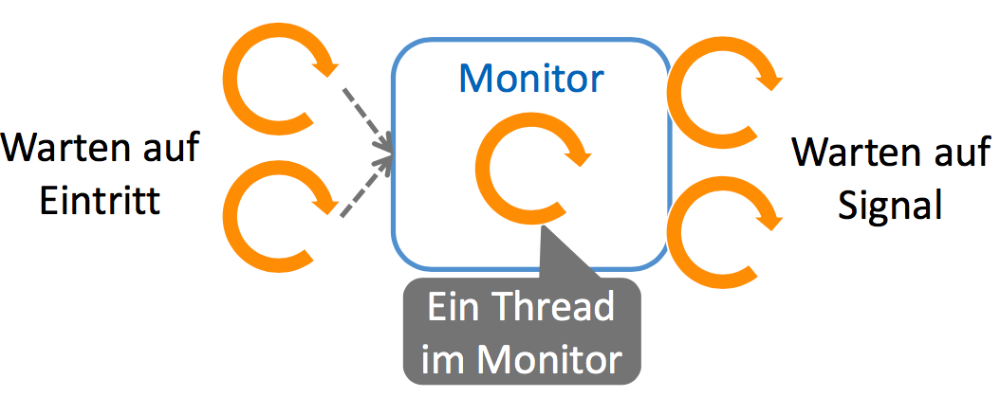

### Beispiel

```java
class BankAccount {
  public int balance = 0;
  
  public synchronized void withdraw(int amount) throws InterruptedException {
    while (amount > balance) {
      wait(); // warte bis geweckt und prüfe erneut
    }
    balance -= amount;
  }
  
  public synchronized void deposit(int amount) {
    balance += amount;
    notifyAll(); // wecke alle
  }
}
```

### Details

Wieso funktioniert das? ``wait`` gibt den Monitor-Lock temporär frei, damit ein anderer Thread die Bedingung im Monitor erfüllen kann.

``wait``macht:

1. In Warteraum gehen
2. Monitor freigeben
3. (Inaktiv bis zum Wecksignal)
4. Monitor neu beziehen

Wecksignal: signalisieren einer Bedingung im Monitor

* ``notify()``weckt *einen* **beliebigen** wartenden Thread im Monitor
* ``notifyAll()`` weckt alle im Monitor wartende Threads
* kein Effekt, falls kein Thread wartet

Beim Aufruf von `notify[All]` Methoden: *Signal and continue*

1. weckt man (alle) Thread(s) in ``wait``
2. Behält man den Monitor und macht weiter

Beim Beispiel stellen sich zwei Fragen:

* Wieso wird hier `notifyAll()` verwendet (warum liegt denn hier Stroh rum)?
  * mit `notify` würde ich nur einen beliebigen Thread wecken
  * wenn dessen Bedingung nicht erfüllt ist, legt er sich wieder schlafen und macht nichts (er weckt auch keine anderen Threads deren Bedingung vielleicht erfüllt wäre) 
* Wieso ist das Warten in einer Schlaufe?
  * wenn ich aufgeweckt werde, bedeutet es nicht dass nun genügend Geld vorhanden ist
  * entweder wurde immer noch zuwenig Geld eingezahlt
  * oder ein anderer Thread der aufgeweckt wurde hat das Geld bereits wieder abgebucht, so dass es nun wieder zu tief ist

Für den Moment kennen wir nur pauschales Wait & Signal. Ich muss selber schauen, ob nach dem Signal die Bedingung nun erfüllt ist.

``wait()``, ``notify()`` und ``notifyAll()`` sind nur im ``synchronized``-Block verwendbar, ansonsten gibt es eine ``IllegalMonitorStateException``. Bei ``wait`` mit rekursiven Locks, werden alle gehaltenen Locks *auf diesem Objekt* (und nur auf diesem) temporär freigegeben.

Gründe zum Aufwachen aus ``wait()``: 

* ``notifyAll()``, ``notify()``
* InterruptedException
* Spurious Wakeup (eher akademisch)

### Funktionsweise des Monitors

Der Monitor unterscheidet den äusseren und den inneren Warteraum.

Ein Thread kommt erstmal am äusseren Warteraum an, bis er den Monitor betreten kann (den Lock besetzen). Falls ein Thread den Lock besitzt, ist er im Monitor.

Ruft er innerhalb des Monitors ``wait`` auf, wandert er in den inneren Warteraum und gibt den Lock frei. Nun kann ein anderer Thread den Lock besetzen. Von dort kann er irgendwann die Wartenden benachrichtigen (im inneren Warteraum), er behält den Lock aber noch.

Die Aufgeweckten wandern dann in den äusseren Warteraum, wo sie (wie alle anderen Threads) auf den Wiedereintritt in den Monitor warten. Sie können nicht in den Monitor zurück, dort ist ja der signalisierende Thread drin. Sie kämpfen neu um den Monitor-Eintritt, wie alle anderen eintrittswilligen Threads.

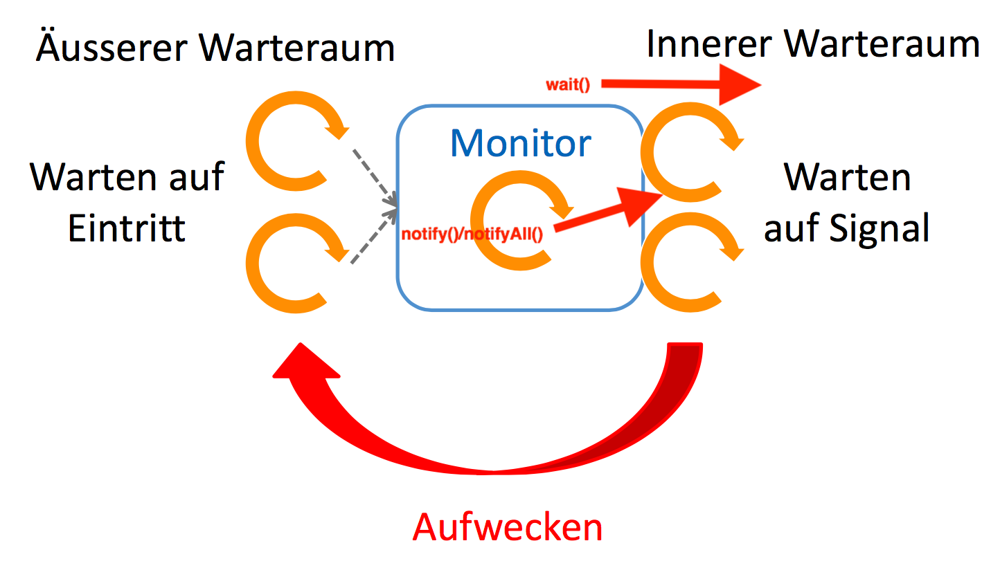

### Typische Fallen/Antipattern (bei Wartebedingungen)

**Bedingung prüfen mit ``if``:** das Signal sagt nur, dass man nun nochmals prüfen soll, nicht dass es nun erfüllt ist. Darum:

> Immer mit ``while`` prüfen

**Bei Wartebedingung nur mit ``notify()`` signalisieren:** es kann sein, dass sich für beide Bedingungen eines Werts (z.B. *nicht leer* und *nicht voll*) mehrere Threads anstauen. ``notify()`` weckt aber nur *irgendeinen* Thread auf. Falls dieser Thread auch auf irgendeine Bedingung wartet, wird kein anderer Thread aufgeweckt, der weitermachen kann.

> Immer ``notifyAll()`` verwenden

### Effizienz-Probleme

Bei mehreren Wartebedingungen

* `notifyAll()`: wecke prophylaktisch immer alle
* alle treten nacheinander in Monitor ein
  * für einen ist Bedingung erfüllt
  * andere rufen wieder `wait()` auf

Es gibt also viele Kontextwechsel und hohe Synchronisationskosten.

### Fairness-Probleme

In Java gibt es keine garantierte FIFO-Warteschlange. Einige Threads könnten so nie drankommen. Bei Signal-and-Continue kommen aufgeweckte Threads in den äusseren Warteraum und können kontinuierlich überholt werden. Es ist aber auch bei FIFO-Warteschlangen (.NET) nicht garantiert fair, da *hinten* eingereiht wird (es kommen erst die bereits aussen wartenden Threads dran)

# Spezifische Synchronisationsprimitiven

## Wann reicht ein Single Notify?

* Nur eine semantische Bedingung (Uniform Waiters)
  * Bedingung interessiert **jeden** wartenden Thread
* Bedingung gilt jeweils nur für einen (One-In/One-Out)
  * Nur ein **einziger** wartender Thread kann weitermachen

Fairness-Problem in Java: weckt beliebigen Thread - Grund für `notifyAll()`, garantiert aber auch keine Fairness

## Monitor

Vorteil: sehr mächtiges Konzept

* jede Synchronisation damit realisierbar
* OO-Einbettung (Synchronisation in Objekt gekapselt)

Nachteil: nicht für alles optimal

* muss Logik selber implementieren
* Effizienzprobleme
* Fairnessprobleme

Alternative: weitere spezifische Synchronisationsprimitiven

## Semaphor

Vergabe einer beschränkten Anzahl freier Ressourcen

* Objekt mit Zähler, Zähler = Anzahl noch freier Ressourcen
* Methode `acquire()` 
  * beziehe freie Ressource, dekrementiere Zähler
  * warten, falls keine verfügbaren Zähler
* Methode `release()`
  * Ressource freigeben, Zähler inkrementieren

```java
Semaphore s = new Semaphore(3); // Initialisierung mit 3 freien Ressourcen

s.acquire(); // bezieht freie Ressource, wartet wenn keine verfügbar
s.release(); // gibt Ressource frei, benachrichtigt Wartende
```

### Nachbau mit Monitor

```java
public class Semaphore {
  private int value;
  
  public Semaphore(int initial) {
    value = initial
  }
  
  public synchronized void acquire() throws InterruptedException {
    while (value <= 0) {
      wait();
    }
    value--;
  }
  
  public synchronized void release() {
    value++;
    notify(); // hier nicht garantiert fair
  }
}
```

### Arten von Semaphoren

Allgemeine Semaphore (Zähler zwischen 0 bis N)

* `new Semaphore(N)`
* Bis zu N Threads können gleichzeitig akquiriert haben
* Für Quotas, Service Throttling, etc.

Binäre Semaphore (Zähler nur 0 oder 1)

* `new Semaphore(1)`
* Für gegenseitigen Ausschluss (1 = offen, 0 = geschlossen)

In Java kann der Zähler auch negativ initialisiert werden (nicht so in anderen Systemen wie Windows oder .NET)

### Faire Semaphore

`new Semaphore(N, true)`

* Benutzt FIFO-Warteschlange für Fairness
* Langsamer als unfaire Variante
* Default ist unfair (ohne Parameter)

### Anwendung

```java
class BoundedBuffer<T> {
  private Queue<T> queue = new LinkedList<>();
  private Semaphore upperLimit = new Semaphore(CAPACITY, true); // freie Kapazität
  private Semaphore lowerLimit = new Semaphore(0, true);
  
  public void put(T item) throws InterruptedException {
    upperLimit.acquire(); // reduziere Kapazität, "darf ich noch dazu tun"?
    synchronized (queue) {
      queue.add(item);
    }
    lowerLimit.release(); // erhöhe Inhalt, "wer was wegnehmen will darf jetzt"
  }
  
  publidc T get() throws InterruptedException {
    T item;
    lowerLimit.acquire(); // reduziere Inhalt, "darf ich wegnehmen?"
    synchronied (queue) {
      item = queue.remove();
    }
    upperLimit.release(); // erhöhe Kapazität, "wer was dazu tun will, darf jetzt"
    return item;
  }
}
```


Man kann dies auch nur mit Semaphoren gestalten, indem man das `synchronized` herausnimmt.

Man braucht dann ein zusätzliches Field `Semaphhore mutex = new Semaphore(1, true)`. Nun ersetzt man alle `synchronized` Blöcke mit `mutex.acquire()` bzw. `mutex.release()`.

Falls man hier ein try-catch verwendet, sollte man das `release` im finally verwenden.

### Multi-Acquire/Release

Mehr als eine Ressource anfordern und freigeen

* `acquire(int permits)`
  * wartet, solange Zähler < permits ist
  * Zähler -= permits
* `release(int permits)`
  * Zähler += permits

### Diskussion

* Sehr mächtig
* ber relativ low-level
  * beim Buffer wollen wir ineffiziente `notifyAll` vermeiden
  * Signalisierung spezifischer Bedingungen gewünscht
    * nicht leer
    * nicht voll

## Lock & Condition

Monitor mit mehreren Wartelisten für verschiedene Bedingungen

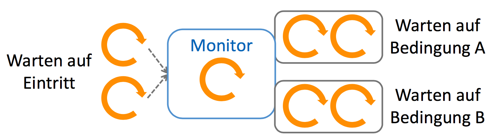

### Hintergrund

* Unabhängig vom eingebauten Java Monitor
  * Kein `synchronized`, `wait`, `notify` und `notifyAll`.
* Spezifische Synchronisationsprimitiven über API
  * kann benutzt werden, um eigenen Art Monitor zu bauen

### Primitiven

* Lock-Objekt: Sperre für Eintritt in Monitor
  * äussere Warteliste
* Condition-Objekt: Wait & Signal für bestimmte Bedingungen
  * innere Warteliste
* mehrere Conditions pro Lock (d.h. Monitor) möglich

### Buffer mit Lock & Conditions

```java
class BoundedBuffer<T> {
  private Queue<T> queue = new LinkedList<>();
  
  private Lock monitor = new ReentrantLock(true); // Fairness aktivieren
  private Condition nonFull = monitor.newCondition();
  private Condition nonEmpty = monitor.newCondition();
  
  public void put(T item) throws InterruptedException {
    monitor.lock();
    try {
      while (queue.size() == Capacity) { // Schlaufe wegen Überholproblem und Spurious Wakeup
        nonFull.await();
      }
      queue.add(item);
      nonEmpty.signal();
    } finally {
      monitor.unlock();
    }
  }
  
  publidc T get() throws InterruptedException {
    monitor.lock();
    try {
      while (queue.size() == 0) { 
      	nonEmpty.await();
      }
      T item = queue.remove();
      nonFull.signal();
      return item;
    } finally {
      monitor.unlock();
    }
}
```

## Read-Write Lock

Gegenseitiger Ausschluss ist unnötig strenf für rein lesende Abschnitte

* Erlaube parallele Lese-Zugriffe (Reader)
* Gegenseitiger Ausschluss bei Schreib-Zugriffen (Writer)

| Parallel | Read | Write |
| -------- | ---- | ----- |
| Read     | Ja   | Nein  |
| Write    | Nein | Nein  |

```java
ReadWriteLock rwLock = new ReentrantReadWriteLock(true);

rwLock.readLock().lock();
// read-only access
rwLock.readLock.unlock();

rwLock.writeLock().lock();
// write (and read) accesses
rwLock.writeLock().unlock();
```

Wichtig: falls schreibender Zugriff in Abschnitt *involviert* (nicht nur) => Write Lock. 

Angenommen, man will etwas lesen und dann später etwas schreiben. Der naive Ansatz ist:

```java
rwLock.readLock().lock();
  // read something
  // oh, we need to write something too
  rwLock.writeLock().lock();
      // write
  rwLock.writeLock.unlock();
rwLock.readLock().unlock();
```

Das wird aber nicht funktionieren. Es darf ja bei einem Readlock kein Writelock geben. Somit wird der innere Lock nie gegeben.

Die richtige Variante ist, von Anfang an Write-Locks zu verwenden wenn man in einem Abschnitt schreiben muss

### Read-Write Lock mit Conditions

Nur auf Write-Lock möglich! Sonst Exception

## Zeitliche Synchronisationsprimitiven (folgende)

Bisher hatten wir Synchronisationsprimitiven zum *Schutz von Shared-Ressourcen bei Multi-Threading*. Es gibt aber noch Synchronisationsprimitiven zum zeitlichen Synchronisieren von mehreren Threads

### Beispiel Autorennen:

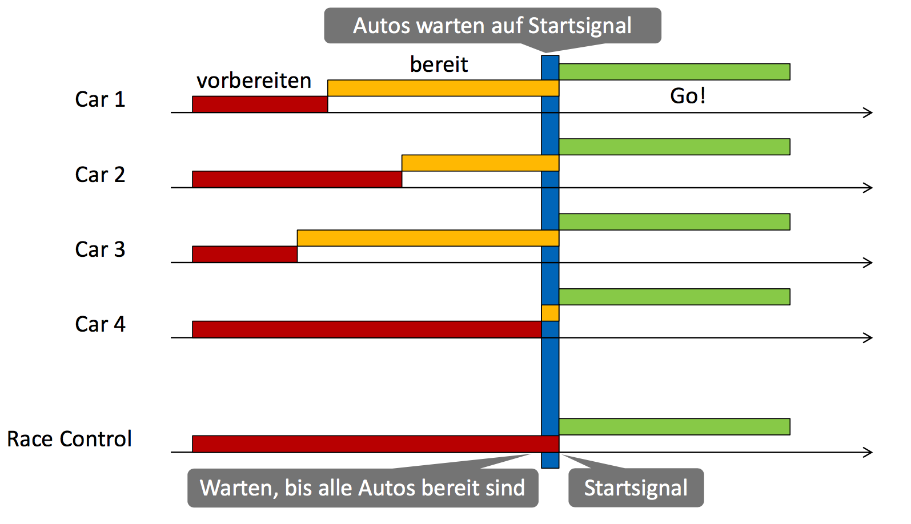

Beispiel-Logik:

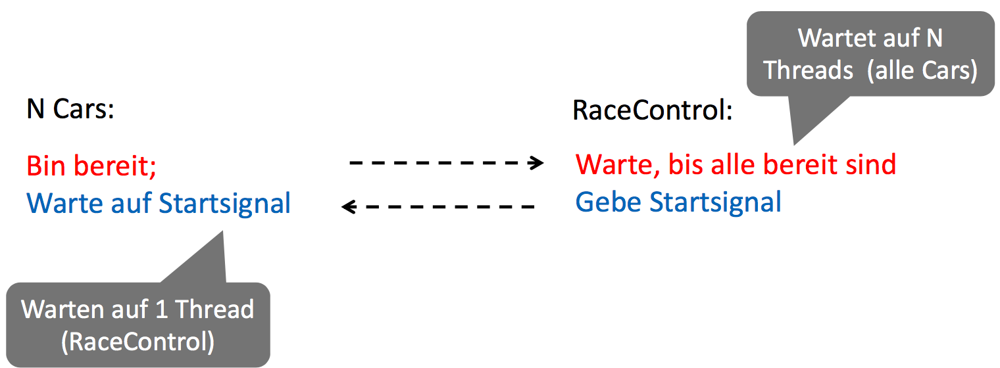

### Synchronisationspunkt

Anzahl Threads warten auf eine Bedingung. Nach Erfüllung der Bedingung laufen alle weiter

Beispiele:

* Autos warten auf Startsignal
* Player warten alle aufeinander

## Latch (Count Down Latch)

Synchronisationsprimitive mit Count Down Zähler

* Threads können warten, bis Zähler <= 0 wird
  * `await()`: warten dass Count Down 0 ist
* Threads können runterzählen
  * `countDown()`: Zähler um 1 dekrementieren
* Ähnlich zu Semaphore
  * Semaphore blockiert bei 0 (<= 0)
  * Count Down Latch blockiert bei > 0

Beispiel mit Count Down Latch

```java
CountDownLatch carsReady = new CountDownLatch(N); // N cars
CountDownLatch startSignal = new CountDownLatch(1); // einer gibt Signal
```

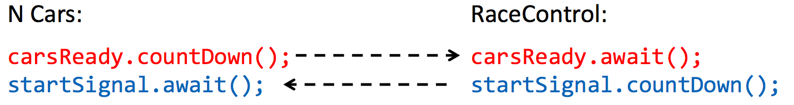

Die linke und die rechte Variante sind die Thread-Methodenbodys der jeweiligen Art. 

### Analoge Lösung mit Semaphoren

```java
Semaphore readyCars = new Semaphore(0);
Semaphore startAllows = new Semaphore(0);
```

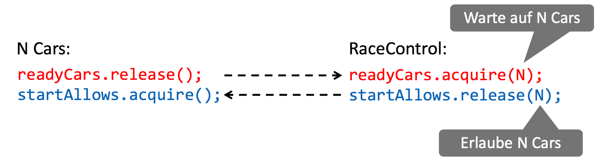

### Details (Latches)

Synchronisiert Anzahl Threads auf Anzahl Ereignisse

* Ereignisse = Count Down Operation
* Synchronisation: warten bis Count Down Zähler <= wird

Auslösen der Ereignisse

* durch beliebige Threads
* an beliebigen Stellen
* `countDown()` blockiert nie

Latches sind nur einmalig verwendbar

* Count Down Zähler lässt sich nicht wieder hochsetzen
* Neue Synchronisation = neue Latch-Instanz

## Barrier (Cyclic Barrier)

Treffpunkt für fixe Anzahl Threads

* Threads warten, bis alle angenommen sind
* Warten am Treffpunkt mit `await()`

Anzahl treffender Threads muss vorgegeben sein

* `await()` blockiert, bis so viele Threads `await()` aufgerufen haben

Cyclic Barrier ist wiederverwendbar

* Threads können sich in mehreren Runden bei der gleichen Barriere synchronisieren

Beispiel:

```java
CyclicBarrier raceStart = new CyclicBarrier(N);

// N cars
raceStart.await(); // Autos fahren direkt los, sobald alle da sind

// brauche kein Race Control mehr!
```

### Wiederholte Barriere

```java
CyclicBarrier gameRound = new CyclicBarrier(N);

// N players
while (true) {
  gameRound.await(); // Barriere schliesst sich automatisch für nächste Runde wenn geöffnet
  // play concurrently with others
}
```

### Details (Barriere)

Anzahl Teilnehmer bei Konstruktor festlegen

* Nicht mehr änderbar
* `int getParties()`

Passieren bei Barriere

* `int await()`
* Rückgabe: Anzahl noch fehlender Threads bei Barriere (genauer: den Arrival Index)
  * Rückgabe natürlich erst nach dem Warten
  * `>0`: warten
  * `== 0`: Barriere öffnen und Wartende aufwecken
* "Broken Barrier"
  * Problem: Exception in `await`, z.B. InterruptedException
  * Alle sind betroffen => `BrokenBarrierException`

### Latch vs. Barriere

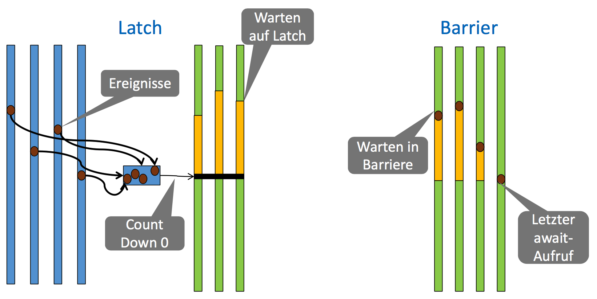

## Phaser

Verallgemeinerte Cyclic Barrier

* `arriveAndWaitAdvance()`: Barriere passieren
* Kann Teilnehmer später anmelden/abmelden
  * `register()` bzw. `arriveAndDeregister()`
  * Wird bei nächster Warterunde irksam

```java
Phaser phaser = new Phaser(0); // anfangs keine Player

// Player thread
phaser.register();
while (...) {
  phaser.arriteAndWaitAdvance();
  playRound();
}
phaser.arriveAndDeRegister();
```

## Rendez-Vous

Barriere mit Informationsaustausch

* Spezialfall: nur 2 Parteien

Zwei Parteien treffen sich und tauschen Objekte aus

* Ohne Austausch: `new CyclicBarrier(2)`
* Mit Austausch: `Exchanger.exchange(something)`

## Exchanger

`V exchange(V x)`

* blockiert, bis anderer Thread auch `exchange()` aufruft
* liefert Argument x des jeweils anderen Threads

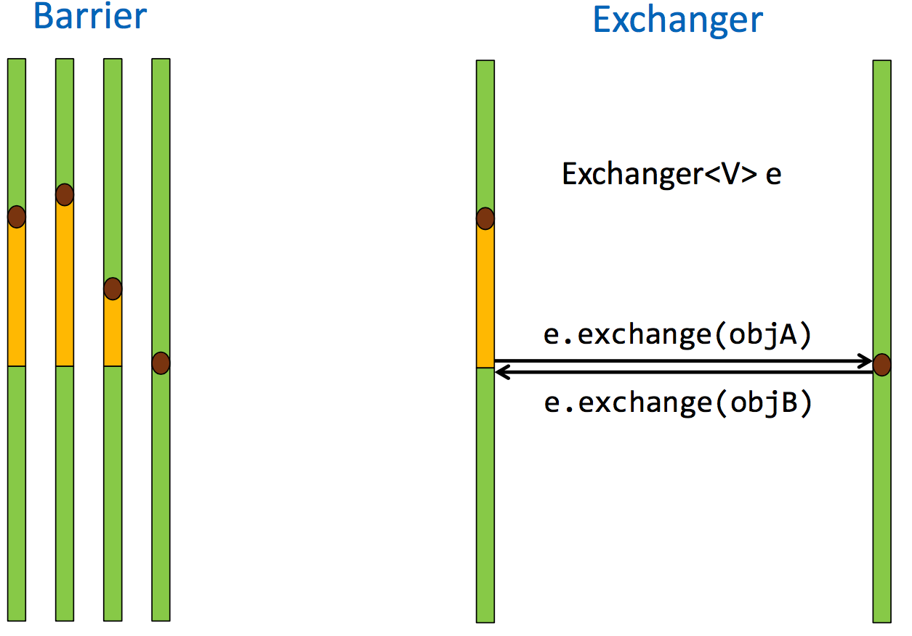

### Beispiel

```java
Exchanger<Integer> exchanger = new Exchanger<>();
for (int k = 0; k < 2; k++) {
  new Thread(() -> {
    for (int in = 0; in < 5; in++) {
      try {
        int out = exchanger.exchange(in);
        System.out.println(
          Thread.currentThread().getName() + " got " + out);
      } catch (InterruptedException e) { }
    }
  }).start();
}
```

# Gefahren der Nebenläufigkeit

Nebenläufige Programmierung birgt Risiko neuer Arten von Programmierfehler

* Fehler, die es bei Single-Threading so nicht gibt
* Können sporadisch oder selten auftreten
* Sehr schwierig durch Tests zu finden

## Fehler der Nebenläufigkeit

* Race Conditions
  * Ungenügend synchronisierte Zugriffe auf gemeinsame Ressourcen
* Deadlocks
  * Gegenseitiges Aussperren von Threads
* Starvation
  * Kontinuierliche Fortschrittsbehinderung von Threads wegen Fairness-Probleme

## Race Conditions

Mehrere Threads greifen auf gemeinsame Ressource ohne genügende Synchronisation zu

* mögliche falsche Resultate oder Verhalten
* *je nach Thread-Verzahnung und zeitlicher Ausführung*

Ursache ist oft ein Data Race (aber nicht immer)!

### Data Race

Unsynchronisierter Zugriff auf gleichen Speicher

* Selbe Variable oder Array-Element
* Mindestens ein schreibender Zugriff von einem Thread)
* Beispiele: Bank Account zu Beginn der Vorlesung

### Absichern mit `synchronized` => Race Condition ohne Data Race

Wenn man die Methoden mit `synchronized` absichert, hat man immer noch ein Problem mit nicht-atomaren Operationen. Beispiel:

```java
class BankAccount {
  int balance = 0;
  synchronized int getBalance() { return balance; }
  synchronized void setBalance(int x) { balance = x; }
}

// mehrere Threads
account.setBalance(account.getBalance() + 100); // Lost Update möglich
```

Critical Sections nicht geschützt

* Data Races mit Synchronisation eliminiert
* Aber nicht genügend grosse synchronisierte Blöcke

Das Beispiel oben haben wir im BankAccount zu Beginn der Vorlesung gar nicht bedacht. Wir haben uns nur darum gekümmert, innerhalb von Methoden zu synchronisieren. Aber nicht, dass jemand das Resultat der einen Methode für eine andere Methode verwendet.

### Kombinationen

|                | Race Condition                 | keine Race Condition                     |
| -------------- | ------------------------------ | ---------------------------------------- |
| Data Race      | Fehlerhaftes Programmverhalten | Programm verhält sich zwar korrekt, dennoch formal falsch |
| kein Data Race | Fehlerhaftes Programmverhalten | Richtig                                  |

### Einfach alles synchronisieren

Hilft nichts

* Race Conditions auch mit Synchronisation möglich
* Weitere Nebenläufigkeitsfehler (später)

Synchronisationskosten

* Synchronisation ist relativ teuer
* Cache Invalidierung; verhindert Optimierung etc.

### Wann kann man auf Synchronisation verzichten?

* Immutability (Unveränderlichkeit)
  * Objekte mit nur lesendem Zugriff
* Confinement (Einsperrung)
  * Objekt gehört nur einem Thread zu einer Zeit

#### Immutable Objects

Instanzvariablen sind alle final

* Primitive Datentypen
* Referenzen auf wiederum immutable Objekte

Methoden mit nur lesendem Zugriff

* Konstruktor initialisiert die Instanzvariablen

Nach Konstruktor kann Objekt ohne Synchronisation von Threads verwendet werden

## Deadlocks

```java
// Thread 1
synchronized(listA) {
  synchronized(listB) {
    listB.addAll(listA);
  }
}

// Thread 2
synchronized(listB) {
  synchronized(listA) {
    listA.addAll(listB)
  }
}
```

Deadlock-Szenario

| Thread 1                         | Thread 2                         | Gesperrte Objekte |
| -------------------------------- | -------------------------------- | ----------------- |
| synchronized(listA)              |                                  | listA             |
|                                  | synchronized(listB)              | listA, listB      |
| synchronized(listB) => blockiert |                                  | listA, listB      |
|                                  | synchronized(listA) => blockiert | listA, listB      |

Beide Threads haben sich gegenseitig ausgesperrt

### Anderes Beispiel

```java
class BankAccount {
  private int balance;
  
  public synchronized void transfer(BankAccount to, int amount) {
    balance -= amount;
    to.deposit(amount); // implizit geschachtelter Lock
  }
  
  public synchronized void deposit(int amount) {
    balance += amount;
  }
}

// Thread 1
a.transfer(b, 20);
==
synchronized(a) {
  synchronized(b) {...}
}

// Thread 2
b.transfer(a, 50);
==
synchronized(b) {
  synchronized(a) {...}
}
```

* Einige Threads sperren sich gegenseitig so, dass keiner von denen weitermachen kann
* Programm mit potentiellem Deadlock ist inkorrekt

### Spezialfall Livelocks

Threads haben sich gegenseitig permant blockiert

* Führen aber noch Warteinstruktionen aus
* Verbrauchen CPU während Deadlock

```java
// Thread 1
b = false;
while (!a) {
  sleep(1);
}

// Thread 2
a = false;
while (!b) {
  sleep(1);
}
```

### Erkennung: Betriebsmittelgraph

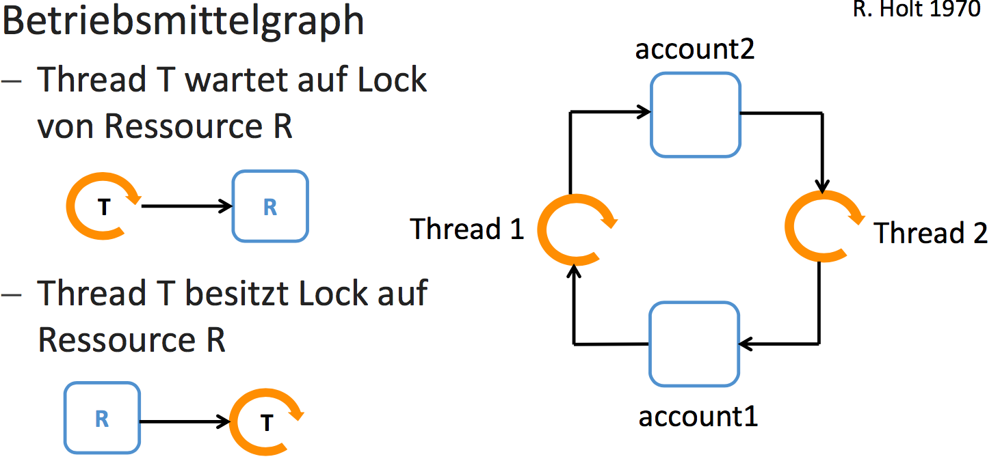

Deadlock $\iff$ Zyklus im Betriebsmittelgraph

### Voraussetzungen

Alle vier Bedingungen müssen zutreffen

* Geschachtelte Locks
* Zyklische Warteabhängigkeiten
* Gegenseitiger Ausschluss (Locks)
* Sperren ohne Timeout/Abbruch

### Vermeidung (1)

Lineare Ordnung der Ressourcen einführen

* Nur geschachtelt in aufsteigender Reihenfolge sperren
  * Konten nur nach aufsteigender Nummer sperren

Eliminiert zyklische Warteabhängigkeiten

### Vermeidung (2)

Grobgranulare Locks wählen

* Wenn lineare Ordnung nicht möglich/sinnvoll
  * Sperre gesamte Bank bei Kontenzugriff

Eliminiert Schachtelung von Looks

## Starvation

Ein Thread kriegt nie die Chance, auf eine Ressource zuzugreifen

* Obwohl Ressource immer wieder frei wird (kein Deadlock oder Livelock)
* Andere Threads können ihn dauernd überholen oder wegschnappen

```java
do {
  success = account.withdraw(100);
} while (!success)
```

Starvation ist ein Liveness/Fairness Problem

### Vermeidung

* Faire Synchronisationskonstrukte
  * Länger wartende Threads mit erfüllter Bedingung haben Vortritte
  * Fairness einschalten in Java Semaphore, Lock & Condition, Read-Write Lock
* Java Monitor hat Fairness Problem
  * Starvation-anfällig, vorallem bei vielen Threads

## Design-Aspekte

## Immutabilit und Confinement

### Confinement

Struktur garantiert, dass Objekt nur durch einen Thread zur gleichen Zeit zugegriffen wird

* Thread Confinement: Objekt nur über Referenzen von einem Thread erreichbar
* Object Confinement: Objekt in anderen bereits synchronisiertem Objekt eingekapselt

#### Thread Confinement

```java
void service() {
  new Thread(() -> {
    // Objekt nur vom Thread erreichbar
    OutputStream output = new FileOutputStream("...");
    try {
      doService(output);
    } finally {
      output.close();
    }
  }).start();
}

void doService(OutputStream s) {
  // s must not be passed to other threads
}
```

#### Object Confinement

Einkapselung in synchronisiertes Objekt

* Kann innere Objekte nur via synchronisierte Methoden des äusseren zugreifen

Keine Synchronisation für inneres Objekt nötig

```java
class ProductDatabase {
 private HashMap<String, Product> productMap = new HashMap<>(); // Gekapselt
 
  public synchronized void addProduct(String name, String details) {
    productMap.put(name, new Product(details)); // Gekapselt
  }
  public synchronized String getProductDetails(String name) { 
    return productMap.get(name).getDetails();
  }
                                                              
  public synchronized void notifySale(String name) {
    productMap.get(name).increaseSales();
  }
}
```

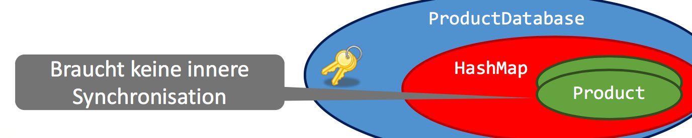

#### Kapselungsbrüche

* Inneres Objekt aussen zugreifbar

  * `public HashMap<String, Product> productMap`

* Rückgabe einer Referenz auf inneres Objekt

  * ```
    Product getLatestProduct() {
      return productMap.get("...");
    }
    ```

* Holder installiert selber Referenz ausserhalb

  * ```
    public void fillCatalog(List<Product> list) {
      list.add(productMap.get("..."));
    }
    ```

* Inneres Objekt gibt selber `this` raus

  * ```
    public void increseSales() {
      sales++;
      globalLastSale = this
    }
    ```

## Collection und Thread-Sicherheit

### Begriff Thread Safety

Klassen/Methoden, die intern synchronisiert sind

* Keine Race Conditions innerhalb dieses Codes
* Kritischer Abschnitt *nur pro Methode* erfüllt

Aber

* kein kritischer Abschnitt über mehrere Methodenaufrufe
* andere Nebenläufigkeitsfehler auch möglich

Keine durchgängige Definition

* Spezifikation überprüfen!

## Collections

| Version                                  | Beispiele                                | Thread-sicher |
| ---------------------------------------- | ---------------------------------------- | ------------- |
| Alte Java 1.0 Collections                | Vector, Stack, Hashtable                 | Ja            |
| Moderne Collections (java.util, Java > 1.0) | HashSet, TreeSet, ArrayList, LinkedList, HashMap, TreeMap | NEIN          |
| Concurrent Collections (java.util.concurrent) | ConcurrentHashMap, ConcurrentLinkedQueue, CopyOnWriteArrayList, ... | Ja            |

Wieso sind die modernen Collections nicht mehr thread-sicher?

* Oft ist die Synchronisation nicht nötig
  * Confinement => unnötige Synchronisationskosten
* Synchronisation meist ungenügend
  * Elemente sind nicht synchronisiert
  * Iteration der Elemente ist nicht synchronisiert
* Alte Collections historisch Thread-sicher
  * Aus Rückwärtskompatibilität immer noch so

### Concurrent Collections

* Effiziente Thread-sichere Collections
* Geeignet für starke Nebenläufigkeit (*Contention*)
* Schwach konsistente Iteratoren
  * Keine ConcurrentModificationException
  * Sehe nebenläufige Updates bei Iteration vielleicht nicht

## Verstecktes Multi-Threading

* Finalizers
  * Laufen über separaten Finalizer-Thread
* Timers
  * Handler durch separaten Thread ausgeführt (ausser GUI)
* Externe Libraries & Frameworks
  * z.B. Abarbeitung von Web Service Aufrufen

## Korrektheitskriterien

* Safety
  * Keine Race Conditions
    * Kritische Abschnitte auf gemeinsame Ressourcen sind genügend synchronisiert
  * Keine Deadlocks
    * Threads können sich nicht gegenseitig für unbeschränkte Zeit sperren
* Liveness
  * Keine Starvation
    * wenn ein Thread auf eine Bedingung wartet, soll er nach einer bestimmten Zeit fortschreiten können, sofern die Bedingung genügend oft erfüllt wird

# Thread Pools

## Konzept und Funktionsweise

**Task Queue**

* Tasks implementieren potentiell parallele Arbeitspakete
* Auszuführende Tasks werden in Warteschlange eingereiht

**Thread Pool**

* Beschränkte Anzahl von Worker-Threads
* Holen Tasks aus der Warteschlange und führen sie aus

## Vorteile und Einschränkungen

* Beschränkte Anzahl von Threads
  * Viele Threads verlangsamen System oder überschreiten verfügbaren Speicher
* Recycling der Threads
  * Spare Thread-Erzeugung und Freigabe
* Höhere Abstraktion
  * Trenne Task-Beschreibung (*Problem Space*) von Task-Ausführung (*Machine Space*)
* Anzahl Threads pro System konfigurierbar
  * Anzahl Worker-Threads = Anzahl Prozessoren + Anzahl I/O Aufrufe

### Neuer Free Lunch

Programme mit Task modellieren

* Laufen automatisch schneller auf parallelen Maschinen
* Ermöglicht Ausschöpfung der Parallelität ohne hohe Thread-Kosten

### Einschränkungen

Tasks dürfen nicht aufeinander warten, dies führt zu einem Deadlock.

Ein Task muss zuende laufen, bevor der Worker Thread einen anderen Task ausführen kann. Ausnahme sind geschachtelte Sub-Tasks.

## Fork & Join Pool

Gibt es seit Java 7/8. Im Gegensatz zu den einfachen Executors (seit Java 5) unterstützt er rekursive Aufgaben und ist effizient implementiert.

### Task Lancierung

```java
ForkJoinPool threadPool = new ForkJoinPool; // moderner Thread Pool
Future<Integer> future = threadPool.submit(() -> {
  int value = ...;
  // long calculation
  return value;
})
```

## Zählen von Primzahlen

Wieviele Primzahlen gibt es zwischen 2 und N?

Sequentiell:

```java
int counter = 0;
for (int number = 2; number < N; number++) {
  if (isPrime(number)) {
    counter++;
  }
}
```

Paralleler Ansatz: paralleles Zählen mit linkem Teil/rechtem Teil

```java
Future<Integer> left = threadPool.submit(() -> count(leftPart));
Future<Integer> right = threadPool.submit(() -> count(rightPart));

result = left.get() + right.get();
```

Das ganze kann auch rekursiv geschehen, Tasks können auf Sub-Tasks warten

```java
class CountTask extends RecursiveTask<Integer> {
  // Constructor
  
  @Override
  protected Integer compute() {
    // if no or single element => return result
    // split into two parts
    CountTask left = new CountTask(leftPart);
    CountTask right = new CountTask(rightPart);
    left.fork();
    right.fork();
    return right.join() + left.join();
  }
}
```

### Pool auswählen

Expliziter Thread-Pool

```java
ForkJoinPool threadPool = new ForkJoinPool();
int result = threadPool.invoke(new CountTask()); // blockiert
```

Standard Pool (Java 8): ForkJoinPool.commonPool()

```java
int result = new CountTask().invoke();
```

### Fork Join Pool

Beim alten Executor führten Untertasks zu einem Deadlock

Tasks erben von `RecursiveTask<T>`:

* `T compute()` Task Implementierung
* `fork()` Starte als Sub-Task in einem anderen Task
* `T join()` Warte auf Task-Ende und frage Resultat ab
* `T invoke()` Ein Sub-Task starten und abwarten
* `invokeAll()` mehrere Sub-Tasks starten und abwarten

`RecursiveAction`, falls kein Rückgabetyp

* `void` statt `T`

### Konkreter Ausbau

```java
class CountTask extends RecursiveTask<Integer> {
  private final int lower, upper;
  
  public countTask(int lower, int upper) {
    this.lower = lower;
    this.upper = upper;
  }
  
  @Override
  protected Integer compute() {
    // no element
    if (lower == upper) { return 0; }
    // single element
    if (lower + 1 == upper) { return isPrime(lower) ? 1 : 0; }
    
    int middle = (lower + upper) / 2;
    CountTask left = new CountTask(lower, middle);
    CountTask right = new CountTask(middle, upper);
    left.fork();
    right.fork();
    return right.join() + left.join();
  }
}
```

### Keine Über-Parallelisierung

```java
protected Integer compute() { 
  if (upper - lower > THRESHOLD) {
    // parallel count
    int middle = (lower + upper) / 2;
    CountTask left = new CountTask(lower, middle); 
    CountTask right = new CountTask(middle, upper);
    left.fork();
    right.fork();
    return right.join() + left.join();
  } else {
    // sequential count
    int count = 0;
    for (int number = lower; number < upper; number++) {
      if (isPrime(number)) { count++; } }
    return count;
  }
}
```

### Fork-Join Reihenfolge

In diesem konkreten Beispiel ist die rechte Hälfte potentiell um eins kleiner. Darum kann man die rechte Hälfte zuerst abfragen:

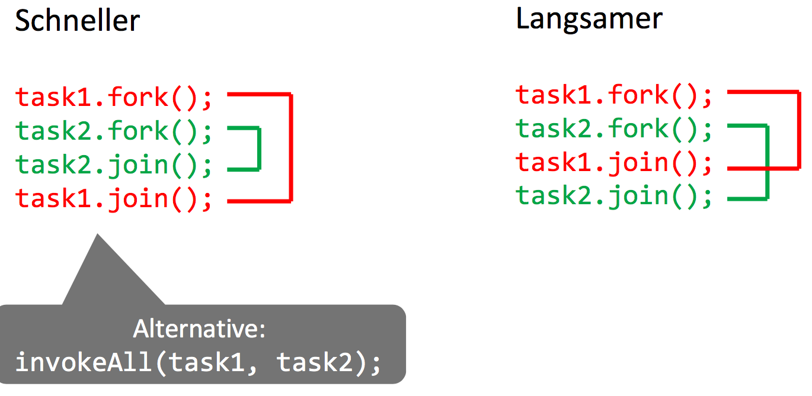

## Fork Join Pool Internals

> Worker-Threads laufen als Daemon-Threads

Automatischer Parallelitätsgrad

* Default: #Worker Threads im Pool = # Prozessoren
* Dynamisches Hinzufügen/Wegnehmen von Threads
* Ziel: genügend aktive/laufende Worker Threads
* Jedoch nicht garantiert (wäre bei I/O Tasks relevant)

Common Pool

* Verhindert Engpässe durch zu viele Thread Pools
* Parallelitätsgrad z.T. tiefer als #Prozessoren

## Work Stealing

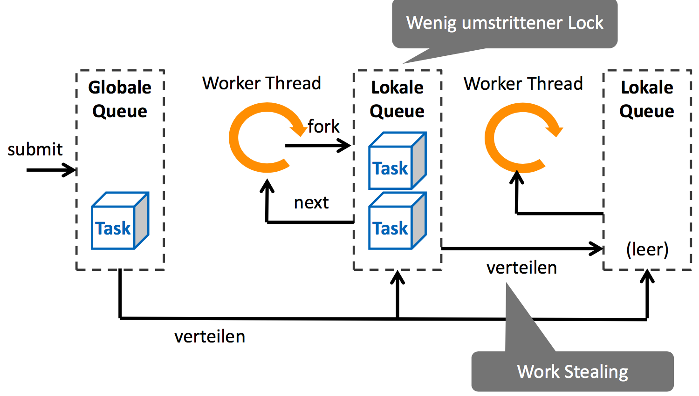

Verteilte Queues für weniger Contention

* Weniger Threads streiten um gleiche Locks
* Viel effizienter

FIFO

* Globale Queue
* Verteilen zwischen Queues

LIFO

* Neue Sub-Tasks kommen zuvorderst in lokale Task Queue
* Grund für Schachtelung der fork/join

## Asynchrone Programmierung

Vielfach unnötig blockierende Methodenaufrufe. Idee: der Aufrufer soll während der Operation weiterarbeiten.

### Futures

Future repräsentiert ein zukünftiges Resultat.

* Proxy auf Resultat das evtl. noch nicht bekannt ist, weil Berechnung noch läuft
* Muss Ende der Berechnung abwarten, bevor Resultat zurückgegeben wird

```java
Future<T> future = threadPool.submit(...); // blockiert nicht, lanciert Task ohne zu warten
// ...
T result = future.get(); // blockiert, bis Task beendet ist
```

### Details

Fehler-Propagierung: Task endet mit unbehandelter Exception:

* `get()` liefert dann ExecutionException
* Ursprüngliche Exception ist darin geschachtelt (Cause)

Task Abbruch:

* `cancel(boolean mayInterruptIfRunning)`
* Task aus Warteschlange herausnehmen
* Kooperativ: bricht laufenden Task nicht einfach ab
* Optional: Interrupt auf Worker-Thread bei laufendem Task

### Fire and Forget

Tasks starten, ohne Resultat später abzuholen

* Submitter interessiert sich nur für Resultat/Task-Ende

Unbehandelte Exception in Task werden ignoriert!

### Moderne Asynchronität (Java 8)

Starte asynchrone Aufgabe in Standard Pool

* ForkJoinPool.commonPool()

```java
CompletableFuture<Long> future =
  CompletableFuture.supplyAsync(() -> longOperation()); // runAsync falls kein Rückgabetyp
// other work
process(future.get());
```

### Ende des asynchronen Aufrufs

* Caller-zentrisch (Pull)
  * Caller wartet auf Task-Ende und holt sich das Resultat
* Callee-zentrisch (Push)
  * asynchrone Operation informiert direkt über Resultat
  * Completion Callback (Continuation, Promise)

### Continuation

Folgeaufgabe an asynchrone Aufgabe anhängen. Ausführung sobald vorgängier Task fertig ist

```java
CompletableFuture<Long> future = 
  CompletableFuture.supplyAsync(() -> longOperation());
// ...

future.thenAccept(result -> System.out.println(result));
```

Ausführung der Continuation: durch beliebigen Thread

* Initiator, wenn Future bereits Resultat hat
* Beliebiger Worker Thread

#### Continuation-Style Programming

* `thenAccept()` für Handler ohne Rückgabe
* `thenApply()` für Funktion mit Rückgabe

Continuation läuft potentiell in anderem Thread => Synchronisation beachten

```java
future1.thenApply(future2).thenAccept(future3)
```

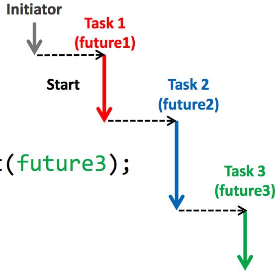

#### Multi-Continuation

```java
CompletableFuture.allOf(future1, future2).thenAccept(continuation);
```

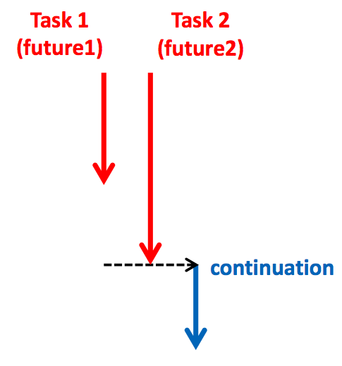

```java
CompletableFuture.any(future1, future2).thenAccept(continutation);
```

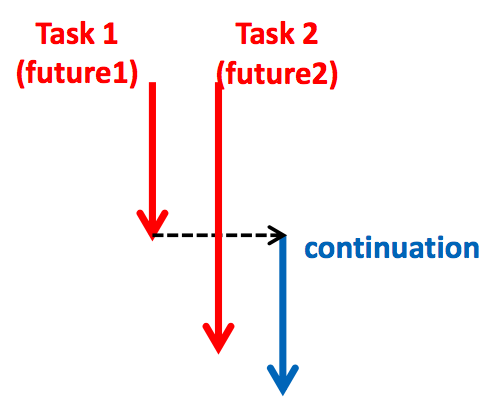