# Memory Models

## Lock-freie Programmierung

* Korrekte nebenläufige Interaktionen ohne Locks
* Garantien des Speichermodell nutzen

Einstiegsbeispiel:


(Also: man setzt x = y = 0; DANN lässt man zwei Threads loslaufen)

### Ursachen für Probleme

* Weak Consistency
  * Speicherzugriffe werden in verschiedenen Reihenfolgen auf verschiedenen Threads gesehen
  * Ausnahme: Synchronisation/Speicherbarrieren
* Optimierungen
  * Compiler, Laufzeitsystem und CPUs
  * Instruktionen werden umgeordnet, wegoptimiert

Keine sequentielle Konsistenz bei Nebenläufigkeit!

Die CPU darf Instruktionen eines Threads umordnen, sofern sie erkennt dass sie nicht voneinander abhängen. Wenn ein zweiter Thread davon abhängig ist in welcher Reihenfolge das geschieht, ist das der CPU egal. Im Beispiel oben darf der Thread 2 auch "umgekehrt" ablaufen.

## Memory Model

### Java

Minimale spezifizierte Garantien

* Atomicity (Unteilbarkeit)
* Visibility (Sichtbarkeit)
* Ordering (Reihenfolge)

### Atomicity

Garantien:

Zugriff auf Variable Lesen/schreiben ist atomar für

* Primitive Datentypen bis 32 Bit
* Objekt-Referenzen
* long und double nur mit `volatile` Keyword atomar

Achtung: Unteilbarkeit heisst nicht Sichtbarkeit

* Nach Write sieht ein anderer Thread evtl. noch anderen Wert
* Es heisst nur: immer gültigen Wert; entweder alten oder neuen

Atomar oder nicht?

TODO: genauer analysieren


### Visibility

Analysebeispiel

```java
class Worker extends Thread {
  private boolean doRun = true;
  
  public void run() {
    while (doRun) {
      ...
    }
  }
  
  public void stopRequest() {
    doRun = false;
  }
}
```

Problem:

Sehe Änderungen eines anderen Threads eventuell nicht oder viel später

Optimierung, z.B. VM hält Variablenwert in Register

```
void run() {
  load doRun to reg1;
  while(reg1) {
    ... (Endlosschleife)
  }
}
```

Garantien: Die Sichtbarkeit ist garantiert bei

* Locks Release & Acquire
  * Änderungen vor Release werden bei Acquire sichtbar
* Volatile Variable
  * Zugriff macht Änderungen anderer Zugreifer sichtbar
* Initialisierung von final Variablen
  * Nach Ende des Konstruktors
* Thread-Start und Join
  * ebenso Task Start und Ende

### Sichtbarkeit mit volatile in Java

Alle Änderungen vor dem volatile Zugriff werden für jeden sichtbar der danach auf dieselbe volatile-Variable zugreift (damit würde man das Problem oben lösen). **Nur so in Java, anders in .NET und C/C++**!

Wo ist die Sichtbarkeit von x == 1 garantiert?


### Java Volatile Keyword

* Atomicity
  * Atomares Lesen und Schreiben auch für long und double
  * Achtung: andere Operationen sind nicht atomar (z.B. `i++`)
* Visibility
  * Änderungen werden anderen Zugreifern propagiert
  * Achtung: kein Sperren im Gegensatz zu Locks
* Reordering
  * Keine Umordnung durch Compiler/Laufzeitsystem/CPU
  * Achtung: nicht volatile Variablen werden evtl. umgeordnet

Volatile verhindert Data Race auf Variable

### Ordering

Java Garantien:

* Innerhalb eines Threads: "As-if-Serial" Semantik
  * Sequentielles Verhalten innerhalb eines Threads bleibt
* Zwischen Threads: Reihenfolge nur erhalten für
  * Synchronisationsbefehle
  * Zugriffe auf volatile Variablen
* Keine Umordnung über Synchronisation oder volatile Zugriffe hinweg
  * Memory Barriers / Memory Fences

Welche Umordnungen sind möglich?


### .NET

Unterschied zu Java Memory Model

* Atomarität: long/double nicht mit volatile atomar
* Visibility nicht definiert. Implizit durch Ordering
* Ordering: volatile ist nur partielle Fence

Atomare Instruktionen

* `Interlocked` Klasse

### .NET Volatile Read/Write Fences

* Volatile Read: Acquire Semantik
  * bleibt vor den nachfolgenden Zugriffen
* Volatile Write: Release Semantik
  * bleibt nach den vorherigen Zugriffen


### .NET Full Fence

Umordnung in beide Richtungen verbieten: `Thread.MemoryBarrier();`

## Atomare Operationen

* Kein Blockieren oder Warten auf Locks
* Komplexer als nur atomares Lesen und Schreiben
* Java Atomic Variables
* Effizient: atomare Instruktionen des Prozessors
* Garantiert auch Visibility und Ordering

### Eigener Spin-Lock-Yield

Idee: wenn es nicht geht, `yield`en wir

```java
public class SpinLock {
  private volatile boolean locked = false;
  
  public void acquire() {
    
    // Block müsste atomar sein
    while(locked) {
      Thread.yield();
    }
    locked = true;
    
  }
  
  public void release() {
    locked = false;
  }
}
```

Mit atomarer Operation

```java
public class SpinLock {
  private AtomicBoolean boolean locked = new AtomicBoolean(false)
  
  public void acquire() {
    while(locked.getAndSet(true)) { 
      // ^ lese alten Werte und setze neuen Wert atomar Rückgabe = gelesener Wert
      Thread.yield();
    }
  }
  
  public void release() {
    locked.set(false);
  }
}
```

Das Ganze ist etwas tricky zu verstehen:

Angenommen, das Lock sei zu (locked = true) und man macht acquire(), dann wird

1. das Lock auf true gesetzt (bleibt true)
2. Ge-yield()-et (man macht also nichts)

Angenommen, das Lock sei offen (locked = false) und man macht acquire(), dann wird

1. Das Lock auf True gesetzt (es ist jetzt zu)
2. nicht ge-yield-et, man macht also weiter

### Atomares Compare and Set

`boolean CompareAndSet(boolean expect, boolean update)`

* Setzt `update` wenn alter Wert gleich `expect` ist (atomar)
* Retourniert `true` bei erfolgeichem Update

Atomar geschieht das folgende:

```java
if (current == expect) {
  current = update;
  return true;
} else {
  return false;
}
```

### Atomic Klassen

Klassen für Boolean, Integer, Long und Referenzen (auch für Array-Elemente)

Diverse atomare Operatoren

* addAndGet(), getAndAdd(), etc.

* Ab Java 8 sogar mit Lambda

* ```java
  AtomicInteger counter = new AtomicInteger(0);
  counter.updateAndGet( x -> x + 1);
  ```

### Optimistische Synchronisation

```java
do {
  oldValue = var.get(); // lese aktuellen Wert
  newValue = calculateChanges(oldValue);
} while (!var.compareAndSet(oldValue, newValue))
  // ^ schreibe, falls gelesener Wert immer noch aktuell ist
```

Hier kommen wir allerdings zum ABA-Problem

### ABA-Problem

Anderer Thread schreibt unbemerkt dazwischen


## Lock-freie Datenstrukturen

Lock-Free Stack

```java
AtomicReference<Node<T>> top = new AtomicReference<>();
...
  
void push(T value) {
  Node<T> newNode = new Node<>(value);
  Node<T> current;
  do {
    current = top.get();
    newNode.setNext(current);
  } while (!top.compareAndSet(current, newNode));
}
```


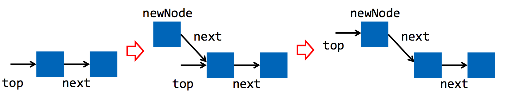

Vorgefertigte Lock-freie Datenstrukturen

* `ConcurrentLinkedQueue<V>`
* `ConcurrentLinkedDeque<V>`
* `ConcurrentSkipListSet<V>`
* `ConcurrentHashMap<K, V>`
* `ConcurrentSkipListMap<K, V>`

# Actor Model

## Motivation

Herkömmliche Programmiersprachen sind nicht für Nebenläufigkeit entworfen

* Optimiert für sequentielle/prozedurale Ausführung
* Nebenläufigkeit/Threads sind "Second Class" Features
* Oder gar nicht vorhanden: JavaScript
* By Default: Speicher nicht thread-safe

Korrekte nebenläufige Programme zu schreiben ist daher besonders schwierig

Threads operieren auf Modell von passiven Objekten

Konsequenzen:

* Beschränkter Grad an Nebenläufigkeit
  * Concurrency sehr selektiv eingesetzt
  * Maschinenorientierte Concurrency für Performance
  * Viele unnötlg blockierende Aufrufe
  * Resultat: no free lunch
* Fehleranfälligkeit
  * Race Conditions vorprogrammiert
* Sehr schlecht verteilbar
  * Shared Memory Modell
  * Threads operieren auf gemeinsamem Speicher

## Actor Modell und CSP

Substantiell anderes Programmierkonzept

* Aktive Objekte
  * Objekte haben nebenläufiges Innenleben
* Kommunikation
  * Objekte senden und empfangen Nachrichten
* Kein Shared Memory
  * Nur Austausch von Nachrichten über Kanäle/Mailboxen

## Actor-Modell

Ein Actor kann

* Neue Actors erstellen
* Nachrichten an Actors (andere und sich selber) senden
* Entscheiden, wie die nächste Nachricht behandelt werden soll (Zustandsänderung)

## CSP (Communicating Sequential Processes)

* Prozesse kommunizieren indirekt über Channels miteinander
* Austausch der Nachrichten erfolgt unmittelbar und synchron
* Inspirierte die Entwicklung von Go

Prinzipiell gleiches Modell wie Actors

* Unterschied: Actor hat keine Channels, Senden ist immer asynchron, keine garantierte Reihenfolge des Empfangs


## Klassisch vs. CSP


## Vorteile: Actor, CSP

* Inhärente Nebenläufigkeit
  * Alle Objekte (Actors) laufen nebenläufig
  * Maschine kann Grad an Nebenläufigkeit ausnutzen
* Keine Race Conditions
  * Kein Shared Memory
  * Nachrichtenaustausch synchronisiert implizit
* Gute Verteilbarkeit
  * Kein Shared Memory
  * Nachrichtenaustausch für Netz prädestiniert

## Akka

Actor-Modell implementiert in Skala, zusätzliches Java API

### Konzept

* Actor sind aktive Objekte
  * laufen konzeptionell nebenläufig zueinander
* Privater Zustand
  * aufpassen, dasss per Java Referenzen kein Shared State entsteht
* Eine Mailbox pro Actor
  * ein Buffer für alle Nachrichten, die zu ihm ankommen
  * asynchrones Senden

### Empfangsverhalten

* Reaktion auf ankommende Nachricht
  * Spezielle Behandlungs-Methode wird ausgeführt (ähnlich wie Event Queue bei GUIs)
* Effekte per Behandlung
  * ändere privaten Zustand
  * Sende Nachrichten
  * erzeuge neue Actors
* Intern sequentiell
  * nur eine Nachricht auf einmal bedienbar

### Einfacher Akka-Actor

Empfangsmethode: Run to Completion pro eingehende Nachricht

```java
public class NumberPrinter extends UntypedActor {
  public void onReceive(final Object message) {
    if (message instanceof Integer) {
      System.out.print(message);
    }
  }
}
```

### Erzeugen und Senden

```java
ActorSystem system = ActorSystem.create("System");
ActorRef printer = system.actorOf(Props.create(NumberPrinter.class)); // Erzeugung per Reflection

for (int i = 0; i < 100; i++) {
  printer.tell(i, actorRef.noSender()) // einfaches, asynchrones Senden
}

system.shutdown(); // Gebe End-Signal an alle Actors
```

### Actor-Referenzen

* `ActorRef` Adresse eines Actors
  * Actor bei Fehlverhalten neu startbar (behält Adresse)
* Entkopplung von "Interface" und Instanz
  * Vorbereitet für Verteilung
  * ActorRef ist immutable (in Message verschickbar)
* Verhindert Methodenaufrufe/Variablenzugriffe
  * Reiner Nachrichtenaustausch

### Verteilte Actors-Client (Producer/Consumer)

```java
ActorSystem system = ActorSystem.create("producer");

ActorSelection printer = system.actorSelection(
	"appa.tcp://System@server:2552/user/printer");

printer.tell(123, ActorRef.noSender());
```

### Actor Remoting	

* Remote Lookup
  * `system.actorSelection` mit URL
* ActorSelection
  * leichtgewichtiger als ActoRef
  * kann 0..n Actors umfassen
  * kann zu ActorRef aufgelöst werden
* Remote erzeugen
  * `system.actorOf(…)`
  * `application.conf` spezifiziert wo Actor erstellt wird
  * Keine Codeänderungen!

### Actor Hierarchies

* Hierarchie von Actors
  * Passend zu URL-Adressierungsschema
  * Supervision von Actors (später)
  * Erzeuger ist Parent
* ActorSelection
  * Selektiert Teilbaum
  * Broadcast möglich

### Akka Sender

`tell(msg, sender)`

* Sender der Message wird mitgegeben
* Nützlich bei Antwort an Sender
* Typischerweise getSelf() bzw getSender() bei Forward

Achtung: getSender zeigt immer auf den ursprünglichen Sender, auch beim Forwarding (wenn es mit dem entsprechenden Absender weitergeleitet wurde)

### Akka Synchrones Senden

Actor-Modell ist asynchron

Synchrones Senden-Empfangen möglich mit Futures

`Future<Object> resut = Patterns.ask(actorRef, msg, timeout);`

### Akka Messages

Serializable Classes

Immutable (Value Objects)

* Attribute final
* Collections in `Collections.unmodifiableList` wrappen
* keine Methoden die Seiteneffekte haben

Typischerweise einfache Wrapper-Klassen mit Fokus auf die Attribute

Messages sind viel Schreibaufwand, besser mit der Scala API

### Akka Laufzeitsystem

* Akka verwendet Dispatcher zur Ausführung
* Typischerweise ein Java Fork-Join Thread Pool
* Nicht ein Thread pro Actor!

Bei synchronem Send & Receive Warteabhängigkeiten zwischen Actors

* Thread Pool: keine Lösung (Deadlock bei fixer Anzahl)
* Muss Stack pro Actor instanzieren
* Thread pro Actor => sehr viele Threads

Synchrones Send & Receive daher nicht empfohlen

### Akka Supervision

* Actors können andere Actors überwachen
* Bei Exception wird der Supervisor benachrichtigt
* Parents überwachen by default ihre Kinder

Der Supervisor kann je nach Fehler reagieren. Achtung: Nicht für Programmierfehler, sondern nur für externe Ursachen (Netzwerk, Files), analog Exception vs. Error.

| Resume   | Child macht weiter (behält internen Zustand) |
| -------- | ---------------------------------------- |
| Restart  | Child wird neu gestartet (verliert Zustand) |
| Stop     | Child wird nicht mehr ausgeführt         |
| Escalate | Supervisor gibt auf und meldet selber seinem Supervisor einen Fehler |

Parent von `/user` ist der Root Guardian, zusätzlicher `/system` Actor für Logging und Shutdown

### System Shutdown

Applikation muss Actors selber stoppen

```java
getContext().stop(actorRef); // stoppt nach Bearbeitung der aktuellen Message (Massage)

getContext().stop(getSelf()); // immer rekursiv (?)
getContext().system().terminate();

actor.tell(PoisonPill.getInstance(), sender); // stoppt bei Behandlung der Poison Pill
victim.tell(Kill.getInstance(), sender); // startet Supervision Behandlung
```

### Schwächen

* Protokoll der Actors nur implizit vorhanden
  * Formales Protokoll fehlt
  * Grundsätzliches Problem bei Actors im Gegensatz zur CSP
* Akka: keine Typsicherheit
* Akka: Diskrepanz JVM und Actor Model
  * leicht verletzbare Regeln => Laufzeitfehler

# GPU-Parallelisierung I

GPU ist ein Co-Prozessor des Systems

* CPUs bieten wenig Cores
  * Meist 4, 8, 16, 20
  * Allgemeine, schnelle Prozessore
* GPUs bieten sehr viele Cores
  * 512, 1024, 2880, 5760 Cores
  * Sehr spezifische, langsamere Prozessoren

Ziel: GPU Many Cores für Parallelisierung nutzen

## GPU

GPUs: hohe FLOPS Performance (Floating Point Operations per Second)

Braucht hohe Bandbreite

GPUs verwenden mehr Transisforen für Recheneinheiten


## Aufbau


Zum Beispiel 1-30 SM

8-192SP pro SM

## SIMD

Streaming Multiprocessor ist primzipiell SIMD (Single Instruction Multiple Data)

Cores führen dieselbe Instruktion auf unterschiedlichen Daten/Speicherstellen aus


SIMD = Vektorparallelität


Cores innerhalb eines SM sind nur mit Vektor-Parallelisierung effizient nutzbar

* Alle Cores führen die gleiche Instruktion aus
* einzelne können auch die Instruktion nicht ausführen (aber nicht eine andere)

## CPU vs GPU

* GPU: Video Gaming

  * Extrem hohe Datenparallelität
  * Wenig Verzweigungen
  * kein beliebiges Warten bei Parallelität
  * Einfache, aber viele Cores
  * Kleine Caches pro Core

  Ziel: hoher Gesamtdurchsatz

* CPU: General Purpose

  * Niedrige Datenparallelität
  * Viel Verzweigungen
  * Beliebige Thread-Synchronisation
  * Wenige, aber mächtige Cores
  * Grössere Caches in Chip

  Ziel: niedrige Latenz pro Thread

## NUMA-Modell

Non-Uniform Memory Access

* kein gemeinsamer Hauptspeicher zwischen GPU und CPU
  * explizites Übertragen
* Unterschiedlicher Instruktionssatz/Architektur
  * Code für GPU kompilieren/designen

## CUDA

Proprietär für Nvidia-Karten, API/Compiler für C/C++

Computer Unified Device Architecture

General Purpose Programming Model

* Parallelisierung mit sehr vielen (vektorparallelen) Threads
* Video-Computing und CUDA teilen sich GPUs
* API und Compiler für Programmiersprache C/C++

## Vektoraddition

Sequentiell:

```c
void VectorAdd(float *A, float *B, float *C, int N)  {
  for (int i = 0; i < N; i++) {
    C[i] = A[i] + B[i]; 
  }
}

Parallelisieren: pro Thread C[i] = ...
```

CUDA

```c
// kernel definition, GPU (Device)
__global__
void VectorAddKernel(float *A, float *B, float *C) {
  int i = threadIdx.x;
  C[i] = A[i] + B[i];
}

// CPU (Host)
int main() {
  // ...
  // kernel invocation
  VectorAddKernel<<<1, N>>>(A, B, C);
  // ...
}
```

der gleiche Kernel wird von mehreren Threads ausgeführt.

`threadIdx.x` => Thread-ID (0..N-1)

## SIMT: Single Instruction Multiple Threads


## CUDA Blocks

Threads sind in Blöcke gruppiert

* Ein Block => gleicher SM
* wird im Programmiermodell sichtbar
* Threads können *innerhalb Block* interagieren

## CUDA Ausführungsmodell

* Thread = virtueller Skalarprozessor
* Block = virtueller Multiprozessor
* Blöcke müssen unabhängig sein
  * Run to Completion
  * Beliebige Ausführungsreihenfolge
    * sequentiell oder parallel
  * Blocks in Thread Pool (Thread Execution Manager)

## CUDA Thread Pool Abstraktion

* Grad der Parallelität durch GPU bestimmt


* Automatische Skalierung


## Thread Hierarchie

* Kernel wird auf *Grid* ausgeführt
  * Blöcke mit ID
    * Thread mit ID


## Datenaufteilung

Jede Kernel-Ausführung bestimmt seinen Datenteil

* `threadIdx.x` Nummer des Threads innerhalb Block
* `blockIdx.x` Nummer des Blocks
* `blockDim.x` Blockgrösse
* Weitere Dimensionen y, z nutzbar
* Der Programmierer modelliert die Datenaufteilung selber


## Aufteilung in Blöcke

Rechnung:

* `blockIdx.x * blockDim.x` eigenen Block finden
* `+ threadIdx.x` Offset innerhalb Block

```c
__global__
void VectorAddKernel(float *A, float *B, float *C, int N) {
  int i = blockIdx.x * blockDim.x + threadIdx.x;
  C[i] = A[i] + B[i];
}

// kernel invocation
VectorAddKernel<<<4, 512>>>(A, B, C, 2048) // 2048 = 4 * 512
```

`VectorAddKernel<<<BLÖCKE, THREADS>>>`

Hier haben wir aber noch ein Problem: wir haben jetzt die Anzahl Blöcke und die Anzahl Threads selber fix bestimmt. So ist das nicht sehr dynamisch.

## Allgemeinere Aufteilung

Um das dynamisch zu machen verwenden wir das folgende. Hier ist die Bedingung wichtig, sonst schreiben wir über Memory hinaus.

```c
__global__
void VectorAddKernel(float *A, float *B, float *C, int N) {
  int i = blockIdx.x * blockDim.x + threadIdx.x;
  if (i < N) {
	  C[i] = A[i] + B[i];    
  }
}

int blockSize = 512; // Anzahl Threads pro Block
int gridSize = (N + blockSize - 1) / blockSize; // Anzahl Blöcke pro Grid
VectorAddKernel<<<4, 512>>>(A, B, C, 2048) // 2048 = 4 * 512
```

Zur Rechnung von gridSize:

Angenommen, $N$ ist 512 (512 Elemente), und man hat eine $blockSize$  von 512. Intuitiv reicht ja hier ein Block.

Wenn man nun aber $\frac{N + blockSize}{blockSize}$ rechnet, erhält man 1024 / 512 = 2 Blöcke.

Mit dem -1 stellt man sicher, dass der Nenner so rutscht, dass man mit der Teilung und Integer-Abrundung auf den richtigen Wert kommt.

Wichtig: `blockDim` im Kernel entspricht der `blockSize`.

## CUDA Ausführung

1. Auf GPU allozieren
   `cudaMalloc` 
2. Daten zu GPU transferieren
   `cudaMemCpy(HostToDevice)`
3. Kernel ausführen
   `<<<gridId, blockId>>>`
4. Daten von GPU zu CPU transferieren
   `cudaMemcpy(DeviceToHost)`
5. Auf GPU deallozieren
   `cudaFree`

## Programmgerüst

```c
void CudaVectorAdd(float* A, float* B, float* C, int N) { 
  size_t size = N * sizeof(float);
  float *d_A, *d_B, *d_C;
  
  cudaMalloc(&d_A, size);
  cudaMalloc(&d_B, size);
  cudaMalloc(&d_C, size);

  cudaMemcpy(d_A, A, size, cudaMemcpyHostToDevice);
  cudaMemcpy(d_B, B, size, cudaMemcpyHostToDevice);
  
  int blockSize = 512;
  int gridSize = (N + blockSize - 1) / blockSize;
  VectorAddKernel<<<gridSize, blockSize>>>(d_A, d_B, d_C, N);
  
  cudaMemcpy(C, d_C, size, cudaMemcpyDeviceToHost);
  
  cudaFree(d_A);
  cudaFree(d_B);
  cudaFree(d_C);
}
```

## Speicher-Funktionen

* `cudaMalloc`
  * Alloziert Objekte in Device Global Memory
  * Parameter: Pointer-Adresse, Size (Bytes)
* `cudaFree`
  * Dealloziert Objekte in Device Global Memory
  * Parameter: Pointer-Adresse
* `cudaMemcpy`
  * Kopiert Speicher zwischen CPU/GPU
  * Target Pointer, Source Pointer, Size, Destination (zu oder von GPU)

## Fehlerbehandlung

Return von CUDA-Funktion beachten. Fehler falls Code != `cudaSuccess`

Am besten Hilfsfunktion verwenden oder schreiben, und um jeden Methodenaufruf wrappen

## Verbessertes Gerüst

```c
void handleCudaError(cudaError error) { 
  if (error != cudaSuccess) {
  	fprintf(stderr, "CUDA: %s!\n",
    	cudaGetErrorString(error));
  	exit(EXIT_FAILURE); 
  }
}

handleCudaError(cudaMalloc(&d_A, size));
handleCudaError(cudaMalloc(&d_B, size)); 
handleCudaError(cudaMalloc(&d_C, size));

handleCudaError(cudaMemcpy(d_A, A, size, cudaMemcpyHostToDevice)); handleCudaError(cudaMemcpy(d_B, B, size, cudaMemcpyHostToDevice));

int blockSize = 512, gridSize = (N + blockSize - 1) / blockSize; VectorAddKernel<<<gridSize, blockSize>>>(d_A, d_B, d_C, N); handleCudaError(cudaGetLastError());

handleCudaError(cudaMemcpy(C, d_C, size, cudaMemcpyDeviceToHost));

handleCudaError(cudaFree(d_A));
handleCudaError(cudaFree(d_B));
handleCudaError(cudaFree(d_C));
```

## Unified Memory seit CUDA 6

Automatischer Transfer CPU <==> GPU

Keine expliziten Memory Copies mehr

Dafür andere Regeln

Siehe V10 S. 39

# GPU Parallelisierung II

## Launch Configuration

* Maximale Anzahl Threads per Block
  * Abhängig von GPU, z.B. 512 oder 1024
* Blockgrösse als Vielfaches von 32 (sonst ineffizient)
* Überflüssige Threads vermeiden
  * 2 Blöcke à 1024 Threads, wenn man 1500 braucht: 548 unnütze Threads
* Streaming Multiprocessor ausschöpfen
  * Limite für Resident Blöcke und Threads, z.B. 8 und 1536
* Grosse Blockgrösse hat Vorteile
  * Threads können nur in Block interagieren

## Resident Threads & Blocks

Kennzahl der GPU

* Anzahl Blöcke/Threads die in GPU geladen sein können
  * Davon sind zu einer Zeit nur wenige effektiv in Ausführung
  * Falls eine Berechnung blockiert, wechselt die GPU zu anderen Resident Block/Thread
* Analoges Konzept wie CPU Hyperthreading

### Beispielrechnung

Wir wollen einen Vektor mit **1500** Elementen parallel bearbeiten

Wir haben eine Grafikkarte mit folgenden Kennzeichen

* maximale Anzahl *Threads per Block*: 1024
* maximale Anzahl *Resident Blocks*: 8
* maximale Anzahl *Resident Threads*: 1536


Probleme:

1. Limite bei Resident Blocks: 8 * 128 = 1024
2. Limite bei Resident Blocks: 8 * 160 = 1280

Die anderen sind alle Ok, ausser dem Letzten. Limite bei Threads per Block: Hier bringen wir nur 1024 Threads in den Block, nicht die 1500 benötigten.

Von denen, bei denen "Threads in SM" = alle ist:

1. Priorität: am wenigsten unnütze Threads
2. Priorität: am meisten Threads per Block

## 3D Thread Hierarchie

(x, y, z) für `threadIdx` und `blockIdx`. 

* 1D falls y, z ungenutzt
* 2D falls z ungenutzt

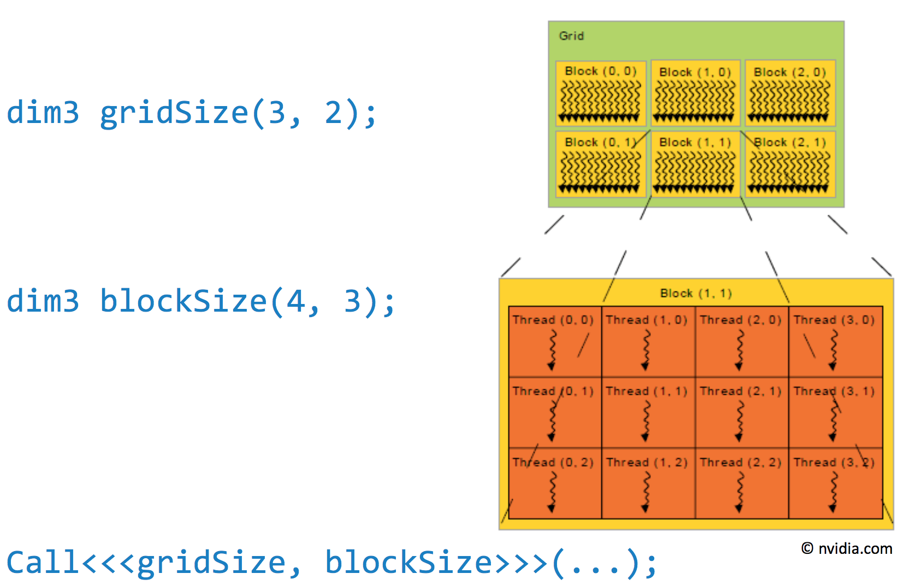

## C Limitation

Mehrdimensioale Arrays nicht direkt unterstützt


```c
float *matrix = 
  (float *)malloc(NofRows * NofCols * sizeof(float));
matrix[row * NOfCols + Col]
```

## Matrix Multiplikation

Sequentiell


$$
C_{i,j} = \sum_{0}^{K-+}A{i,k} * B_{k, j}
$$

```c
float sum = 0;
for (int k = 0; k < K; k++) {
  sum += A[i, k] * B[k, j];
}
C[i, j] = sum;
```

## Kernel: erste Versuche

```c
__global__
  void multiply(float *A, float *B, float *C) {
  int i = blockIdx.x * blockDim.x + threadIdx.x;
  int j = blockIdx.y * blockDim.y + threadIdx.y;
  float sum = 0;
  for (int k = 0; k < K; k++) {
    sum += A[i * K + k] * B[k * M + j]; 
  }
  C[i * M + j] = sum;
}
```

`A[i * K + k] + B[k * M + j]` ist äquivalent zu `A[i, k] * B[k, j]`

`C[i * M + j]` äquivalent zu `C[i, j]`

Bei diesem Kernel fehlt aber noch die Randbehandlung

```c
__global__
  void multiply(float *A, float *B, float *C) {
  int i = blockIdx.x * blockDim.x + threadIdx.x;
  int j = blockIdx.y * blockDim.y + threadIdx.y;
  if (i < N && j < M) {
    float sum = 0;
    for (int k = 0; k < K; k++) {
      sum += A[i * K + k] * B[k * M + j]; 
    }
    C[i * M + j] = sum;
  }
}
```

## Hohe Speicherkosten

Global Memory ist relativ teuer

Threads lesen wiederholt selbe Elemente von A & B

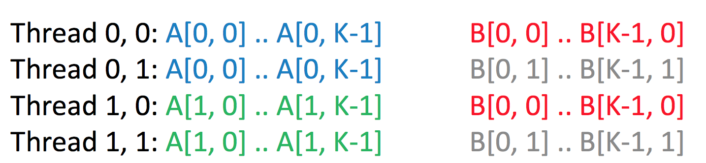

## CUDA Speicherstufen

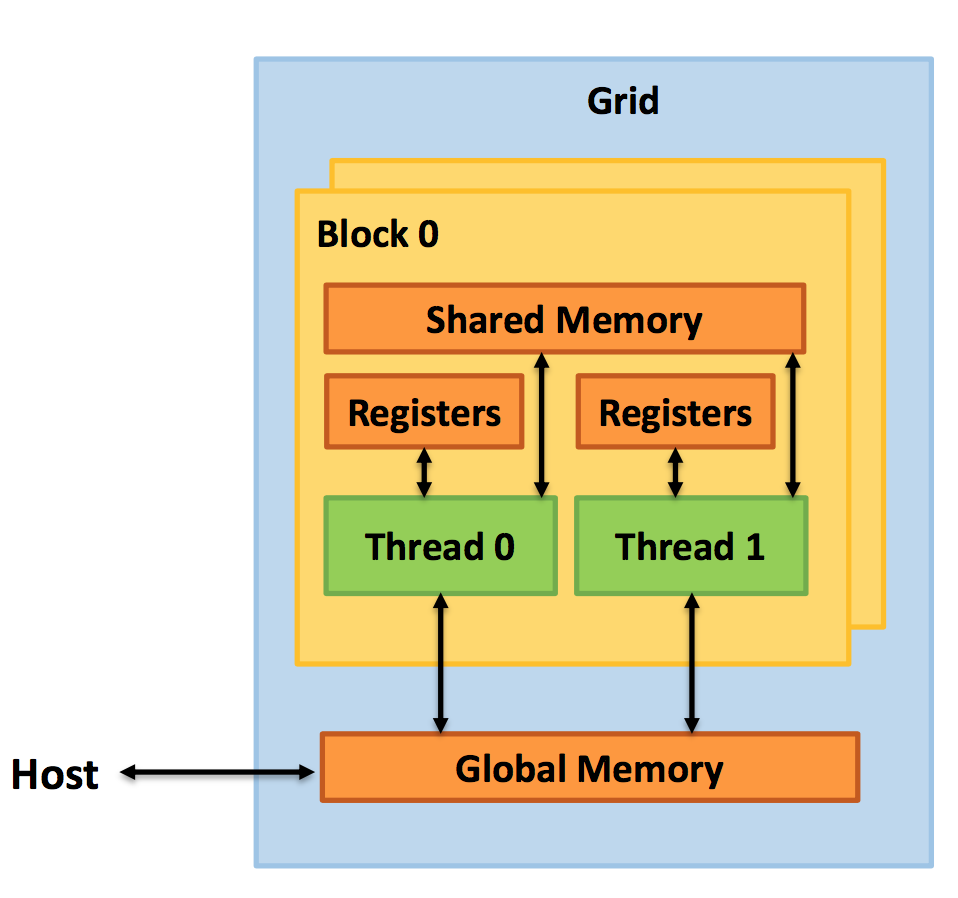

(vereinfachtes Speichermodell)

* Shared Memory
  * Per Streaming Multiprozessor
  * Schnell
  * Nur zwischen Threads innerhalb Block sichtbar
  * Paar KB
  * `__shared__ float x;`
* Global Memory
  * Main Memory in GPU Device
  * Langsam
  * Für alle Threads sichtbar
  * Mehrere GB
  * `cudaMalloc()`

Achtung: Shared Memory hängt auf dem Streaming Multiprocessor. Ein Streaming Multiprocessor hat mehrere Blöcke (man sieht den also nicht direkt; Streaming Processor sind dann die Threads).

Wieso ist das Shared Memory nur zwischen Threads innerhalb Block sichtbar?

Man kann nicht garantieren, dass zwei Blöcke auf demselben Streaming Multiprocessor sind. Somit kann es sein, dass man zwischen Blocks dasselbe Shared Memory hat, aber das wäre Zufall.

## Tiled Matrix Multiplikation

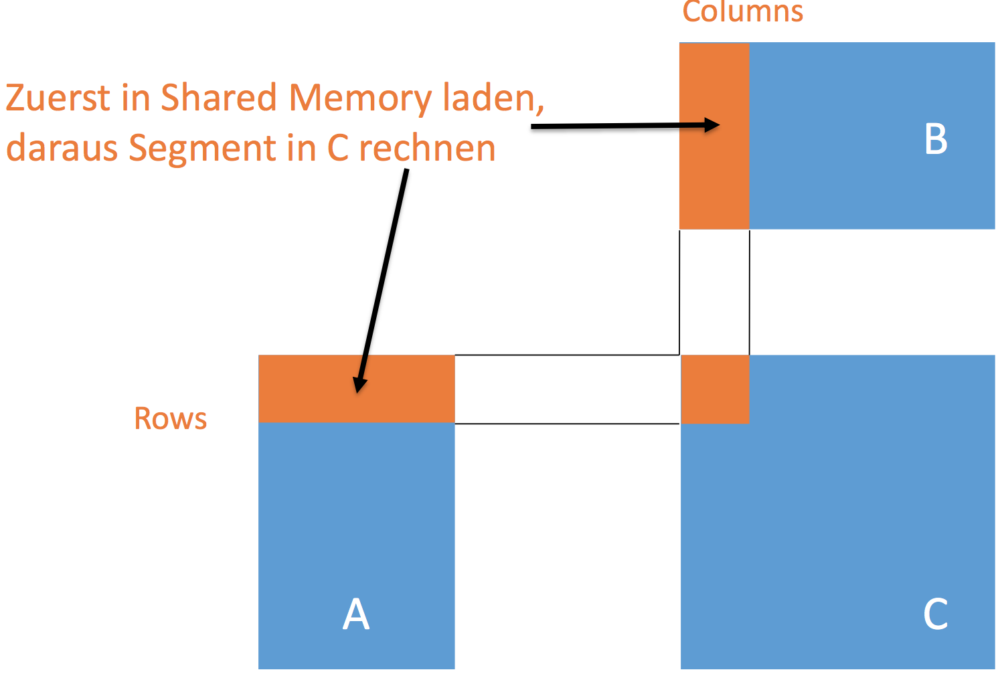

Begrenztes Shared Memory

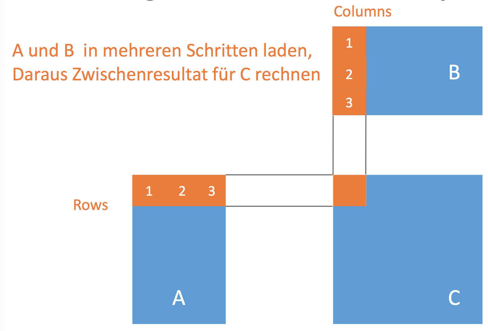

## Gerüst des Algorithmus

```c
float sum = 0.0;
for (int tile = 0; tile < nofTiles; tile++) {
  // Tile von A und B in Shared Memory lesen
  // Jeder Thread liest ein Element von jedem Tile
  __syncthreads();
  // Multipliziere Zeile von A-Tile mit
  // Spalte von B-Tile aus dem Shared Memory
  sum += partialProduct;
  __syncthreads();
}
C[row * M + col] = sum;
```

## CUDA Barriere

`__syncthreads()`

* synchronisiert alle Threads *innerhalb eines Blocks*
* Keine Synchronisation zwischen Blöcken

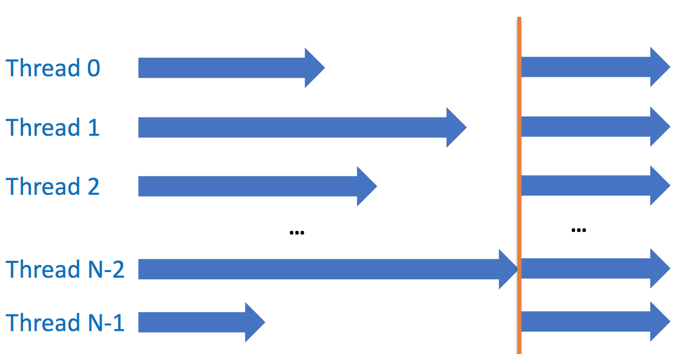

Jedes `__syncthreads` Statement ist andere Barriere

* in if-else nur erlaubt, falls alle Threads eines Blocks entweder nur oder nur else-Branch pro Runde wählen
* Sonst undefiniert

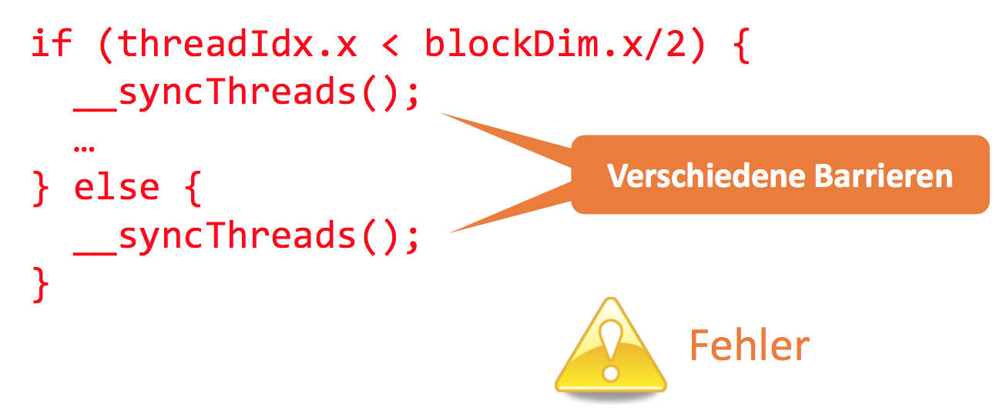

## Erweiterung mit Shared Memory

* Deklaration mit Keyword `__shared__`
* Statische Array-Grösse notwendig
  * begrenzter Speicher (z.B. 48KB)
* Mehrdimensionalität bei statischer Grösse erlaubt

```c

__shared__ float Asub[TILE_SIZE][TILE_SIZE];
__shared__ float Bsub[TILE_SIZE][TILE_SIZE];

int tx = threadIdx.x, ty = threadIdx.y;
int col = blockIdx.x * TILE_SIZE + tx;
int row = blockIdx.y * TILE_SIZE + ty;

for (int tile = 0; tile < nofTiles; tile++) {
  Asub[ty][tx] = A[row * K + tile * TILE_SIZE + tx];
  Bsub[ty][tx] = B[(tile * TILE_SIZE + ty) * M + col];
  __syncthreads();
  for (int ksub = 0; ksub < TILE_SIZE; ksub++) {
    sum += Asub[ty][ksub] * Bsub[ksub][tx];
  }
  __syncthreads();
}
C[row * M + col] = sum;
```

Es fehlen (wahrscheinlich) noch die Memory Guards, damit ich nicht über fremdes Memory schreibe

## Warp

Ein Block wird intern in Warps zerlegt (zu je 32 Threads) <== fixe Grösse?

* Alle Threads in Warp führen gleiche Instruktion aus
  * SIMD: gleiche Instruktion auf verschiedenen Daten
  * Verzweiungen werden abwechselnd ausgeführt (später)
* Stream Multiprozessor kann alle Warps eines Blocks beherbergen
  * aber nur wenige laufen gleichzeitig echt parallel (1 bis 24)

## Abbildung auf Prozessoren

* Ein Block läuft immer in einem Streaming Multiprozessor (SM)
  * Ein SM kann eventuell mehrere Blöcke beherbergen
* Ein Warp läuft (falls aktiv) auf den Stream Prozessoren (SPs) eines einzigen SM
  * Deswegen SIMD
* Latenzverringerung: falls ein Warp auf Speicher wartet, führt nächsten Warp aus
  * Analog zu Hyperthreading Modell

## Divergenz

Unterschiedliche Verzweigungen im selben Warp

* SM führt Instruktionen der einen Verzweigung durch
  * die anderen Threads müssen warten
* Dann wieder der anderen Verzweigung
  * die einen Threads müssen warten

Idee: innerhalb eines Warps machen immer alle dasselbe

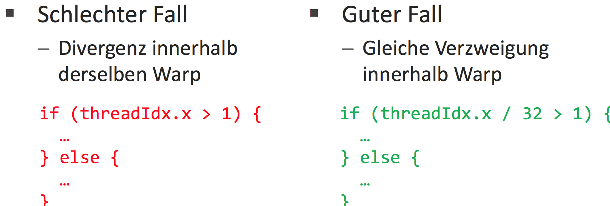

## Memory Coalescing

Zugriffsmuster der Threads sind entscheidend für Performance

Falls Threads auf aufeinanderfolgen zugreifen => in einer Transaktion (Memory Burst) erledigt

Sonst viele einzelne, teure Zugriffe

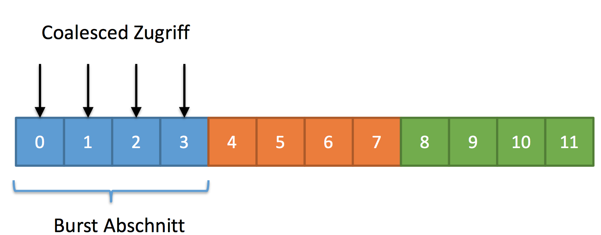

Threads in Warp müssen Zugriffe auf alle Elemente einer Burst Section erledigen

Auch Coalescing:

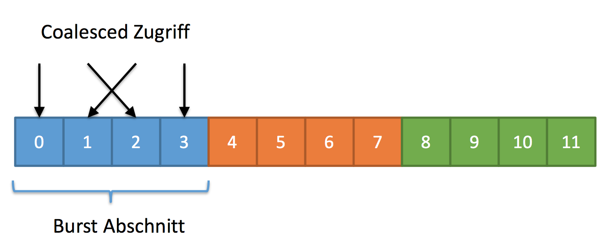

Kein Coalescing

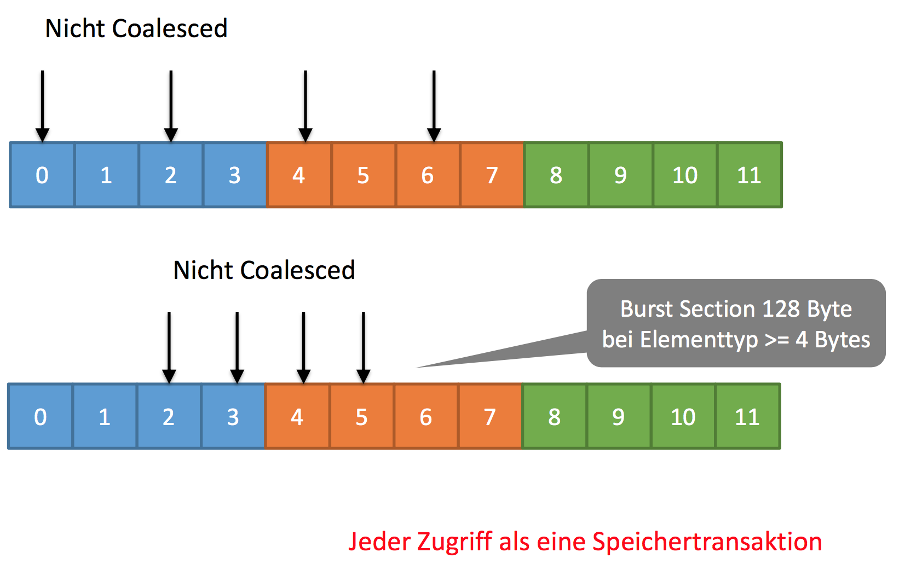

## Coalescing in Anwendungen

Zugriffe möglichst wie folgt umdesignen:

`data[(Ausdruck ohne threadIdX.x) + threadIdx.x]`

# Cluster-Parallelisierung

Möglichst hohe parallele Beschleunigung

* Faktor 100 und mehr

General Purpose

* Viele CPU Cores statt nur viele GPU Cores
* Kombination auch möglich

## Ausführungsmodell

HPC Job

* Zusammengehörige Ausführung im Cluster
* Vom Client lanciert
* Besteht aus einem oder mehreren Tasks

HPC Task

* Ausführung eines Executable
* Operiert auf Files in File Share des Clusters
* Abhängigkeiten zwischen Tasks definierbar

Ziel: ein Programm auf mehreren Nodes ausführen

## Verteiltes Programmiermodell

Programm auf mehreren Nodes ausführen

* Kein Shared Memory (NUMA) zwischen Nodes
* Shared Memory (SMP) für Cores innerhalb Node

Actor Model/CSP für beide Modelle geeignet

* Egal ob auf gleichen oder entferntem System
* Nachrichtenaustausch zwischen Prozessen

## Message Passing Interface (MPI)

Verteiltes Programmiermodell

* Basiert auf Actor/CSP-Prinzip
* Übliche Wahl für heterogene Parallelisierung

Industrie-Standard einer Library

## Erstes Programm

```c
#include <stdio.h>
#include "mpi.h"
int main(int argc, char* argv[]){
  MPI_Init(&argc, &argv); // Initialisierung
  int rank;
  MPI_Comm_rank(MPI_COMM_WORLD, &rank); // Prozess Identifikation
  printf("MPI process %i", rank);
  MPI_Finalize(); // FInalisierung
  return 0; 
}
```

Alternative in .NET

```c#
using MPI; 
using System;

class Program {
  public static void Main(string[] args) {
    using (new MPI.Environment(ref args)) {
      int rank = Communicator.world.Rank; Console.WriteLine("MPI process {0} ", rank);
    }
  } 
}
```

## Programmausführung

`mpiexec -n 16 FirstMpiProgram.exe`, `n` Prozessinstanzen

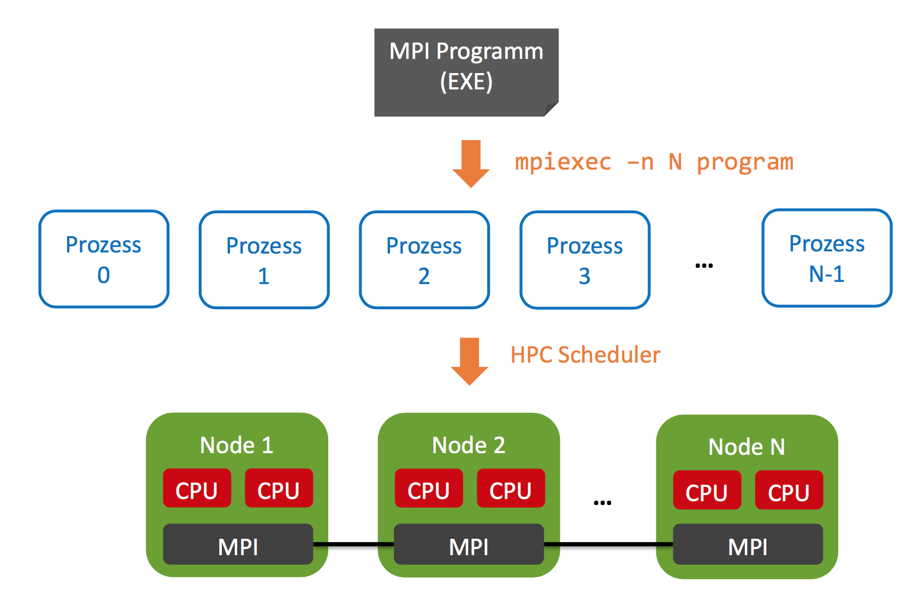

## Single Program Multiple Data

MPI Programm wird in mehreren Prozessen gestartet

* Jeder Prozess hat seine Identifikation (Rank)
* Prozesse arbeiten unabhängig in ihrem Adressraum
* Alle Prozesse starten und terminieren synchron

Prozesse können untereinander kommunizieren

* Senden und Empfangen von Nachrichten
* Synchronisation mit Barrieren

##  Communicator

Gruppe von MPI-Prozessen

* Erlaubt Kommunikation zwischen Prozessen

`Communicator.world`

* Alle Prozesse einer MPI-Programmausführung
* Eigene Gruppen definierbar

## Prozess-Identifikation

Rank = Nummer innerhalb einer Gruppe

Eindeutige Identifikation = (Rank, Communicator)

* `Communicator.world.Rank` Prozess-Nummer
* `Communicator.world.Size` Gesamtanzahl der Prozesse

## Direkte Kommunikation

`world.Send(value, receiverRank, messageTag)`

`world.Receive(senderRank, messageTag, out value)`

`world` = Communicator.world

`messageTag`: frei wählbare Nummer für Nachrichtenart (>= 0)

## Beispiel: Senden und Empfangen

```c#

var world = Communicator.world; int rank = world.Rank;
int size = world.Size;
int tag = 1;
if (rank == 0) {
  int value = new Random().Next(); 
  for (int to = 1; to < size; to++) {
    world.Send(value, to, tag);
  }
} else {
  int value;
  world.Receive(0, tag, out value);
  Console.WriteLine("{0} received by {1}", value, rank);
}
```

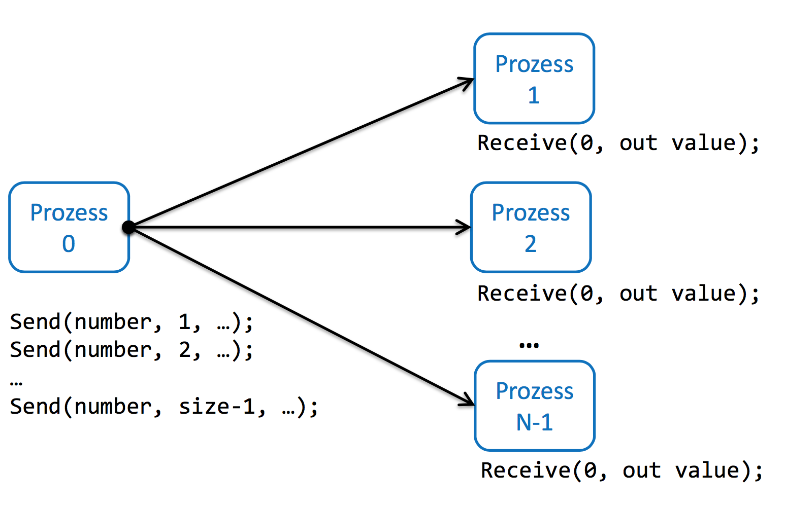

## Barriere

`Communicator.world.Barrier()`

Warte, dass alle Prozesse Barriere erreichen (`.Barrier()` aufrufen)

## Reduktion

Aggregation von Teilresultaten zwischen Prozessen

`world.AllReduce(value, (a, b) => a + b)`

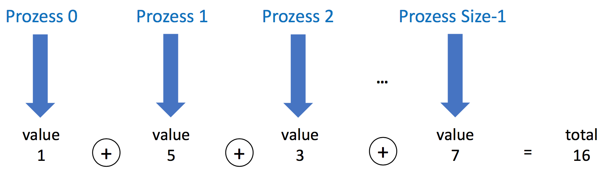

### Funktionen

`T Allreduce(T Value, Op<T>)`

* beliebige Aggregationsoperation, z.B. als Lambda
* Default-Initialwerte für T, z.B. 0 bei int
* Jeder erhält das Gesamtresultat als Rückgabewert
* Implizite Barriere/Broadcast über alle Prozesse

`T Reduce(T value, Op<T>, int rank)`

* Nur ein Prozess (rank) sieht das Gesamtresultat
* Effizienter als Allreduce, kein Broadcast

## Monte Carlo Pi Simulation

Randomisierte Berechnung von Pi

* Generiere zufällige Punkte aus Fläche
* Schaue, ob sie im Einheitskreis liegen
* Trefferrate gibt eine Annäherung an Pi


$$
\frac{\pi}{4}=\frac{Hits}{Points}
$$

### Sequentieller Algorithmus

```c#
long CountHits(long trials) {
  long hits = 0;
  Random random = new Random();
  for (long i = 0; i < trials; i++) {
    double x = random.NextDouble(); double y = random.NextDouble();
    if (x * x + y * y <= 1) { hits++; }
  }
  return hits; 
}

long hits = CountHits(Trials);
double pi = 4 * ((double)hits / Trials);
```

### MPI Parallelisierung

```c#
int rank = world.Rank;
int size = world.Size;

long hits = CountHits(Trials/size); // jeder Prozess rechnet Bruchteil
long totalHits = world.Reduce(hits, (a, b) => a + b, 0); // Prozess 0 erhält Gesamtwert
if (rank == 0) {
  double pi = 4 * ((double)totalHits / Trials);
  ...
}
```

## Blockierende Sends

Sends sind allenfalls blockierend

* D.h. wartet, dass Gegenseite empfängt

Bei Kreis => Deadlock

* Alle wollen senden, niemand empfängt

Lösung: nicht blockierendes Senden

```c#
var request = Communicator.world.ImmediateSend(text, right, 0); Communicator.world.Receive(left, 0, out text);
request.Wait();
```

# Reactive Programming

Deskriptiv (ähnlich wie LINQ)

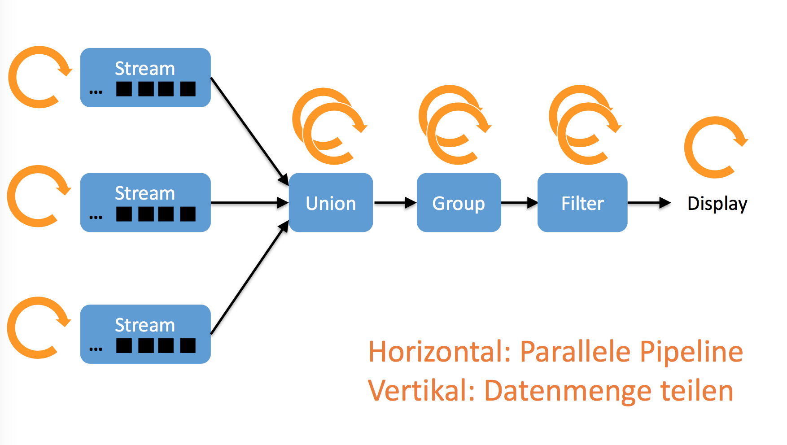

LINQ hat einen Pull-Mechanismus. Wenn Daten gebraucht werden, werden sie lazy angefordert. Die Input-Quelle ist passiv; der Input muss vollständig vorliegen.

Dieser Mechanismus funktioniert nicht, falls

* Input sukzessive mit Pausen ankommt
* Länge des Streams unbekannt bzw. unendlich ist

=> Push Modell (aka Reactive)

## Reactive Programming

* Inputs und Arbeitsschritte sind aktiv
  * Lösen pro Wert ein Ereignis aus (OnNext)
* Nachfolgeschritt abonniert Events des Vorgängers

## Rx.NET

Asynchrone Events + LINQ

* Inputs können asynchron als Events ankommen
* Verarbeitungsschritte als LINQ beschreibbar
* Outputs sind asynchrone Events (idea für GUI)

Zwischenschritte haben zwei Rollen (Interfaces)

* Observer des Vorgängers
* Observable des Nachfolgers

Das Ganze nennt man dann ein `Subject<T>` (oder Promise)

Einfaches Beispiel:

```c#
var subject = new Subject<string>();

// Observer ruft auf
subject.Subscribe(Console.WriteLine);

// Observable ruft auf
subject.OnNext("A");
subject.OnNext("B");
subject.OnNext("C");
subject.OnCompleted();
```

Observer kann beliebig viele Werte erhalten

Ende der Sequenz

* Erfolgreich mit OnCompleted()
* Fehlerhaft mit OnError()

Nach dem Ende ignorieren Subjects weitere Aufrufe

## Ad-Hoc Observer Erzeugung

```c#
subject.Subscribe(
  DelegateForOnNext,
  DelegateForOnError, // Optional
  DelegateForOnCompleted // Optional
);

subject.Subscribe(
  value => Console.WriteLine("{0} received", value),
  exception => Console.WriteLine("{0} thrown", exception),
  () => Console.WriteLine("completed")
);
```

## Buffer-Varianten

| Subject         | Observer erhält zukünftige Werte    | Kein Buffer  |
| --------------- | ----------------------------------- | ------------ |
| ReplaySubject   | Observer erhällt alle letzten Werte | Unbeschränkt |
| BehaviorSubject | Schickt letzten Wert und zukünftige | Ein Element  |
| AsyncSubject    | Schickt letzten bei OnCompleted     | Ein Element  |

## Collections zu Observable

Passive Enumerable zu aktiven Observable umwandeln:

`salesEurope.ToObservable()`

## Observables kombinieren

```c#
var combinedSales = 
  salesEurope.ToObservable().
  Merge(salesAsia.ToObservable()).
  Merge(salesAmerica.ToObservable());

combinedSales.Subscribe(Console.WriteLine);
```

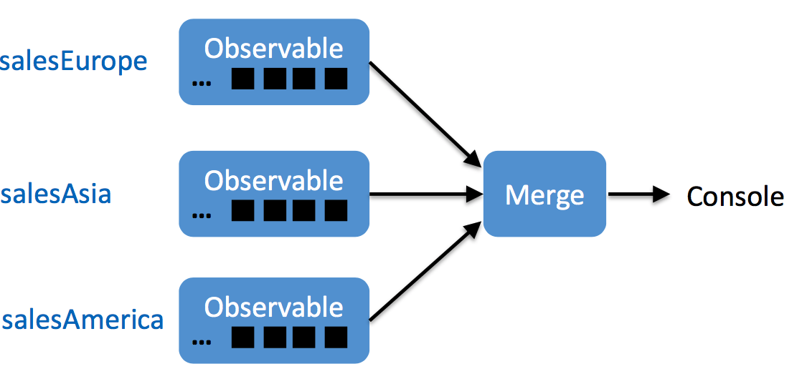

## Rx und Concurrency

* Default: alles sequentiell
  * asynchron
* Concurrency einfach einstellbar
  * Scheduler mit `ObserveOn()` angeben

`observable.ObserveOn(TaskPoolScheduler.Default).Subscribe(...)`

## Parallele Verarbeitung mit TPL

```c#
var sales1 = salesEurope.ToObservable().
  ObserveOn(TaskPoolScheduler.Default);
var sales2 = salesAsia.ToObservable().
  ObserveOn(TaskPoolScheduler.Default);
var sales3 = salesAmerica.ToObservable().
  ObserveOn(TaskPoolScheduler.Default);

var combinedSales =
  sales1.Merge(sales2).Merge(sales3);

combinedSales.Subscibe(Console.WriteLine);
```

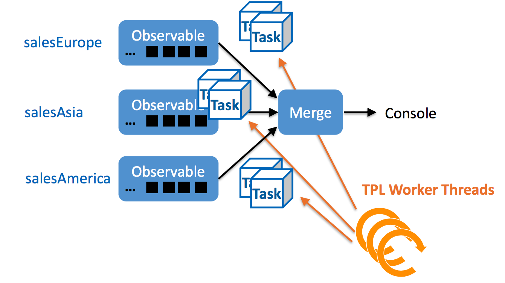

## Andere Scheduler

* Default
  * synchrone Ausführung (gleicher Thread)
* `TaskPoolScheduler.Default`
  * Parallele Ausführung in TPL
* `NewThreadScheduler.Default`
  * Alle Aufrufe dieses Observable in neuen Thread
* `DispatcherScheduler.Current`
  * GUI Thread

## GUI

Ausführung auf GUI Thread

```c#
combinedSales.ObserveOnDispatcher().Subscribe( entry =>
    textBlock.Text += entry.Article + " " + entry.Volume
);
```

## Rx mit LINQ

```c#
var sales =
  from entry in
    salesEurope.ToObservable().
    Merge(salesAsia.ToObservable()).
    Merge(salesAmerica.ToObservable())
  group
  	entry by entry.Article into category
  let
  	sum = category.Sum(e => e.Volume) // sum ist Observable (kein Skalar)
  select
  	new { category.Key, sum };
```


## Vorgefertigte Observables

* `Observable.Return("Value")` liefert den Wert, dann Completed

* `Observable.Empty()` liefert sofort Completed

* `Observable.Never()` liefert nie etwas (auch nicht Completed)

* `Observable.Throw(exception)` liefert sofort Error

* `Observable.Range(-10, 20)` 

* ```c#
  Observable.Generate(
    0,
    value => value < 100,
    value => value + 2,
    value => value
  )
  // 0, 2, 4, ..., 98  
  ```

* `source.Take(10)` nächste 10 Werte von` source`, dann Completed

* `Observable.Interval(TimeSpan.FromMilliseconds(250))` 0, 1, 2 im Intervall von 250ms

* `Observable.Timer(Timespam.FromDays(1))` liefert 0 erst in einem Tag

* `source.Delay(Timespam.FromSeconds(1))` verzögert alle werte von `source` einmal um 1 Sekunde

## Events zu Observables

Event Quellen zu Observables umwandeln

```c#
Observable.FromEventPattern <MouseButtonEventHandler, MouseButtonEventArgs>( 
  h => window.MouseDown += h,
  h => window.MouseDown -= h
);
```

## Hot & Cold

Hot = aktiv; notifizieren spontan auch ohne registrierte Observers

Cold = passiv; notifizieren on request, erst bei Anmeldung von Observers

# Software Transactional Memory (STM)

Idee aus Datenbanksystem

Ziele: keine Races, keine Deadlocks (keine Starvation)

## Software Transactions

Atomare Sequenz von Operationen

Konzeptionell wie eine grosse atomare Instruktion

keine inkonsistenten Zwischenstände bemerkbar

## ACI Transaktionen

* Atomicity
  * Vollständig oder gar nicht sichtbar
* Consistency
  * Programm vor und nach Transaktion gültig
* Isolation
  * Effekte wie eine serielle Ausführung
* Gegensatz zu DB
  * keine Durability/Persistenz

## Konzept

Deskriptiv. Was ist atomar, nicht wie

Automatische Isolation

* überlasse korrekte Ausführung dem System

Einschränkungen

* nur Speicherzugriffe sind isoliert, Seiteneffekte nicht

Implementierung

* meist optimistisches Concurrency Control

## STM versus Locking

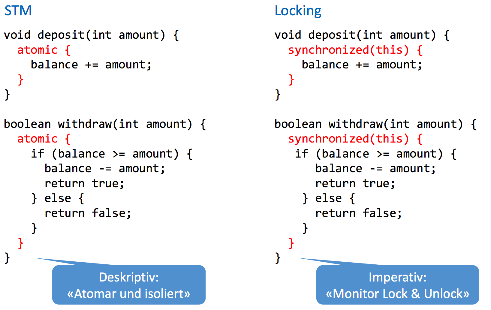

Mit STM kann man auch Nested Transactions richtig machen (`withdraw` und `deposit`)

Es gibt keine Gefahr von Deadlocks

Im Fehlerfall ist das Geld drauf oder eben nicht, aber nicht verloren

## Transaktionsausführung

Optimistisches Concurrency Control (OCC)

* unsynchronisiert ausführen
* bei Konflikten => Rollback durch System

Transaktionen könenn unerwartet abbrechen

* Automatischer Retry, sollte für Anwendung unbemerkbar sein

## Typische Probleme

Seiteneffekte bleiben sichtbar

Starvation-Gefahr bei OCC

* Transaktion unter Umständen wiederholt wegen Konflikt abbrechbar

## Warten auf Bedingungen

* Retry innerhalb Transaktion
  * Transaktion ausdrücklich abbrechen
  * Automatische Wiederholung später
* System Monitoring
  * Wiederholung erst, wenn Zustandsänderung

## Nested

Commit erst bei Top Level Transaktion

## Baldiger Abbruch

Bei Konflikten: Transaktion direkt abbrechen

## Hardware Support

Intel Transactional Synchronisation Extensions (TSX), unterstützt sogar nested Transactions

Kann vom Framework genutzt werden

Aber mit Bug in Haswell, es ist anscheinend nicht so einfach

## STM auf Java

Scala STM

## Wrapping von Variablen

Keine normalen Variablenzugriffe in Transaktionen, sonst sind sie nicht transaktionell. 

Ausnahme: lokale Variablen und Parameter

```java
final Ref.View<Integer> balance = STM.newRef(0);
final Ref.View<LocalDate> lastUpdate = STM.newRef(LocalDate.now());
```

## Transaktion

```java
import scala.concurrent.stm.japi.STM;
void deposit(int amount) {
  STM.atomic(() -> {
    balance.set(balance.get() + amount);
    lastUpdate.set(LocalDate.now());
  });
}
```

## Retry

```java
void withdraw(int amount) {
  STM.atomic(() -> {
    if (balance.get() < amount) {
      STM.retry();
    }
    balance.set(balance.get() - amount);
    lastUpdate.set(LocalDate.now());
  });
}
```

## Nested Transactions

```java
void transfer(BankAccount from, BankAccount to, int amount) {
  STM.atomic(() -> {
    from.withdraw(amount);
    to.deposit(amount);
  });
}
```

## Exceptions

Rollback und Abbrechen mit Exception, kein Retry

```java
void deposit(int amount) {
  STM.atomic(() -> {
    if (balance.get() >= Limit) {
      throw new RuntimeException("Balance limit");
    }
    balance.set(balance.get() - amount);
    lastUpdate.set(LocalDate.now());
  }
}
```

## Zugriffe in Transaktionen

Nur Zugriffe via Wrapper: `Ref.View<T>`; T muss immutable sein

Indirekte Strukturen sind nicht transaktionell (Collections)

Vordefinierte transaktionelle Collections

* `STM.newMap()`
* `STM.newSet()`
* `STM.newArrayAsList()` fixed size list
* Normale List fehlt

## Keine Seiteneffekte

* Kein IO, auch kein Thread Start/Wait/Join

Spezifisch: keine normalen Variablen

* nur lesen von final oder lokalen Variablen
* Sonst nur Zugriffe via Wrapper
* oder Transactional Collections

## Transaktionstheorie

* Jede serielle Ausführung der Transaktion ist korrekt
* Nebenläufige Ausführung auch korrekt, sofern die Effekte gleich sind wie irgendeine serielle Ausführung

=> Serialisierbarkeit

Write Skew und Starvation-Probleme (nicht verstanden, S. 30-32)