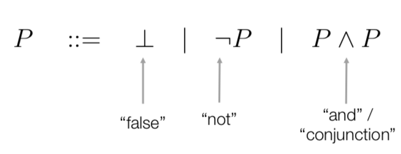
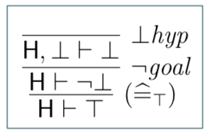
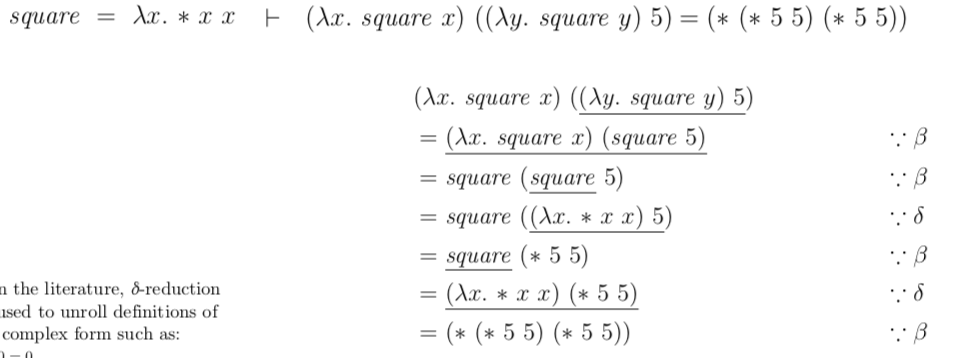
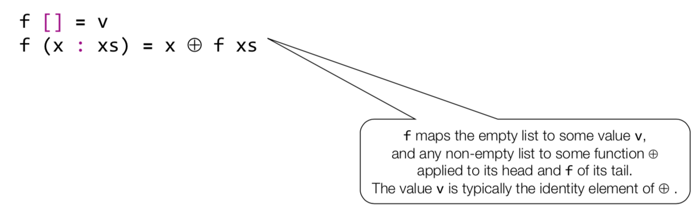

# PrfM

# Introduction

Formal Methods: applying ... such as logic calculi, formal languages, automata theory, program semantics, type systems, algebraic data types

Formal Languages: constrained by specific rules


# Programming Paradigms

Imperative

* focuses on **how** a program operates
* uses commands that **change a program's state**. 
* Program = Sequence of commands; Computation = Change of state
* Close to hardware implementation!

Declarative Programming:

* Functional Programming (Basis: Lambda Calculus)
  * Programs = Function definitions
  * Computations = Expression evaluation
* Logic Programming (Basis: Predicate Logic)
  * Programs = Sequents in predicate calculus
  * Computation = proof of a sequent
* Express the logic, not the control flow
* Describe **what** the program accomplishes, *how* is left to the implementation

# Formal Proof

Constructed using well-formed formulaes of formal languages and formally defined rules of inference

Can (sometimes) be mechanically constructed

Some proofs are only practically possible with computational aid

# Sequent Calculus

$S1$ is a sequent. A generic name for a statement that we want to prove

Proof rule: used to construct proofs of sequents


Axiom: in case the list of antedecents $\vec{A}​$ is empty, the rule is said to be an axiom that discharges the sequent C.

Reading a proof rule: in order to prove the sequent $S1$ it is sufficient to prove the sequents $S2$ and $S3$

Theory: a set of proof rules (possibly infinite). Normally, the set of proof rules that make up an interesting theory are infinite and it is specified using a finite set of proof rule schemas

Proofs (Derivations)

* each node consists of a sequent and an optional proof rule of the theory
* root node contains the initial sequent we want to prove
* a node with no proof rule has no child nodes
* if a node has a proof rule:
  * sequent is identical to the consequent of the proof rule
  * a child node corresponding to each antedecent of the proof rule
  * sequent of each child node is identical to its corresponding antecedent

Pending Subgoals

* proof complete: iff has no pending subgoals
* incomplete proof: iff has at least one pending subgoal
* Valid sequent: sequent S is valid with respect to theory $\tau$ iff there exists a complete proof of S within the  theory $\tau​$

# Propositional Calculus


Predicate: formal statement expressing a certain property that we may assume, or wish to prove

Sequents (redefined):

* composed of a finite set of hypotheses predicates $H$
* and a single goal predicate $G$ written in $H\vdash G$


"Under the hypotheses H prove the goal G"


## basicPC



Operator bind (decreasing strength): not, and

## Proof Rule Schema

Uses meta variables


## basicPC


## PC

Extend basicPC to PC by introducing


Syntactic rewriting should be used like a rule



## Summary of PC


# First-Order Predicate Calculus

Goal: FoPCe: First-order predicate calculus with equality

Expression: a formal statement denoting a mathematical object

Expressions cannot be proven, only predicates can be proven. Relations are used to build predicates from expressions

Variables: identifiers of a mathematical object, therefore an expression. Subject to substitution (being replaced by another expression)

## Syntax of basicFoPCe


## Free and bound Variables


nfin: not free in (e.g. y nfin P)

Bound variables are placeholders. Their names have no significance and can be renamed


## FoPCe


## Summary of FoPCe


# Logic Programming (Prolog)

```
m(X):- h(X). -- Rule
h(s). -- Fact
?- m(s). -- Query
true. -- Result
```


`:-` ist ein umgekehrtes $\impliedby$

# Prolog Facts, Rules and Queries


A fact can be viewed as a rule without a body (=> body = true)

Facts and rules sometimes referred to as clauses. End of a clause is marked with a full stop.

Three predicates here:

* happy, listens2music, playsAirGuitar

Conjunction (and): comma


Disjunction(or): two rules, or semicolon


## Asking for Alternatives

`?- woman(X)`

Last result has a full stop. No results are "false"

## Syntax


Atoms: starting with a lowercase letter, or enclosed in single quotes. Special characters (keywords) are also atoms

Numbers: floats, ints

Variables: starting with an uppercase letter or an underscore

Complex terms are built out of a functor directly followed by a sequence of arguments ("function"). Built out of a functor and a sequence of arguments. The functor must be an atom.

Arity: how many arguments a complex term has

* `woman(mia)` has arity 1 (/1)
* `loves(vincent, mia)` has arity 2 (/2)
* `father(father(butch))` has arity 1 (/1)

Arity ~= overloading: can define two predicates with the same functor but with different arity. Prolog treats this as two different predicates. Arity is usually indicated with the suffix `/` followed by the arity's number

# Prolog Unification and Proof Search

Two terms **unify**:

* if they contain the *same term*, or
* if they contain variables that can be *uniformly instantiated* with terms in such a way that the *resulting terms are equal*

Examples

* mia and mia unify
* 42 and 42 unify
* woman(mia) and woman(mia) unify
* vincent and mia do not unify
* woman(mia) and woman(jody) do not unify

For certain types of unification problems, a *most general unifier* can be found.


Unification can be tested with `=/2`

Occurs Check: if asked to unify a variable with another term, unification checks whether the variable occurs in this term. This prevents circular/infinite terms. By default, Prolog omits this check for *efficiency* reasons. This can lead to circular data structure and looping.

The predicate `unify_with_occurs_check/2` can be used to include the occurs check during unification

```
unify_with_occurs_check(father(X), X)
```


## Proof Search


# Prolog Recursion

Mismatch between declarative and procedureal meaning of a Prolog program. At the end of the day, it runs on a real machine

Prolog has a specific way of answering queries:

* search knowledge base from top to bottom
* process clauses from left to right
* backtrack to recover from bad choices

> In recursive calls, make sure your recursion comes late or last

# Prolog Lists

Lists are written in `[]`. The empty list is special!

A non-empty list has two parts: the head and the tail. The head is the first item, the tail is everything else.

* The head is the first item in the list

* The tail is everything else
  * The tail is the list that remains when we take the first element away
  * **the tail is always a list** (can be the empty list)

> The empty list has neither a head nor a tail!

The operator `|` can be used to decompose a list into its head and tail

````
?- [Head|Tail] = [mia,vincent,jules,yolanda].
Head = mia,
Tail = [vincent, jules, yolanda].

?- [X|Y] = [mia,vincent,jules,yolanda].
X = mia,
Y = [vincent, jules, yolanda].
````

Can even have two elements, e.g. `[X,Y|Tail]`

Anonymous Variables are written with a simple `_`. Each instantiation is independent.

# Recipe for recursion

A Recipe for Recursion (Prolog) 

1. Write down the signature of the predicate you want to define so that you know what you are doing. 
2. Choose the parameter(s) over which you want to perform the recursion. 
3. Identify and write down the case distinctions for the recursion parameter(s) on the left hand side of the rules. 
4. The case distinctions consist of base cases and recursive cases. 
5. For each recursive case, note down the predicate applied to the recursion parameter(s) made “smaller”. This predicate may be used within the right hand side of your rule. 
6. Complete your rules. 
7. Check that your rules are valid properties of the predicate you want to define. 

A Recipe for Recursion (Haskell) 

1. Write down the type signature of the function you want to define so that you know  what you are doing. 
2. Choose the parameter(s) over which you want to perform the recursion. 
3. Identify and write down the case distinctions for the recursion parameter(s) on the left hand side of the definitions. 
4. The case distinctions consist of base cases and recursive cases. 
5. For each recursive case, note down the function applied to the recursion parameter(s) made “smaller”. This expression may be used within the right hand side of your definition. 
6. Complete the right hand sides of your definition. 
7. Check that the inferred type agrees with the type you were aiming for and that the definitions are valid properties of the function you want to define. 

# Arithmetic

`X is 3*4`

Warning: you can't infere stuff here (e.g. `1 is X*4`). `is` does the actual arithmetic. Without it, `3/4` is just using the `/ / 2` predicate. 

Return results are often given in arguments (compare to out arguments in C#)

```
addThreeAndDouble(X,Y) :- Y is (X+3) * 2
?- addThreeAndDouble(1, X)
```

Restrictions on `is`:

* free to use variables on the right hand side of the predicate
* when actually carried out, the evaluation must be instantiated with a variable-free Prolog term
* this term must be an arithmetic expression

`3+2` is just syntactic sugar for `+(3, 2)`

## How long is a list?

Empty list: length 0

Non-empty list: one plus length of tail

## Accumulators

```
// when we reach the empty list, the accumulator contains the length of the list
accLen([],Acc,Length) :- Length = Acc.

// add 1 to the accumulator each time we take off a head from the list
accLen([_|L],OldAcc,Length) :-
	NewAcc is OldAcc + 1,
	accLen(L, NewAcc,Length).
```

AccLen is better than Len, since it's tail recursive

* in tail recursive predicates, the result is fully calculated once we reach the base clause
* in non-tail recursive predicates, there are still goals on the stack when we reach the base clause


## Comparing Integers

Some predicates actually do carry out arithmetic by themselves. These are the operators that compare integers

# More lists

append/3 can be a source of inefficiency

Concatenating a list is not done in one simple action but by travsering down one of the lists

=> it's defined to recurse on the first list. Therefore, make the first argument the shorter list

# Cuts and Negation

Negation as failure. Like cuts, but works better.

Has to be the last statement! Otherwise, it masks other statements.

# Database Manipulation and Collecting Solutions

findAll(O,G,L) produces a list L of all the objects O that satisfy the goal G

* always succeeds
* unifies L with empty list if G cannot be satisfied

# Lambda Calculus

Pure untyped Lambda Calculus

$\alpha$ equivalence = Variablennamen (bound) ersetzen


$\beta​$ reduction = Function application

Rest of proof rules:


# Computation with the Lambda Calculus

Final step (no $\beta$ reduction possible) are in $\beta$-normal form. 

Every $\lambda$ term has at most one normal form (contrary to most programming languages)

They can also have no normal form!

Adding definitions results in an impure or applied $\lambda$ calculus.

$\delta$ reduction = unrolling definitions. substitution of a defined symbol with is definition



redex = reducible expression. any $\beta\delta$ reducible sub-term

the evaluation strategy plays an important role in

* length of derivations
* if they terminate

leftmost innermost/leftmost outermost does **not** refer to the depth in the syntax tree, but if redexes are contained inside, or outside

leftmost innermost:

* a function's argument are substituted into the body of a function **after** they are reduced
* => a function's arguments are reduced exactly once

leftmost outermost

* also known as normal order or "outermost first" since it always ends in a normal form if one exists
* a function's arguments are substituted into the body of a function **before** they are reduced
* => a function's arguments are reduced as often as they are needed

Haskell has lazy evaluation that uses memoization (caching) to have call by name, but still avoid computing the same expression more than once.

Church Encodings: allows us to have boolean algebra and arithmetic.

# Functional Programming

Side effects are necessary!

Side effects are often treated like a global variable that is always available. They are not modular and difficult to reason about. Side effects should be controllable!

Each input is related to exactly one output

Key Features

* no mutable state
* functions are first class citizens

f(x) only depends on the definition of f and the value of the parameter x

* no (mutable) variables
* no assignments
* no imperative control structures
* all data structures are immutable

# Haskell Introduction

# Haskell First Steps

Function application has higher priority than all other operators

`f a + b` means `f(a + b)`

By convention, list arguments have an s suffix

Function and argument names must begin with a lowercase letter

Layout rule: in a sequence of definitions, each definition must begin in precisely the same column

The layout rule allows for implicit bracing without explicit `{/}` in let, where, of, do

# Haskell Types and Classes

Type is a name for a collection of related values. The type `Bool` has the two values `False` and `True`If evaluating an expression *e* would produce a value of type *t* then *e* **has type** *t*, written `e :: t`

Every well formed expression has a type which can be calculated at compile time using type inference

Haskell checks types at compile time!

GHCi: `:type` command evaluates type of an expression without evaluating

Basic Types

* Bool
* Char
* String
* Int (fixed-precision)
* Integer (arbitrary precision)
* Float

`[t]` is the type of lists with elements of type `t`

`t` can be a list type itself. There's no info about its length in `t`

Tuples are sequences of different types. The type of a tuple encodes its size (number of types = number of values)

Functions are a mapping of values of one type to values of another type (can be the same). `t1 -> t2` is the  type of function that maps values of `t1` to `t2`

## Currying

```hask
add' :: Int -> (Int -> Int)
add' x y = x + y


-- Load in GHCi
> add' 2 3
5
> (add' 2) 3
5
> z = add' 2
> z 3
5
```

`add'` takes an integer `x` and returns a function `add' x`. This function takes an integer `y` and returns the result `x + y`

> Equivalent to Lambda Calculus: `add' = \x -> \y -> x + y`


```haskell
mult:: Int -> (Int -> (Int -> Int))
mult x y z = x * y * z
```

To use less parentheses, the arrow `->` associates to the right

```haskell
Int -> Int -> Int -> Int
=
Int -> (Int -> (Int -> Int))
```

As a consequence, function applications associate to the left.

Unless tupling is explicitly required, all functions in Haskell are normally defined in curried form

## Polymorphic Functions

Type contains one or more type variables

`length :: [a] -> Int` => for any type `a`, `length` takes a list of values of type `a` and returns an integer

Type variables must begin with a lower case letter and are usually named a, b, c, etc.

## Overloaded Functions

type contains one or more **class constraints**

`(+) :: Num a => a -> a -> a`

Constrained type variables can be instantiated to any types that satisfy the constraints

Type Classes: including,

* Num
  * `(+) :: Num a => a -> a -> a`
* Eq
  * `(==) :: Eq a => a -> a -> Bool`
* Ord
  * `(<) :: Ord a -> a -> Bool`

## Hints and Tips

It's useful to begin by writing down the type of a function

Take care to include the necessary class constraints

# Haskell Defining Functions

## ​Conditional Expressions

```haskell
abs :: Int -> Int
abs n = if n >= 0 then n else -n

-- Can be nested
-- Conditionals MUST have an else branch
signum :: Int -> Int
signum n = if n < 0 then -1 else
			if n == 0 then 0 else 1
```

## Guarded Equation

Alternative to conditionals

```haskell
abs n
	| n >= 0 = n
	| otherwise = -n
	
-- Easier to read
signum n
	| n < 0 = -1
	| n == 0 = 0
	| otherwise = 1
```

`otherwise` is defined as `otherwise = True`

## Pattern Matching

```haskell
not :: Bool -> Bool
not False = True
not True = False

-- Example 2
(&&) :: Bool -> Bool -> Bool
True && True = True
True && False = False
False && True = False
False && False = False

-- More compact:
True && True = True
_ && _ = False

-- More efficient (avoids evaluating the second argument if the first is False)
True && b = b
False && _ = False

-- Patterns are matched in order (v always returns false)
_ && _ = False
True && True = True

-- Patterns may not repeat variables (gives  error)
b && b = b -- XXX
_ && _ = False
```

### List Patterns

Internally, every non-empty list is constructed by repeated use of the `(:)` operator (called cons)

`[1, 2, 3, 4] = 1 : (2 : (3 : (4 : [])))`

```haskell
-- Functions on lists can be defined using x : xs patterns
head :: [a] -> a
head (x : _) = x

tail :: [a] -> [a]
tail (_ : xs) = xs
```

> `x : xs` patterns only match non-empty lists

`x : xs` pattern must always be parenthesized

## Lambda Expression

Used to define anonymous functions. `\ x -> x + x`

Gives formal meaning to functions defined using currying. 

`add x y = x + y` means `add = \ x -> (\ y -> x + y)`

Useful when defining functions that return functions as results

```haskell
const :: a -> b -> a
const x _ = x

-- "more naturally defined" (this is what actually happens)
const :: a -> (b -> a)
const x = \_ -> x
```

Can be used to avoid naming functions that are only referenced once

```haskell
odds n = map f [0 .. n-1]
	where
		f x = x * 2 + 1
		
-- simplified
odds n = map (\ x -> x * 2 + 1) [0 .. n-1]
```

## Operator Sections

An operator written *between* two arguments can be converted into a curied function written *before* its two arguments using parentheses

```haskell
> 1 + 2
3

> (+) 1 2
3

-- Also

> (1 +) 2
> (+ 2) 1
```

In general, if `∆` is an operator, then functions of the form `(∆)`, `x (∆)`, `∆ y` are called sections.

Useful functions with sections:

* successor `(1 +)`
* reciprocation `(1 /)`
* doubling `(* 2)`
* halving `(/ 2)`

# Haskell List Comprehensions

Mathematics: construct new sets from old sets (comprehension notation) $\{x | x \in \{1...5\}\}$

Haskell: construct new **lists** from old lists

`[x^2 | x <- [1..5]]`

Elegant way to perform iteration in the declarative style

```haskell
factors n = [x | x <- [1..n], n `mod` x == 0]
prime n = factors n == [1, n]
primes n = [x | x <- [2..n], prime x]
```

## Generators

`x <- [1..5]` is called a generator. Comprehensions can have multiple generators, separated by commas

Multiple generators are like nested loops, later generators are more deeply nested loops whose variables change more frequently

=> linkerer Loop-Wert bleibt länger gleich


## Dependant Generators

Later generators can **depend** on the variables that are introduced by earlier generators

```haskell
[(x, y) | x <- [1..3], y <- [x .. 3]]
```

## Guards

Restrict the values produced by earlier generators

`[x | x <- [1..10], even x]`

## zip

Maps two lists to a list of pairs

> Infinite list: `[0..n]`

```haskell
pairs :: [a] -> [(a, a)]
pairs xs = zip xs (tail xs)

sorted :: Ord a => [a] -> Bool
sorted xs = and [x <= y | (x, y) <- pairs xs]

positions :: Eq a => a -> [a] -> [Int] positions x xs =
[i | (x', i) <- zip xs [0 ..], x == x']
```


## String Comprehensions

Strings are lists of chars.

`"abc" :: String` means `['a', 'b', 'c'] :: Char`

A polymorphic function that works on lists also works on strings

List comprehensions can also be used to define functions on strings

```haskell
count :: Char -> String -> Int
count x xs = length [x' | x' <- xs, x == x']
```

# Haskell Recursive Functions

```haskell
fac' 0 = 1
fac' n = n * fac (n - 1)

product :: Num a => [a] -> a
product [] = 1
product (n : ns) = n * product ns
```

# Haskell Higher-Order Functions

```haskell
twice :: (a -> a) -> a -> a
twice f x = f (f x)
```

## foldr




Can also be written as

```haskell
sum = foldr (+) 0
product = foldr (*) 1
or = foldr (||) False
and = foldr (&&) True
```


## Other functions

`f . g = \x -> f (g x)`

`all` decides if every argument of a list satisfies a given predicate. `any` does the same if *at least one* element satisfies a predicate

`takeWhile` selects elements from a list while a predicate holds of the head, and returns the selected elements. `dropWhile` removes elements while ... and returns the rest

# Haskell Types and Classes

## Type declarations

New name for an existing type: `type String = [Char]`

```haskell
type Pos = (Int, Int)
origin :: Pos
origin = (0, 0)

left :: Pos -> Pos
left (x, y) = (x -1, y)

-- Can also have parameters
type Pair a = (a, a)

mult :: Pair Int -> Int
mult (m, n) = m, n

copy :: a -> Pair a
copy x = (x, x)

-- Can be nested
type Pos = (Int, Int)
type Trans = Pos -> Pos

-- CANNOT be recursive
type Tree = (Int, [Tree]) -- XXX
```

## Data declarations

A completely new type can be defined specifying its values (aka algebraic datatypes)

`data Bool = False | True`

* `False` and `True` are called the constructors for `Bool`
* Type and constructor names must always begin with an upper-case letter

```haskell
data Answer = Yes | No | Unknown
answers :: [Answer]
answers = [Yes, No, Unknown]

flip :: Answer -> Answer
flip Yes = No
flip No = Yes
flip Unknown = Unknown

-- Can also have parameters
data Shape = Circle Float | Rect Float Float

square :: Float -> Shape
square n = Rect n n

area :: Shape -> Float
area (Circle r) = pi * r^2
area (Rect x y) = x * y
```

* Circle and Rect can be viewed as functions that construct values of type Shape

Data declarations themselves can also have parameters

```haskell
data Maybe a = Nothing | Just a


safediv :: Int -> Int -> Maybe Int
safediv _ 0 = Nothing
safediv m n = Just (m `div` n)

safehead :: [a] -> Maybe a
safehead [] = Nothing
safehead xs = Just (head xs)
```

## Type Constructors & Kinds

`Maybe` and `Pair` are called Type constructors since they construct one type from another

This is expressed using *kinds*. A kind is the type of a type

Data types can be recursive

`data Nat = Zero | Succ Nat` => new constructors

* `Zero :: Nat`
* `Succ : Nat -> Nat`

```haskell
nat2int :: Nat -> Int
nat2Int Zero = 0
nat2Int (Succ n) = 1 + nat2int n -- given parameter is the successor to n

int2Nat :: Int -> Nat
int2Nat 0 = Zero
int2Nat n = Succ(int2nat (n-1))
```

## Class and Instance Declarations

Type classes


All members of `Ord` are also members of `Eq`

A type can be declared to be an instance of a type class using an instance declaration


```haskell
-- A type class can also be used to specify constraints on type constructors
class Functor (f :: * -> *) where
	fmap :: (a -> b) -> f a -> f b
    
-- A type constructor can also be an instance of a type class
instance Functor [] where
	fmap = map
    
instance Functor Maybe where
	fmap _ Nothing = Nothing
	fmap g (Just x) = Just (g x)
```

Default Implementation for built-in type classes Eq, Ord, Show, Read can be generated automatically for data declarations, using `deriving`:

```haskell
data Bool = False | True
	deriving (Eq, Ord, Show, Read)
```

# Haskell Interactive Programming

Haskell programs have no side effects. But interactive programs have side effects

`IO a`: the type of actions that return a value of type a

* expressions: pure
* actions: impure

Intuition: takes the world as a parameter and returns a function that takes a and the world

`IO ()` returns nothing and is purely side effecting (compare to void)

* `getChar :: IO Char`
* `putChar :: Char -> IO ()`
* `return :: a -> IO a`
  * simply returns the value without performing any interaction

## Sequencing

A sequence of actions can be combined to a single composite action using `do`

```haskell
act :: IO (Char, Char)
act = do { x <- getChar;
			getChar;
			y <- getChar;
			return (x, y)}
```

(can also be used without curly braces with implicit grouping)


Implicit Grouping pitfalls: 


Evaluating an action *executes* its side effects, with the final result value being discarded.

# Haskell Monads and More

## Functors

`map` just works on lists


Both lists and maybe wrap values of certain types. We need a generic way to apply functions to the wrapped values.

```haskell
class Functor f where
	fmap :: (a -> b) -> f a -> f b
```

Functors are types that *wrap values* of other types and allow us to *map functions* over the wrapped value

Many Prelude things are defined as Functors

Type Class Law: user documentation, not checked by compiler

* An instance of a functor has to abide the following laws
  * fmap has to preserve identity: `fmap id = id`
  * fmap has to preserve function composition: `fmap (g . h) = fmap g . fmap h`

## Applicative Functors

```haskell
class Functor f = Applicative f where
	pure :: a -> f a
	(<*>) :: f (a -> b) -> f a -> f b
```


## Monads

You cannot escape from IO!