# RheKI

# Textkompetenz

"Schreiben im Beruf ist Handeln im Fach" aha

Sammeln => Gliedern => Formulieren => Überarbeiten

Quellen: Hinweisformel "Die Autoren sind der Meinung"

Quellentypen

* Monographie (von vorne bis hinten ein Thema, Anzahl Autoren egal)
* Handbuch
* Sammelband (Buch aus mehreren Büchern)
* Tagungsband
* Zeitschriften (Wissenschaft, Branchen, Verbände, Verlage)
* Zeitungen
* Online Zeitschriften
* Online Lexika
* Webseiten
  * Branchenportale
  * Institutsportale
  * Firmenwebseiten
  * Personenwebseiten
* PDF: immer wie Printquelle nachweisen

SQ3R:

* Survey: Überblick gewinnen
  * was lese ich
* Question: Fragen stellen
  * Motiviation Antworten auf die Fragen zu finden
* Read: lesen
  * Schlüsselwörter und Zusammenhänge hervorheben
* Recite: rekapitulieren
  * Mindmap
* Review: zusammenfassende Wiederholung

Funktioniert nur wenn keine Schritte ausgelassen werden

Jeder Absatz sollte nur einen Gedanken oder eine Idee enthalten. Besteht aus: 

* Themensatz
  * Kürzestzusammenfassung des Hauptgedanken
* unterstützende Aussagen
  * Hauptgedanken belegen
* Schlusssatz
  * noch einmal zusammenfassen oder Fazit ziehen

Zwischentexte

* Exzerpieren
  * direkte und indirekte Zitate
* Ideen notieren
  * eigene Gedanken
* Beschlagworten
  * Textbausteine in eigenen Bericht integrieren

Strukturiertes Schreiben

* objektiv
* fachlich
* wahrheitstreu

Zahlen

* Vergleich: gleich schreiben (in Ziffern oder Buchstaben)
* Kein Vergleich: ungleich schreiben
* nicht exakt: Buchstaben (etwa tausend Zuschauer)

Einfach schreiben

* Kurze Sätze, maximal ein Nebensatz (hinten)
* So wenig Passiv wie möglich
* Wenig Nominalisierungen
* Geläufige Wörter

Muster bilden

* Hirngerecht

## Information Mapping (IMap)

* Gliederungsprinzip: Informationen in kleine Einheiten gliedern
* Betitelungsprinzip: Navigationshilfen
* Relevanzprinzip: was nicht direkt zum Thema gehört, hat im Dokument nichts verloren
* Einheitlichkeitsprinzip: durchgehende klare Struktur (inhaltlich und formal)
* Auswahl des optimalen Informationsträgers
* Verfügbarkeit der Einzelheiten
* Hierarchische Gliederung und Betitelung

Maps und Block

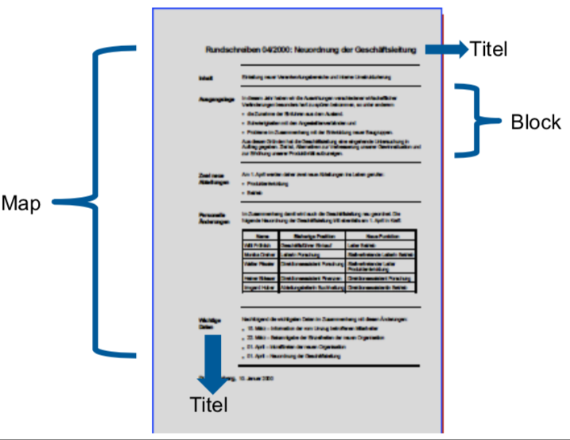

Block

* eine Informationseinheite die eine Aussage enthält
* Titel der klar die Funktion oder Inhalt beschreibt
* Abstände!

Informationsarten

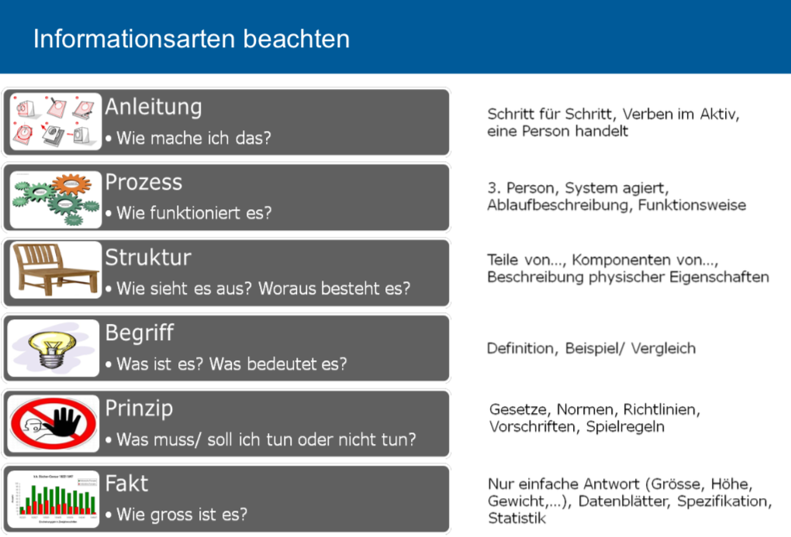

Qualitätskriterien

* Kontext: weiss der Leser wozu er den Text liest?
* Inhalt: bekommt er das zu lesen was er braucht?
* Organisation/Aufbau: Führt der Text den Leser?
* Sprache/Darstellung: Wird der Inhalt für den Leser verständlich formuliert?
* Abgabe: Wird der Text dem Leser zugänglich gemacht?

Schlussteil

Nur Fakten erwähnen, die schon im Hauptteil erwähnt wurden

# Gesprächskompetenz

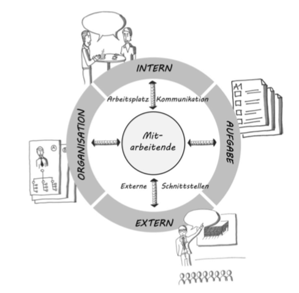

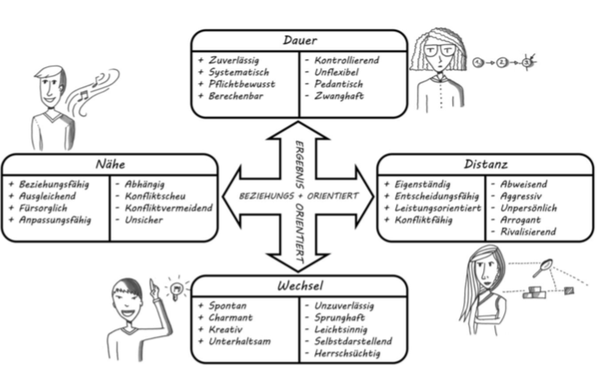

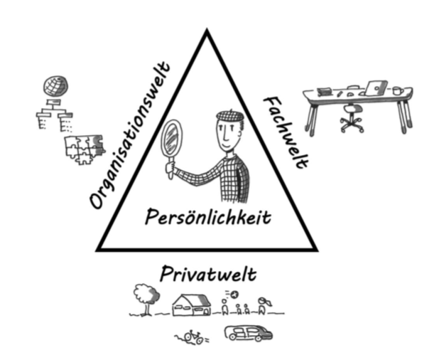

Bezugsrahmen: common ground herstellen (geteilter Bezugsrahmen)

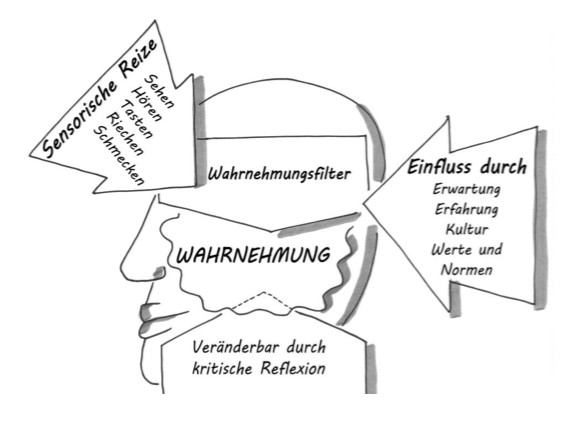

Gesprächsstörer

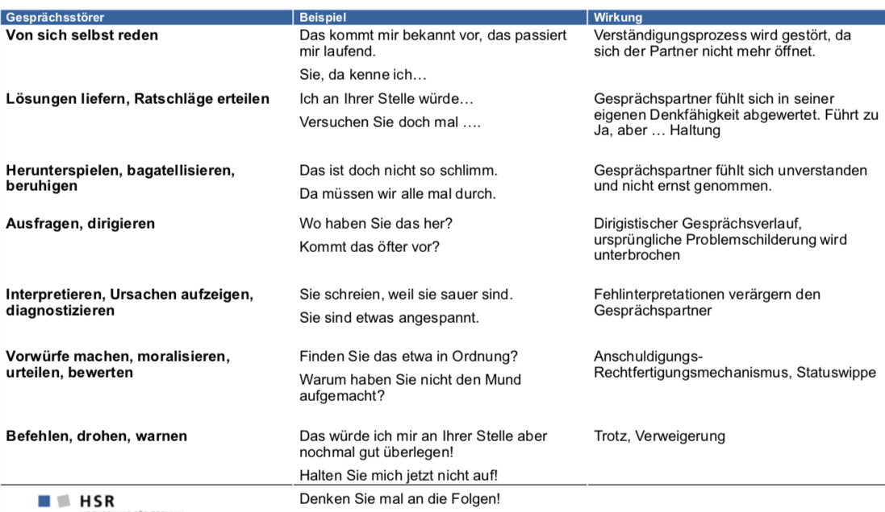

Aktives Zuhören

* Paraphrasieren: wiedergeben des Gehörten in eigenen Worten
* Verbalisieren: gefühlsmässige Zuschreibung des Gehörten

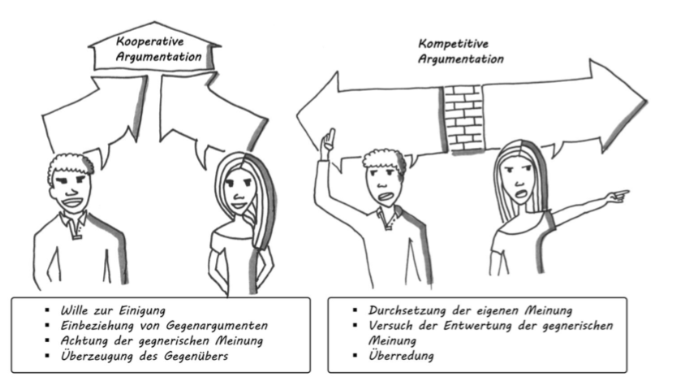

* Faktische Argumentation
  * Glaubwürdigkeit ist abhängig von der Detailliertheit und Nachprüfbarkeit der Fakten

* Plausibilitätsargumentation
  * Allgemeingültiges "jeder weiss doch dass", "wer rechnen kann weiss doch dass"
  * wenig glaubwürdig!
* Moralische Argumentation
  * Anstand, Fairness, Gerechtigkeit
* Emotionale Argumentation
  * Stützung auf Gefühle und Stimmungen (das macht doch allen Spass)

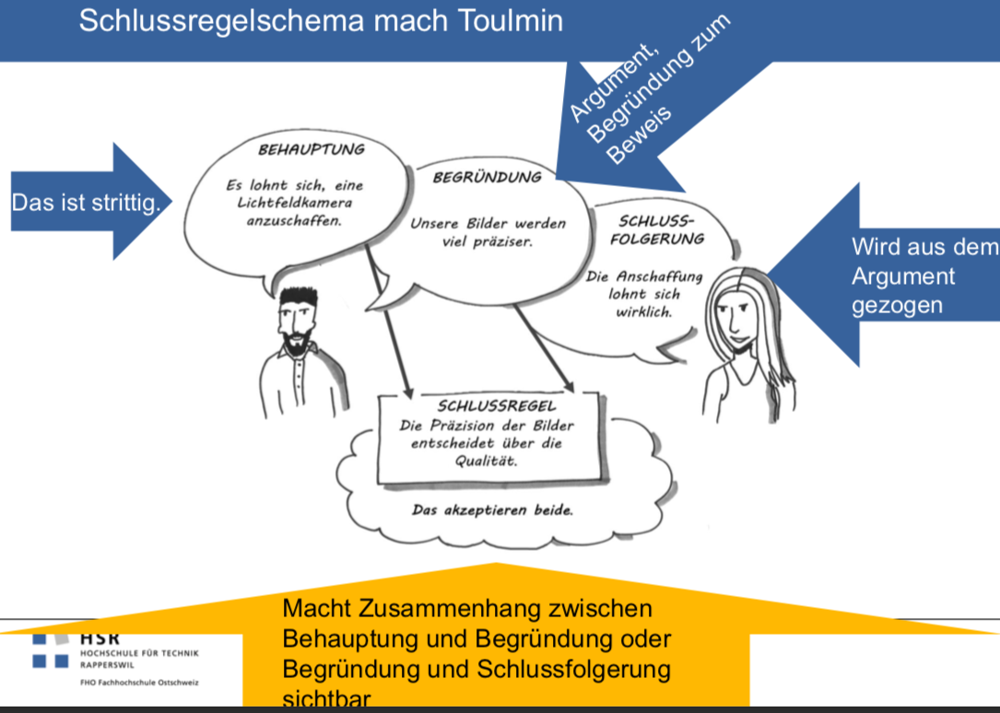

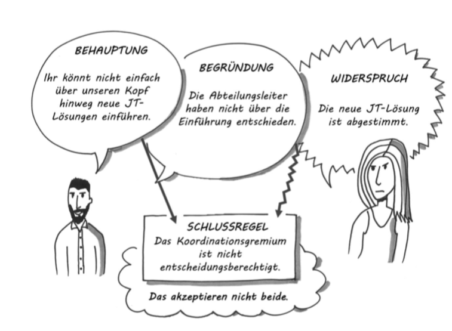

Argumente nötig:

* Richtigkeit/Wahrheit zu beweisen
* Berechtigung/Angemessenheit einer Aufforderung unterstützen
* Notwendigkeit/Angemessenheit einer Handlung begründen

Argumentationsrichtung

* Deduktive Argumentation (wenn mit Zustimmung zu rechnen ist)
  * Wir müssen eine neue Lichtfeldkamera kaufen, weil dann präzisere Aufnahmen möglich sind
* Induktive Argumentation (wenn mit Ablehnung zu rechnen ist)
  * Mit einer Lichtfeldkamera sind präzisere Aufnahmen möglich, deshalb müssen wir eine Lichtfeldkamera kaufen

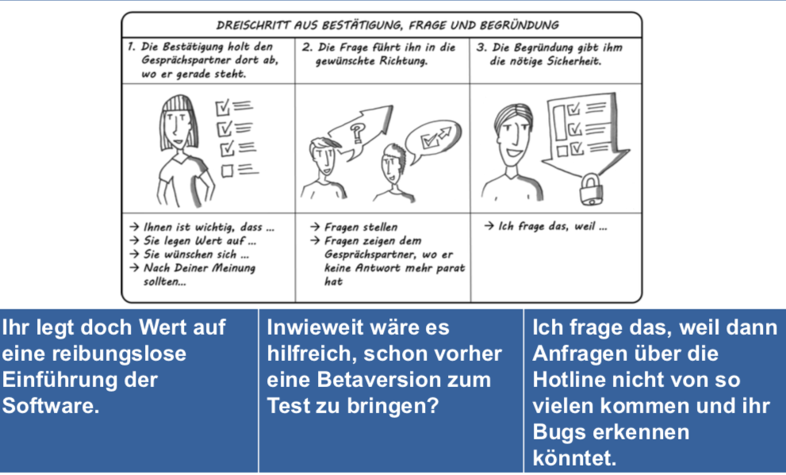

