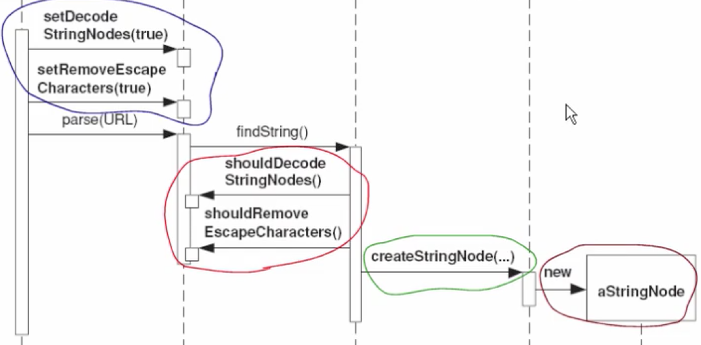
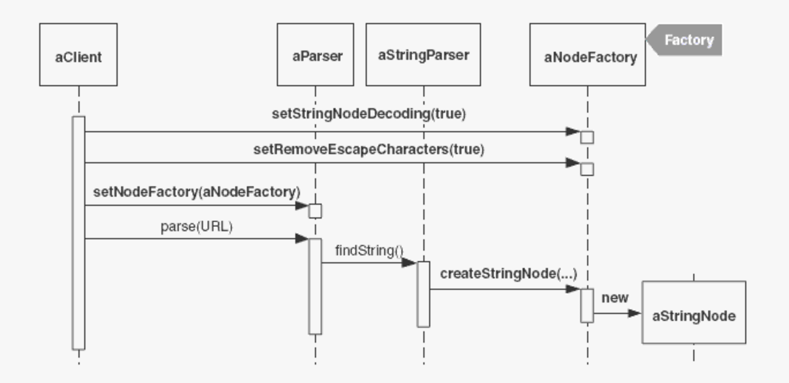
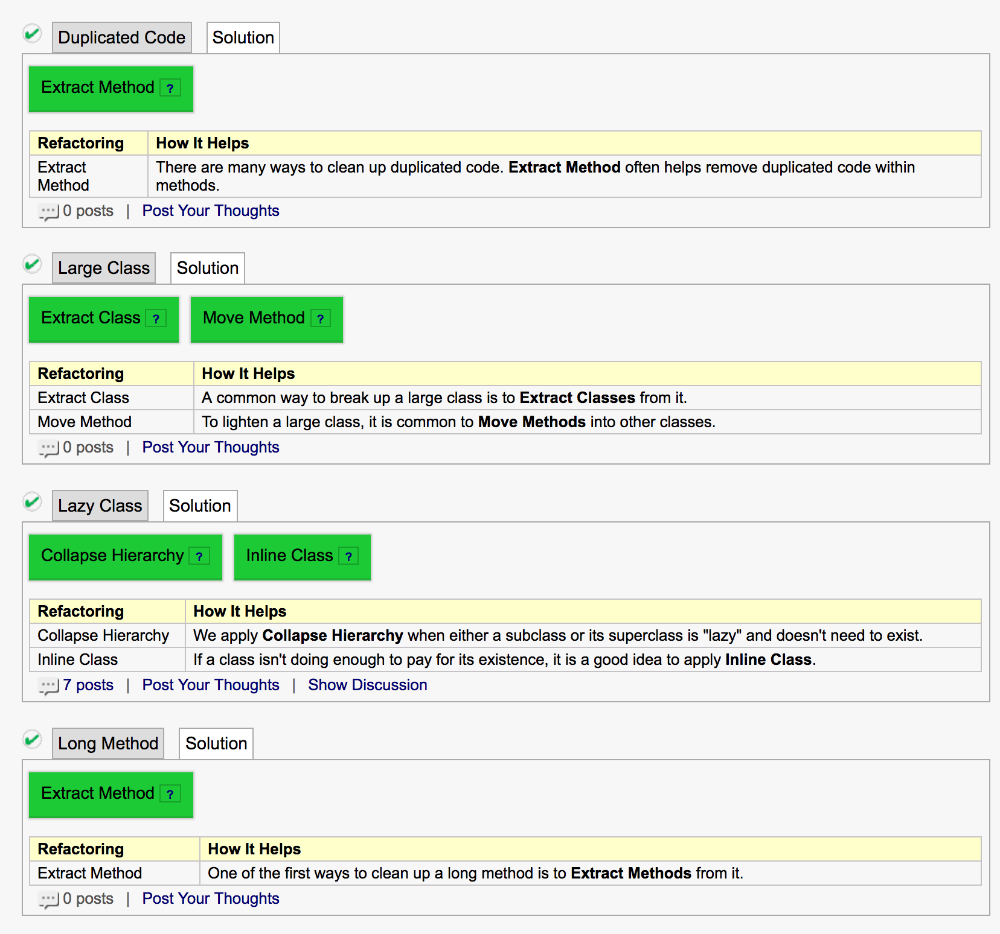
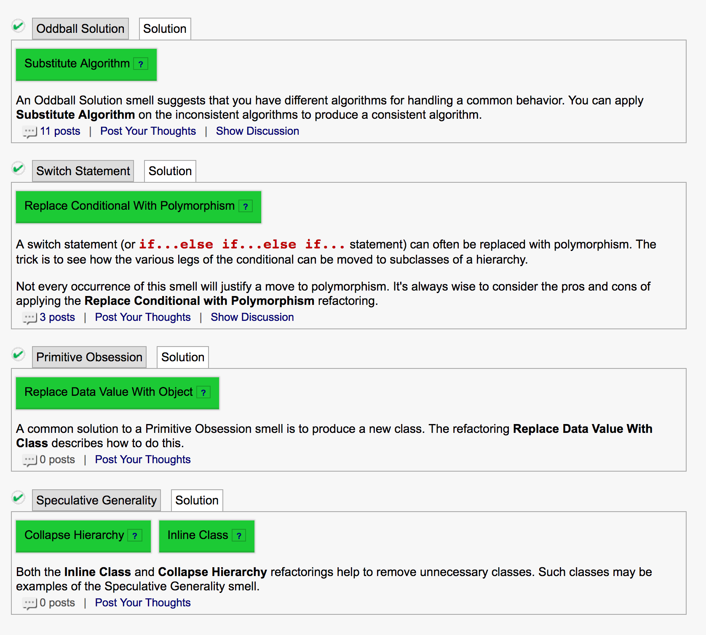
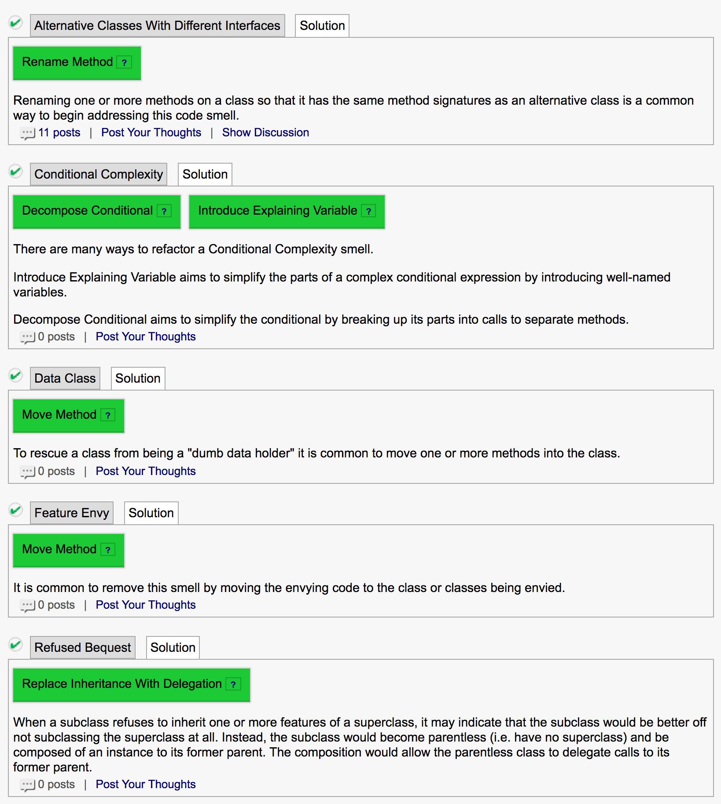

# Domi

Code Smells: https://docs.google.com/document/d/19wmWXyuv2zrB0CQNeXxNxoptYuIgV_DTP6rNWyJlLjI/edit

# Smells

* Speculative Generality
  "Oh, I think we will need the ability to do that someday". Daher bauen wir es jetzt schon komplizierter als es sein muss => am Ende ist dann die komplexe Lösung trotzdem nicht passend
* Comment
  wie ein Deodorant verwendet. Kommentare erklären das WARUM, nicht das WIE.
* Long Method
  eine zu lange Methode => Man könnte sie in Untermethoden aufteilen.
* Long ParameterList
  zuviele Parameter. Macht auch das Testen nicht einfacher. Evtl will die Methode zuviel auf einmal machen, hat zuviele Modi? Default-Parameter sind semi-ok => Parameter in Objekte wrappen, Methode in Klasse verschieben und eigene Attribute verwenden
* Magic Numbers
* Duplicated Code
  duplizierter Code
* Large Class
  eine Klasse die zuviel macht


* Conditional Complexity

  => Polymorphismus (siehe Switch/Case) ausnutzen; oder mindestens die Bedingungen in Methoden auslagern (schöne Namen verwenden)

* Switch/Case (ibs. wenn `instanceOf()` im Spiel ist)
  => statt "Wenn du ein Kinderticket bist, kostest du 5 CHF, wenn du ein Erwachsenenticket bist, kostest du 10 CHF" baut man lieber eine Kinderticket- und eine Erwachsenenticketklasse, nutzt Polymorphismus indem man `.getPrice()` überschreibt.

* Primitive Obsession
  die Abstraktion ist nicht gegeben, man befasst sich mit viel zu tiefen Details

  * XML-Code manuell schreiben
  * "If I had a hammer", Wer als Werkzeug nur einen Hammer hat, sieht in jedem Problem einen Nagel.
  * Wenn man einen Substring nicht findet, bieten viele APIs einen Sentinel-Wert (z.B. `-1`.) Anstatt auf diesen Wert zu prüfen, verwendet man besser die `.contains`-Methode

* Oddball Solution (Inconsistent Solution)
  wenn eine Methode 3-4 mal implementiert wird, und eine davon anders ist.

* Refused Bequest (bequest = Erbe, Vermächtnis)
  For example, when a subclass overrides a method on the superclass interface (as opposed to a superclass protected method) and then provides a do-nothing implementation, the subclass is essentially *refusing* what it has inherited.

* Inapporpriate Intimacy
  wenn eine Klasse viel zu doll in einer anderen Klasse "herumstochert". Speziell in Bezug auf Feldern (Instanzattribute), Getter sind anscheinend ok.   

* Feature Envy
  eine Methode holt sich immer wieder Informationen aus einer anderen Klasse => Methode vielleicht besser in dieser anderen Klasse

* Lazy Class
  eine kleine Klasse die zuwenig macht. Man sollte mit Version Control überprüfen, ob sie gerade wächst (Baby => lassen), ob sie kleiner wird (Shrinking => löschen), oder ob sie so bleibt (=> evtl. mergen)

* Middle Man

* Shotgun Surgery/Solution Sprawl
  das Feature "einfach mal wohin" packen, ohne sich zu überlegen wo es am besten versorgt wäre.

   
  (die Zwischenklassen verwenden die Flags nur zum Weitergeben)


# Refactoring

https://refactoring.com/catalog/


* Extract Method
  Code extrahieren und mit einem Methodennamen versehen; 
* Inline Method
  Code der zusammengehört zusammenbringen

```java
int getRating() {
   return (moreThanFiveLateDeliveries()) ? 2 : 1;
}
boolean moreThanFiveLateDeliveries() {
   return numberOfLateDeliveries > 5;
}

↓

int getRating() {
   return (numberOfLateDeliveries > 5) ? 2 : 1;
}
```

​	Dabei wird `moreThanFiveLateDeliveries` gelöscht

​	=> Gegenteil von Extract Method

* Extract Variable
  Komplizierter Ausdruck => speichere Ausdruck oder Teile davon in temporärer Variable
* Inline Temp => siehe Inline Method
  => Gegenteil von Extract Variable
* Replace Temp with Query
  Temporäre Variable nur einmal mit Ausdruck initalisiert => extrahiere Ausdruck in Methode, ersetze Referenzen auf Variable durch Methodenaufruf
* Rename Method/field/parameter
  Name widerspiegelt nicht den Zweck => umbenennen
* Move Method/Field (inkl. pull up/push down)
  * Pull Up: mehrere Subklassen haben gleiche Methode/Field => in die Basisklasse verschieben
  * Push Down: Verhalten in Basisklasse ist nur für Teil von Subklassen relevant => verschiebe in entsprechende Subklassen (evtl. Mittelklasse einbauen)
* Change Value to Reference, Change Reference to Value..
  * Value-Objekt verwenden wenn immutable möglich => Cyrill
* Replace Magic Number with Symbolic Constant
* Change Method Signature
* Encapsulate Field
  * public Attribut => private machen, Getter und Setter
* Replace Type Code with Class/Subclass
  * Klasse hat ein Typ-Attribut => Klasse-Subklasse verwenden
* Replace Type Code with State/-Strategy
  * Klasse hat ein *veränderliches* Typ-Attribut => State/Strategy Pattern
* Decompose Conditional
  * Kompliziertes if-then-else (Bedingung und Blöcke) => Bedingung extrahieren, then- und if-Block extrahieren
* Replace Nested Conditional with Guard Clauses
  * Geschachtelte Bedingungen machen Normalablauf unübersichtlich => verwende für Spezialfälle Guards und entsprechende Methoden
* Introduce Null Object
  * Es finden wiederholt null-Überprüfungen statt => nehme spezielles Null-Objekt (Null-Klasse)
* Replace Constructor with Factory Method
  * Die Erzeugung eines Objekts ist komplex => verwende Factory-Method
* Replace Exception with Test
  * Eine Methode (die man nicht kontrolliert) wirft eine Exception aufgrund eines Parameters => der Caller soll den Parameter seinerseits überprüfen.
* Extract Subclass/Superclass
  * ähnlich Push Down
* Extract Interface
* Collapse Hierarchy
* Replace Inheritance with Delegation
  * Eine Subklasse verwendet nur ein Teil des Interfaces der Basisklasse
    Oder die Subklasse braucht vererbte Daten nicht.
    => Erzeuge in der Subklasse eine Referenz zur Basisklasse und ändere Methoden, so dass sie über die Referenz an Basisklasse delegieren, löse Vererbung auf	
* Oddball Solution: Substitute Algorithm [Fowler], Unify Interfaces with Adapter (GOF)

# Code Smells => Refactorings (Rudin S. 52-62)

* Smell Conditional Complexity

  * Wenn Fallunterscheidungen für verschiedene Berechnungen:
    Replace Conditional Logic with Strategy

  * Wenn Fallunterscheidungen **Zustandsübergänge** eines Objektes kontrollieren:

    Replace State-Altering Conditionals with State

  * Wenn Fallunterscheidungen für Zusatzfunktionalität zu Kernklasse:
    Move Embellishment (Ausschmückung) to Decorator

  * Wenn viele Fallunterscheidungen für Spezialfall „Objekt nicht vorhanden"
    Introduce Null Object

* Refactoring Replace Conditional Logic with Strategy **S. 53**
  Conditional logic in a method controls which of several variants of a calculation are executed
  =>		
  Create a Strategy for each variant and make the method delegate the calculation to a Strategy instance.

* Refactoring Replace State-Altering Conditionals with State **S.54**		
  The conditional expressions that control an object's state transitions are complex.
  =>
  Replace the conditionals with State classes that handle specific states and transitions between them.	

* Refactoring Move Embellishment to Decorator **S.55**
  Code provides an embellishment to a class' core responsibility.
  => 
  Move the embellishment code to a Decorator.

* Refactoring Introduce Null Object **S.56**
  Logic for dealing with a null field or variable is duplicated throughout your code.
  => 
  Replace the null logic with a Null Object: an object that provides the appropriate null behavior.

* Smell Indecent Exposure **S.57**
  => Encapsulate Classes with Factory oder Dependency Injection

* Refactoring Encapsulate Classes with Factory **S.58**
  Clients directly instantiate classes that residein one package and implement a common interface.
  => 
  Make the class constructors non-public and let clients create instances of them using a Factory.

* Smell Oddball Solution **S.59**

  * Substitute Algorithm oder

  * Unify Interfaces with Adapter **S.60**
    Clients interact with two classes, one of which has a preferred interface.

    =>
    Unify the interfaces with an Adapter.

* Smell Solution Sprawl (a.k.a. Shotgun Surgery) **S.61**

  * Move Creation Knowledge to Factory **S.62**		
    Data and code used to instantiate a class is sprawled across numerous classes.
    => 
    Move the creation knowledge into a single Factory class.

## IndustrialLogic







# Test-Driven Development

* **Specify It**

  * Essence First
    * XML: zuerst Open/Close a Tag, Attribute, innere Werte usw. später
  * Test First
    * `testSimpleOpenClosedTag() {}` 
  * Assert First
    * Assertion zuerst schreiben (auch Client-Code zuerst schreiben), danach erst das Setup

* **Frame It**

  * Frame First
    * Kompilierbar machen

* **Evolve It**

  * Do The Simplest Thing That Could Possibly Work

    * > Sometimes all you'll produce is a method that returns a hard-coded value. Never mind that.

  * Break It To Make

    * Nun schreibt man weitere Tests, zum Beispiel mit einem anderen erwarteten Wert. Erst dann baut man das ins Programm ein, so dass der Wert dynamisch ist.

  * Refactor Mercilessly

  * Test Driving