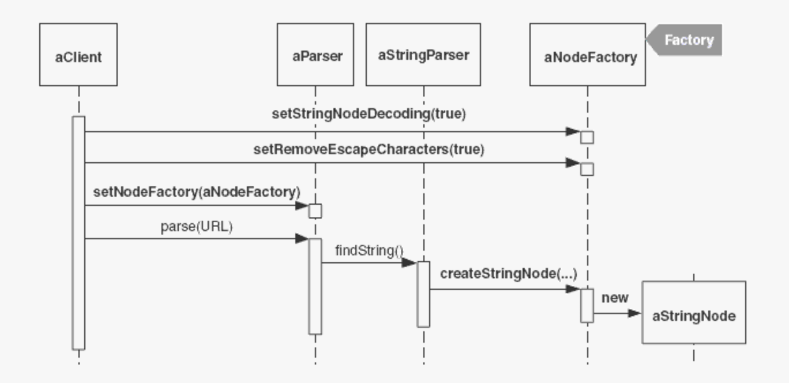
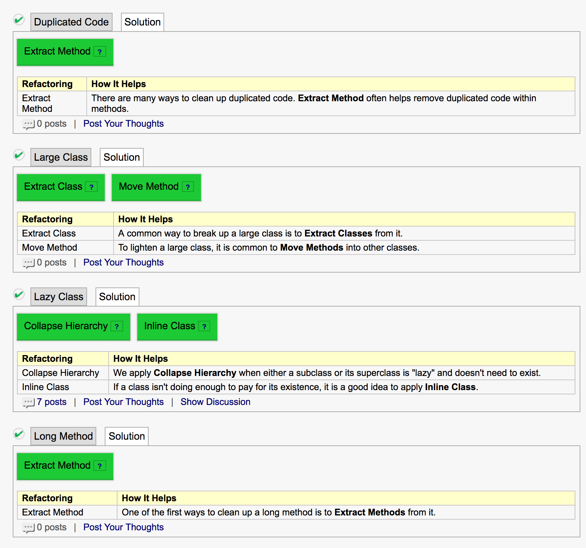
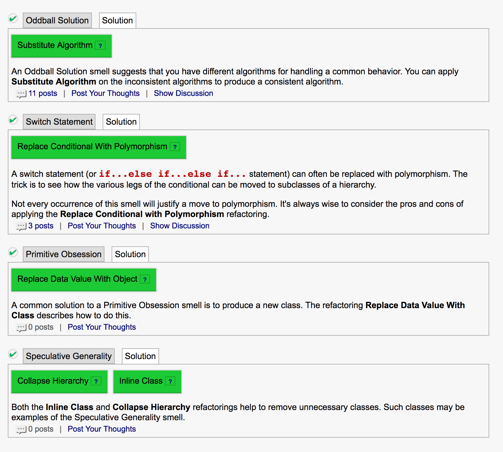
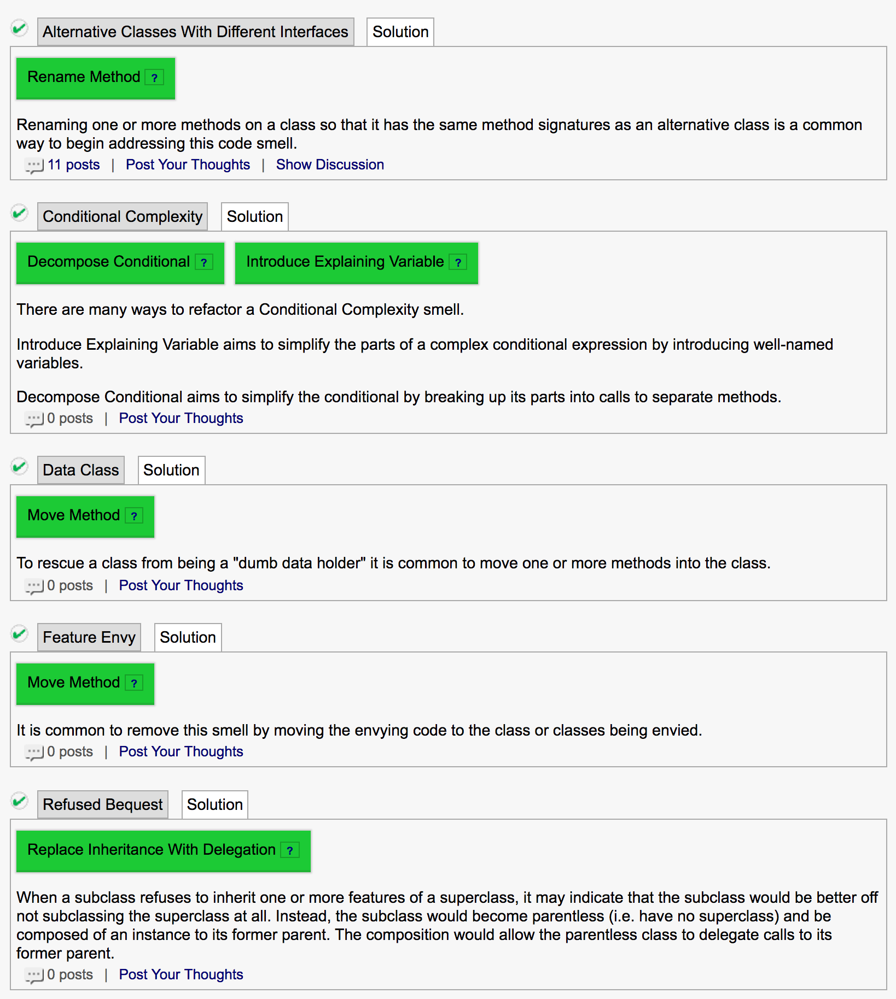

# TODO

IndustrialLogic:

* Code Smells
* Refactoring
* Test Driven Development
  * Welcome To Test-Driven Development
  * The TDD Cycle
  * This Will Never Work
  * TDD Patterns
  * The TDD Cycle: A Deeper Look
  * Recording your performance
  * A TDD Rhythm Exercise

# Domi

Code Smells: https://docs.google.com/document/d/19wmWXyuv2zrB0CQNeXxNxoptYuIgV_DTP6rNWyJlLjI/edit


# Smells

* Speculative Generality
  "Oh, I think we will need the ability to do that someday". Daher bauen wir es jetzt schon komplizierter als es sein muss => am Ende ist dann die komplexe Lösung trotzdem nicht passend
* Comment
  wie ein Deodorant verwendet. Kommentare erklären das WARUM, nicht das WIE.
* Long Method
  eine zu lange Methode => Man könnte sie in Untermethoden aufteilen.
* Long ParameterList
  zuviele Parameter. Macht auch das Testen nicht einfacher. Evtl will die Methode zuviel auf einmal machen, hat zuviele Modi? Default-Parameter sind semi-ok => Parameter in Objekte wrappen, Methode in Klasse verschieben und eigene Attribute verwenden
* Magic Numbers
* Duplicated Code
  duplizierter Code
* Large Class
  eine Klasse die zuviel macht


* Conditional Complexity

  => Polymorphismus (siehe Switch/Case) ausnutzen; oder mindestens die Bedingungen in Methoden auslagern (schöne Namen verwenden)

* Switch/Case (ibs. wenn `instanceOf()` im Spiel ist)
  => statt "Wenn du ein Kinderticket bist, kostest du 5 CHF, wenn du ein Erwachsenenticket bist, kostest du 10 CHF" baut man lieber eine Kinderticket- und eine Erwachsenenticketklasse, nutzt Polymorphismus indem man `.getPrice()` überschreibt.

* Primitive Obsession
  die Abstraktion ist nicht gegeben, man befasst sich mit viel zu tiefen Details

  * XML-Code manuell schreiben
  * "If I had a hammer", Wer als Werkzeug nur einen Hammer hat, sieht in jedem Problem einen Nagel.
  * Wenn man einen Substring nicht findet, bieten viele APIs einen Sentinel-Wert (z.B. `-1`.) Anstatt auf diesen Wert zu prüfen, verwendet man besser die `.contains`-Methode

* Oddball Solution (Inconsistent Solution)
  wenn eine Methode 3-4 mal implementiert wird, und eine davon anders ist.

* Refused Bequest (bequest = Erbe, Vermächtnis)
  For example, when a subclass overrides a method on the superclass interface (as opposed to a superclass protected method) and then provides a do-nothing implementation, the subclass is essentially *refusing* what it has inherited.

* Inapporpriate Intimacy
  wenn eine Klasse viel zu doll in einer anderen Klasse "herumstochert". Speziell in Bezug auf Feldern (Instanzattribute), Getter sind anscheinend ok.   

* Feature Envy
  eine Methode holt sich immer wieder Informationen aus einer anderen Klasse => Methode vielleicht besser in dieser anderen Klasse

* Lazy Class
  eine kleine Klasse die zuwenig macht. Man sollte mit Version Control überprüfen, ob sie gerade wächst (Baby => lassen), ob sie kleiner wird (Shrinking => löschen), oder ob sie so bleibt (=> evtl. mergen)

* Middle Man

* Shotgun Surgery/Solution Sprawl
  das Feature "einfach mal wohin" packen, ohne sich zu überlegen wo es am besten versorgt wäre.

   
  (die Zwischenklassen verwenden die Flags nur zum Weitergeben)


# Refactoring

https://refactoring.com/catalog/

* Extract Method, Inline Method
  Code extrahieren und mit einem Methodennamen versehen; Code der zusammengehört zusammenbringen

```java
int getRating() {
   return (moreThanFiveLateDeliveries()) ? 2 : 1;
}
boolean moreThanFiveLateDeliveries() {
   return numberOfLateDeliveries > 5;
}

↓

int getRating() {
   return (numberOfLateDeliveries > 5) ? 2 : 1;
}
```

* Extract Variable, Inline Temp
  You have a complicated expression.
  Put the result of the expression, or parts of the expression, in a temporary variable with a name that explains the purpose.
  Inline Temp => siehe Inline Method
* Replace Temp with Query
  Variable mit einer Methode zu ihrer Berechnung ersetzen
* Rename Method/field/parameter
* Move Method (inkl. pull up/push down)
* Move Field (inkl. pull up/push down)
* Change Value to Reference, Change Reference to Value
* Replace Magic Number with Symbolic Constant
* Change Method Signature
* Encapsulate Field
* Replace Type Code with Class/Subclass
* Replace Type Code with State/-Strategy
* Decompose Conditional
* Replace Nested Conditional with Guard Clauses
* Introduce Null Object
* Replace Constructor with Factory Method
* Replace Exception with Test
* Extract Subclass/Superclass
* Extract Interface
* Collapse Hierarchy
* Replace Inheritance with Delegation
* Oddball Solution: Substitute Algorithm [Fowler], Unify Interfaces with Adapter (GOF)

# Code Smells => Refactorings (Rudin, S. 52-62)







* Smell Conditional Complexity => mehrere Refactorings möglich
* Refactoring Replace Conditional Logic with Strategy
* Refactoring Replace State-Altering Conditionals with State
* Refactoring Move Embellishment to Decorator
* Refactoring Introduce Null Object
* Smell Indecent Exposure -> Encapsulate Classes with Factory oder Dependency Injection
* Refactoring Encapsulate Classes with Factory
* Smell Oddball Solution -> Substitute Algorithm oder Unify Interfaces with Adapter
* Smell Solution Sprawl (a.k.a. Shotgun Surgery) -> Move Creation Knowledge to Factory

# Test-Driven Development

* **Specify It**

  * Essence First
    * XML: zuerst Open/Close a Tag, Attribute, innere Werte usw. später
  * Test First
    * `testSimpleOpenClosedTag() {}` 
  * Assert First
    * Assertion zuerst schreiben (auch Client-Code zuerst schreiben), danach erst das Setup

* **Frame It**

  * Frame First
    * Kompilierbar machen

* **Evolve It**

  * Do The Simplest Thing That Could Possibly Work

    * > Sometimes all you'll produce is a method that returns a hard-coded value. Never mind that.

  * Break It To Make

    * Nun schreibt man weitere Tests, zum Beispiel mit einem anderen erwarteten Wert. Erst dann baut man das ins Programm ein, so dass der Wert dynamisch ist.

  * Refactor Mercilessly

  * Test Driving