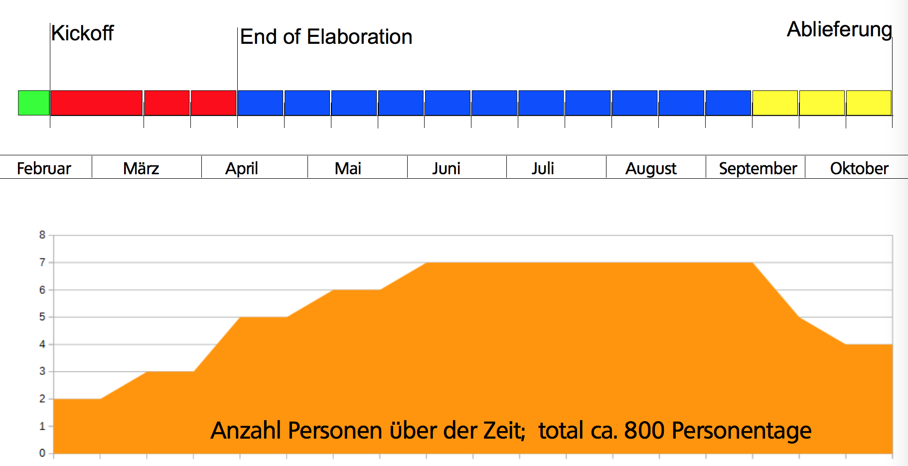
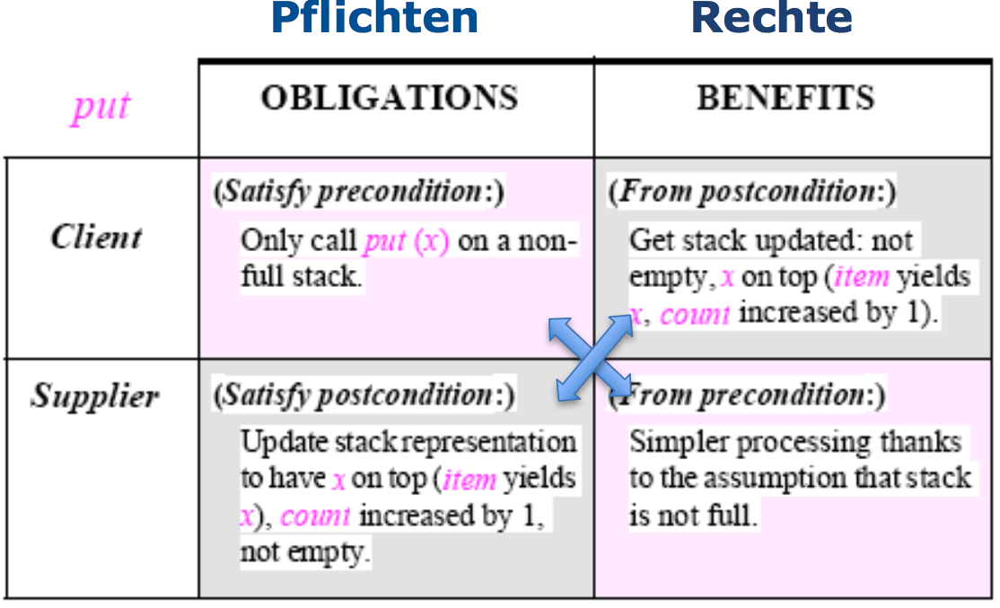
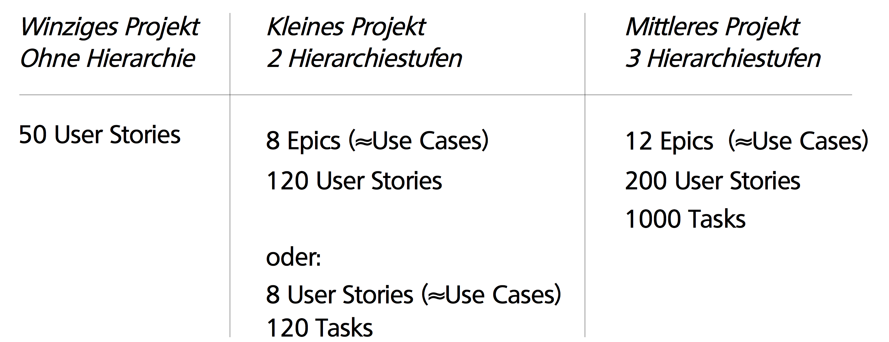

# Projektplanung

Das Wasserfall-Modell ist vorbei, man arbeitet heute nach

* Agil (Scrum, XP)
* Iterativ (RUP, Iterative Development, Spiral Development)

## Beispiel-Projekt (18 Iterationen)

* Inception: 10 Tage
* Elaboration: 8 Wochen, 3 Iterationen (4 + 2x2 Wochen)
* Construction: 11 Iterationen à 2 Wochen
* Transition: 3 Iterationen à 2 Wochen



Man sieht also: die Construction-Phase ist sehr teuer, d.h. es sollte möglichst viel schon vorher bekannt sein, so dass die teuren Entwickler nicht einfach "rumsitzen". Wichtig: der Chief Architect ist vom Kickoff bis mindestens Mitte Projekt involviert.

## Zeitaufteilung

* Elaboration: typischerweise 15-25%
  * bei explorativem Projekt: eher mehr Elaboration
  * bei Standard-Projekt: eher weniger
* Construction: typischerweise deutlich über 50% der Zeit
* Achtung: Prozent der Zeit Prozent der Zeit $\neq$ Prozent der Kosten

## Checkliste: End of Elaboration

* [ ] Anforderungen (Requirements): Haben wir den Kunden verstanden?
* [ ] Funktionsumfang (Scope) ist abgesteckt durch UCs, Domain Model, nicht-funktionale Anforderungen
* [ ] User Interface Design: Entwürfe gemacht, dem Kunden gezeigt (wenn möglich Clickable Prototypes plus Grafik-Entwürfe)
* [ ] Software Architecture: Entwurf steht, Subsysteme und Intterfaces definiert, Prototypen gemacht (Durchstich durch alle Schichten)
* [ ] Entwicklungs-Werkzeuge und Methoden: definiert und komplett aufgesetzt
      * [ ] IDE
      * [ ] Version Control System
      * [ ] Build Server
      * [ ] Unit Testing
      * [ ] Static Code Analysis
      * [ ] Dev/Test/Prod-Server
      * [ ] Ticket/Bug Tracking
      * [ ] User Story Writing/Proofing
* [ ] Genauere Aufwandschätzung: Liste der Arbeitspakete

## Meilensteine


## Anforderungen

Use Cases sind Beschreibungen, klar aus Benutzersicht also gut mit Kunden kommunizierbar. Sie beschreiben Funktionalität im Kontent, z.B. warum, was, in welcher Reihenfolge, wie oft, etc. Sie können gut zum Abstecken des Funktionsumfangs (Scope) definiert werden. Man listet die Use Cases auf und fragt dann "ist das alles?".

### Nicht-funktionale Anforderungen

Diese sind sehr wichtig, denn an ihnen scheitern oft Projekte. Sie beeinflussen u.a. die Architektur. Beispiele:

* Performance "Antwortzeiten für eine Produkt-Suche bei 100'000 Produkten"
* Mengengerüst (Grössenordnung) "50'000 Artikel, 200 gleichzeitige Besucher"
* Sicherheit: Firewalls, IDS, IPS, Logging, Plausability Checks
* Erweiterbarkeit: "Später automatischer Import von Lieferanten-Daten"
* Benutzerfreundlichkeit: "Produkt-Manager Einführung in 2 Tagen"

## Domain Modell

Was wir uns während der Laufzeit des Programmes merken und was wir evtl. darüber hinaus speichern. Achtung: im SE an der HSR bauen wir Domain-Modelle nach Larman. Dort fehlen gegenüber "echten" Domain-Modellen die Operationen. Diese werden im System-Sequenzdiagramm (ebenso Larman) erfasst. 

## Arbeitspakete

### Inhalt von Arbeitspaketen

* ID
* Kurze Beschreibung (z.B. User Story in Scrum)
* Akzeptanz-Kriterien
* Schätzung Aufwand
* Priorität für *Kunde*
* Geleistete Stunden (Zeitaufschreibung)
* Status
* Arbeits-Kategorie

### Grösse der Arbeitspakete

*Maximal 50-70% von dem, was eine Person in einer Iteration schafft.* Idee:  das Arbeitspaket sollte innerhalb der Iteration fertig werden. In Engineering-Projekten sind es pro Person ca. 17 Arbeitsstunden pro Iteration, d.h. **maximale empfohlene Grösse: 10 Arbeitsstunden.**

### Organisation der Arbeitspakete

Sie müssen an einem Ort zentral gespeichert sein, von allen eingesehen und editiert werden können, priorisierbar sein, und sowohl Schätzungen als auch Ist-Zeiten (Zeitaufschreibung) enthalten. Deshalb wählt man ein Tool wie Redmine oder JIRA (oder MS TFS), nur im Notfall Excel.

### Fallstricke

* Nicht nur generische Arbeitspakete aufführen: Generisch: Domainmodell, Use Cases. Nicht-generisch: Funktionalität für Speichern des Warenkorbs.
* Auch Arbeitspakete für unproduktive Tätigkeiten erstellen, z.B. Einrichten des Servers, Besprechungen, etc.
* Arbeitspakete möglichst "abhakbar" schreiben
* Arbeitspakete schreiben kostet auch Zeit!

## Grundsätze zur Arbeitsaufteilung

Bevor man die Arbeitsaufteilung machen kann (insbesondere wenn das Team gegrafisch verteilt ist) muss folgendes klar sein:

* was der Kunde will/braucht
* die Architektur

## Planung

Es soll genug Arbeitspakete geben, damit alle im Team während der nächsten Iteration beschäftigt sind. Genau soviele Arbeitspakete wie die Schätzungen zulassen, so dass sie auch innerhalb der Iteration fertig werden. Innerhalb des Teams werden die Arbeitspakete dann eigenverantwortlich zugeordnet, evtl. auch dynamisch verteilt.

* Die Entwickler schätzen den Aufwand für die Arbeitspakete: *hängen den Preiszettel an die Ware*
* Der Kunde priorisiert die Arbeitspakete: *er wählt die Ware nach dem Preis aus*
* nicht umgekehrt!

Einzige Ausnahme: architekturrelevante Arbeitspakete können vom System-Architekten in bestimmte Iterationen gesetzt werden, weil sonst das System nicht schlau gebaut werden könnte. Dies muss aber dem Kunden erklärt werden und der Kunde muss es absegnen.

## Projekt-Dokumentation

Bei jedem Meilenstein friert man die Doku ein und speichert

* ein PDF von jedem relevanten Dokument, mit Datum im Dateinamen
* Export von allen Web-Tools, insb. Redmine/JIRA, nicht vergessen Tools wie Gruppenkalender, Wireframes, Browser Tests, ...
* Screenshots von allen wichtigen Funktionen, mit Datum im Dateinamen

Die Projektdojumentation ist das Gedächtnis. Es hilft, bei neuen Projekten den Erfahrungsschatz nicht nur im Kopf zu haben. 

## End of Elaboration = Wendepunkt

Vor End of Elaboration liegen die Hauptanstrengungen bei der Doku darauf, zu zeigen dass man den Kunden verstanden hat. Diese Doku ist zum grössten Teil für die Kommunikation mit dem Kunden gedacht, ist also auch in seiner Sprache (z.B. Deutsch) gehalten

Nach End of Elaboration ist der Fokus auf dem Bauen der Lösung, d.h. die Doku die entsteht ist hauptsächlich für die Entwickler. 

# Projekt-Automation

Man sollte alles automatisieren, was man mehr als einmal tut. Es gibt x verschiedene Tools, die entweder zu viel auf einmal machen, oder zu granular funktionieren. Die Idee ist, dass man Tests nicht manuell laufen lassen soll, sondern möglichst viel zu automatisieren (dann macht man es auch).

Wunschliste an ein Tool: CRISP

* **C**omplete
* **R**epeatable
* **I**nformative
* **S**chedulable
* **P**ortable

Dazu Dependency Management, Performance (Parallelisierung, inkrementell) und Erweiterbarkeit (z.B. LESS Processing)

Build-Tools erstellen einen DAG und bauen ihn dann vom Ende her auf. In der Vorlesung wird nun make (wie "driving a car") als Beispiel für ein imperatives Build-Tool genannt, dazu noch Apache ANT

Imperative Build Tools:

* Pros
  * very powerful and flexible!
* Cons
  * Build definitions tend to be complex and verbose (i.e. explicit compiler invocations)
  * Difficult to reuse build logic
  * Copy Paste is a common pattern

Als nächstes Beispiel lernen wir Maven kennen, als Beispiel für ein deklaratives Build-Tool. Speziell ist hier, dass der Verzeichnisbaum vorgegeben ist. Maven arbeitet mit XML und nach den Konzept "Convention over configuration". Es wird ein default-Build vorgenommen und es werden nur spezifische Differenzen dokumentiert. Maven ist "riding the bus".

Maven

* Pros
  * More concise => shorter build files
  * Reusable build logic (plugins)
  * Automated dependency management
* Cons
  * Less general and flexible than imperative tools
  * Impose a somewhat rigid project/file structure

Post-Maven Tools:

Deklarativ ist ein guter Ansatz, aber zu einschränkend. Neuere Tools versuchen das Beste auf beiden Welten zu holen. 

* Apache Buildr
* SBT
* Gradle

> Set up your automated build at day 0

# Continuous Integration

Jedes Team-Mitglied integriert mindestens täglich ihre Arbeit ins Produkt. Unit Tests testen nur den Code-Teil, CI testet das System als Ganzes.

## Objectives

* Always have a runnable product
* Have fast feedback in case of errors
  * Automated tests
  * Compiler errors/warnings
  * Static analysis tools
* Allow division of work without
  * Losing control / overall view of the product state
  * "Integration Hell"

## Practices

**Maintain a single source repository:** VCS nutzen, damit jeder weiss wo der Code liegt. Alles was benötigt wird um das Produkt zu bauen wird eingecheckt, aber keine Build Resultate. Es sollte nur einen main-Branch (z.B. ``master``) geben, von dem alle Features ableiten. Unbedingt die Features nutzen: Commit-Messages, Tags um Versionen zu markieren, Branches, etc.

**Automate the build:** siehe oben

**Make the build self-testing:** eine automatisierte Test-Suite erstellen und warten. Diese besteht aus Unit-Tests (Empfehlung: Test-driven development) und Integrationstests. Sie verifiziert automatisiert die Änderungen und zeigt Fehler frühzeitig auf.

**Everyone commits to the mainline everyday:** Continuous Integration! Merging-Aufwand wird kleiner und Bugs werden schneller aufgespürt, da die einzelnen Code-Reviews weniger Code abdecken müssen.

**Every commit to the mainline should be built:** jeder Change des Mainline-Branches sollte einen kompletten Build auf einem CI-Server anstossen. Wenn der Build bricht, muss er unmittelbar gefixt werden-

> Nobody has a higher priority task than fixing the build

**Keep the build fast:** der Hauptzweck von CI ist schnelles Feedback zu liefern. Lange Builds verlangsamen diesen Feedback-Loop. Ein langer Build ist nach XP 10+ Minuten. Als Lösung können hier inkrementelle Builds, oder eine Multi-Stage Build Pipeline helfen.

**Test in a clone of the production environment:** die Testumgebung sollte die Produktionsumgebung so nah wie möglich nachbilden. Damit ist das Testfeedback so genau wie möglich.

**Make it easy to get the latest executable:** jeder in der Entwicklung sollte Zugang zur neusten Version des Produkts haben. Damit erleichtert man manuelles Testing, Demos, Diskussionen, etc. Der Build-Server könnte also z.B. eine Download-URL anbieten.

**Everyone can see what's happening:** der Status der Mainline-Builds sollte mit einem einfachen Ampelsystem kommuniziert werden. Weitere Infos: Commit-History, Testabdeckung, weitere Metriken.

**Automate deployment**: automatisch das Produkt nach einem erfolgreichen Build zur Testing/Staging-Umgebung deployen. Achtung: das ist nicht dasselbe wie continuous deployment/delivery

# Software Engineering Practices

Erfahrungen aus Praxis für Theorie und umgekehrt. Kein absoluter Anspruch!

## Requirements Practices

### Dig for Requirements

Zusammenarbeit mit dem Benutzer, denken aus Benutzersicht.

Kritisches Hinterfragen und Nachbearbeiten, man soll echte Anforderungen von Ad-hoc Wünschen trennen, die Frage nach dem Grund

Genügend generell und abstrakt halten, Details können schneller ändern => Details konfigurierbar halten

Verfolgung des Ursprungs beachten

Es ist wirklich ein schaufeln, harte Arbeit bis man die Requirements hat

### Make Quality a Requirement

Möglichst testbare Qualitätsanforderungen:

* Max. Antwortzeiten unter definierten Umständen
* Min. unterstützte Datenmenge
* Prüfung von Daten/Geräten und Verhalten bei Fehler

Basierend auf echten Anforderungen

* Konkrete Benutzer-Erwartungen, harte externe Limiten
* Quantitative Werte unter definierten Rahmenbedingungen

Diese Anforderungen sind schwieriger zu ermitteln, es sind oft unbewusste Wünsche. Sie sind aber wichtig, denn davon hängen Architekturentscheide ab und sie können später nicht geflickt werden

### Deal with Changes

Mythos: "stabile Requirements", sie ändern sich ca. 2% pro Monat.

Requirement-Änderungen vorhersehen, genügend abstrakt definieren

Design for Change, flexibleres Design wo Änderungen passieren

Kurze Iterationen, User Feedback mit funktioriendem Code, unklare Bereiche früh addressieren

Change Assessment, Qualität der Requirements nach Iteration prüfen

## Design Practices

### Don't Repeat Yourself

Zum Beispiel benannte Konstanten, gemeinsam genutzte Funktionen statt Copy/Paste, Kommentare geben nur relevante *Zusatz*informationen, Konfigurationsdaten in externen Files, evtl. Code-Generierung statt selber schreiben und jedes Mal wieder anpassen

### Achieve Orthogonality

> Eliminate side effects between unrelated things

Keine Kopplung zwischen konzeptionell unabhängigen Aspekten. Nicht mehrere unabhängige Aufgaben als eine Routine, nicht mehrere unabhängige Abstraktionen als ein Objekt

Ziel: hohe Kohäsion

Reduktion der Kopplung möglichst wenig Abhängigkeiten. Zyklen vermeiden!

### Design to Test

Testbarkeit *vor* Entwicklungszeit betrachten, die Testbarkeit hat Einfluss auf die Architektur. Evtl. gewisse Freiheitsgrade für Dependency Injection. Es kann das Design komplexer als produktiv nötig machen

Vokabular:

* Fake
  * vereinfachte, schnellere Implementierung (z.B. In-Memory DB)
* Mock
  * auf Testfall zugeschnitten, prüft Reihenfolge und Inhalt der erwarteten Aufrufe
* Stub
  * auf Testfall zugeschnittene Antworten
* Dummy
  * Objekte die nur herumgereicht, aber nie inspiziert werden

## Implementation Practices

### Fix broken windows

Probleme beheben, wenn sie entstehen

### Refactor early and often

"Heilungsprozess", konstanter Verbesserungsprozess während wachsendem SW-Projekt

Liste von zu verbessernden Bereichen führen und betroffene Programmierer informieren

Vorgehen:

* Refactoring soll keine neuen Funktionen bieten
* Gute Tests sind Bedingung für Refactoring
* Mehrere kleine Schritte statt eine riesige Änderung

### Program Deliberately

Vermeide "Programming by Coincidence/Luck"

Klares Ziel sehen und Design verfolgen. Nur auf spezifizierte Features von Libraries verlassen. Eingesetzte Technologien beherrschen. Annahmen dokumentieren und mit Assert & Tests prüfen

## Verification Practices

### Test rigorously

Früh, häufig und automatish testen

"Find Issues once": gefundene Fehler verstehen und dafür Test schreiben

### Perform reviews

In Sitzung oder selbständig, Findings festhalten (Severity, Action, Verantwortlicher)

# Error Handling Design

Häufiger Grund für Software Fehlverhalten: eintreffen einer nicht berücksichtigten Eingabe oder Umgebung, oder ungeeignete oder fehlende Massnahmen danach

Bei Error Handling Design wird systematisch dagegen gearbeitet.

## Defensive Programmierung

Systematische Fehlerprüfung:

* alle Werte von externen Quellen
* alle Werte von Input-Parametern in Routinen
* Nicht unterstützte Zustände in Fallbehandlung

Systematische Fehlerbehandlung

* Abhängig vom kritischen Grad des Systems

## Schutz vor ungültigem Input

Kein "Garbage in, garbage out"

Ungültige Eingaben verhindern, Fehlererkennung und Meldung, keine Resultate bei ungültigem Input

## Prüfung von Routinen-Input

Preconditions prüfen (Parameter-Werte, Zustände in Objekten)

## Fehler-Barrikaden

* Barrikade im Programm gegen Fehler definieren
  * Hinter den Barrikaden sind Daten gültig
  * Daten bei Grenzübertritt überprüfen
* Barrikade auf Klassenniveau
  * Public-Methoden überprüfen Daten
    * Fehler per Exception (externer Input)
  * Private Methoden gehen von gültigen Daten aus
    * Fehler per Asserts (interner Input)

## Fehlerbehandlungs-Techniken

* Konservative Behandlung
  * Error-Handling-Prozedur aufrufen
  * Fehlermeldung anzeigen
  * Shutdown
* Optimistische Behandlung
  * Neutrales Resultat
  * Nächstmögliches plausibles Resultat
  * Warnung loggen

## Korrektheit vs. Robustheit

Korrektheit: niemals ungenaues Resultat liefern

Robustheit: versuche Software am Laufen zu halten

Abhängig von Systemfall

* Sicherheitskritische Systeme => oft Korrektheit
* Unkritische Systeme => oft Robustheit

## Lokale vs. globale Behandlung

Lokal behandeln: nur für erwarteten Fall, der nicht höher relevant ist. Nur wenn der Fall lokal abschliessend entscheidbar ist

An Aufrufer delegieren: wenn Fehler auf höherer Systemebene relevant ist

Keine ungültigen Zwischenzustände hinterlassen: `finally`-Block, auch ohne `catch`

## Global Exception Handler

Alle unbehandelten Fehler an GEH delegieren

## Kritischer Grad der Fehler

Kritische Systeme

* Globale Behandlung von Fehlern
* In sicheren Zustand bringen
  * Shutdown
  * Starten von Sicherheitsmassnahmen
  * Korrupte Daten abschirmen (kein Save/Export)
* Fehler danach protokollieren

Unkritische Operationen

* Lokale Behandlung von Fehlern
* Optimistische Behandlung
* Warnung mitteilen und protokollieren

## Exceptions vs. Assertions

Exceptions

* für mögliche produktive Fälle
* für sicherheitsrelevante Fehler
* In Java: Throwable Error für nicht zu behandelnde Fälle

Assertions

* können eingeschaltet und abgeschaltet werden
* für Debug Mode einschalten
* für Programmierfehler, die nie auftreten sollten
* für Postconditions
* für Preconditions interner Quellen

Kein ausführbarer Code in Assertions!

In Tests ein- oder abschalten? So, wie es in der Produktion dann ist

Assertions sind primär eine Stütze während der Entwicklung, und formale Kommentare

Sekundär:

* Verdacht auf grobe, logische Fehler
* bei lokaler Fehlersuche
* evtl. auch bei Verdacht auf "Compiler-Fehler"

# Design by Contract (DBC)

## Einführung

Ein Vertrag legt *Rechte* (benefits) und *Pflichten* (obligations) zweier Parteien statt.

Auf Software angewandt: Kunden/Lieferanten-Beziehung zwischen Komponenten

Durch Bertrand Meier zur Designmethode entwickelt, DBC ist Teil seiner Programmiersprache "Eiffel"

### Pre/Postconditions

Für jede Methode:

* Preconditions:
  * Bedingungen, die vor dem Aufruf erfüllt sein müssen
  * Verantwortlich ist der Aufrufer
* Postconditions
  * Bedingungen, die nach dem Aufruf gültig sind
  * Verantwortlich ist die Implementation der Methode

Für Klasse: Klasseninvarianten

Postconditions die für alle Methoden gelten als Klasseninvarianten formulieren (DRY)

* Garantien für Aufrufer, die immer (vorher und nachher) bei einem Methodenaufruf gelten
* Verantwortlich ist die Implementation der Klasse

### Beispiel Stack




## Preconditions, Postconditions, Class Invariants

> A precondition violation is the manifestation of a bug in the client
>
> A postcondition violation is the manifestation of a bug in the supplier

### Precondition

Bedingungen die vor dem Aufruf erfüllt sein müssen, verantwortlicher ist der Aufrufer

**Preconditions in aufgerufener Methode nie überprüfen** (DRY)

*Validierung* von Eingangsparametern nur wenn explizit Aufgabe der Methode. Validierung hat nichts mit Überprüfung von Preconditions zu tun. Validierungen so nahe an den externen Quellen wie möglich, der Kern des Systems kann davon frei gehalten werden

### Postcondition

Bedingungen, die nach dem Aufruf gültig sind.

Wirft eine Methode Exceptions, so unterscheiden wir

* Normal Postconditions und
* Exceptional Postconditions

### Invarianten

Gelten "immer" vor oder nach dem Ausführen einer beliebigen Methode.

### Contracts und Vererbung

Ein Subtyp muss mindestens Vertrag der Basisklasse erfüllen!

Ein Subtyp darf

* Preconditions lockern aber NICHT verschärfen
* Postconditions verschärfen aber NICHT lockern
* Invariante verschärfen, aber nicht lockern

## Gute Verträge, Anwendung im agilen Umfeld

Die 6 Prinzipien der Vertragserstellung

(Kommandos verändern das Objekt, Abfragen zeigen nur an)

1. Formuliere Invarianten
   um die unveränderlichen Eigenschaften des Objekts zu beschreiben. Wähle diejenigen Attribute die den Anwender unterstützen, das konzeptionelle Modell der Klasse zu verstehen
2. Prüfe für jede Abfrage und jedes Kommando
   ob eine Vorbedingung erforderlich ist
3. Erstelle für jedes Kommando eine Nachbedingung
   die den Wert jeder elementareb Abfrage auflistet. Der vollständige sichtbare Wert eines jeden Kommandos ist nun bekannt
4. Erstelle für jede abgeleitete Abfrage eine Nachbedingung
   die beschreibt, welches Ergebnis zurückgegeben wird,
   ausgedrückt durch eine oder mehrere elementare Abfragen
5. Trenne elementare Abfragen von abgeleiteten Abfragen
   abgeleitete Abfragen können durch elementare Abfragen ausgedrückt werden
6. Trenne Abfragen durch `@Pure` von Kommandos
   Abfragen geben ein Ergebnis zurück, ändern jedoch nicht die sichtbaren Eigenschaften des Objekts. Kommandos können das Objekt verändern, geben jedoch kein Ergebnis zurück

## Fallstudie

Pareto-Prinzip: 20% der Klassen stellen 80% der genutzten Funktionalität zur Verfügung. Es reicht aus, diese Kernklassen mit Softwareverträgen zu schützen.

Falsche Annahmen als Hauptfehlerquellen: 80% der gefundenen Fehler waren auf Verletzungen von Vorbedingungen und Klasseninvarianten zurückzuführen.

## Unterstützung von DbC in Programmiersprachen

Im Modul: Cofoja

```java
interface Time {
  ...
  
  @Ensures({
    "result >= 0,
    "result <= 23"
  })
  int getHour();
  
  @Requires({
    "h >= 0",
    "h <= 23"
  })
  @Ensures("getHour() == h")
  void setHour(int h);
  
  ...
}
```

# Story Splitting

Keller'sche Faustregeln:

> Kein Projekt über eine Million
>
> Kein Projekt länger als 9 Monate

## Aufteilung zu grosser Projekte

* Aufteilung nach Kunden-Domäne
  * Beispiel Versicherung
  * Leben
  * Nicht-Leben
    * Rechtsschutz
    * Haftpflicht
* Aufteilung nach Geschäftsprozessen
  * Beispiel Gebäudeversicherung
  * Haus schätzen
  * Police erstellen
  * Schaden einschätzen

Arbeitspakete-Reihenfolge:

Beispiel ToDo

1. Kern-Funktionalität ("ohne diese geht es nicht"), Browse List of ToDos, Prioritize ToDos
2. Wichtige Funktionalität, Mark Todo as Done,See Progress Report
3. 08/15 (Login, Registrierung)
4. CRUD

Aufteilung nach Domänen-Modell

Geografisch (z.B. Steuersoftware zuerst in Uri (klein), und erst am Ende Zug (kompliziert))

## Aufteilung zu grosser Arbeitspakete

Von der Basis-Version zur Vollausstattung: erst alles nice-to-have weglassen, später inkrementell mehr liefern

Ideale Grösse von Arbeitspaketen:

* Durchschnitt: was 1 Person in 1/4 eines Sprints schafft
* Maximum: was 1 Person in 50-70% eines Sprints schafft



Use Cases sind grösser als User Stories

Beispiel Use Case: An der Kasse bezahlen

* User Story: als ein Kunde will ich...
* User Story: als Kassierer will ich...

Aus diesen User Stories leitet man dann Arbeitspakete ab. Und da sich sehr viele Menschen auf Sprintlänge 2 oder 3 Wochen geeinigt haben, ist diese durchschnittliche Grösse sehr oft ähnlich.

> Arbeitspakete im Sprint Backlog haben eine Grösse von durchschnittlich 2-4 Arbeitstagen

