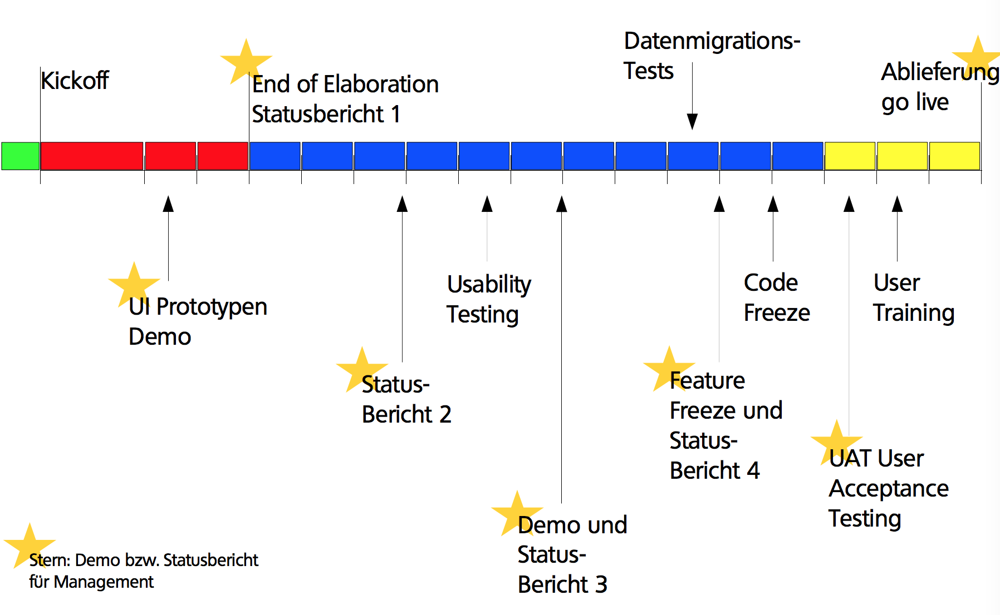

# Projektplanung

Das Wasserfall-Modell ist vorbei, man arbeitet heute nach

* Agil (Scrum, XP)
* Iterativ (RUP, Iterative Development, Spiral Development)

## Beispiel-Projekt (18 Iterationen)

* Inception: 10 Tage
* Elaboration: 8 Wochen, 3 Iterationen (4 + 2x2 Wochen)
* Construction: 11 Iterationen à 2 Wochen
* Transition: 3 Iterationen à 2 Wochen

Man sieht also: die Construction-Phase ist sehr teuer, d.h. es sollte möglichst viel schon vorher bekannt sein, so dass die teuren Entwickler nicht einfach "rumsitzen". Wichtig: der Chief Architect ist vom Kickoff bis mindestens Mitte Projekt involviert.

## Zeitaufteilung

* Elaboration: typischerweise 15-25%
  * bei explorativem Projekt: eher mehr Elaboration
  * bei Standard-Projekt: eher weniger
* Construction: typischerweise deutlich über 50% der Zeit
* Achtung: Prozent der Zeit Prozent der Zeit $\neq$ Prozent der Kosten

## Checkliste: End of Elaboration

* [ ] Anforderungen (Requirements): Haben wir den Kunden verstanden?
* [ ] Funktionsumfang (Scope) ist abgesteckt durch UCs, Domain Model, nicht-funktionale Anforderungen
* [ ] User Interface Design: Entwürfe gemacht, dem Kunden gezeigt (wenn möglich Clickable Prototypes plus Grafik-Entwürfe)
* [ ] Software Architecture: Entwurf steht, Subsysteme und Intterfaces definiert, Prototypen gemacht (Durchstich durch alle Schichten)
* [ ] Entwicklungs-Werkzeuge und Methoden: definiert und komplett aufgesetzt
      * [ ] IDE
      * [ ] Version Control System
      * [ ] Build Server
      * [ ] Unit Testing
      * [ ] Static Code Analysis
      * [ ] Dev/Test/Prod-Server
      * [ ] Ticket/Bug Tracking
      * [ ] User Story Writing/Proofing
* [ ] Genauere Aufwandschätzung: Liste der Arbeitspakete

## Meilensteine

## Anforderungen

Use Cases sind Beschreibungen, klar aus Benutzersicht also gut mit Kunden kommunizierbar. Sie beschreiben Funktionalität im Kontent, z.B. warum, was, in welcher Reihenfolge, wie oft, etc. Sie können gut zum Abstecken des Funktionsumfangs (Scope) definiert werden. Man listet die Use Cases auf und fragt dann "ist das alles?".

### Nicht-funktionale Anforderungen

Diese sind sehr wichtig, denn an ihnen scheitern oft Projekte. Sie beeinflussen u.a. die Architektur. Beispiele:

* Performance "Antwortzeiten für eine Produkt-Suche bei 100'000 Produkten"
* Mengengerüst (Grössenordnung) "50'000 Artikel, 200 gleichzeitige Besucher"
* Sicherheit: Firewalls, IDS, IPS, Logging, Plausability Checks
* Erweiterbarkeit: "Später automatischer Import von Lieferanten-Daten"
* Benutzerfreundlichkeit: "Produkt-Manager Einführung in 2 Tagen"

## Domain Modell

Was wir uns während der Laufzeit des Programmes merken und was wir evtö. darüber hinaus speichern. Achtung: im SE an der HSR bauen wir Domain-Modelle nach Larman. Dort fehlen gegenüber "echten" Domain-Modellen die Operationen. Diese werden im System-Sequenzdiagramm (ebenso Larman) erfasst. 

## Arbeitspakete

### Inhalt von Arbeitspaketen

* ID
* Kurze Beschreibung (z.B. User Story in Scrum)
* Akzeptanz-Kriterien
* Schätzung Aufwand
* Priorität für *Kunde*
* Geleistete Stunden (Zeitaufschreibung)
* Status
* Arbeits-Kategorie

### Grösse der Arbeitspakete

*Maximal 50-70% von dem, was eine Person in einer Iteration schafft.* Idee:  das Arbeitspaket sollte innerhalb der Iteration fertig werden. In Engineering-Projekten sind es pro Person ca. 17 Arbeitsstunden pro Iteration, d.h. **maximale empfohlene Grösse: 10 Arbeitsstunden.**

### Organisation der Arbeitspakete

Sie müssen an einem Ort zentral gespeichert sein, von allen eingesehen und editiert werden können, priorisierbar sein, und sowohl Schätzungen als auch Ist-Zeiten (Zeitaufschreibung) enthalten. Deshalb wählt man ein Tool wie Redmine oder JIRA (oder MS TFS), nur im Notfall Excel.

### Fallstricke

* Nicht nur generische Arbeitspakete aufführen: Generisch: Domainmodell, Use Cases. Nicht-generisch: Funktionalität für Speichern des Warenkorbs.
* Auch Arbeitspakete für unproduktive Tätigkeiten erstellen, z.B. Einrichten des Servers, Besprechungen, etc.
* Arbeitspakete möglichst "abhakbar" schreiben
* Arbeitspakete schreiben kostet auch Zeit!

## Grundsätze zur Arbeitsaufteilung

Bevor man die Arbeitsaufteilung machen kann (insbesondere wenn das Team gegrafisch verteilt ist) muss folgendes klar sein:

* was der Kunde will/braucht
* die Architektur

## Planung

Es soll genug Arbeitspakete geben, damit alle im Team während der nächsten Iteration beschäftigt sind. Genau soviele Arbeitspakete wie die Schätzungen zulassen, so dass sie auch innerhalb der Iteration fertig werden. Innerhalb des Teams werden die Arbeitspakete dann eigenverantwortlich zugeordnet, evtl. auch dynamisch verteilt.

* Die Entwickler schätzen den Aufwand für die Arbeitspakete: *hängen den Preiszettel an die Ware*
* Der Kunde priorisiert die Arbeitspakete: *er wählt die Ware nach dem Preis aus*
* nicht umgekehrt!

## Projekt-Dokumentation

Bei jedem Meilenstein friert man die Doku ein und speichert

* ein PDF von jedem relevanten Dokument, mit Datum im Dateinamen
* Export von allen Web-Tools, insb. Redmine/JIRA, nicht vergessen Tools wie Gruppenkalender, Wireframes, Browser Tests, ...
* Screenshots von allen wichtigen Funktionen, mit Datum im Dateinamen

Die Projektdojumentation ist das Gedächtnis. Es hilft, bei neuen Projekten den Erfahrungsschatz nicht nur im Kopf zu haben. 

## End of Elaboration = Wendepunkt

Vor End of Elaboration liegen die Hauptanstrengungen bei der Doku darauf, zu zeigen dass man den Kunden verstanden hat. Diese Doku ist zum grössten Teil für die Kommunikation mit dem Kunden gedacht, ist also auch in seiner Sprache (z.B. Deutsch) gehalten

Nach End of Elaboration ist der Fokus auf dem Bauen der Lösung, d.h. die Doku die entsteht ist hauptsächlich für die Entwickler. 

# Projekt-Automation

Man sollte alles automatisieren, was man mehr als einmal tut. Es gibt x verschiedene Tools, die entweder zu viel auf einmal machen, oder zu granular funktionieren. Die Idee ist, dass man Tests nicht manuell laufen lassen soll, sondern möglichst viel zu automatisieren (dann macht man es auch).

Wunschliste an ein Tool: CRISP

* **C**omplete
* **R**epeatable
* **I**nformative
* **S**chedulable
* **P**ortable

Dazu Flexibilität, Performance und Erweiterbarkeit.

Build-Tools erstellen einen DAG und bauen ihn dann vom Ende her auf. In der Vorlesung wird nun make ("driving a car") als Beispiel für ein imperatives Build-Tool genannt.

Als nächstes Beispiel lernen wir Maven kennen, als Beispiel für ein deklaratives Build-Tool. Speziell ist hier, dass der Verzeichnisbaum vorgegeben ist. Maven arbeitet mit XML und nach den Konzept "Convention over configuration". Es wird ein default-Build vorgenommen und es werden nur spezifische Differenzen dokumentiert. Maven ist "riding the bus".

> Set up your automated build at day 0

## Continuous Integration

Jedes Team-Mitglied integriert mindestens täglich ihre Arbeit ins Produkt. Unit Tests testen nur den Code-Teil, CI testet das System als Ganzes.

## Practices

**Maintain a single source repository:** VCS nutzen, damit jeder weiss wo der Code liegt. Alles was benötigt wird um das Produkt zu bauen wird eingecheckt, aber keine Build Resultate. Es sollte nur einen main-Branch (z.B. ``master``) geben, von dem alle Features ableiten. Unbedingt die Features nutzen: Commit-Messages, Tags um Versionen zu markieren, Branches, etc.

**Automate the build:** siehe oben

**Make the build self-testing:** eine automatisierte Test-Suite erstellen und warten. Diese besteht aus Unit-Tests (Empfehlung: Test-driven development) und Integrationstests. Sie verifiziert automatisiert die Änderungen und zeigt Fehler frühzeitig auf.

**Everyone commits to the mainline everyday:** Continuous Integration! Merging-Aufwand wird kleiner und Bugs werden schneller aufgespürt, da die einzelnen Code-Reviews weniger Code abdecken müssen.

**Every commit to the mainline should be built:** jeder Change des Mainline-Branches sollte einen kompletten Build auf einem CI-Server anstossen. Wenn der Build bricht, muss er unmittelbar gefixt werden-

> Nobody has a higher priority task than fixing the build

**Keep the build fast:** der Hauptzweck von CI ist schnelles Feedback zu liefern. Lange Builds verlangsamen diesen Feedback-Loop. Ein langer Build ist nach XP 10+ Minuten. Als Lösung können hier inkrementelle Builds, oder eine Multi-Stage Build Pipeline helfen.

**Test in a clone of the production environment:** die Testumgebung sollte die Produktionsumgebung so nah wie möglich nachbilden. Damit ist das Testfeedback so genau wie möglich.

**Make it easy to get the latest executable:** jeder in der Entwicklung sollte Zugang zur neusten Version des Produkts haben. Damit erleichtert man manuelles Testing, Demos, Diskussionen, etc. Der Build-Server könnte also z.B. eine Download-URL anbieten.

**Everyone can see what's happening:** der Status der Mainline-Builds sollte mit einem einfachen Ampelsystem kommuniziert werden. Weitere Infos: Commit-History, Testabdeckung, weitere Metriken.

**Automate deployment**: automatisch das Produkt nach einem erfolgreichen Build zur Testing/Staging-Umgebung deployen. Achtung: das ist nicht dasselbe wie continuous deployment/delivery