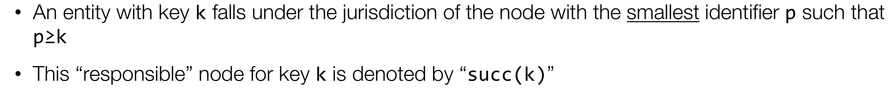

# VSS

# Naming

* Flat Naming
  * Unstrukturiert, in seiner Idee "IP"s, auch wenn ich da nicht ganz einverstanden bin 
    * Möglichkeit des Broadcastings
* Structured Naming
  * DNS
* Attribute-based
  * AD (Mischform, nur die Queries!)

# Chord

## Node-Lookup

1. Bin ich es selber?
2. Tabelle konsultieren: suche den ersten, der noch drunter ist. Wenn es keinen gibt der drunter ist, 1. Eintrag verwenden (das ist dann der Successor)

# Vektor-Uhr

