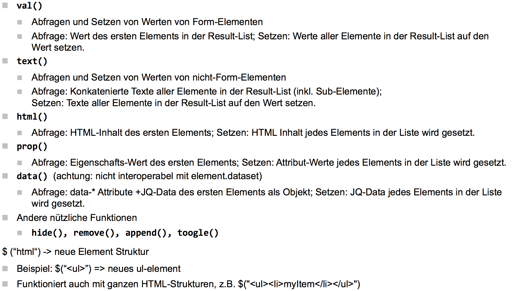
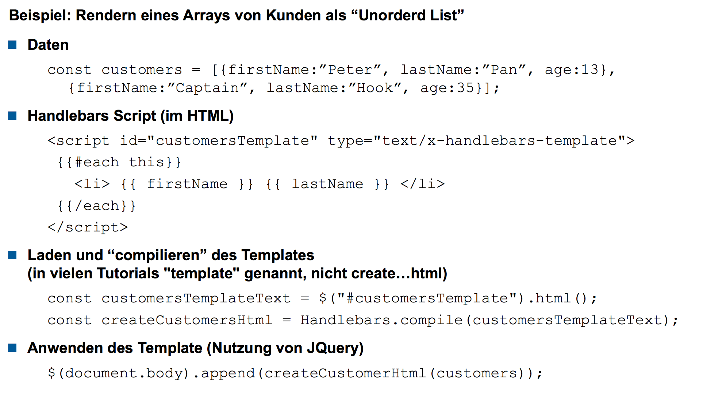

# Markup-Sprachen


Achtung: das Leerzeichen nach dem Book gehört nicht zum Markup, es ist ein Trennzeichen (genau so wie das Leerzeichen zwischen der Menge und dem Preis nicht zum Markup gehört).

Markup gibt dem Text Semantik. Sie sind deklarativ, und beschreiben eine Bedeutung und nicht (direkt) eine Darstellung. Wenn man semantisches Markup verwendet, können auch Blinde die Semantik der Elemente verstehen.

## Encoding

> Wenn möglich: UTF-8

Bei UTF-8 sind die einzelnen Zeichen mehrere Bytes lang (1-4 in der aktuellen Spezifikation). Wieviele Bytes es sind, ist im ersten Byte geschrieben. 

* 1 Byte: ``0xxx xxxx`` (Spezialfall)
  * Die 7 Bits sind exakt dieselben wie in ASCII
  * Bleibt man also im ASCII-Bereich, so "merkt" man nichts von UTF-8.
* 2 Bytes: ``110x xxxx``
* 3 Bytes: ``1110 xxxx``
* 4 Bytes: ``1111 0xxx``

Danach folgen mehrere Bytes mit einem speziellen Präfix: ``10xx xxxx``. Wer es ganz genau wissen will: https://en.wikipedia.org/wiki/UTF-8#Description

UTF-16 arbeitet mit 16 Bit Blöcken (UTF-8 mit 8 Bit Blöcken).

# HTML Dokument

Standard HTML-Dokumentstart

```html
<!DOCTYPE html>
<html lang="en">
  <head>
    <title>First document</title>
    <meta charset="utf-8" />
  </head>
  <body>
    
  </body>
</html>
```

Das DOM davon (mit H1 und P im Body):


## Elemente

Die meisten Elemente benötigen einen closing-Tag. void-Elemente dürfen nicht geschlossen werden, sondern müssen offen gelassen werden, oder mit XML End Mark geschlossen werden (``/>``), wenn man den XHTML-Standard befolgen will.

## Attribute

* lowercase (Konvention)
* Manche Attribute sind obligatorisch

```html

<a href="http://www.hsr.ch">HSR</a>
```

* Manche Attribute erlauben nur vordefinierte Werte

```html
<input type="text" /> <!-- "number", "email", "date", "password", ... -->
```

* Manche Attribute brauchen keine Werte

```html
<video src="video.mp4" autoplay controls></video>
```

* ``data-*``-Attribute sind custom

```html

```

## Vokabular

Element: Text zwischen dem öffnendem und dem schliessenden Tag

## Semantik

HTML sollte die Semantik und nicht die visuelle Erscheinung beschreiben

```html
<!-- gut -->
<p class="warning">Warning</p>
<!-- schlecht -->
<p class="red">Warning</p>
```
# HTML Basics

## Content Model

"Can contain"


Wenn der DOCTYPE fehlt geht der Browser in den Quirks-Mode.

Tag Omitting ist möglich (wird so z.B. von Google empfohlen), hier aber nicht empfohlen. Der Parser setzt die End-Tags!

## Meta 

```html
<head>
  <meta name="author" content="Max Muster" />
  <meta name="description" content="HTML Presentation" />
  <meta name="keywords" lang="en" content="example, html, head" />
  <meta name="keywords" lang="de" content="Beispiel, HTML, Kopf" />
  <meta name="date" content="2010-05-15T08:49:37+02:00" />
  <meta name="creator" content="Hanna Hansen" />
  <meta name="publisher" content="HSR" />
  <meta name="application-name" content="Reveal.js" />
  <meta name="generator" content="no-generator V1.0" />
  <meta name="viewport" content="width=device-width, initial-scale=1.0" />
  <meta name="robots" content="noindex, nofollow" />
  <meta http-equiv="refresh" content="5; URL=http://other.html/" />
</head>
```

## Content Areas

* `section`: Semantische Abschnitte, z.B. Kapitel, Topic)
* `aside`: Side content (additional information)
* `artice`: Complete article (containing header, footer, text, author, ...)
* `main`: Hauptabschnitt, **nur einmal verwenden**

## Text

`hr`: Paragraph level thematic break

## Navigation

Im `nav` nur Main Navigation, keine anderen Menüs

## Links

Kann Flow Content enthalten, aber keine interaktiven Inhalte

## Download

Mit Attribut `download` und MIME-Type `type`

## Title

Jedes Element kann ein `title` Attribut haben

## Tabindex

`tabindex`

## HTML Advanced

Picture vs. img: besser img benutzen

## Embed SVG


## Object & Embed


## Form Properties


## Field Properties


## Input Type


## Autocompletion in Listen


## Form Validation


Mehrere Felder zusammenhängend validieren noch nicht ohne JS möglich

## WAI-Aria Rollen

Attribut `role`


`aria-label`: Formularelemente ohne Label labeln (nicht sichtbar; für Screenreader gedacht)

# CSS

## Einführung

CSS sagt, wie etwas angezeigt werden soll

Seit CSS3 werden die Features mittels Modules definiert, es wird kein CSS4 geben.

### Definieren

* Inline
  * Attribut `style=`
* Im Head; Tag `style`
* File
  * `<link rel="stylesheet" href="file.css">`
  * Mit `media` das Stylesheet für das entsprechende Medium definieren

## Selektoren

### Basics

* Typ: `a`
* ID: `#id`
  * sollten in modularem CSS nicht verwendet werden
  * performantester Selektor

### Kombinatoren

* Kindselektor (direkt) `e > f`
* Nachfahrenselektor (irgendwann) `e f`
* Nachbarselektor (direkt) `e + f`
  * Selektiert f, f muss direkter Nachbar (gleiche Ebene) von e sein, keine Elemente dazwischen
* Geschwisterselektor `e ~ f`
  * Selektiert f (können mehrere sein) die auf gleicher Stufe neben e sind


### Universal

`*`

### Klassen

`.klasse`

Auch Kombinationen erlaubt. `.box.danger` selektiert alle die beide Klassen haben

### Attribut

Überprüfen ob vorhanden

`[attribut]` oder optional `*[attribut]` 

Man kann auch vergleichen

Achtung: `v` immer in Double Quotes

* `[a=v]`
  * überprüft ob der Wert von Attribut `a` gleich dem Wert `v` ist (komplett!)
* `[a~=v]`
  * ob a das Wort v beinhaltet (alleinstehend)
* `[a|=v]`
  * ob a mit dem Wort v startet (alleinstehend)
* `[a^=v]`
  * ob a mit dem Wert v startet
* `[a$=v]`
  * ob a mit dem Wert v endet
* `[a*=v]`
  * ob a den Wert v beinhaltet


### Pseudo Elemente

Erlauben es, bestimmte *Teile* eines Elements zu formattieren

* `::first-line` selektiert die erste Textzeile eines Elements
* `::first-letter` selektiert den ersten Buchstaben eines Elements

Nur für Block- und blockähnliche-Elemente

`::before` und `::after` erzeugen ein neues Element, welches vor/nach dem selektierten Element eingefügt wird

`::selection` ermöglicht es, die Vorder- und Hintergrundfare der Selektion anzupassen

### Pseudo Klassen


### Hintergrundinfos

Interpretation von rechts nach links

* Avoid the descendant selector
  * `A > B` wenn möglich vor `A B` vorziehen
* Rely on inheritance
* Avoid universal rules

## CSS Advanced

### Box-Model


Jedes Element besteht aus

* Inhalt (content)
* Innenabstand (padding)
* Rahmen (border)
* Aussenabstand (margin)

Die Grösse des Elements ist die Summe von Content + Padding + Border + Margin

Background wird auf content + padding angewendet

Margin kann auch negativ sein

`box-sizing: border-box`: damit wird Padding/Border vom Contente abgezogen


### Border/Outline

Border: Breite des Rahmens

Border wird der Grösse des Elements hinzugefügt

Outline: wird NICHT der Grösse des Elements hinzugefügt

Somit kann man auch Check Boxes formatieren, diese ignorieren den Border

Weniger Optionen als Border

### Eigenschaften

Einige Eigenschaften können in einem Property zusammengefasst werden. Sind zu empfehlen!

### Vererbung

Ausnutzen!

### Default Werte

Browser definiert ein Default Set von Element-Styles

Einfachste Variante für ein Reset:

```css
* {
  padding: 0;
  margin: 0;
}
```

### Fehlertoleranz

Nachfolgende Deklarationen überschreiben vorhergehende

Ausser sie sind fehlerhaft bzw. nicht unterstützt, dann werden sie ignoriert

### Vendor Prefixes

Standard immer als letztes angeben! Wenn der Standard dann mal implementiert ist, wird er den Vendor Prefix überschreiben

### Display

* Inline (z.B. span, a)
  * erlaubt left/right margin und padding, aber NICHT top und bottom
  * Ignoriert width und height
  * Erlaubt andere Elemente auf der gleichen Zeile
  * GBricht die Zeile, falls zuwenig Platz, wie text um
  * Nimmt nur den notwendigen Platz ein
  * erzeugt einen Whitespace
* Block (z.B. h1, div, form, p)
  * erlaubt margin/padding
  * erzeugt einen Linienumbruch
  * Füllt die ganze Zeile
* Inline-Block (z.B. Inline-Flex, Inline-Tabelle)
  * erlaubt margin/padding
  * Erlaubt andere Elemente auf der gleichen Zeile
  * Erlaubt width/height
  * Nimmt nur den notwendigen Platz ein
  * Erzeugt einen Whitespace

Mit dem `display` Attribute im CSS kann man den Type ändern

`display: none` das Element wird aus dem Fluss entfernt, wird vom Screenreader nicht mehr gefunden

`visibility: hidden`: der Platz wird reserviert, aber als leer gezeichnet. Wird vom Screenreader nicht mehr gefunden

`opacity: 0` gleicher Effekt wie `visibility: hidden` aber vom Screenreader erkennbar

`visibility: collapse` wie display:none aber für Table-Elemente. `display: none` wird aber besser unterstützt.

### Position

HTML-Elemente werden nach Typ von links nach rechts und von oben nach unten platziert.

Mit `position` kann ein Element aus dem Fluss genommen werden

Wichtig: nur verwenden wenn es unumgänglich ist, und überprüfen ob es überall funktioniert.

* `absolute`
  * absolut definieren mit top, left, bottom, right
  * Werte sind relativ zum ersten Parent mit `absolute` oder `relative` Position
  * Kann genutzt werden, um ein Element über andere Elemente zu legen
* `fixed`
  * ein Element fix an einem Ort auf dem Screen platzieren

Der Platz wird nicht reserviert!

* `relative`
  * Platz wird reserviert
  * Platz ist in Fluss
  * Kann sich selbst auch absolute positionieren, verlässt dann aber seinen reservierten Platz
    * Werte sind relativ zum reservierten Platz
  * Oft als Parent für absolut positionierten Inhalt definiert
* `static`
  * Default

### Float

Früher für Layouts verwendet, heute pöse.

Kann verwendet werden, um Text um ein Bild fliessen zu lassen

## Kaskade

Kaskade ist ein Algorithmus um die verschiedenen Style-Quellen zu verschmelzen.

* Aus welcher Quelle kommt der Style
* Spezifität des Selektors
* Reihenfolge der Style
* Wird `!important` verwendet

Der Wert eines vererbbaren Properties wird vom Parent Element übernommen, wenn

* eine Regel explizit den Wert als `inherited` definiert
* keine Regel (auch keine aus dem User Agent/Default Stylesheet) zutrifft

### Quelle

1. Browser (kleinste Priorität)
   1. Default Werte
2. Benutzer
   1. Vom Nutzer angepasste Einstellungen (selten)
3. Autor (höchste Priorität)
   1. Mit der Website mitgeliefert

### Reihenfolge

Falls Styles den gleichen Selektor haben, werden die Werte von der zuletzt definierten CSS-Regel übernommen.

### Spezifität

(wir machen es hier gleich mit dem `style` Attribut, in der Vorlesung wird das noch auseinandergenommen und dann die Zähler neu durchnummeriert). Daher sind die Zähler um eins verschoben.

Es gibt die Zähler A, B und C.

* Zähler A: durch jedes Vorkommen eines ID-Selektors +1
* Zähler B: durch jedes Vorkommen von Attribut- oder Klassenselektor bzw. Pseudoklasse +1
* Zähler C: durch jedes Vorkommen eines Typselektors oder Pseudoelements +1

Universalselektor verhält sich neutral, wird ignoriert

Pseudoklasse `:not()` wird ignoriert, die Selektoren innerhalb der Klasse werden dann wie vorbeschrieben bewertet


Werden Eigenschaften in einem Style-Attribut festgelegt, so ist diese Eigenschaft spezifischer als jeder Regelsatz in einem Stylesheet. Darum wird ein zusätzlicher Zähler vor A eingefügt (und alles neu durchnummeriert), der um eins erhöht wird wenn das style-Attribut gesetzt wurde. Er hat Priorität vor allen anderen.

Mit `!important` kann ein Style überschrieben werden. Sollte nie verwendet werden, wenn man das ganze CSS unter eigener Kontrolle hat.


## Einheiten

`px` ist die Basis-Einheit, eine virtuelle Grösse

`em` relativ zur Parent-Schriftgrösse

`rem` relativ zum Root-Element

`vw/vh` %-Grösse vom Viewport

## Font & Body

`font-family` ist eine Liste von Schriftarten. Die erste die der Browser unterstützt wird gewählt. Die letzte sollte eine generische sein


## Body


# JavaScript

Bei Fehler wird oft keine Exception geworfen, sondern läuft weiter

## Typen

Keine Typendeklarierung! Aber es gibt natürlich Typen

Die gleiche Variable kann über die Zeit unterschiedliche Typen beinhalten

`typeof()` kann genutzt werden, um den Typ der Variable abzufragen

JavaScript unterscheidet (wie Java) auch zwischen Primitives und Objects

Primitives:

* string, number, boolean, null, undefined, symbol
* Compared by value
* immutable

Objekte:

* alles andere: plain objects, arrays, regex, functions
* Compared by reference
* Mutable by default

| typeof(type) | Result    |
| ------------ | --------- |
| Undefined    | undefined |
| Null         | object    |
| Boolean      | boolean   |
| Number       | number    |
| String       | string    |
| Function     | function  |
| Symbol (ES6) | symbol    |
| All other    | object    |

## Primitives

### Boolean

`true` und `false`

Jeder Wert kann in ein Boolean gewandelt werden

`!!(null)`=> false

Aber auch

`Boolean(null)`

Falsy:

* false
* 0 (zero)
* ""
* null
* undefined
* NaN

Truthy

* Alles andere
* Also auch '0'

### Number

Nach Definition sind alle Zahlen floats.

Die Engines versuchen die floats auf Integer abzubilden, falls möglich

NaN = not a Number

* Ist ein Fehler-Wert: `0/0`=> NaN
* Hat auch den Type number
* NaN == NaN ist immer false
* Zum überprüfen: isNan()

Infinity:

* Unendlich
* Kann auch negativ sein

ACHTUNG

`0/0`=> NaN

`x/0`=> Infinity

Jeder Wert kann in eine Zahl verwandelt werden:

+(true) => 1

aber auch

Number(true)

Ausnahme: Symbol

parseInt/parseFloat parsen bis zum ersten Fehler.

#### Regeln zur Konvertierung in Zahlen (AirBnb)

Nur die guten

`const val = Number(inputValue);`

good with radix:

`const val = parseInt(inputValue, 10);`

## String

Mit `""` oder `''`

Escape mit `\`

### Regeln zur Konvertierung zu String

Jeder Wert kann in einen String verwandelt werden

nur die guten

`const totalScore = String(this.reviewScore)`

### Template Strings

Neuer String-Type, welcher mit ` `` ` umschlossen wird.

Inhalt innerhalb von `${}` wird interpretiert und durch das Resultat ersetzt.

## Operatoren

Punkt vor Strich

Von links nach rechts

Spezielle:

+ String + Value = String
+ Value + String = String
+ Value [Operator] Value = Number

## Equality

`===` vergleicht die beiden Objekte ohne Typumwandlung, sie müssen also wirklich dasselbe sein, mit Edge Cases:

* -0 und +0 sind true

`==` macht vorher eine Typumwandlung und vergleicht dann mit `===`


### null != undefined

`undefined`

* Variable ist nicht definiert, z.B. `let a` wurde vergessen
* Variable ist nicht initialisiert, z.B. `a = 1234` wurde vergessen

`null`

* ist ein Wert von einer Variable
* => `undefined` ist ein Zustand, und `null` ist ein Wert

Achtung: `null == undefined` => true

Überprüfen ob eine Variable undefined ist

`typeof myVariable == 'undefined';`

Überprüfen, ob ein Wert auf einem Objekt undefined ist

`myVariable.a == undefined`

## Array


### Iterieren

Normale

```javasc
for (let i = 0; i < arr.length; ++i) {
  console.log(arr[i]);
}

// foreach
for (let y of arr) {
  console.log(y);
}

// for in iteriert über die Property Namen, eher nicht für arrays
for (let x in arr) {
  console.log(arr[x])
}
```

## Object

Ein Object ist eine Sammlung von Properties

Die Properties werden mit einem HashSet verwaltet

Key = String

Value = Value (boolean, function, string, ...)

Objekte können als object literals erstellt werden und/oder nachträglich mit Properties ergänzt werden

```javascr
const person = {
  name: 'Markus',
  hallo: function() {
    return "Hallo " + this.name;
  }
};

console.log(person.hallo());

person.name = "Bob";
```

Leider können auch die Properties und Methoden von Standard-Objekten verändert werden, da fängt die JS-Fuckery dann richtig an zu dampfen.

## Functions

* Funktionen können in Variablen abgespeichert werden
* als Parameter übergeben werden
* Funktionen besitzen eine offene Parameter-Liste
  * Es können mehr oder weniger als die deklarierte Anzahl an Parameter übergeben werden
  * Alle Parameter werden in `arguments` abgelegt
* Funktionen besitzen Properties
* Eine Funktion erzeugt einen eigenen Scope

`arguments` ist kein Array, sondern ein Objekt. Aber mit `const array = Array(…arguments);` kann es umgewandelt werden.

Mit den `…` erzeugt man ein Array aus den übrigen Parametern. Muss der letzte Parameter sein, wenn es keine übrig hat erzeugt man ein leeres Array

Wenn es zuwenig Parameter hat, wird der Parameter auf undefined gesetzt.

Funktionsdefinitionen sollten in const-Variablen abgespeichert werden

Keine Funktionsdefinition in non-function Block (if, while),  da Browser dies unterschiedlich handhaben

### Parameter Defaults

Standard-Pattern für das Setzen vn Default Werten (ES5)

`a = a || "No Data";`

Aber Problem wenn der reguläre Wertebereich der Funktion falsy-Werte umfassen soll

Besser (ES5):

`param = (param === undefined) ? defaultValue: param;`

Mit ES6 gibts Default Werte:

`function helloWorld (a = "No Data") { ... }`

### Named

Mit ES6 gibts auch Named Parameter:

```javasc
const helloWorld4 = function helloWorld4 (opt = {}) {
const firstName = (opt.firstName === undefined) ? 'No First Name' : opt.firstName;
const lastName = (opt.lastName === undefined) ? 'No Last Name' : opt.lastName; console.log('helloWorld4', firstName, lastName);
};

console.log('\n helloWorld4');
helloWorld4();
helloWorld4('Markus');
helloWorld4({});
helloWorld4({firstName:'Markus'});
helloWorld4({lastName:'Stolze'});
helloWorld4({firstName:'Markus', lastName:'Stolze'});

// oder auch

const helloWorld5 = function helloWorld5 (
	{firstName = 'No First Name', lastName = 'No Last Name'} = {}
	) {
		console.log('helloWorld4', firstName, lastName);  
};
```


### Funktionen haben Properties

`.name` beinhaltet den Namen der Funktion

* Anonyme Methoden besitzen keinen Namen
* Dieser Name wird für den Stacktrace genutzt

`.length` beinhaltet die Anzahl Parameter der Funktion

`.toString()` gibt den Source Code der Funktion zurück

### ES6 Arrow Functions

```javas
console.log((()=>{ 
  const x = 9;
  const y = 11;
  return x + y; 
})()); // Funktionsdeklaration und Aufruf in einem, extra kompliziert weil WED
```

# Scope

Jede Funktion generiert einen neuen Scope

Innerhalb eines Scopes kann man auf

* dessen Variablen
* globale Variablen
* Variablen aller Parent-Scopes zugreifen
  * Closure
  * Diese Werte bleiben erhalten

Wichtig: **ein Script Tag erzeugt keinen Scope**

### Globaler Scope

Zuweisung eines Wertes zu einer Variable, ohne const, let oder var, erzeugt eine globale Variable:

`myGlobalVariable = 42`

Globale Variablen sind im Browser über `window.myGlobalVariable` zugreifbar

### Variablen im lokalen Block bzw. Funktionen-Scope

Benötigt eine Deklaratio mit const, let oder var

Nur innerhalb des Blocks (const/let) oder der Funktion (var) zugreifbar (inkl. nested scopes)

### Module Scope (node.js)

Nicht **explizit** globale Variablen werden auf den module scope gelegt. Dieser ist file-basiert.

### Block Scoped (ES6)

Variablen, die mit const oder let deklariert wurdn, sind Block Scoped

```javasc
for(let x = 1; x < 10; ++x) {
  console.log(x);
  if(x > 4){
  	let x = 10; //wird vom for-loop ignoriert
	// var x = 10 // Identifier 'x' has already been declared
  } 
}
//console.log(x); //ReferenceError: x is not defined
```

## IIFE (Iffies)

IIFE = Immediately Invoked Function Expression

= Funktion (meist anonym), welche sofort nach der Definition aufgerufen wird

IN ES5 häufig genutzt um neuen Variablen-Scope zu definieren

Mit ES6 const und let block-scoped wenigwe wichtig

Pattern:

```javascript
(function () {
  var localVar = 'action';
  console.log("Iffe in " + localVar)
}())
```

## Closure

Funktionen können den Zugriff auf Variablen ihres Definitions-Scopes aufbewahren und auch dann zugreifen, wenn sie aus dem Scope herausgenommen werden.

Eine solche Funktion, welche Variable einschliesst, nennt man Closure

```javasc
function counter(start){ return function(){
start = start + 1;
return start; }
}

const counter0 = counter(10); 
console.log(counter0()); 
console.log(counter0());
console.log(counter0());
```

## Destructuring Assignment

Objekte können mittels "short form" erstellt werden

```javascript
function processInput() {
  const left = 1;
  const right = 2;
  const top = 3;
  const bottom = 4;

  // use object short form to create the return object
  return { left, right, top, bottom };
}

// the caller selects only the data they need

const { left, top } = processInput();
console.log(left, top);
```

## Context

`this` ist der aktuelle Context

Je nach Aufrufart wird ein anderes Objekt referenziert:

* Falls eine Funktion als Methode von einem Objekt aufgerufen wird
  * `this` = Objekt
  * `object.foo();`
* Falls eine Funktion mit new() aufgerufen wird
  * wird `this` mit einem neu erstellten Objekt abgefüllt
  * `new.foo();`
* Falls eine unbound Funktion (d.h. eine Funktion die keine Methode ist) aufgerufen wird
  * zeigt `this` auf das globale Objekt

Jeder Funktion kann mit apply() oder call() der Context gesetzt werden. In diesem Fall werden die obengenannten Regeln ignoriert

TODO: die Geschichte mit bind noch anschauen

## Use Strict

* Eliminiert fails silently
* Eliminiert Probleme, die Code-Optimierung verunmöglichen

### Aktivieren

`'use strict'` 

* Erste Zeile in einer Datei:
  * ganzes File
* erste Zeile in einer Funktion
  * Funktion und nested Funktionen

Strict Mode wird vererbt

Bei reinem Aufruf wird der Strict Mode nicht vererbt

Muss pro File aktiviert werden! Kann nicht mehr entfernt werden.

## Constructor Function

JavaScript unterstützt Klassen und Inheritance

Falls eine Javascript-Fumktion mit `new` aufgerufen wird, wird diese zu einem Konstruktor

new erzeugt ein leeres Objekt und setzt dieses als Kontext.

## Features (aka JS Fuckery)

### Hoisting

JavaScript verschiebt alle Deklarationen von Methoden/Variablen an den Anfang des Scopes

Kann zu Bugs führen => Variablen möglichst am Anfang des Blocks (const, let) oder der Funktion (var)


### Jedes Objekt ist eine Hash Table

Ausnahme: null, undefined

Zugriffe auf Properties:

`b.x` ist dasselbe wie `b['x']` (auch schreibend)

Objekte:

* Wandeln den Index-wert immer in einen String
* `Sample[1]` => `Sample['1']`

Array

* unterstützt ganzzahlige Nummern als Index
* Nicht ganzzahlige Nummern werden zu Strings gewandelt
  * das Array verhält sich wie ein normales Objekt
* [].length beachtet nur die echten Array-Einträge
* => ein Array sollte wie ein Array verwendet werden

Functions

* können wie Objekte mit Properties ergänzt werden

### Statement oder Expression?

* Expression
  * erzeugt einen Wert
  * Kann als Parameter einer Funktion übergeben werden
  * Beispiele
    * myFunc('a', 'b')
    * 3 + x
    * myVar
* Statement
  * führt etwas aus (Sprachelemente)
  * Beispiele
    * If
    * Loop
    * Const

# DOM

Das DOM kann abgefragt werden (API)

Das globale Objekt `document` ist der Startpunkt

`e1 = document.querySelector('h1')`

Kann manipuliert werden

`e1.innerHTML = "newText"`

Events können an Elemente im DOM angehängt werden

`e1.addEventListener("click", ...)`

DOM Manipulation ist erst möglich wenn DOM geladen wurde

Am besten: `window.onload`-Event nutzen

## Standard API 

### Globale Browser-Objekte

* `console` Browser-Console
* `window` Top Level Objekt
  * Enthält Properties/Methoden für das gesamte Window (scrollTo(), print())
  * Löst den `window.onload` Event aus, wenn DOM fertig geparst
* `document` Startpunkt für DOM Queries/Navigation und Erstellung neuer Elemente
* `location` enthält Properties basierend auf der momentanen URL
* `history` enthält Properties zu der Browser History
* `navigator` enthält Properties mit Name und Version des benutzten Browsers (I see what you did there, Netscape)

### Begriffe

* Node
  * Basis aller Schnittstellen
  * repräsentiert einen Knoten im Baum
  * Zugriff auf und Manipulation von Kindknoten
* Document
  * repräsentiert das ganze Dokument (Root-Node)
  * Erzeugen und suchen von Knoten
* Element, Attr, Text
* NodeList, NamedNodeMap
  * geordnete Liste von Knoten, Map von Knoten

## Document


## Nodes


## Element


## NodeList

NodeList ist KEIN Array

Aber hat Property Length


## DOM Manipulation mit DOM Elementen


# DOM Events

## Registrieren von Events

`button1.onClick = myEventListener`

oder

`button1.addEventListener('click', myEventListener)`

Wenn in der Funktion `event` als Parameter definiert wurde, kann im Code auf `this` (das TargetElement) und auch auf den `event` zugegriffen werden.

## Wichtige DOM Events


TODO Currying/Closures (falls schwierige Fragen)

## Event Bubbling

Events bubblen von innen nach aussen dem DOM-Tree entlang, ausser sie werden mit `e.stopPropagation` daran gehindert.

Mit `event.target` kann man immer auf das originale Targetelement zugreifen

Achtung: wenn das TargetElement weitere Listener definiert hat, stoppt man nur die Propagierung des aktuellen Events.

Es gibt auch Event Capturing, aber das wird selten genutzt.

## this in Event-Listeners

= DOM-Element, welches den Event ausgelöst hat.

`e.target` = DOM-Element mit dem der Nutzer interagiert hat

Bei bubbled-Events ist event.eventTarget != this

e.currentTarget ist immer = this

Empfehlung: lieber mit e.target oder e.currentTarget arbeiten als mit this

## De-Registrierung

`button1.onclick = null` oder mit Referenz `button1.removeEventListener('click', button1EventListener)`

# jQuery

Wichtig: `$` ist ein Alias für die Funktion `jQuery`!

## DOM-Anfragen

Beispiele:

* `$("p > em");`

Man kann die Suche auch einschränken

```javascript
var container = $("#container");
$(".alert", container)
```

Das Resultat ist eine jQuery Result List. jQuery verwendet eigene Objekte, die man aber zu nativne Objekten konvertieren kann (in beide Richtungen).

Aktionen die man auf der Result List ausführt, werden auf alle Elemente in der Liste angewendet.

## DOM-Manipulation



## Event Handling

TODO

# Handlebars

Einbinden:

```html
<script src="./handlebars.js"></script>
```

Nutzen:

```html
<script id="notes-template" type="text/x-handlebars-template">
<div class="entries">
	<ul>
		{{#each this}}
			<li>
				<strong>{{content}}</strong> due:{{formatDate dueDate "short"}}
					<br><button class="editNote" data-id="{{id}}">Ed
				<br>
				<div id="editContainer{{id}}" style="display:none">
					<label for="content{{id}}">Content<input id="content{{id}}"
						type="text" value="{{content}}" placeho
					</label>
					<label for="dueDate{{id}}">Due Date<input id="dueDate{{id}}"
						type="date" value="{{formatDate dueDate
				  </label>
				  <br>
				  <input type="submit" value="Absenden" class="sendEdit" data-id="		
				  	{{id}}">
  				</div>
  			</li>
        {{/each}}
  </ul>
</div>
</script>
```

Nötige Helper-Funktionen definieren

```javascript
Handlebars.registerHelper("formatDate", function(datetime, format) {
if (moment) {
format = DateFormats[format] || format; return moment(datetime).format(format);
}
else {
        return datetime;
    }
});
```

Kompilieren des Templates

```javascript
const createNotesHtml_T = Handlebars.compile($("#notes-template").html())
```

Anwenden des Templates

```javascript
$("#container").html(createNotesHtml_T(notes));
```




# HTTP

URI = URL + URN


## Request


## Response


## Entity (Response)


# Callbacks

## Promises

Beispiel:

```javascript
sleep(time)
	.then(_ => console.log('done'));
```

## AJAX

Ursprünglich mit XML gedacht

XmlHttpRequest (XHR) bietet eine JS API für AJAX

## Native XHR


```javascript
// Create request object
var request = new XmlHttpRequest();
// Register event to handle successful response
request.onreadystatechange = function() {} // or handlerFn reference
// Open asynchronous AJAX request (true is asynchronous (default))
request.open('GET', 'http://example.com/product-details', true)
// Send request (with optional data) to the server
request.send(/* data */)
```

`onreadystatechange` gets called when the `readyState` property changes


### POST

```javascript
// Create request object
var request = new XmlHttpRequest();
// Register event to handle successful response
request.onreadystatechange = function() {} // or handlerFn reference
// need to set content type for POST
request.setRequestHeader("Content-Type", "application/x-www-form-urlencoded")
// Open asynchronous AJAX request (true is asynchronous (default))
request.open('POST', 'http://example.com/product-details', true)
// Send request (with optional data) to the server
request.send(/* data */)
```

### Standard-Renderfunktion

```javascript
var request = new XMLHttpRequest();
request.onreadystatechange = function () {
  if (request.readyState == 4
      && (request.status == 200
          || request.status == 304
          || request.status == 201)) { renderResult(request.responseText);
                                     }
};
request.open("GET", "/api/entries");
request.send();
```

Vorallem wenn man einen Link als Click-Target hat, muss man verhindern dass der Browser den Link an sich öffnet. Dies mit `event.preventDefault()`.

## jQuery Ajax API

Request Status und HTTP Status-Code werden automatisch behandelt.

Hat eine Promises API.


### Auto Completion mit jQuery


## XHR Interaction as Promise (no jQuery needed)


## AJAX Limitations

XHR: Same Origin Policy

* Lösung: CORS
  * Aber Firewalls können CORS rausnehmen

Server Push gerade noch nicht möglich (überall)

# Web Design & Usability

User Experience ist mehr als nur Usability

## Was ist gute Usability?

Kriterien nach ISO 9241-11 und Quesenberry. Systeme sollten folgende Eigenschaften besitzen

* Effektivität
  * Benutzer können ihre Ziele erreichen
* Effizienz
  * Benutzer können ihre Ziele mit angemessenem Aufwand erreichen
* Zufriedenheit
  * Benutzer sind positiv gegenüber dem System eingestellt 


### Prinzipen der Dialoggestaltung ISO 9241-110

* Aufgabenangemessenheit
  * Benutzer erledigen Aufgaben effektiv und effizient
* Selbstbeschreibungsfähigkeit
  * Dialogschritte sind durch Beschreibungen oder Rückmeldungen verständlich erklärt
* Steuerbarkeit
  * Benutzer kann Richtung und Geschwindigkeit der Interaktion beeinflussen
* Erwartungskonformität
  * Dialog entspricht den Kenntnissen des Benutzers
* Fehlertoleranz
  * Trotz erkennbarer fehlerhafter Eingaben des Benutzers kann das Ziel effizient erreicht werden
* Individualisierbarkeit
  * Interaktion kann angepasst werden
* Lernförderlichkeit
  * Erlernen der Anwendung wird unterstützt

### Stone

* Visibility
  * der erste Schritt zum Ziel ist sichtbar
* Affordance (Begreifbarkeit)
  * Aktionsresultat ist vorhersagbar
* Feedback
  * Es ist klar was passiert ist (oder passiert => Animation)
* Simplicity
  * Nicht mehr als nötig für die Aufgabe
* Structure
  * Logische und konsistente Organisation
* Consistency
  * Vorhersagbarkeit durch Konsistenz
* Tolerance
  * Fehler vermeiden, Wiederherstellung vereinfachen
* Accessibility
  * Design für alle Personengruppen & Situationen

### Garrett Design-Ebenen

(von oben nach unten)

1. Oberfläche
   attraktiv, vertrauenserweckend, "hedonische Qualität"
   => Graphic Design
2. Raster
   erwartungskonform, fehlertolerant, effizient
   => Interaktionsdesign mit Wireframes
3. Struktur
   aufgabengerecht, fehlertolerant, effizient
   => Interaktionsdesign mit Szenarios
   => Informationsarchitektur
4. Umfang
   zielgruppengerecht, Effektivität
   => Anforderungsanalyse, Ziele, Aufgaben
5. Strategie
   Marktgerecht
   => Marktanalyse, Zielgruppenanalyse

Garrett-Ebenen erlauben Gruppierung der Kriterien


Und weils so schön ist, noch als Eisberg


Und mit mehr Details:


## Garrett: Oberfläche

### Grafisches Design

* Farbpalette
* Typografie
* Icons

### Sensorisches Design

Menschliche Wahrnehmung

Sehschwächen

* ältere Personen: Kontrast ist wichtig
* Farbenblinde

Farb-Design

* Muss zum Auftraggeber und zur Plattform passen
* Nicht  mehr als 4 Farben (gut: 2 + 1)
* Rot ist nicht immer gleich Stop
* Grün ist nicht immer gleich Gut

Typographie

Serifen verbessern Lesbarkeit bei hoher Auflösung (auf Papier), bei tiefer Auflösung verschlechtern sie die Lesbarkeit.

Fliesstext:

* hohe Kleinbuchstaben
* keine Serifen (ausser Retina)
* Satz: Flattersatz

Icons:

vom Profi machen lassen, oder Library

## Garrett: Raster

### Interaktionsdesign für einzelne Seite

Wir nehmen nur einen Bruchteil von Web-Seiten wahr

Change Blindness beachten!

Strukturierung von Text:

* White Space
* Symbole
* Farbe
* Grösse/Font

Eye Catcher einsetzen!

Interaktionselemente müssen grundsätzlich sichtbar sein. Rechtsklick, Long Press usw. ist immer kritisch.

# Garrett: Struktur

### Informationsarchitektur

Bei guter Ausschilderung wissen Nutzer stets

* Wo bin ich im Moment
* Wo kann ich hin
* Was ist passiert

# User Centered Design

Strategie und Umfang (unterste zwei Garrett-Ebenen)

Benutzerbefragung ist kein User Centered Design

"People don't know what they want"

Wichtige Axiome

* Benutzer sind Experten in ihrem Kontext und ihrer Welt
* Designer & Techniker sind Experten in dem, wie die Welt sein könnte
* Um für Nutzer eine "bessere Welt" bauen zu können, muss die aktuelle Welt verstanden sein.

User Centered Design Prozess (DIN EN ISO 9241-210)

1. Planen des Prozesses: Wer macht was, wann und mit welcher Methodik
2. Benutzungsumfeld analysieren & spezifizieren: Benutzer, Produktumfeld, Konkurrenz
3. Anforderungen (F & NF) an das Produkt ableiten (messbar!)
4. Lösung produzieren
5. Lösung evaluieren gegen Anforderungen

Vorgehen User Centered Design (Buch)

* Analyse: Benutzer und Kontext verstehen
* Modellieren: Entwurf und Optimierung einer passenden Lösung
* Spezifikation: die Lösung in die Entwicklung tragen
* Realisierung: (Unterstützung bei der) Implementierung der Lösung
* Evaluation: Resultate mit Benutzern überprüfen


## Stone


