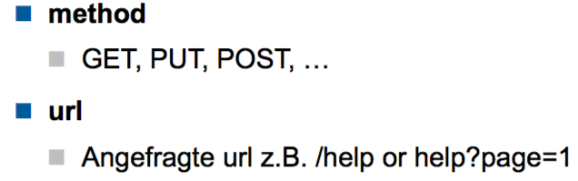
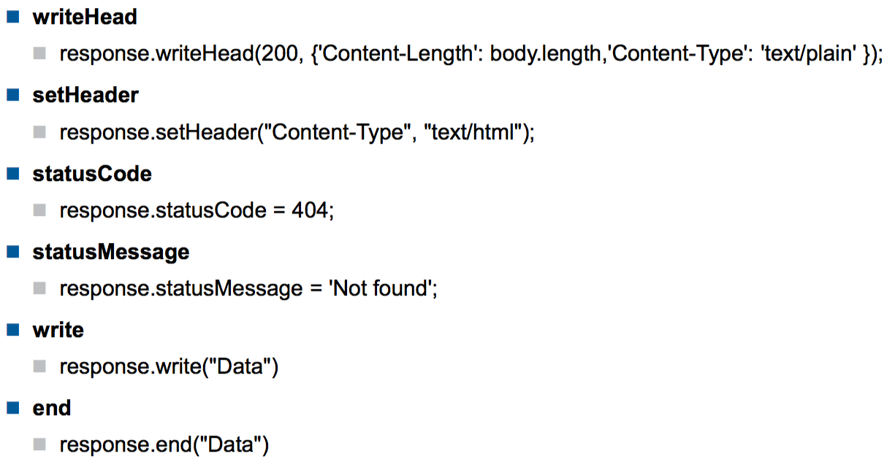
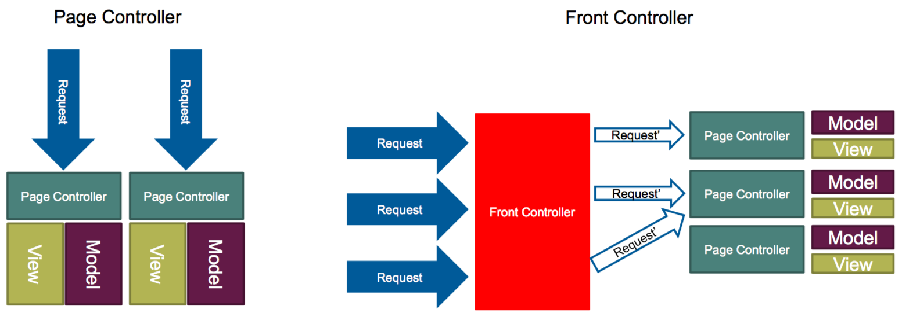

# WED2

# NodeJS

Aufgaben eines Web Servers

* Statische Inhalte ausliefern
* Dynamische Inhalte rendern

Warum NodeJS?

* JS
* Nativer Support für JSON (ideal für REST)
* läuft überall
* sehr schnelle Entwicklung möglich
* sehr modularer Aufbau
* wenig Magie

Node basiert auf dem Reactor-Pattern.

Node.JS nutzt Callbacks und nicht Promises (es gibt Module, die Promise-Support ergänzen)

## Core

* HTTP
* URL
* FS: FileSystem
* Console
* UDP/Net
* Crypto
* DNS
* ...

## Request Methoden



## Response Methoden



## Module

Node verwendet NPM. Node verwendet CommonJS (Standard-Library). 

Module-Files werden nur einmal geladen. Sie können native oder in JS implementiert sein

## Export

`module.exports = myExportedObject`

```js
let counter = 0
function add() { return ++counter; }
function get() { return counter; }

module.exports = { count: add, get} // nur Value: Key = Valuename ('get')
```

Das obige wird nur einmal durchlaufen. Das Objekt wird dann gecached und bei jeder Nachfrage wieder zurückgegeben. Das Objekt wird geshared, und kann von anderen Modulen (theoretisch) angepasst werden.

## Import

`const myModule = require('moduleName')` oder `const myModule = require('./moduleName.js')`

Resolve-Reihenfolge

1. Core-Module (z.B. `require('HTTP'`)
2. Falls mit `./`, `../` oder `/` startet: (`require('./myModule')`, oder auch dasselbe mit Backslash
   1. Suche als File
   2. Suche als Directory
3. Falls ein Filename angegeben wurde (`require('myModule')`)
   1. Wird ein Module im `node_modules` gesucht
      1. Wird bis zum File-System Root gesucht

## Native odule

`var result = fs.readFileSync` ist z.B. nativer Code. Daher

> node_modules nicht ausliefern, könnte betriebssystem-abhängig sein.

## Node API

Das Callback ist immer das letzte Argument

Der erste Callback-Parameter ist im Fehlerfall der Error

Das Callback wirft keine Exception

Die meisten async-Methoden haben auch eine synchrone Variante, z.B. readFileSync. Diese wirft eine Exception bei einem Fehler

## Streams

Das Request und das Response-Objekt basieren auf dem Stream. Streams sind chainable. Es gibt unterschiedliche Varianten

* readable
* writeable
* transform
* duplex
* classic

Ohne Streams

```js
let server = http.createServer(function (req, res) {
  fs.readFile(__dirname + '/data.txt', function (err, data) {
    res.end(data);
  });
});
```

Mit Streams

```js
let server = http.createServer(function (req, res) {
  let stream = fs.createReadStream(__dirname + '/data.txt');
  stream.pipe(res);
})
```

## Events

Node hat ein `event`-Mopdule, welches einen EventEmitter beinhaltet. Von diesem kann man erben, um die Eigenschaften zu übernehmen

```js
const EventEmitter = require('events').EventEmitter

class Door extends EventEmitter {
  constructor() { super() }
  
  ring() {
    setTimeout(() => {
      this.emit('open')
    }, 100)
  }
}
```

## Favicon

Quadratisch, in mehreren Formaten (auch GIF, aber nicht animiert)

`<link rel="icon" type="image/gif" href="facepalm.gif"` und/oder in `/favicon.ico` platzieren.

# Express/Ajax

## JSON

JSON vs JS Object

* all identifiers and all strings are written between double quotes
* the only allowed data types are: String, Number, Boolean, Array, Object and null. NaN, Infinity and -Infinity are converted to null
* there is no defined representation for Date, Error, Regular Expression, and Function objects.
* there are no comments
* trailing commas are forbidden

`application/json`

JSON-Arrays (globale Arrays) sollten nicht verwendet werden

## Controller



## Express nutzen

```js
var http = require('http');
var express = require('express'); var app = express();
http.createServer(app).listen(3000);

var express = require('express'); var app = express();
app.listen(3000, function () {
  console.log('Example app listening on port 3000!');
});
```

## Middleware

Express nutzt Middleware für die Request-Bearbeitung. Für die Middleware-Implementation wird konkret `Connect` verwendet. Mit Connect erhält Node das Feature Middleware.

Middleare ist ein Stack von Anweisungen, welche für einen Request ausgeführt werden

Mit app.use wird eine neue Middleware registriert. Die Reihenfolge der Registrierung bestimmt die Ausführungsreihenfolge

